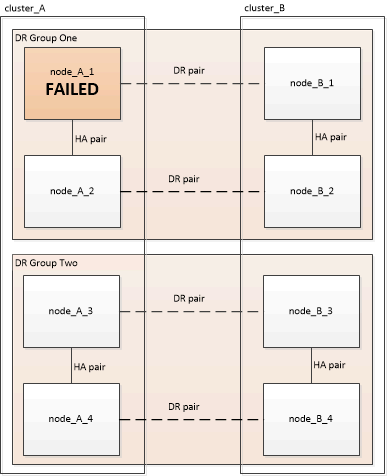
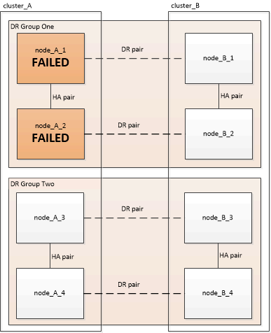
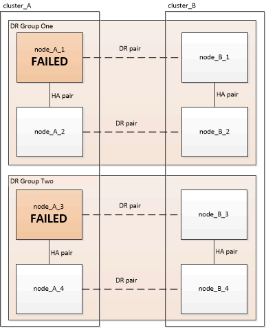

= 選擇正確的恢復程序
:allow-uri-read: 
:icons: font
:imagesdir: ../media/

[role="lead"]
在無法進行還原組態之後MetroCluster 、您必須選取正確的還原程序。請使用下表和範例來選取適當的還原程序。

本表中的資訊假設安裝或轉換已完成、即表示 `metrocluster configure` 命令執行成功。

|===

| 災難站台的故障範圍 | 程序 

 a| 
* 無硬體故障（例如電源故障）

 a| 
link:task_recover_from_a_non_controller_failure_mcc_dr.html["從非控制器故障中恢復"]

 a| 
* 無控制器模組故障
* 其他硬體故障

 a| 
link:task_recover_from_a_non_controller_failure_mcc_dr.html["從非控制器故障中恢復"]

 a| 
* 控制器模組內的FRU元件發生單一控制器模組故障或故障
* 磁碟機未故障

 a| 
如果故障僅限於單一控制器模組、則必須針對平台機型使用控制器模組FRU更換程序。在四節點或八節點MetroCluster 的支援環境組態中、這類故障會隔離到本機HA配對。

*附註：*如果MetroCluster 沒有磁碟機或其他硬體故障、則控制器模組FRU更換程序可用於雙節點的版本。

https://docs.netapp.com/platstor/index.jsp["ONTAP 硬體系統文件"^]

 a| 
* 控制器模組內的FRU元件發生單一控制器模組故障或故障
* 磁碟機故障

 a| 
link:task_recover_from_a_multi_controller_and_or_storage_failure.html["從多控制器或儲存設備故障中恢復"]

 a| 
* 控制器模組內的FRU元件發生單一控制器模組故障或故障
* 磁碟機未故障
* 控制器模組以外的其他硬體故障

 a| 
link:task_recover_from_a_multi_controller_and_or_storage_failure.html["從多控制器或儲存設備故障中恢復"]

您應該跳過磁碟機指派的所有步驟。

 a| 
* 災難恢復群組中的多個控制器模組故障（有或無其他故障）

 a| 
link:task_recover_from_a_multi_controller_and_or_storage_failure.html["從多控制器或儲存設備故障中恢復"]

|===

== 安裝過程中的控制器模組故障情形MetroCluster

回應控制器模組在MetroCluster 執行支援功能組態程序期間的故障、取決於是否需要 `metrocluster configure` 命令已成功完成。

* 如果是 `metrocluster configure` 命令尚未執行或失敗、您必須從MetroCluster 更換控制器模組開始重新啟動該程式的軟體組態程序。
+

NOTE: 您必須執行中的步驟 link:https://docs.netapp.com/us-en/ontap-metrocluster/install-ip/task_sw_config_restore_defaults.html["還原控制器模組的系統預設值"] 在每個控制器（包括替換控制器）上、確認先前的組態已移除。

* 如果是 `metrocluster configure` 命令成功完成、然後控制器模組故障、請使用上表判斷正確的恢復程序。

== 在從FC到IP的轉換過程中、控制器模組發生故障MetroCluster

如果在轉換期間發生站台故障、則可使用恢復程序。不過、只有在設定為穩定的混合式組態、同時完全設定FC DR群組和IP DR群組時、才能使用此功能。輸出的「MetroCluster flex節點show」命令應顯示兩個DR群組、所有八個節點。

IMPORTANT: 如果在轉換期間發生故障、而節點正在新增或移除、您必須聯絡技術支援部門。

== 控制器模組故障案例、採用八節點MetroCluster 的不全功能組態

故障案例：

* <<單一DR群組中的單一控制器模組故障>>
* <<單一DR群組中有兩個控制器模組故障>>
* <<單一控制器模組故障、位於不同的DR群組中>>
* <<三個控制器模組故障分散在整個DR群組中>>

=== 單一DR群組中的單一控制器模組故障

在此情況下、故障僅限於HA配對。

* 如果不需要更換儲存設備、您可以使用平台機型的控制器模組FRU更換程序。
+
https://docs.netapp.com/platstor/index.jsp["ONTAP 硬體系統文件"^]

* 如果儲存設備需要更換、您可以使用多控制器模組恢復程序。
+
link:task_recover_from_a_multi_controller_and_or_storage_failure.html["從多控制器或儲存設備故障中恢復"]

+
此案例MetroCluster 也適用於四節點的不完整組態。

+

=== 單一DR群組中有兩個控制器模組故障

在此情況下、故障需要切換。您可以使用多控制器模組故障恢復程序。

link:task_recover_from_a_multi_controller_and_or_storage_failure.html["從多控制器或儲存設備故障中恢復"]

此案例MetroCluster 也適用於四節點的不完整組態。

=== 單一控制器模組故障、位於不同的DR群組中

在這種情況下、故障僅限於個別的HA配對。

* 如果不需要更換儲存設備、您可以使用平台機型的控制器模組FRU更換程序。
+
FRU更換程序執行兩次、每個故障控制器模組執行一次。

+
https://docs.netapp.com/platstor/index.jsp["ONTAP 硬體系統文件"^]

* 如果儲存設備需要更換、您可以使用多控制器模組恢復程序。
+
link:task_recover_from_a_multi_controller_and_or_storage_failure.html["從多控制器或儲存設備故障中恢復"]

=== 三個控制器模組故障分散在整個DR群組中

在此情況下、故障需要切換。您可以使用DR Group One的多控制器模組故障恢復程序。

link:task_recover_from_a_multi_controller_and_or_storage_failure.html["從多控制器或儲存設備故障中恢復"]

您可以針對DR群組二使用平台專屬的控制器模組FRU更換程序。

https://docs.netapp.com/platstor/index.jsp["ONTAP 硬體系統文件"^]

image::../media/mcc_dr_groups_8_node_with_a_3_controller_failure.gif[MCC DR會將8個節點分組、並出現3個控制器故障]

== 控制器模組故障案例、採用雙節點MetroCluster 的不全功能組態

您使用的程序取決於故障程度。

* 如果不需要更換儲存設備、您可以使用平台機型的控制器模組FRU更換程序。
+
https://docs.netapp.com/platstor/index.jsp["ONTAP 硬體系統文件"^]

* 如果儲存設備需要更換、您可以使用多控制器模組恢復程序。
+
link:task_recover_from_a_multi_controller_and_or_storage_failure.html["從多控制器或儲存設備故障中恢復"]

image::../media/mcc_dr_groups_2_node_with_a_single_controller_failure.gif[MCC DR會將2個節點與單一控制器故障進行分組]
