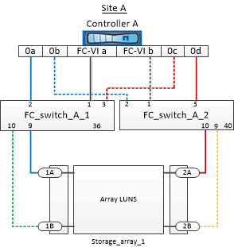

= 將儲存陣列連接埠連接至雙節點MetroCluster 的FC交換器之纜線配置範例
:allow-uri-read: 
:icons: font
:imagesdir: ../media/

[role="lead"]
在使用陣列LUN的功能組態中MetroCluster 、您必須將構成備援連接埠配對的儲存陣列連接埠、連接至備用FC交換器。

下圖顯示MetroCluster 儲存陣列與FC交換器之間的連線、以雙節點架構附加的支援陣列LUN組態進行連線：

儲存陣列連接埠與FC交換器連接埠之間的連線、對於MetroCluster 雙節點的雙節點式版本（含陣列LUN）而言、類似於延伸和光纖連接的版本。

[NOTE]
====
如果您計畫MetroCluster 在您的系統配置中除了使用陣列LUN之外、還要使用磁碟組態所指定的交換器連接埠。

link:concept_port_assignments_for_fc_switches_when_using_ontap_9_1_and_later.html["FC交換器的連接埠指派（使用ONTAP 版本不含更新版本）"]

====
在圖例中、兩個站台的備援陣列連接埠配對如下：

* 站台A的儲存陣列：
+
** 連接埠1A和2A
** 連接埠1B和2B

* 站台B的儲存陣列：
+
** 連接埠1A'和2A'
** 連接埠1B'和2B'

站台A的FC_switch_a_1和站台B的FC_switch_B_1均連接至FORM_1。同樣地、站台A的FC_switch_a_2和FC_switch_B_2也會連接至FORM_2。

下表列出儲存陣列連接埠與FC交換器之間的連線、以供範例MetroCluster 參考：

|===

| 陣列LUN連接埠 | FC交換器連接埠 | 交換器架構 

3+| *站台A * 

 a| 
1A.
 a| 
FC_switch_a_1、連接埠9
 a| 
網路_1.

 a| 
2A.
 a| 
FC_switch_a_2、連接埠10
 a| 
網路_2.

 a| 
1B.
 a| 
FC_switch_a_1、連接埠10
 a| 
網路_1.

 a| 
2B
 a| 
FC_switch_a_2、連接埠9
 a| 
網路_2.

3+| *站點B * 

 a| 
1A'
 a| 
FC_SWIT_B_1、連接埠9
 a| 
網路_1.

 a| 
2A'
 a| 
FC_SWIT_B_2、連接埠10
 a| 
網路_2.

 a| 
1B'
 a| 
FC_SWIT_B_1、連接埠10
 a| 
網路_1.

 a| 
2B'
 a| 
FC_SWIT_B_2、連接埠9
 a| 
網路_2.

|===