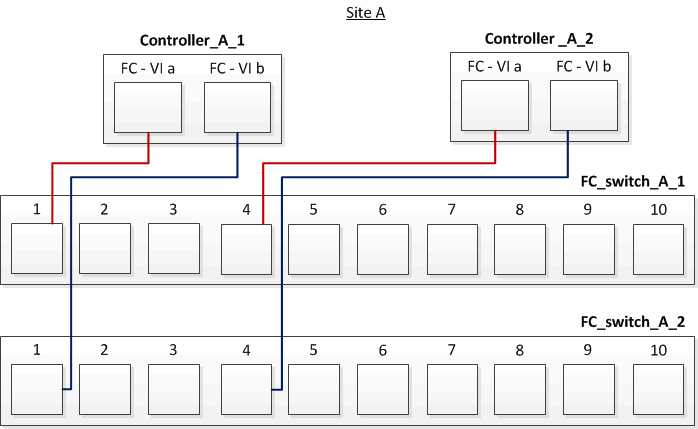

= 使用MetroCluster 陣列LUN、在四節點架構附加的功能性功能區組態中、為FC-VI和HBA連接埠佈線
:allow-uri-read: 
:icons: font
:imagesdir: ../media/

[role="lead"]
如果您要使用MetroCluster 陣列LUN設定四節點架構附加的功能區組態、則必須將FC-VI連接埠和HBA連接埠纜線連接至交換器連接埠。

.關於這項工作
* 您必須為MetroCluster 兩個站台的每個控制器重複此工作。
* 如果您計畫MetroCluster 在您的需求配置中除了使用陣列LUN之外、還要使用磁碟、則必須使用指定的HBA連接埠和交換器連接埠、以便使用磁碟進行組態設定。
+
** link:concept_port_assignments_for_fc_switches_when_using_ontap_9_1_and_later.html["FC交換器的連接埠指派（使用ONTAP 版本不含更新版本）"]
** link:concept_port_assignments_for_fc_switches_when_using_ontap_9_0.html["FC交換器的連接埠指派（使用ONTAP 功能）9.0"]

.步驟
. 將FC-VI連接埠從每個控制器連接至備用FC交換器上的連接埠。
+
以下範例顯示FC VI連接埠與站台A交換器連接埠之間的連線：

+

. 在MetroCluster 這兩個景點執行控制器對交換器的纜線。
+
您必須確保控制器與交換器之間的連線具有備援功能。因此、對於站台上的每個控制器、您必須確保同一個連接埠配對中的兩個HBA連接埠都已連接至備用FC交換器。

+
以下範例顯示站台A的HBA連接埠與交換器連接埠之間的連線：

+
image::../media/four_node_mcc_hba_switch_connections.gif[四個節點MCC HBA交換器連線]

+
下表列出了在控制器_a_1上的HBA連接埠與FC交換器連接埠之間的連線、如圖所示：

+
|===

| HBA連接埠 | 交換器連接埠 

2+| *連接埠配對* 

 a| 
連接埠A
 a| 
FC_switch_a_1、連接埠2

 a| 
連接埠d
 a| 
FC_switch_a_2、連接埠3

2+| *連接埠配對* 

 a| 
連接埠b
 a| 
FC_switch_a_2、連接埠2

 a| 
連接埠c
 a| 
FC_switch_a_1、連接埠3

|===
+
下表列出了在控制器_a_2上的HBA連接埠與FC交換器連接埠之間的連線、如圖所示：

+
|===

| HBA連接埠 | 交換器連接埠 

2+| *連接埠配對* 

 a| 
連接埠A
 a| 
FC_switch_a_1、連接埠5

 a| 
連接埠d
 a| 
FC_switch_a_2、連接埠6

2+| *連接埠配對* 

 a| 
連接埠b
 a| 
FC_switch_a_2、連接埠5

 a| 
連接埠c
 a| 
FC_switch_a_1、連接埠6

|===

您應該在MetroCluster 整個站台的FC交換器之間連接ISL。

當您將ONTAP 非功能性系統連接至FC交換器以設定MetroCluster 含有陣列LUN的功能性組態時、您必須將每個控制器的FC-VI和HBA連接埠連接至特定的交換器連接埠。

link:concept_switch_ports_required_for_a_eight_node_mcc_configuration_with_array_luns.html["使用陣列LUN進行不必要的交換器連接埠MetroCluster 以進行不必要的組態設定"]
