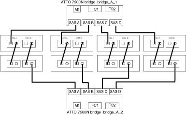

= 安裝FC至SAS橋接器和SAS磁碟櫃
:allow-uri-read: 
:icons: font
:imagesdir: ../media/

[role="lead"]
在組態中新增儲存設備時、您可以安裝Atto FibreBridge橋接器和SAS磁碟櫃、並進行纜線連接。

.關於這項工作
對於從原廠接收的系統、FC對SAS橋接器已預先設定、不需要額外的組態。

此程序是假設您使用建議的橋接管理介面：Atto ExpressNAV GUI和Atto QuickNAV公用程式。

您可以使用Atto ExpressNAV GUI來設定和管理橋接器、以及更新橋接器韌體。您可以使用Atto QuickNAV公用程式來設定橋接式乙太網路管理1連接埠。

如果需要、您可以改用其他管理介面、例如序列連接埠或Telnet來設定及管理橋接器、設定乙太網路管理1連接埠、以及使用FTP來更新橋接器韌體。

此程序使用下列工作流程：

image::../media/workflow_bridge_installation_and_configuration.gif[工作流程橋接器安裝與組態]

== FC至SAS橋接器的頻內管理

從採用FIBEBridge 7500N或7600N橋接器ONTAP 的SUR9.5開始、橋接器的頻內管理（_in-band management）可作為橋接器IP管理的替代方案。從功能不完善的9.8開始ONTAP 、頻外管理已不再適用。

NOTE: 從ONTAP 功能組別9.8開始、「最小橋接器」命令會改為「系統橋接器」。以下步驟顯示了「shorage bridge」命令、但ONTAP 如果您執行的是更新版本的版本、最好使用「系統橋接器」命令。

使用頻內管理時、橋接器可透過ONTAP FC連線至橋接器、從CLI進行管理及監控。不需要透過橋接式乙太網路連接埠實體存取橋接器、以減少橋接器的安全弱點。

橋接器的頻內管理是否可用、取決ONTAP 於版本的下列項目：

* 從ONTAP 功能不再是功能不全的9.8開始、橋接器依預設是透過頻內連線進行管理、而透過SNMP進行頻外管理的橋接器則已過時。
* 支援從9.5到9.7的頻內管理或頻外SNMP管理。ONTAP
* 在版本不含支援的版本不含支援的頻外SNMP管理。ONTAP

橋接CLI命令可從ONTAP 位於Isetical介面的「sorage bridge run－CLI -name _brider_name_-command _bridge命令_command_name_」命令發出ONTAP 。

NOTE: 建議在停用 IP 存取的情況下使用頻內管理，藉由限制與橋接器的實體連線來改善安全性。

== FiberBridge 7600N 與 7500N 橋接器限制與附加規則

在連接 FiberBridge 7600N 和 7500N 橋接器時，請檢閱限制和考量事項。

.FiberBridge 7600N 和 7500N 橋接器限制
* HDD 和 SSD 磁碟機的最大組合數為 240 個。
* SSD 磁碟機的最大數量是 96 個。
* 每個 SAS 連接埠的 SSD 數量上限為 48 個。
* 每個 SAS 連接埠的最大機櫃數量為 10 個。

.FiberBridge 7600N 和 7500N 橋接器附加規則
* 請勿在同一個 SAS 連接埠上混用 SSD 和 HDD 磁碟機。
* 在 SAS 連接埠之間平均分配機櫃。
* DS460 機櫃不應與其他機櫃類型（例如 DS212 或 DS224 機櫃）位於同一個 SAS 連接埠上。

.組態範例
以下是將四個 DS224 機櫃與 SSD 磁碟機連接的範例組態，以及六個 DS224 機櫃與 HDD 磁碟機連接的範例：

[cols="2*"]
|===
| SAS 連接埠 | 磁碟櫃和磁碟機 

| SAS 連接埠 A | 2 個 DS224 機櫃，含 SSD 磁碟機 

| SAS 連接埠 B | 2 個 DS224 機櫃，含 SSD 磁碟機 

| SAS 連接埠 C | 3 個 DS224 機櫃，含 HDD 磁碟機 

| SAS 連接埠 D | 3 個 DS224 機櫃，含 HDD 磁碟機 
|===

== 準備安裝

當您準備將橋接器安裝為新MetroCluster 版的環節時、必須確保系統符合特定要求、包括橋接器的設定與組態要求。其他需求包括下載必要文件、Atto QuickNAV公用程式和橋接韌體。

.開始之前
* 如果系統未裝入系統機櫃、則必須將系統安裝在機架中。
* 您的組態必須使用支援的硬體機型和軟體版本。
+
在中 https://mysupport.netapp.com/matrix["NetApp互通性對照表工具IMT （不含）"]、您可以使用儲存解決方案欄位來選擇MetroCluster 您的解決方案。您可以使用*元件總管*來選取元件和ONTAP 更新版本、以精簡搜尋範圍。您可以按一下「*顯示結果*」來顯示符合條件的支援組態清單。

* 每個FC交換器都必須有一個FC連接埠可供單一橋接器連接。
* 您必須熟悉SAS纜線的處理方式、以及安裝和佈線磁碟櫃的考量與最佳實務做法。
+
磁碟櫃模型的安裝與服務指南_說明考量事項與最佳實務做法。

* 您用來設定橋接器的電腦必須執行Atto支援的網頁瀏覽器、才能使用Atto ExpressNAV GUI。
+
_Atto產品版本說明_提供最新的支援網頁瀏覽器清單。您可以從Atto網站存取本文件、如下列步驟所述。

.步驟
. 下載適用於您磁碟櫃模式的安裝與服務指南：
+
.. 使用您的光纖橋模型所提供的連結存取Atto網站、並下載手冊和QuickNAV公用程式。
+
[NOTE]
====
適用於您的模型橋接器的_Atto FibreBridge安裝與操作手冊_有更多管理介面的相關資訊。

您可以使用Atto FIBrebridge Description（Atto FIBrebridge說明）頁面上提供的連結、存取Atto網站上的此內容和其他內容。

====

. 收集使用建議的橋接管理介面、Atto ExpressNAV GUI和Atto QuickNAV公用程式所需的硬體和資訊：
+
.. 判斷非預設的使用者名稱和密碼（用於存取橋接器）。
+
您應該變更預設的使用者名稱和密碼。

.. 如果設定橋接器的IP管理、則需要橋接器隨附的保護乙太網路纜線（從橋接器乙太網路管理1連接埠連接至網路）。
.. 如果設定橋接器的IP管理、您需要每個橋接器上的乙太網路管理1連接埠的IP位址、子網路遮罩和閘道資訊。
.. 在您要設定的電腦上停用VPN用戶端。
+
作用中的VPN用戶端會使橋接器的QuickNAV掃描失敗。

== 安裝 FC 至 SAS 橋接器和 SAS 機櫃

在確保系統符合「準備安裝」中的所有要求之後、您就可以安裝新系統。

.關於這項工作
* 兩個站台的磁碟和磁碟櫃組態應相同。
+
如果使用非鏡射Aggregate、則每個站台的磁碟和機櫃組態可能會有所不同。

+

NOTE: 災難恢復群組中的所有磁碟都必須使用相同類型的連線、而且無論用於鏡射或非鏡射Aggregate的磁碟為何、災難恢復群組中的所有節點都必須可見。

* 使用50微米、多重模式光纖纜線的磁碟櫃、FC交換器和備份磁帶設備的最大距離系統連線需求、也適用於Fibre Bridge橋接器。
+
https://hwu.netapp.com["NetApp Hardware Universe"^]

* 同一個儲存堆疊不支援混合使用IOM12模組和IOM3模組。如果您的系統執行支援版本ONTAP 的、同一個儲存堆疊中也支援IOM12模組與IOM6模組的混合。

[NOTE]
====
支援頻內ACP、下列磁碟櫃和FibreBridge 7500N或7600N橋接器無需額外纜線：

* IOM12（DS460C）位於7500N或7600N橋接器後方、ONTAP 搭配使用者為NetApp 9.2及更新版本
* IOM12（DS212C和DS224C）位於7500N或7600N橋接器後方、ONTAP 搭配使用者為NetApp 9.1或更新版本

====

NOTE: 不支援ACP纜線的SAS架構MetroCluster 。

=== 如有必要、請在光纖橋接器7600N上啟用IP連接埠存取

如果您使用ONTAP 9.5版之前的版本、或是打算使用遠端登入或其他IP連接埠傳輸協定和服務（FTP、ExpressNAV、ICMP或QuickNAV）、以頻外存取的方式存取到FibreBridge 7600N橋接器、您可以透過主控台連接埠來啟用存取服務。

.關於這項工作
與 Atto FiberBridge 7500N 橋接器不同、 FiberBridge 7600N 橋接器隨附的所有 IP 連接埠通訊協定和服務均已停用。

從ONTAP 支援橋接器的32個版本開始、就支援橋接器的頻內管理。這表示橋接器可透過ONTAP 連接至橋接器的FC連線、從CLI進行設定和監控。不需要透過橋接式乙太網路連接埠實體存取橋接器、也不需要橋接器使用者介面。

從ONTAP 功能表支援的功能為32、8、8、8、5、2、2、2、3、2、2、2、2、3、2、2、3、2、3、2、3、2、3、2、3、2、

如果您*未*使用頻內管理來管理橋接器、則必須執行此工作。在此情況下、您需要透過乙太網路管理連接埠來設定橋接器。

.步驟
. 將序列纜線連接至 FiberBridge 7600N 橋接器上的序列連接埠，即可存取橋接器主控台介面。
. 使用主控台啟用存取服務、然後儲存組態：
+
「et closePort無」

+
「組態設定」

+
「設為封閉連接埠NONE」命令可啟用橋接器上的所有存取服務。

. 如有需要、請發出「設為關閉連接埠」命令來停用服務、並視需要重複執行命令、直到停用所有所需的服務為止：
+
--
「et closePort _service_」

「設為關閉連接埠」命令一次會停用單一服務。

參數`_service_'可以指定為下列其中一項：

** expresssnav
** FTP
** ICMP
** Quicknav
** SNMP
** 遠端登入

您可以使用「Get closePort」命令來檢查是否啟用或停用特定的傳輸協定。

--
. 如果您要啟用SNMP、也必須發出下列命令：
+
「已啟用SNMP」

+
SNMP是唯一需要個別啟用命令的傳輸協定。

. 儲存組態：
+
「組態設定」

=== 設定 FC 對 SAS 橋接器

在連接FC至SAS橋接器的模型纜線之前、您必須先在Fibre Bridge軟體中設定設定。

.開始之前
您應該決定是否要使用橋接器的頻內管理。

NOTE: 從ONTAP 功能組別9.8開始、「最小橋接器」命令會改為「系統橋接器」。以下步驟顯示了「shorage bridge」命令、但ONTAP 如果您執行的是更新版本的版本、最好使用「系統橋接器」命令。

.關於這項工作
如果您要使用橋接器的頻內管理、而非IP管理、則可跳過設定乙太網路連接埠和IP設定的步驟、如相關步驟所述。

.步驟
. 將連接埠速度設定為115000個bauds、以設定Atto FibreBridge上的序列主控台連接埠：
+
[listing]
----
get serialportbaudrate
SerialPortBaudRate = 115200

Ready.

set serialportbaudrate 115200

Ready. *
saveconfiguration
Restart is necessary....
Do you wish to restart (y/n) ? y
----
. 如果設定用於頻內管理、請將纜線從FIBRBridge的RS-232序列連接埠連接至個人電腦上的序列（COM）連接埠。
+
序列連線將用於初始組態、然後透過ONTAP 功能區進行頻內管理、並可使用FC連接埠來監控及管理橋接器。

. 如果設定IP管理、請使用乙太網路纜線、將每個橋接器上的乙太網路管理1連接埠連接至網路。
+
在執行ONTAP 版本不超過版本的系統中、頻內管理可透過FC連接埠（而非乙太網路連接埠）存取橋接器。從功能表9.8開始ONTAP 、僅支援頻內管理、且SNMP管理已過時。

+
乙太網路管理1連接埠可讓您快速下載橋接韌體（使用Atto ExpressNAV或FTP管理介面）、並擷取核心檔案和擷取記錄。

. 如果設定IP管理、請依照橋接器機型的_Atto FibreBridge安裝與操作手冊_第2.0節中的程序、為每個橋接器設定乙太網路管理1連接埠。
+
在執行ONTAP 版本不超過版本的系統中、頻內管理可透過FC連接埠（而非乙太網路連接埠）存取橋接器。從功能表9.8開始ONTAP 、僅支援頻內管理、且SNMP管理已過時。

+
執行QuickNAV以設定乙太網路管理連接埠時、只會設定以太網路纜線所連接的乙太網路管理連接埠。例如、如果您也想要設定乙太網路管理2連接埠、則需要將乙太網路纜線連接至連接埠2並執行QuickNAV。

. 設定橋接器。
+
您應該記下您指定的使用者名稱和密碼。

+

NOTE: 請勿在Atto FibreBridge 7600N或7500N上設定時間同步。Atto FIBreBridge 7600N或7500N的時間同步設定為ONTAP 叢集時間、之後橋接器被人發現。它也會每天定期同步一次。使用的時區為GMT,不可變更。

+
.. 如果設定IP管理、請設定橋接器的IP設定。
+
在執行ONTAP 版本不超過版本的系統中、頻內管理可透過FC連接埠（而非乙太網路連接埠）存取橋接器。從功能表9.8開始ONTAP 、僅支援頻內管理、且SNMP管理已過時。

+
若要在不使用QuickNAV公用程式的情況下設定IP位址、您需要連線至FibreBridge。

+
如果使用CLI、您必須執行下列命令：

+
「設定IP位址MP1 IP位址」

+
"et ipsubnetmaskMP1 subnet-mask"

+
"et ipgateway MP1 x x x．x．x"

+
停用了MP1

+
「設定etethernetspeed MP1 1000」

.. 設定橋接器名稱。
+
--
橋接器在MetroCluster 整個支援架構中應各有一個獨特的名稱。

每個站台上一個堆疊群組的橋接名稱範例：

*** bride_a_1a.
*** bride_a_1b
*** bride_B_1a
*** bride_b_1b.

如果使用CLI、您必須執行下列命令：

《et bridgename _bride_name_》

--
.. 如果執行ONTAP 的是S得9.4或更早版本、請在橋接器上啟用SNMP：
+
「已啟用SNMP」

+
在執行ONTAP 版本不超過版本的系統中、頻內管理可透過FC連接埠（而非乙太網路連接埠）存取橋接器。從功能表9.8開始ONTAP 、僅支援頻內管理、且SNMP管理已過時。

. 設定橋接FC連接埠。
+
.. 設定橋接FC連接埠的資料速率/速度。
+
--
支援的FC資料速率取決於您的機型橋接器。

*** FiberBridge 7600N 橋接器最多支援 32 、 16 或 8 Gbps 。
*** FiberBridge 7500N 橋接器支援高達 16 、 8 或 4 Gbps 。

NOTE: 您選取的FCDataRate速度會限制為橋接器連接埠所連接之控制器模組的橋接器和FC連接埠所支援的最大速度。佈線距離不得超過SFP和其他硬體的限制。

如果使用CLI、您必須執行下列命令：

`set FCDataRate <port-number> <port-speed>`

--
.. 如果您要設定 FiberBridge 7500N 橋接器、請設定連接埠使用的連線模式以「 PTP 」。
+

NOTE: 設定FIBreBridge 7600N橋接器時、不需要FCConnMode設定。

+
如果使用CLI、您必須執行下列命令：

+
`set FCConnMode <port-number> ptp`

.. 如果您要設定的是FIBreBridge 7600N或7500N橋接器、則必須設定或停用FC2連接埠。
+
*** 如果您使用第二個連接埠、則必須針對FC2連接埠重複上述子步驟。
*** 如果您不使用第二個連接埠、則必須停用連接埠：
+
`FCPortDisable <port-number>`

+
下列範例顯示停用FC連接埠2：

+
[listing]
----
FCPortDisable 2

Fibre Channel Port 2 has been disabled.

----

.. 如果您要設定的是FIBreBridge 7600N或7500N橋接器、請停用未使用的SAS連接埠：
+
--
"AsportDisable _SAS-port_"（停用_SAS-port_）

NOTE: 預設會啟用SAS連接埠A到D。您必須停用未使用的SAS連接埠。

如果只使用SAS連接埠A、則必須停用SAS連接埠B、C和D。下列範例顯示停用SAS連接埠B同樣地、您必須停用SAS連接埠C和D：

[listing]
----
SASPortDisable b

SAS Port B has been disabled.
----
--

. 安全存取橋接器並儲存橋接器的組態。根據ONTAP 系統執行的版本、從下列選項中選擇一個選項。
+
[cols="1,3"]
|===

| 版本ONTAP | 步驟 

 a| 
*《*》（*）9.5或更新版本* ONTAP
 a| 
.. 檢視橋接器的狀態：
+
《龍橋秀》

+
輸出顯示哪個橋接器未受到保護。

.. 保護橋接器：
+
《分子橋樑》

 a| 
*《*》9.4或更早版本* ONTAP
 a| 
.. 檢視橋接器的狀態：
+
《龍橋秀》

+
輸出顯示哪個橋接器未受到保護。

.. 檢查不安全的橋接器連接埠狀態：
+
《資訊》

+
輸出會顯示乙太網路連接埠MP1和MP2的狀態。

.. 如果已啟用乙太網路連接埠MP1、請執行：
+
「設定乙太網路連接埠MP1已停用」

+
如果也啟用乙太網路連接埠MP2、請針對連接埠MP2重複上一個子步驟。

.. 儲存橋接器的組態。
+
您必須執行下列命令：

+
「另存組態」

+
「FirmwareRestart」

+
系統會提示您重新啟動橋接器。

|===
. 完成MetroCluster 支援的功能組態後、請使用「flashimaged」命令檢查您的版本的網路橋接器韌體、如果橋接器未使用支援的最新版本、請更新組態中所有橋接器上的韌體。
+
link:../maintain/index.html["維護MetroCluster 元件"]

=== 將磁碟櫃連接至橋接器

您必須使用正確的FC對SAS橋接器來連接磁碟櫃的纜線。

.選擇
* <<cabling_fb_7600N_7500N_with_iom12,使用 IOM12 模組將 FiberBridge 7600N 或 7500N 橋接器與磁碟櫃連接起來>>
* <<cabling_fb_7600N_7500N_with_iom6_iom3,使用 IOM6 或 IOM3 模組，將 FiberBridge 7600N 或 7500N 橋接器與磁碟櫃連接>>

==== 使用 IOM12 模組將 FiberBridge 7600N 或 7500N 橋接器與磁碟櫃連接起來

設定橋接器之後、您可以開始為新系統佈線。

.關於這項工作
若為磁碟櫃、請插入SAS纜線連接器、拉片朝下（位於連接器底部）。

.步驟
. 菊環鏈連接每個堆疊中的磁碟櫃：
+
.. 從堆疊中的第一個邏輯機櫃開始，將 IOM A 連接埠 3 連接至下一個機櫃上的 IOM A 連接埠 1 ，直到堆疊中的每個 IOM A 都連接為止。
.. 針對IOM B重複上一個子步驟
.. 針對每個堆疊重複上述子步驟。

+
磁碟櫃模型的安裝與服務指南_提供有關菊環鏈式磁碟櫃的詳細資訊。

. 開啟磁碟櫃電源、然後設定磁碟櫃ID。
+
** 您必須重新啟動每個磁碟櫃。
** 每MetroCluster 個EDR群組（包括兩個站台）內的每個SAS磁碟櫃、機櫃ID都必須是唯一的。

. 將磁碟櫃纜線連接至光纖橋接器。
+
.. 對於第一堆磁碟櫃、將第一個磁碟櫃的IOM A纜線連接至光纖橋接器A的SAS連接埠A、並將最後一個磁碟櫃的IOM B纜線連接至光纖橋接器B的SAS連接埠A
.. 如需其他機櫃堆疊、請使用第二個堆疊使用連接埠B、第三個堆疊使用連接埠C、第四個堆疊使用連接埠D、重複上一個步驟。
.. 在佈線期間、只要將以IOM12和IOM3/IOM6模組為基礎的堆疊連接至個別的SAS連接埠、即可將它們連接至同一個橋接器。
+
--

NOTE: 每個堆疊都可以使用不同的IOM機型、但堆疊內的所有磁碟櫃都必須使用相同的機型。

下圖顯示連接至一對FibreBridge 7600N或7500N橋接器的磁碟櫃：

image::../media/mcc_cabling_bridge_and_sas3_stack_with_7500n_and_multiple_stacks.gif[MCC纜線橋接器和SAS3堆疊、內含7500n和多個堆疊]

--

==== 使用 IOM6 或 IOM3 模組，將 FiberBridge 7600N 或 7500N 橋接器與機櫃連接

設定橋接器之後、您可以開始為新系統佈線。FibreBridge 7600N或7500N橋接器使用Mini-SAS連接器、並支援使用IOM6或IOM3模組的機櫃。

.關於這項工作
iOM3模組不支援使用FIBLIBRIBridge 7600N橋接器。

若為磁碟櫃、請插入SAS纜線連接器、拉片朝下（位於連接器底部）。

.步驟
. 菊環鏈連接每個堆疊中的磁碟櫃。
+
--
.. 對於第一堆磁碟櫃、將IOM纜線連接至第一個磁碟櫃的方形連接埠、連接至光纖橋接器A的SAS連接埠A
.. 對於第一堆磁碟櫃、將最後一個磁碟櫃的IOM B圓形連接埠纜線連接至光纖橋接器B的SAS連接埠A

適用於您的機櫃模型的_安裝與服務指南_提供有關菊環鏈式機櫃的詳細資訊。

https://library.netapp.com/ecm/ecm_download_file/ECMP1119629["適用於DS4243、DS2246、DS4486和DS4246的SAS磁碟櫃安裝與服務指南"^]

下圖顯示一組連接至磁碟櫃堆疊的橋接器：

image::../media/mcc_cabling_bridge_and_sas_stack_with_7500n_and_single_stack.gif[MCC纜線橋接器和SAS堆疊、含7500n和單一堆疊]

--
. 如需其他機櫃堆疊、請重複上述步驟、使用第二個堆疊使用連接埠B、第三個堆疊使用連接埠C、第四個堆疊使用連接埠D。
+
下圖顯示四個連接至一對FibreBridge 7600N或7500N橋接器的堆疊。

+

=== 驗證橋接器連線及橋接 FC 連接埠的纜線

您應該確認每個橋接器都能偵測到所有磁碟機、然後將每個橋接器連接至本機FC交換器。

.步驟
. [[step1_bridity]驗證每個橋接器是否能偵測其所連接的所有磁碟機和磁碟櫃：
+
[cols="1,3"]
|===

| 如果您使用... | 然後... 

 a| 
Atto ExpressNAV GUI
 a| 
.. 在支援的網頁瀏覽器中、於瀏覽器方塊中輸入橋接器的IP位址。
+
您會被帶到您輸入IP位址的橋接器Atto FibreBridge首頁、其中有一個連結。

.. 按一下連結、然後輸入您在設定橋接器時所指定的使用者名稱和密碼。
+
橋接器的Atto FIBreBridge狀態頁面會出現、左側會顯示功能表。

.. 按一下*進階*。
.. 使用sastargets命令查看連接的設備，然後單擊* Submit*。

 a| 
序列連接埠連線
 a| 
檢視連線的裝置：

「astargets」

|===
+
輸出會顯示橋接器所連接的裝置（磁碟和磁碟櫃）。輸出線會依序編號、以便您快速計算裝置數量。例如、下列輸出顯示已連接10個磁碟：

+
[listing]
----
Tgt VendorID ProductID        Type        SerialNumber
  0 NETAPP   X410_S15K6288A15 DISK        3QP1CLE300009940UHJV
  1 NETAPP   X410_S15K6288A15 DISK        3QP1ELF600009940V1BV
  2 NETAPP   X410_S15K6288A15 DISK        3QP1G3EW00009940U2M0
  3 NETAPP   X410_S15K6288A15 DISK        3QP1EWMP00009940U1X5
  4 NETAPP   X410_S15K6288A15 DISK        3QP1FZLE00009940G8YU
  5 NETAPP   X410_S15K6288A15 DISK        3QP1FZLF00009940TZKZ
  6 NETAPP   X410_S15K6288A15 DISK        3QP1CEB400009939MGXL
  7 NETAPP   X410_S15K6288A15 DISK        3QP1G7A900009939FNTT
  8 NETAPP   X410_S15K6288A15 DISK        3QP1FY0T00009940G8PA
  9 NETAPP   X410_S15K6288A15 DISK        3QP1FXW600009940VERQ
----
+

NOTE: 如果輸出開頭出現文字「回應截斷」、您可以使用 Telnet 連線到橋接器、然後輸入相同的命令來查看所有輸出。

. 確認命令輸出顯示橋接器已連接至堆疊中應連接的所有磁碟和磁碟櫃。
+
[cols="1,3"]
|===

| 如果輸出是... | 然後... 

 a| 
正確
 a| 
重複 <<step1_bridge,步驟1.>> 每個剩餘的橋接器。

 a| 
不正確
 a| 
.. 重複佈線、檢查SAS纜線是否鬆脫或修正SAS纜線。
+
<<將磁碟櫃連接至橋接器>>

.. 重複 <<step1_bridge,步驟1.>>。

|===
. 使用表中的佈線來連接每個橋接器與本機FC交換器、以利設定和交換器機型、以及FC對SAS橋接器機型：
+

IMPORTANT: 在完成分區之前、請勿使用光纖橋接器7500N上的第二個FC連接埠連線。

+
請參閱ONTAP 您的版本的《連接埠指派》。

. 在合作夥伴網站的橋上重複上述步驟。

.相關資訊
當您在使用ONTAP 更新版本的版本時、使用纜線連接FC交換器時、必須確認您使用的是指定的連接埠指派。

link:concept_port_assignments_for_fc_switches_when_using_ontap_9_1_and_later.html["FC交換器的連接埠指派（使用ONTAP 版本不含更新版本）"]

== 保護或取消保護光纖橋接器

若要在橋接器上輕鬆停用可能不安全的乙太網路傳輸協定、請先從ONTAP 版本資訊9.5開始、確保橋接器安全無虞。這會停用橋接器的乙太網路連接埠。您也可以重新啟用乙太網路存取。

.關於這項工作
* 保護橋接器會停用橋接器上的Telnet及其他IP連接埠傳輸協定與服務（FTP、ExpressNAV、ICMP或QuickNAV）。
* 本程序使用ONTAP 從ONTAP 版本資訊（從版本資訊9.5開始提供）的使用畫面提示進行頻外管理。
+
如果不使用頻外管理、您可以從橋接CLI發出命令。

* 可以使用「unsecurebridge」命令來重新啟用乙太網路連接埠。
* 在NetApp 9.7及更早版本中、在Atto FibreBridge上執行「Recurebridge」命令可能無法正確更新合作夥伴叢集上的橋接器狀態。ONTAP如果發生這種情況、請從合作夥伴叢集執行「Recurebridge」命令。

NOTE: 從ONTAP 功能組別9.8開始、「最小橋接器」命令會改為「系統橋接器」。以下步驟顯示了「shorage bridge」命令、但ONTAP 如果您執行的是更新版本的版本、最好使用「系統橋接器」命令。

.步驟
. 從包含橋接器的叢集的驗證提示字元、ONTAP 保護或取消橋接器的安全。
+
** 下列命令可保護bridge _a_1：
+
「cluster _a>儲存橋接器run－CLI -bridge bridge bridge bridge _a_1－command securebridge」

** 下列命令會取消bridge _a_1的安全保護：
+
「cluster _a>儲存橋接器run－CLI -bridge bridge bridge bridge _a_1－command unsecurebridge」

. 在包含橋接器的叢集的系統提示字元中ONTAP 、儲存橋接器組態：
+
「torage bridge run－CLI -bridge _bridge-name_－command saveconfigur態」

+
下列命令可保護bridge _a_1：

+
「叢集_a>儲存橋接器執行CLI -橋接器_a_1 -command Saveconfiguronfigures'

. 在ONTAP 包含橋接器的叢集的畫面提示中、重新啟動橋接器的韌體：
+
「torage bridge run－CLI bridge _bridge-name_－command firmwarerestart」

+
下列命令可保護bridge _a_1：

+
「cluster _a>儲存橋接器run－CLI -bridge bridge bridge bridge _a_1－command firmwarerestart」

