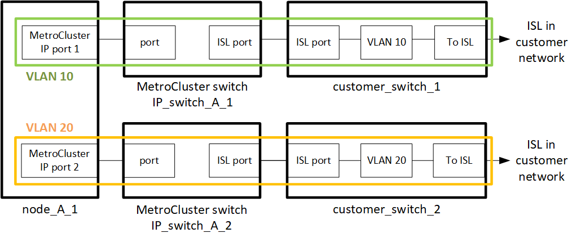

= 在共用第 2 層或第 3 層網路中部署MetroCluster IP 配置的要求
:allow-uri-read: 

[role="lead"]
視您的需求而定、您可以使用共享的第 2 層或第 3 層網路來部署 MetroCluster 。

從 ONTAP 9.6 開始、支援交換器的 MetroCluster IP 組態可以共用現有的交換器間連結（ ISL ）網路、而非使用專用的 MetroCluster ISL 。此拓撲稱為 _ 共享第 2 層網路 _ 。

從功能支援的9.9開始ONTAP 、MetroCluster 即可透過IP路由（第3層）後端連線來實作支援的IP組態。此拓撲稱為 _ 共享第 3 層網路 _ 。

[NOTE]
====
* 並非所有網路拓撲都支援所有功能。
* 您必須驗證您的網路容量是否足夠、以及 ISL 大小是否適合您的組態。低延遲是MetroCluster 在各個景點之間複寫資料的關鍵。這些連線的延遲問題可能會影響用戶端I/O
* 所有關於 MetroCluster 後端交換器的參考資料、都是指 NetApp 驗證的交換器或 MetroCluster 相容的交換器。請參閱 link:mcc-compliant-netapp-validated-switches.html["NetApp 驗證且符合 MetroCluster 規範的交換器"] 以取得更多詳細資料。

====

== ISL 對第 2 層和第 3 層網路的需求

以下內容適用於第 2 層和第 3 層網路：

* MetroCluster 交換器和中間網路交換器之間的 ISL 速度和數量不需要相符。同樣地、中間網路交換器之間的速度也不需要相符。
+
例如、 MetroCluster 交換器可以使用一個 40Gbps ISL 連線至中繼交換器、而中繼交換器可以使用兩個 100Gbps ISL 彼此連線。

* 應在中間網路上設定網路監控、以監控 ISL 的使用率、錯誤（掉落、連結快照、毀損等）、 和故障。
* 所有傳輸 MetroCluster 端點對端點流量的連接埠上、 MTU 大小都必須設為 9216 。
* 無法將其他流量設定為高於服務等級（ COS ） 5 的優先順序。
* 必須在傳輸端點對端點 MetroCluster 流量的所有路徑上設定明確壅塞通知（ ECN ）。
* 傳輸MetroCluster 不穩定流量的ISL必須是交換器之間的原生連結。
+
不支援多重傳輸協定標籤交換（MPLS）連結等連結共用服務。

* 第 2 層 VLAN 本身必須跨越站台。不支援虛擬可延伸LAN（VXLAN）等VLAN重疊。
* 中間交換器的數量不受限制。不過、 NetApp 建議您將交換器數量保持在所需的最低數量。
* MetroCluster 交換器上的 ISL 設定如下：
+
** 交換器連接埠模式「主幹」是 LACP 連接埠通道的一部分
** MTU 大小為 9216
** 未設定原生 VLAN
** 只允許傳輸跨站台 MetroCluster 流量的 VLAN
** 不允許交換器預設 VLAN

== 第 2 層網路的考量

MetroCluster 後端交換器已連線至客戶網路。

由客戶提供的中介交換器必須符合下列需求：

* 中間網路必須在站台之間提供相同的 VLAN 。這必須符合 RCF 檔案中設定的 MetroCluster VLAN 。
* RcfFileGenerator不允許使用平台不支援的VLAN來建立RCF檔案。
* RcfFileGenerator 可能會限制某些 VLAN ID 的使用、例如、如果這些 ID 是供未來使用。一般而言、保留的VLAN最多可達100個（含100個）。
* 第2層VLAN的ID必須與MetroCluster 「支援的VLAN ID」相符、而且必須跨越共用的網路。

.ONTAP 中的 VLAN 組態
您只能在建立介面時指定 VLAN 。您可以設定預設的 VLAN 10 和 20 、或介於 101 到 4096 之間的 VLAN （或交換器廠商支援的號碼、取較低的數字）。建立 MetroCluster 介面之後、您就無法變更 VLAN ID 。

NOTE: 有些交換器廠商可能會保留某些 VLAN 的使用。

下列系統不需要在 ONTAP 中設定 VLAN 。VLAN 由交換器連接埠組態指定：

* FAS8200與AFF FASA300
* 解答320 AFF
* FAS9000 和 AFF A700
* AFF A800 、 ASA A800 、 AFF C800 和 ASA C800
+

NOTE: 以上列出的系統可能使用 VLAN 100 及以下的 VLAN 進行設定。不過、此範圍內的某些 VLAN 可能會保留供其他或未來使用。

對於所有其他系統、在 ONTAP 中建立 MetroCluster 介面時、您必須設定 VLAN 。以下限制適用：

* 預設 VLAN 為 10 和 20
* 如果您執行的是 ONTAP 9.7 或更早版本、則只能使用預設的 VLAN 10 和 20 。
* 如果您執行的是 ONTAP 9.8 或更新版本、您可以使用預設的 VLAN 10 和 20 、也可以使用 100 以上的 VLAN （ 101 及更高版本）。

== 第 3 層網路的考量

後端交換器可直接連線至路由IP網路、或直接連線至路由器（如下列簡化範例所示）、或透過其他介入式交換器連線。MetroCluster

image::../media/mcc_layer3_backend.png[MetroCluster第 3 層後端網路配置]

如所述、將此環境設定為標準的靜態IP組態、並以纜線連接MetroCluster MetroCluster link:https://docs.netapp.com/us-en/ontap-metrocluster/install-ip/concept_parts_of_an_ip_mcc_configuration_mcc_ip.html["設定MetroCluster 靜態硬體元件"]。執行安裝和佈線程序時、您必須執行第 3 層組態的特定步驟。以下內容適用於第 3 層組態：

* 您可以將 MetroCluster 交換器直接連接到路由器或一或多個介入的交換器。
* 您可以將 MetroCluster IP 介面直接連接到路由器或其中一台交換器。
* VLAN必須延伸至閘道裝置。
* 您可以使用 `-gateway parameter` 以 IP 閘道位址設定 MetroCluster IP 介面位址。
* 每個站台的「不支援VLAN」VLAN ID MetroCluster 必須相同。不過、子網路可能會有所不同。
* 不支援MetroCluster 動態路由傳送給不支援的資訊流量。
* 不支援下列功能：
+
** 八節點MetroCluster 的不完整組態
** 重新整理四節點 MetroCluster 組態
** 從MetroCluster 靜態FC移轉至MetroCluster 靜態IP

* 每MetroCluster 個站台都需要兩個子網路、每個網路都需要一個子網路。
* 不支援自動IP指派。

設定路由器和閘道 IP 位址時、您必須符合下列需求：

* 一個節點上的兩個介面不能有相同的閘道 IP 位址。
* 每個站台上HA配對上的對應介面必須具有相同的閘道IP位址。
* 節點及其DR和輔助合作夥伴上的對應介面不能具有相同的閘道IP位址。
* 節點及其DR和輔助合作夥伴上的對應介面必須具有相同的VLAN ID。

== 中間交換器的必要設定

當 MetroCluster 流量通過中繼網路中的 ISL 時、您應該確認中繼交換器的組態是否能確保 MetroCluster 流量（ RDMA 和儲存設備）符合 MetroCluster 站台之間整個路徑中所需的服務層級。

下圖概述使用 NetApp 驗證的 Cisco 交換器時所需的設定：

image::../media/switch_traffic_with_cisco_switches.png[使用NetApp驗證的Cisco交換器進行MetroCluster流量時所需的設定]

下圖概述當外部交換器為 Broadcom IP 交換器時、共用網路所需的設定。

image::../media/switch_traffic_with_broadcom_switches.png[使用 Broadcom IP 交換器時共用網路所需的設置]

在此範例中、我們會針對MetroCluster 某些流量建立下列原則和地圖：

* 。 `MetroClusterIP_ISL_Ingress` 原則會套用至連接至 MetroCluster IP 交換器的中繼交換器上的連接埠。
+
。 `MetroClusterIP_ISL_Ingress` 原則會將傳入的標記流量對應到中繼交換器上的適當佇列。

* 答 `MetroClusterIP_ISL_Egress` 原則會套用到中繼交換器上連接到中繼交換器之間 ISL 的連接埠。
* 您必須設定中間交換器、使其在MetroCluster 整個過程中、都能在不同的路徑上、提供符合QoS存取對應、類別對應和原則對應。中繼交換器會將RDMA流量對應至COS5、並將儲存流量對應至COS4。

以下範例適用於 Cisco Nexus 3232C 和 9336C-FX2 交換器。視交換器廠商和機型而定、您必須驗證中間交換器是否有適當的組態。

.設定中繼交換器 ISL 連接埠的類別對應
以下範例顯示類別對應定義、視您是否需要分類或比對入口流量而定。

[role="tabbed-block"]
====
.對進入流量進行分類：
--
[listing]
----
ip access-list rdma
  10 permit tcp any eq 10006 any
  20 permit tcp any any eq 10006
ip access-list storage
  10 permit tcp any eq 65200 any
  20 permit tcp any any eq 65200

class-map type qos match-all rdma
  match access-group name rdma
class-map type qos match-all storage
  match access-group name storage
----
--
.符合入口流量：
--
[listing]
----
class-map type qos match-any c5
  match cos 5
  match dscp 40
class-map type qos match-any c4
  match cos 4
  match dscp 32
----
--
====
.在中繼交換器的 ISL 連接埠上建立入口原則對應：
以下範例說明如何根據您是否需要分類或比對入口流量來建立入口原則對應。

[role="tabbed-block"]
====
.對進入流量進行分類：
--
[listing]
----
policy-map type qos MetroClusterIP_ISL_Ingress_Classify
  class rdma
    set dscp 40
    set cos 5
    set qos-group 5
  class storage
    set dscp 32
    set cos 4
    set qos-group 4
  class class-default
    set qos-group 0
----
--
.符合入口流量：
--
[listing]
----
policy-map type qos MetroClusterIP_ISL_Ingress_Match
  class c5
    set dscp 40
    set cos 5
    set qos-group 5
  class c4
    set dscp 32
    set cos 4
    set qos-group 4
  class class-default
    set qos-group 0
----
--
====
.設定 ISL 連接埠的出口佇列原則
下列範例顯示如何設定出口佇列原則：

[listing]
----
policy-map type queuing MetroClusterIP_ISL_Egress
   class type queuing c-out-8q-q7
      priority level 1
   class type queuing c-out-8q-q6
      priority level 2
   class type queuing c-out-8q-q5
      priority level 3
      random-detect threshold burst-optimized ecn
   class type queuing c-out-8q-q4
      priority level 4
      random-detect threshold burst-optimized ecn
   class type queuing c-out-8q-q3
      priority level 5
   class type queuing c-out-8q-q2
      priority level 6
   class type queuing c-out-8q-q1
      priority level 7
   class type queuing c-out-8q-q-default
      bandwidth remaining percent 100
      random-detect threshold burst-optimized ecn
----
這些設定必須套用至所有傳輸 MetroCluster 流量的交換器和 ISL 。

在本範例中、第 4 季和第 5 季均使用進行設定 `random-detect threshold burst-optimized ecn`。視您的組態而定、您可能需要設定最小和最大臨界值、如下列範例所示：

[listing]
----
class type queuing c-out-8q-q5
  priority level 3
  random-detect minimum-threshold 3000 kbytes maximum-threshold 4000 kbytes drop-probability 0 weight 0 ecn
class type queuing c-out-8q-q4
  priority level 4
  random-detect minimum-threshold 2000 kbytes maximum-threshold 3000 kbytes drop-probability 0 weight 0 ecn
----

NOTE: 最小值和最大值會因交換器和您的需求而異。

.範例 1 ： Cisco
如果您的組態有 Cisco 交換器、就不需要在中間交換器的第一個入口連接埠上進行分類。接著您可以設定下列對應和原則：

* `class-map type qos match-any c5`
* `class-map type qos match-any c4`
* `MetroClusterIP_ISL_Ingress_Match`

您可以指派 `MetroClusterIP_ISL_Ingress_Match` 原則對應至傳輸 MetroCluster 流量的 ISL 連接埠。

.範例 2 ： Broadcom
如果您的組態有 Broadcom 交換器、則必須在中間交換器的第一個入口連接埠上進行分類。接著您可以設定下列對應和原則：

* `ip access-list rdma`
* `ip access-list storage`
* `class-map type qos match-all rdma`
* `class-map type qos match-all storage`
* `MetroClusterIP_ISL_Ingress_Classify`
* `MetroClusterIP_ISL_Ingress_Match`

您指派 `the MetroClusterIP_ISL_Ingress_Classify` 原則對應至連接 Broadcom 交換器的中繼交換器上的 ISL 連接埠。

您可以指派 `MetroClusterIP_ISL_Ingress_Match` 原則會對應至傳輸 MetroCluster 流量但未連接 Broadcom 交換器的中繼交換器上的 ISL 連接埠。
