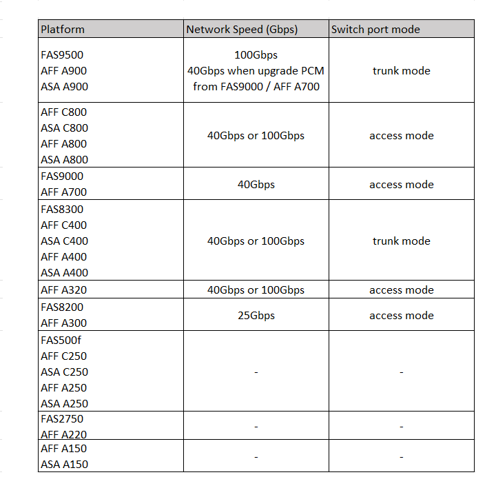

= 適用於MetroCluster相容交換器的平台專屬網路速度和交換器連接埠模式
:allow-uri-read: 
:icons: font
:imagesdir: ../media/

[role="lead"]
如果您使用的是符合 MetroCluster 標準的交換器、您應該瞭解平台特定的網路速度和交換器連接埠模式需求。

下表為 MetroCluster 相容的交換器提供平台專屬的網路速度和交換器連接埠模式。您應該根據表格設定交換器連接埠模式。

NOTE: 缺少值表示平台無法搭配MetroCluster相容的交換器使用。

