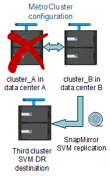

= 在一個邊的組態中使用ONTAP 邊的考量MetroCluster
:allow-uri-read: 
:icons: font
:imagesdir: ../media/

[role="lead"]
在進行不實的組態中使用ONTAP 時MetroCluster 、您應該注意授權、對等處理MetroCluster 不符合此功能的叢集、執行Volume作業、NVFIL作業及其他ONTAP 的不實作業等特定考量。

包括網路在內的兩個叢集的不完整組態應該相同、因為在進行切換時、叢集必須仰賴其能力、才能無縫地為合作夥伴提供資料。ONTAP MetroCluster

== 授權考量

* 這兩個站台都應獲得相同站台授權功能的授權。
* 所有節點均應獲得相同節點鎖定功能的授權。

== SnapMirror考量

* SnapMirror SVM災難恢復僅支援MetroCluster 執行ONTAP 版本為S9.5或更新版本的各種支援。

== 執行功能MetroCluster ONTAP

視ONTAP 您的版本而定、有些MetroCluster專屬作業可以使用ONTAP 「系統管理程式」執行。

若要深入瞭解、請參閱 link:https://docs.netapp.com/us-en/ontap/concept_metrocluster_manage_nodes.html["使用System Manager管理MetroCluster 各種站台"^] 文件。

== 支援的支援功能FlexCache MetroCluster

從ONTAP 使用支援支援支援的功能為從支援的功能為支援的功能為支援的FlexCache 功能為支援的MetroCluster 功能。您應該瞭解切換或切換作業後、手動還原的需求。

=== 當不一致的來源和快取位於相同的站台時、SVM會在切換後重新執行FlexCache MetroCluster

經過協商或非計畫性的切換之後、FlexCache 叢集內的任何SVM恢復關係都必須手動設定。

例如、SVM VS1（快取）和VS2（來源）位於站台A這些SVM都會受到支援。

切換後、SVM VS1-MC和VS1-MC會在合作夥伴站台（站台B）啟動。必須手動將它們重複執行、FlexCache 才能使用vserver對等拒絕命令來運作。

=== 當某個目的地位於第三個叢集且處於中斷連線模式時、SVM會在切換或切換後還原FlexCache

為了FlexCache 與MetroCluster 非流通組態的叢集建立關聯、如果相關叢集在切換期間處於中斷連線模式、則必須在切換後手動重新設定對等關係。

例如：

* 只有一端FlexCache 是支援（VS1上的CACD_1）MetroCluster 位在支援功能的站台A、FlexCache 只有一端是支援功能
* 另一端FlexCache 的資料（VS2上的ORIGIN_1）位於站台C（MetroCluster 而非整個流程圖）

當觸發切換時、如果站台_A和站台_C未連線、您必須在切換後、使用vserver對等拒絕命令、手動重新啟動站台_B（切換叢集）和站台_C上的SVM。

執行切換時、您必須再次在ssite（站台）a（原始叢集）和ssite（站台）c上還原SVM

.相關資訊
link:https://docs.netapp.com/us-en/ontap/flexcache/index.html["使用CLI進行磁碟區管理FlexCache"^]

== 支援各種支援的支援FabricPool MetroCluster

從NetApp 9.7開始ONTAP 、MetroCluster 支援FabricPool 各種不含資料的儲存層組態。

如需使用FabricPools的一般資訊、請參閱 https://docs.netapp.com/us-en/ontap/disks-aggregates/index.html["磁碟與層（Aggregate）管理"^]。

=== 使用FabricPools時的考量

* 叢集必須具有FabricPool 容量限制相符的不完整版授權。
* 叢集必須具有名稱相符的IPspaces。
+
這可以是預設的IPspace、也可以是系統管理所建立的IP空間。此IPspace將用於FabricPool 物件儲存組態設定。

* 對於所選的IPspace、每個叢集都必須定義叢集間LIF、才能連到外部物件存放區

=== 設定用於鏡射FabricPool 的Aggregate

NOTE: 在設定Aggregate之前、您必須依照FabricPool 中的「設定物件存放區以MetroCluster 供使用的物件組態」所述、設定物件存放區 https://docs.netapp.com/ontap-9/topic/com.netapp.doc.dot-cm-psmg/home.html["磁碟與Aggregate管理"^]。

.步驟
若要設定Aggregate以供FabricPool 在整個過程中使用：

. 建立Aggregate或選取現有Aggregate。
. 將Aggregate鏡射為MetroCluster 典型的鏡射Aggregate、位於整個過程的不協調組態內。
. 如FabricPool 所述、使用Aggregate建立鏡射 https://docs.netapp.com/ontap-9/topic/com.netapp.doc.dot-cm-psmg/home.html["磁碟與Aggregate管理"^]
+
.. 附加主要物件存放區。
+
此物件存放區實際上較接近叢集。

.. 新增鏡射物件存放區。
+
此物件存放區與主要物件存放區的實體距離比遠。

== 支援各種支援的支援FlexGroup MetroCluster

從功能支援支援不完整的支援功能的支援範本的支援範本ONTAP 。MetroCluster FlexGroup

== 以功能不一的組態排程工作MetroCluster

在使用者建立的作業排程中、使用者建立的工作排程會自動複寫到以功能性為設計目標的叢集之間。ONTAP MetroCluster如果您在叢集上建立、修改或刪除工作排程、則會使用組態複寫服務（CRS）、在合作夥伴叢集上自動建立相同的排程。

NOTE: 系統建立的排程不會複寫、您必須在合作夥伴叢集上手動執行相同的作業、以便兩個叢集上的工作排程相同。

== 叢集從MetroCluster 整個站台對等移轉到第三個叢集

由於對等組態並未複寫、因此如果您將MetroCluster 某個執行於該組態的叢集對等到該組態以外的第三個叢集、您也必須在合作夥伴MetroCluster 的叢集上設定對等。這是為了在發生切換時維持對等關係。

非MetroCluster叢集必須執行ONTAP 的是不含更新版本的版本。如果沒有、即使在MetroCluster 兩個支援夥伴上都設定了對等關係、也會在發生切換時遺失對等關係。

== LDAP用戶端組態複寫（MetroCluster 以不中斷組態）

在本機叢集的儲存虛擬機器（SVM）上建立的LDAP用戶端組態、會複寫到遠端叢集上的合作夥伴資料SVM。例如、如果LDAP用戶端組態是在本機叢集的管理SVM上建立、則會複寫到遠端叢集上的所有管理資料SVM。此功能是刻意設計的、因此LDAP用戶端組態會在遠端叢集上的所有合作夥伴SVM上啟用。MetroCluster

== 適用於MetroCluster 各種組態的網路與LIF建立準則

您應該瞭MetroCluster 解如何在一套功能性的組態中建立及複寫生命。您也必須瞭解一致性需求、以便在設定網路時做出適當的決策。

.相關資訊
https://docs.netapp.com/ontap-9/topic/com.netapp.doc.dot-cm-nmg/home.html["網路與LIF管理"^]

link:concept_considerations_when_using_ontap_in_a_mcc_configuration.html#ipspace-object-replication-and-subnet-configuration-requirements["IPSpace物件複寫和子網路組態需求"]

link:concept_considerations_when_using_ontap_in_a_mcc_configuration.html#requirements-for-lif-creation-in-a-metrocluster-configuration["以架構組態建立LIF的需求MetroCluster"]

link:concept_considerations_when_using_ontap_in_a_mcc_configuration.html#lif-replication-and-placement-requirements-and-issues["LIF複寫及放置需求與問題"]

=== IPSpace物件複寫和子網路組態需求

您應該瞭解將IPspace物件複寫到合作夥伴叢集、以及在MetroCluster 整個過程中設定子網路和IPv6的需求。

==== IPSpace複寫

將IPspace物件複寫到合作夥伴叢集時、您必須考量下列準則：

* 這兩個站台的IPspace名稱必須相符。
* IPSpace物件必須手動複寫至合作夥伴叢集。
+
在IPspace複寫之前建立並指派給IPspace的任何儲存虛擬機器（SVM）、都不會複寫到合作夥伴叢集。

==== 子網路組態

在MetroCluster 設定子網路為一個以供參考的組態時、您必須考量下列準則：

* 兩個MetroCluster 支援此功能的叢集在相同的IPspace中、必須具有相同的子網路名稱、子網路、廣播網域和閘道。
* 兩個叢集的IP範圍必須不同。
+
在下列範例中、IP範圍不同：

+
[listing]
----
cluster_A::> network subnet show

IPspace: Default
Subnet                     Broadcast                   Avail/
Name      Subnet           Domain    Gateway           Total    Ranges
--------- ---------------- --------- ------------      -------  ---------------
subnet1   192.168.2.0/24   Default   192.168.2.1       10/10    192.168.2.11-192.168.2.20

cluster_B::> network subnet show
 IPspace: Default
Subnet                     Broadcast                   Avail/
Name      Subnet           Domain    Gateway           Total    Ranges
--------- ---------------- --------- ------------     --------  ---------------
subnet1   192.168.2.0/24   Default   192.168.2.1       10/10    192.168.2.21-192.168.2.30
----

==== IPv6組態

如果在一個站台上設定IPv6、則另一個站台也必須設定IPv6。

.相關資訊
link:concept_considerations_when_using_ontap_in_a_mcc_configuration.html#requirements-for-lif-creation-in-a-metrocluster-configuration["以架構組態建立LIF的需求MetroCluster"]

link:concept_considerations_when_using_ontap_in_a_mcc_configuration.html#lif-replication-and-placement-requirements-and-issues["LIF複寫及放置需求與問題"]

=== 以架構組態建立LIF的需求MetroCluster

在MetroCluster 設定以功能性為基礎的網路組態時、您應該瞭解建立生命的需求。

建立生命時、您必須考量下列準則：

* Fibre Channel：您必須使用延伸的VSAN或延伸的Fabric
* IP/iSCSI：您必須使用第2層延伸網路
* ARP廣播：您必須在兩個叢集之間啟用ARP廣播
* 重複的lifs：不能在IPspace中使用相同的IP位址（重複的lifs）建立多個lifs
* NFS與SAN組態：您必須針對無鏡射與鏡射的Aggregate使用不同的儲存虛擬機器（SVM）

==== 驗證LIF建立

您可以執行SeskCheck LIF show命令、確認是否能在MetroCluster 一個SeskesfConfiguration中成功建立LIF MetroCluster 。如果您在建立LIF時遇到任何問題、可以使用MetroCluster 指令《核對LIF修復放置命令」來修正問題。

.相關資訊
link:concept_considerations_when_using_ontap_in_a_mcc_configuration.html#ipspace-object-replication-and-subnet-configuration-requirements["IPSpace物件複寫和子網路組態需求"]

link:concept_considerations_when_using_ontap_in_a_mcc_configuration.html#lif-replication-and-placement-requirements-and-issues["LIF複寫及放置需求與問題"]

=== LIF複寫及放置需求與問題

您應該瞭解MetroCluster 到整個流程組態中的LIF複寫需求。您也應該知道複寫的LIF如何放置在合作夥伴叢集上、而且您應該瞭解LIF複寫或LIF放置失敗時所發生的問題。

==== 複寫LIF至合作夥伴叢集

當您在MetroCluster 採用非集中組態的叢集上建立LIF時、LIF會複寫到合作夥伴叢集上。LIF不會以一對一的名稱為基礎放置。針對切換作業後的LIF可用度、LIF放置程序會根據可到達性和連接埠屬性檢查、驗證連接埠是否能夠裝載LIF。

系統必須符合下列條件、才能將複寫的LIF置於合作夥伴叢集上：

[cols="2,5,8"]
|===

| 條件 | LIF類型：FC | LIF類型：IP/iSCSI 

 a| 
節點識別
 a| 
嘗試將複寫的LIF放在建立它的節點的災難恢復（DR）合作夥伴上。ONTAP如果DR合作夥伴無法使用、則DR輔助合作夥伴將用於放置。
 a| 
嘗試將複寫的LIF放在所建立節點的DR合作夥伴上。ONTAP如果DR合作夥伴無法使用、則DR輔助合作夥伴將用於放置。

 a| 
連接埠識別
 a| 
可識別DR叢集上連接的FC目標連接埠。ONTAP
 a| 
DR叢集上的連接埠與來源LIF位於相同的IPspace中、會被選取以進行可到達性檢查。如果同一個IPspace中的DR叢集中沒有連接埠、則無法放置LIF。

DR叢集中所有已在相同IPspace和子網路中裝載LIF的連接埠、都會自動標示為可連線、並可用於放置。這些連接埠不包含在連線能力檢查中。

 a| 
連線能力檢查
 a| 
可連線性是透過檢查DR叢集中連接埠上來源網路WWN的連線能力來決定。如果DR站台上沒有相同的網路、則LIF會放在DR合作夥伴的隨機連接埠上。
 a| 
可到達性取決於對從DR叢集上先前識別的每個連接埠到要放置之LIF來源IP位址的位址解析傳輸協定（Arp）廣播的回應。若要成功進行可到達性檢查、必須允許兩個叢集之間的ARP廣播。

接收來源LIF回應的每個連接埠都會標示為可能的放置位置。

 a| 
連接埠選擇
 a| 
根據介面卡類型和速度等屬性來分類連接埠、然後選取具有相符屬性的連接埠。如果找不到具有相符屬性的連接埠、則LIF會放置在DR合作夥伴的隨機連接埠上。ONTAP
 a| 
從可連線性檢查期間標示為可連線的連接埠、 選用廣播網域中與LIF子網路相關聯的連接埠。如果DR叢集上沒有與LIF子網路相關聯的網路連接埠、ONTAP 然後、選擇可連線至來源LIF的連接埠。ONTAP

如果沒有連接至來源LIF的連接埠、則會從與來源LIF子網路相關聯的廣播網域中選取連接埠、如果不存在此類廣播網域、則會選取隨機連接埠。

根據介面卡類型、介面類型和速度等屬性、將連接埠分類、然後選取具有相符屬性的連接埠。ONTAP

 a| 
LIF放置
 a| 
從可到達的連接埠ONTAP 、選擇最少負載的連接埠進行放置。
 a| 
從選取的連接埠ONTAP 、選擇最少負載的連接埠進行放置。

|===

==== 當DR合作夥伴節點當機時、放置複寫的LIF

當iSCSI或FC LIF是在DR合作夥伴已接管的節點上建立時、複寫的LIF會放置在DR輔助合作夥伴節點上。在後續的恢復作業之後、將不會自動將LIF移至DR合作夥伴。這可能會導致LIF集中在合作夥伴叢集中的單一節點上。在進行物件切換作業期間MetroCluster 、後續嘗試對應屬於儲存虛擬機器（SVM）的LUN時、將會失敗。

您應該MetroCluster 在接管作業或恢復作業之後執行「S還原 檢查LIF show」命令、以驗證LIF放置是否正確。如果發生錯誤、您可以執行「MetroCluster 停止修復定位」命令來解決問題。

==== LIF放置錯誤

在切換作業之後、「MetroCluster 不知道資料檢查LIF show」命令所顯示的LIF放置錯誤會保留下來。如果針對LIF發出「網路介面修改」、「網路介面重新命名」或「網路介面刪除」命令、但出現放置錯誤、則錯誤將會移除、而且不會出現在「MetroCluster Rename Check LIF show」命令的輸出中。

==== LIF複寫失敗

您也可以使用「MetroCluster show lif show」命令來檢查LIF複寫是否成功。如果LIF複寫失敗、將會顯示EMS訊息。

您可以針對MetroCluster 任何無法找到正確連接埠的LIF、執行「SikellCheck LIF修復放置」命令來修正複寫失敗。您應該盡快解決任何LIF複寫故障、以驗證在MetroCluster 執行「切換」作業期間LIF的可用度。

NOTE: 即使來源SVM停機、如果目的地SVM中的IP空間和網路相同、連接埠中有屬於不同SVM的LIF、則LIF放置可能會正常進行。

.相關資訊
link:concept_considerations_when_using_ontap_in_a_mcc_configuration.html#ipspace-object-replication-and-subnet-configuration-requirements["IPSpace物件複寫和子網路組態需求"]

link:concept_considerations_when_using_ontap_in_a_mcc_configuration.html#requirements-for-lif-creation-in-a-metrocluster-configuration["以架構組態建立LIF的需求MetroCluster"]

=== 在根Aggregate上建立Volume

系統不允許在MetroCluster 實體組態中節點的根Aggregate（具有CFO HA原則的Aggregate）上建立新磁碟區。

由於此限制、根集合體無法使用「vserver add-aggregate」命令新增至SVM。

== SVM災難恢復功能MetroCluster 、以一套功能不全的組態進行

從ONTAP 功能介紹的起、MetroCluster 使用支援VMware®的動態儲存虛擬機器（SVM）就能透過SnapMirror SVM災難恢復功能、作為來源。目的地SVM必須位於MetroCluster 不屬於該組態的第三個叢集上。

從ONTAP 功能完善的9.11.1開始、MetroCluster 可從功能完善的兩個站台開始、成為SVM DR與FAS 功能完善或AFF 功能完善的目的地叢集之間關係的來源、如下圖所示。

image:../media/svmdr_new_topology-2.png["SVM DR新拓撲"]

您應該瞭解搭配SnapMirror災難恢復使用SVM的下列要求和限制：

* 只有MetroCluster 在整個SVM組態中有作用中的SVM、才能成為SVM災難恢復關係的來源。
+
來源可以是切換前的同步來源SVM、或是切換後的同步目的地SVM。

* 當某個支援區組態處於穩定狀態時、由於該磁碟區不在線上、所以無法將該支援區同步目的地SVM作為SVM災難恢復關係的來源。MetroCluster MetroCluster
+
下圖顯示SVM災難恢復行為處於穩定狀態：

+
image::../media/svm_dr_normal_behavior.gif[SVM DR正常行為]

* 當sync-source sVM是SVM DR關係的來源時、來源SVM DR關係資訊會複寫到MetroCluster 該合作夥伴。
+
如此可讓SVM DR更新在切換後繼續、如下列映像所示：

+

* 在切換和切換程序期間、複寫到SVM DR目的地可能會失敗。
+
不過、在切換或切換程序完成之後、下一個SVM DR排程更新將會成功。

請參閱中的「複寫SVM組態」 http://docs.netapp.com/ontap-9/topic/com.netapp.doc.pow-dap/home.html["資料保護"^] 如需設定SVM DR關係的詳細資訊、

=== 在災難恢復站台上進行SVM重新同步

在重新同步期間、MetroCluster 將從非MetroCluster站台上的目的地SVM還原位於該組態上的儲存虛擬機器（SVM）災難恢復（DR）來源。

在重新同步期間、來源SVM（叢集_A）會暫時做為目的地SVM、如下圖所示：

image::../media/svm_dr_resynchronization.gif[SVM DR重新同步]

==== 如果在重新同步期間發生非計畫性切換

重新同步期間發生的非計畫性切換、將會停止重新同步傳輸。如果發生非計畫性的切換、則下列情況為真：

* 在站台上的目的地SVM MetroCluster （在重新同步之前是來源SVM）仍會保留為目的地SVM。合作夥伴叢集的SVM將繼續保留其子類型、並保持非作用中狀態。
* SnapMirror關係必須以同步目的地SVM作為目的地、以手動方式重新建立。
* SnapMirror關係不會出現在SnapMirror顯示輸出中、除非執行SnapMirror建立作業、否則會在存留站台切換後出現。

==== 在重新同步期間進行非計畫性切換後執行切換

若要成功執行切換程序、必須中斷並刪除重新同步關係。如果存在任何SnapMirror DR目的地SVM MetroCluster 、或者叢集的SVM子類型為「dp-dit目的地」、則不允許切換。

== 儲存Aggregate plex show命令的輸出在MetroCluster 執行完功能介紹後仍不確定

當您在MetroCluster 執行完還原切換後執行儲存Aggregate plex show命令時、切換根Aggregate的plex0狀態會不確定、並顯示為故障。在此期間、切換根目錄不會更新。此叢的實際狀態只能在MetroCluster 還原階段之後決定。

== 在切換時修改Volume以設定NVFIL旗標

您可以修改磁碟區、以便在MetroCluster 發生故障切換時、在磁碟區上設定NVFIL旗標。NVFIL旗標會將磁碟區隔離、使其不受任何修改。這是需要處理的磁碟區、如同切換後已將寫入作業提交至磁碟區的內容遺失一樣。

NOTE: 在9.0之前的版本中、NVFIL旗標會用於每個切換。ONTAP在更新版本的版本中、使用非計畫性的切換（USO）ONTAP 。

.步驟
. 將MetroCluster 「vol-dr-force-nv故障」參數設為「開啟」、啟用此組態以在切換時觸發NVFIL：
+
「vol modify -vserver vserver-name -volume volVolume名稱-dr-force-nvail on」

