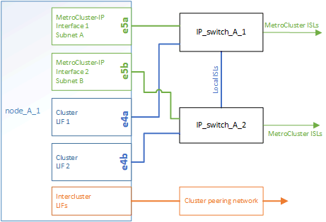

= 部分的靜態IP組態MetroCluster
:allow-uri-read: 
:icons: font
:imagesdir: ../media/

[role="lead"]
規劃MetroCluster 您的靜態IP組態時、您應該瞭解硬體元件及其互連方式。

== 關鍵硬體元素

一套包含下列主要硬體元素的功能：MetroCluster

* 儲存控制器
+
儲存控制器設定為兩個雙節點叢集。

* IP網路
+
此後端IP網路提供兩種不同用途的連線能力：

+
** 叢集內通訊的標準叢集連線功能。
+
這與非MetroCluster交換ONTAP 式叢集所使用的叢集交換器功能相同。

** 用於複寫儲存資料和非揮發性快取的後端連線功能。MetroCluster

* 叢集對等網路
+
叢集對等網路提供連線功能、可鏡射叢集組態、包括儲存虛擬機器（SVM）組態。一個叢集上所有的SVM組態都會鏡射到合作夥伴叢集。

image::../media/mcc_ip_hardware_architecture_mcc_ip.gif[MCC IP硬體架構MCC IP]

== 災難恢復（DR）群組

一個由四個節點組成的DR群組是由一個VMware IP組態所組成。MetroCluster

下圖顯示了四節點MetroCluster 的節點的架構。

image::../media/mcc_dr_groups_4_node.gif[MCC DR群組4個節點]

== 以架構組態顯示本機HA配對的圖例MetroCluster

每MetroCluster 個VMware站台都包含設定為HA配對的儲存控制器。如此一來、本機備援功能便可在某個儲存控制器故障時、由其本機HA合作夥伴接管。此類故障無需MetroCluster 執行不可用的切換操作即可處理。

本機HA容錯移轉和還原作業是以非MetroCluster組態的相同方式、使用儲存容錯移轉命令來執行。

.相關資訊
https://["概念ONTAP"]

== 示意圖：「靜態IP」和「叢集互連網路」MetroCluster

支援叢集的叢集通常包括叢集互連網路、用於叢集中節點之間的流量。ONTAP在靜態IP組態中、此網路也可用於在各個站台之間傳輸資料複寫流量。MetroCluster MetroCluster

image::../media/mcc_ip_hardware_architecture_ip_interconnect.png[MCC IP硬體架構IP互連]

在Sfor the Back-End IP網路組態中、每個節點MetroCluster 都有專屬的生命期：

* 兩MetroCluster 個介面
* 一個叢集間LIF

下圖顯示這些介面。所示的連接埠使用量適用於AFF 不含功能的A700或FAS9000系統。

.相關資訊
link:concept_considerations_mcip.html["關於靜態IP組態的考量MetroCluster"]

== 叢集對等網路的圖例

透過客戶提供的叢集對等網路、將會對支援此組態的兩個叢集MetroCluster 進行對等連接。叢集對等功能可在站台之間同步鏡射儲存虛擬機器（SVM、先前稱為Vserver）。

叢集間的生命體必須設定MetroCluster 在每個節點上的Sfor the Sepering、而且叢集必須設定為對等。具有叢集間生命體的連接埠會連接至客戶提供的叢集對等網路。SVM組態的複寫是透過組態複寫服務透過此網路進行。

image::../media/mcc_ip_hardware_architecture_cluster_peering_network.gif[MCC IP硬體架構叢集對等網路]

.相關資訊
http://["叢集與SVM對等化快速組態"]

link:concept_considerations_peering.html["設定叢集對等的考量"]

link:task_cable_other_connections.html["叢集對等連線纜線"]

link:task_sw_config_configure_clusters.html#peering-the-clusters["對等連接叢集"]
