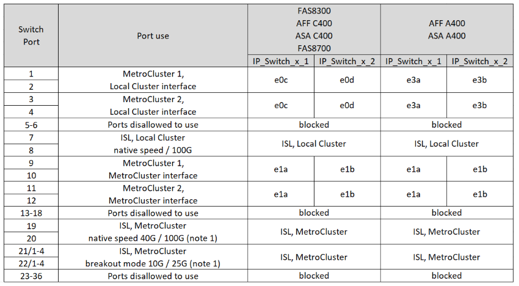

= MetroCluster IP 配置中 12 連接埠Cisco 9336C-FX2 交換器的平台連接埠分配
:allow-uri-read: 
:icons: font
:imagesdir: ../media/

[role="lead"]
連接埠在MetroCluster 一個靜態IP組態中的使用取決於交換器機型和平台類型。

使用組態表之前，請先檢閱下列考量事項：

* 本節的表格適用於 12 埠 Cisco 9336C-FX2 交換器。
+
如果您有 36 連接埠 Cisco 9336C-FX2 交換機，但未連接 NS224 機架，請使用link:port_usage_3232c_9336c.html["Cisco 3232C 或 36 連接埠 Cisco 9336C-FX2 交換器的平台連接埠分配"] 。

+
如果您有 36 連接埠 Cisco 9336C-FX2 交換機，並且至少一個 MetroCluster 設定或 DR 組將 NS224 機架連接到 MetroCluster 交換機，請使用link:port_usage_9336c_shared.html["連接 NS224 儲存的 36 連接埠 Cisco 9336C-FX2 交換器的平台連接埠分配"] 。

NOTE: 12 連接埠 Cisco 9336C-FX2 交換器不支援將 NS224 架連接到 MetroCluster 交換器。

* 下表顯示站台A的連接埠使用量站台B使用相同的纜線
* 您無法為交換器設定不同速度的連接埠（例如，100 Gbps 連接埠和 40 Gbps 連接埠的混合）。
* 如果您使用MetroCluster 交換器設定單一的支援、請使用* MetroCluster 支援1*連接埠群組。
+
追蹤 MetroCluster 連接埠群組（MetroCluster 1、MetroCluster 2）。如本配置過程後面所述，在使用 RcfFileGenerator 工具時會使用它。

* RcfFileGeneratorfor MetroCluster EscIP也提供每個交換器的每埠纜線總覽。

== 請為您的組態選擇正確的纜線配置表

請使用下表來判斷您應遵循的纜線表。

[cols="25,75"]
|===
| 如果您的系統 ... | 使用此纜線表 ... 

| AFF A150，ASA A150 FAS500f AFF C250，ASA C250 AFF A250，ASA A250 | <<table_1_cisco_12port_9336c,Cisco 9336C-FX2 12 連接埠平台連接埠分配（第 1 組）>> 

| AFF A20 | <<table_2_cisco_12port_9336c,Cisco 9336C-FX2 12 連接埠平台連接埠分配（第 2 組）>> 

| AFF A30 ， AFF C30 FAS50 AFF C60  a| 
下表取決於您使用的是 25G （第 3a 組）還是 100g （第 3b 組）乙太網路卡。

* <<table_3a_cisco_12port_9336c,Cisco 9336C-FX2 12 連接埠平台連接埠分配（群組 3a - 25G）>>
* <<table_3b_cisco_12port_9336c,Cisco 9336C-FX2 12 連接埠平台連接埠分配（群組 3b - 100G）>>

| FAS8300、AFF C400、ASA C400、FAS8700 AFF A400、ASA A400 | <<table_4_cisco_12port_9336c,Cisco 9336C-FX2 12 連接埠平台連接埠分配（第 4 組）>> 

| AFF A50 | <<table_5_cisco_12port_9336c,Cisco 9336C-FX2 12 連接埠平台連接埠分配（第 5 組）>> 

| AFF C800、ASA C800、AFF A800、ASA A800 FAS9500、AFF A900、ASA A900 | <<table_6_cisco_12port_9336c,Cisco 9336C-FX2 12 連接埠平台連接埠分配（第 6 組）>> 

| FAS70 ， AFF A70 AFF C80 FAS90 ， AFF A90 AFF A1K | <<table_7_cisco_12port_9336c,Cisco 9336C-FX2 12 連接埠平台連接埠分配（第 7 組）>> 
|===
.Cisco 9336C-FX2 12 連接埠平台連接埠分配（第 1 組）
查看平台連接埠分配，以將 AFF A150、ASA A150、FAS500f、AFF C250、ASA C250、AFF A250 或 ASA A250 系統連接至 12 連接埠 Cisco 9336C-FX2 交換器：

image:../media/mccip-cabling-9336c-12-port-a150-fas500f-a250-c250.png["顯示 Cisco 9336C-FX2 12 連接埠平台連接埠分配"]

*註 1：*您只能設定連接埠 19 和 20 *或* 連接埠 21 和 22。如果您先使用連接埠 19 和 20，則連接埠 21 和 22 將被封鎖。如果您先使用連接埠 21 和 22，則連接埠 19 和 20 將被封鎖。

.Cisco 9336C-FX2 12 連接埠平台連接埠分配（第 2 組）
查看平台連接埠分配，以便將 AFF A20 系統連接到 12 連接埠 Cisco 9336C-FX2 交換器：

image:../media/mccip-cabling-9336c-12-port-a20.png["顯示 Cisco 9336C-FX2 12 連接埠平台連接埠分配"]

*註 1：*您只能設定連接埠 19 和 20 *或* 連接埠 21 和 22。如果您先使用連接埠 19 和 20，則連接埠 21 和 22 將被封鎖。如果您先使用連接埠 21 和 22，則連接埠 19 和 20 將被封鎖。

.Cisco 9336C-FX2 12 連接埠平台連接埠分配（群組 3a）
查看平台連接埠分配，以使用四埠 25G 乙太網路卡將 AFF A30、AFF C30、AFF C60 或 FAS50 系統連接至 12 連接埠 Cisco 9336C-FX2 交換器。

NOTE: 此組態需要插槽 4 中的四埠 25G 乙太網路卡，才能連接本機叢集和 HA 介面。

image:../media/mccip-cabling-9336c-12-port-a30-c30-fas50-c60-25g.png["顯示 Cisco 9336C-FX2 12 連接埠平台連接埠分配"]

*註 1：*您只能設定連接埠 19 和 20 *或* 連接埠 21 和 22。如果您先使用連接埠 19 和 20，則連接埠 21 和 22 將被封鎖。如果您先使用連接埠 21 和 22，則連接埠 19 和 20 將被封鎖。

.Cisco 9336C-FX2 12 連接埠平台連接埠分配（群組 3b）
查看平台連接埠分配，以便使用雙連接埠 100G 乙太網路卡將 AFF A30、AFF C30、AFF C60 或 FAS50 系統連接至 12 連接埠 Cisco 9336C-FX2 交換器。

NOTE: 此組態需要插槽 4 中的雙埠 100g 乙太網路卡，才能連接本機叢集和 HA 介面。

image:../media/mccip-cabling-9336c-12-port-a30-c30-fas50-c60-100g.png["顯示 Cisco 9336C-FX2 12 連接埠平台連接埠分配"]

*註 1：*您只能設定連接埠 19 和 20 *或* 連接埠 21 和 22。如果您先使用連接埠 19 和 20，則連接埠 21 和 22 將被封鎖。如果您先使用連接埠 21 和 22，則連接埠 19 和 20 將被封鎖。

.Cisco 9336C-FX2 12 連接埠平台連接埠分配（第 4 組）
查看平台連接埠分配，以將 FAS8300、AFF C400、ASA C400、FAS8700、AFF A400 或 ASA A400 系統連接至 12 連接埠 Cisco 9336C-FX2 交換器：

*註 1：*您只能設定連接埠 19 和 20 *或* 連接埠 21 和 22。如果您先使用連接埠 19 和 20，則連接埠 21 和 22 將被封鎖。如果您先使用連接埠 21 和 22，則連接埠 19 和 20 將被封鎖。

.Cisco 9336C-FX2 12 連接埠平台連接埠分配（第 5 組）
查看平台連接埠分配，以將 AFF A50 系統連接至 12 連接埠 Cisco 9336C-FX2 交換器：

image::../media/mccip-cabling-9336c-12-port-a50.png[顯示 Cisco 9336C-FX2 12 連接埠平台連接埠分配]

*註 1：*您只能設定連接埠 19 和 20 *或* 連接埠 21 和 22。如果您先使用連接埠 19 和 20，則連接埠 21 和 22 將被封鎖。如果您先使用連接埠 21 和 22，則連接埠 19 和 20 將被封鎖。

.Cisco 9336C-FX2 12 連接埠平台連接埠分配（第 6 組）
查看平台連接埠分配，以將 AFF C800、ASA C800、AFF A800、ASA A800、FAS9500、AFF A900 或 ASA A900 系統連接至 12 連接埠 Cisco 9336C-FX2 交換器：

image::../media/mccip-cabling-9336c-12-port-c800-a800-fas9500-a900.png[顯示 Cisco 9336C-FX2 12 連接埠平台連接埠分配]

*註 1：*您只能設定連接埠 19 和 20 *或* 連接埠 21 和 22。如果您先使用連接埠 19 和 20，則連接埠 21 和 22 將被封鎖。如果您先使用連接埠 21 和 22，則連接埠 19 和 20 將被封鎖。

*註 2：*如果您使用的是 X91440A 轉接器 (40Gbps)，請使用連接埠 e4a 和 e4e 或 e4a 和 e8a。如果您使用的是 X91153A 介面卡（ 100Gbps ），請使用連接埠 E4A 和 e4b 或 E4A 和 e8a 。

.Cisco 9336C-FX2 12 連接埠平台連接埠分配（第 7 組）
查看平台連接埠分配，以將 AFF A70、FAS70、AFF C80、FAS90、AFF A90 或 AFF A1K 系統連接至 12 連接埠 Cisco 9336C-FX2 交換器：

image:../media/mccip-cabling-9336c-12-port-fas70-a70-c80-fas90-a90-a1k.png["顯示 Cisco 9336C-FX2 12 連接埠平台連接埠分配"]

*註 1：*您只能設定連接埠 19 和 20 *或* 連接埠 21 和 22。如果您先使用連接埠 19 和 20，則連接埠 21 和 22 將被封鎖。如果您先使用連接埠 21 和 22，則連接埠 19 和 20 將被封鎖。
