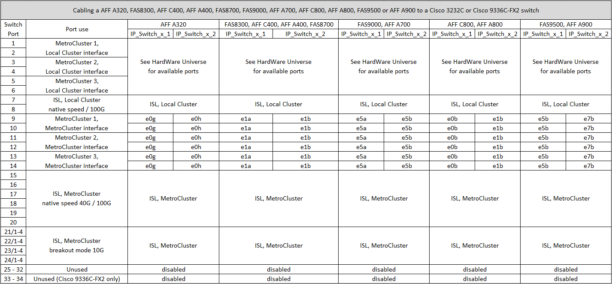
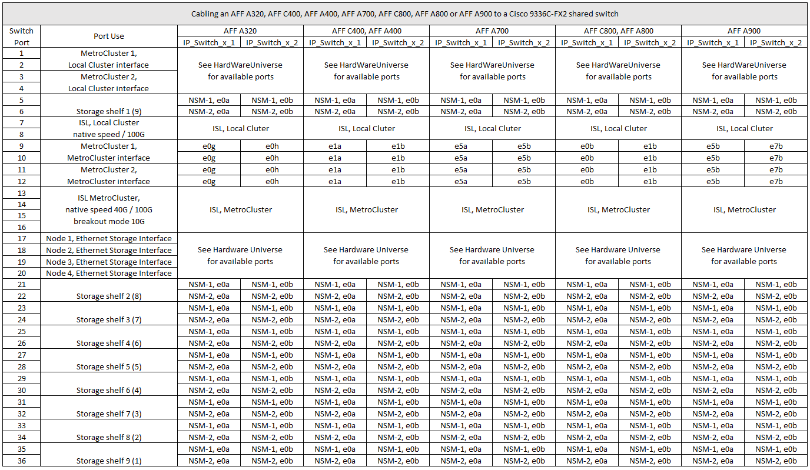

= Cisco 3232C或Cisco 9336C交換器的平台連接埠指派
:allow-uri-read: 
:icons: font
:imagesdir: ../media/

[role="lead"]
連接埠在MetroCluster 一個靜態IP組態中的使用取決於交換器機型和平台類型。

使用表格之前、請先檢閱下列考量事項：

* 下表顯示站台A的連接埠使用量站台B使用相同的纜線
* 交換器無法設定不同速度的連接埠（例如、混合使用100 Gbps連接埠和40 Gbps連接埠）。
* 如果您使用MetroCluster 交換器設定單一的支援、請使用* MetroCluster 支援1*連接埠群組。
+
追蹤MetroCluster 不穩定的資料群組MetroCluster （例如：1、MetroCluster 2、MetroCluster 或3）。使用RcfFileGenerator-工具時、您將需要此工具、如本組態程序稍後所述。

* RcfFileGeneratorfor MetroCluster EscIP也提供每個交換器的每埠纜線總覽。
+
使用此纜線總覽來驗證纜線。

== 將兩MetroCluster 個交換器連接至交換器

將多個 MetroCluster 組態連接至 Cisco 3132Q-V 交換器時、您必須根據適當的表格為每個 MetroCluster 連接纜線。例如，如果將 FAS2750 和 AFF A700 連接到同一臺 Cisco 3132Q-V 交換機。然後根據表 1 中的「 MetroCluster 1 AFF 」、以及表 2 中的「 MetroCluster 2 」或「 MetroCluster 3 」、為 FAS2750 連接纜線。您無法將 FAS2750 和 AFF A700 實體連接成「 MetroCluster 1 」。

== 將 AFF A150 、 FAS2750 、 AFF A220 、 FAS500f 、 AFF C250 或 AFF A250 連接至 Cisco 3232C 或 Cisco 9336-FX2C 交換器

image::../media/mcc_ip_cabling_a150_a220_a250_to_a_cisco_3232c_or_cisco_9336c_switch.png[MCC IP 纜線 a150 A220 a250 至 Cisco 3232c 或 Cisco 9336c 交換器]

== 將 FAS8200 或 AFF A300 連接至 Cisco 3232C 或 Cisco 9336C 交換器

image::../media/mcc_ip_cabling_a_aff_a300_or_fas8200_to_a_cisco_3232c_or_cisco_9336c_switch.png[MCC IP纜線AFF 連接至Cisco 3232c或Cisco 9336c交換器的不支援A300或fas8200]

== AFF A320 、 FAS8300 、 AFF C400 、 AFF A400 、 FAS8700 、 FAS9000 、 AFF A700 、 AFF C800 、 AFF A800 、 FAS9500 或 AFF A900

== 佈線 AFF A320 、 AFF C400 、 AFF A400 、 AFF A700 、 AFF C800 、 或 AFF A800 至 Cisco 9336C-FX2 共用交換器

