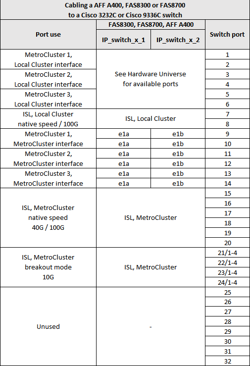
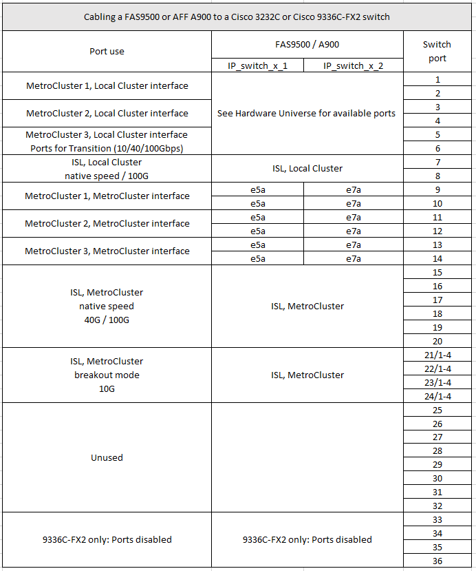

= Cisco 3232C或Cisco 9336C交換器的平台連接埠指派
:allow-uri-read: 
:icons: font
:imagesdir: ../media/

[role="lead"]
連接埠在MetroCluster 一個靜態IP組態中的使用取決於交換器機型和平台類型。

使用表格之前、請先檢閱下列考量事項：

* 下表顯示站台A的連接埠使用量站台B使用相同的纜線
* 交換器無法設定不同速度的連接埠（例如、混合使用100 Gbps連接埠和40 Gbps連接埠）。
* 如果您使用MetroCluster 交換器設定單一的支援、請使用* MetroCluster 支援1*連接埠群組。
+
追蹤MetroCluster 不穩定的資料群組MetroCluster （例如：1、MetroCluster 2、MetroCluster 或3）。使用RcfFileGenerator-工具時、您將需要此工具、如本組態程序稍後所述。

* RcfFileGeneratorfor MetroCluster EscIP也提供每個交換器的每埠纜線總覽。
+
使用此纜線總覽來驗證纜線。

== 將兩MetroCluster 個交換器連接至交換器

將多MetroCluster 個邊區組態纜線連接至Cisco 3132Q-V交換器時、請MetroCluster 根據適當的表格來連接各個邊區。例如、將FAS2750和A700纜線連接至同一個Cisco 3132Q-V交換器。然後依照MetroCluster 表1中的「0 2」和MetroCluster 表2中的「0 2」或MetroCluster 「0 3」、將FAS2750連接至纜線。您無法將FAS2750和A700實體連接成MetroCluster 「1」。

== 將FAS2750或AFF FASA220系統佈線至Cisco 3232C或Cisco 9336C交換器

image::../media/mcc_ip_cabling_an_aff_a220_or_fas2750_to_a_cisco_3232c_or_cisco_9336c_switch.png[MCC IP將AFF 一個名為A220或fas2750的纜線連接至Cisco 3232c或Cisco 9336c交換器]

== 將AFF FASA300或FAS8200纜線連接至Cisco 3232C或Cisco 9336C交換器

image::../media/mcc_ip_cabling_a_aff_a300_or_fas8200_to_a_cisco_3232c_or_cisco_9336c_switch.png[MCC IP纜線AFF 連接至Cisco 3232c或Cisco 9336c交換器的不支援A300或fas8200]

== 將AFF FASA250或FAS500f纜線連接至Cisco 3232C或Cisco 9336C交換器

image::../media/mcc_ip_cabling_an_aff_a250_or_fas500f_to_a_cisco_3232c_or_cisco_9336c_switch.png[MCC IP纜線AFF 連接至Cisco 3232c或Cisco 9336c交換器的Fasa250或fas500f]

== 將Arc-A320纜線連接AFF 至Cisco 3232C或Cisco 9336C交換器

image::../media/cabling_a_aff_a320_to_a_cisco_3232c_or_cisco_9336c_switch.png[將纜線AFF 連接到Cisco 3232c或Cisco 9336c交換器]

== 將AFF FASA400、FAS8300或FAS8700纜線連接至Cisco 3232C或Cisco 9336C交換器

== 將AFF FASA700或FAS9000纜線連接至Cisco 3232C或Cisco 9336C交換器

image::../media/mcc_ip_cabling_a_aff_a700_or_fas9000_to_a_cisco_3232c_or_cisco_9336c_switch.png[MCC IP將AFF 一個名為fasa700或fas9000的纜線連接至Cisco 3232c或Cisco 9336c交換器]

== 將功能組的纜線連接AFF 到Cisco 3232C或Cisco 9336C交換器

image::../media/cabling_an_aff_a800_to_a_cisco_3232c_or_cisco_9336c_switch.png[將某個交換器連接AFF 至Cisco 3232c或Cisco 9336c交換器]

== 將AFF FASA900或FAS9500纜線連接至Cisco 3232C或Cisco 9336C交換器

NOTE: 您可以選擇使用連接埠e5a和e7a做MetroCluster 為叢集間的LIF組態。

== 將AFF 一個名為「Sf2 A320」AFF 、「Sf2 A400」、AFF 「Sf2 A700」或AFF 「Sf2 A800」的纜線連接至Cisco 9336C-FX2共用交換器

image::../media/mcc_ip_cabling_aff_a320_a400_a700_a800_to_cisco_9336c_shared_switch.png[MCC IP纜線AFF 從320 A400 a700 a800連接至Cisco 9336c共享交換器]

image::../media/mcc_interfaces_per_platform_9336-shared.png[每個平台的MCC介面9336共享]
