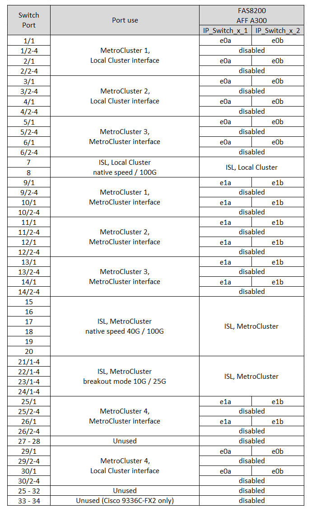

= Cisco 3232C或Cisco 9336C交換器的平台連接埠指派
:allow-uri-read: 
:icons: font
:imagesdir: ../media/

[role="lead"]
連接埠在MetroCluster 一個靜態IP組態中的使用取決於交換器機型和平台類型。

使用表格之前、請先檢閱下列考量事項：

* 下表顯示站台A的連接埠使用量站台B使用相同的纜線
* 交換器無法設定不同速度的連接埠（例如、混合使用100 Gbps連接埠和40 Gbps連接埠）。
* 如果您使用MetroCluster 交換器設定單一的支援、請使用* MetroCluster 支援1*連接埠群組。
+
追蹤 MetroCluster 連接埠群組（ MetroCluster 1 、 MetroCluster 2 、 MetroCluster 3 或 MetroCluster 4 ）。使用RcfFileGenerator-工具時、您將需要此工具、如本組態程序稍後所述。

* RcfFileGeneratorfor MetroCluster EscIP也提供每個交換器的每埠纜線總覽。
+
使用此纜線總覽來驗證纜線。

* 對於 MetroCluster ISL 、 25G 中斷模式需要 RCF 檔案版本 v2.10 或更新版本。
* ONTAP 9.13.1 或更新版本和 RCF 檔案版本 2.00 必須使用「 MetroCluster 4 」群組中 FAS8200 或 AFF A300 以外的平台。

NOTE: RCF 檔案版本與用於產生檔案的 RCFfilegenerator 工具版本不同。例如、您可以使用 RCFfilegenerator v1.6c 產生 RCF 檔案版本 2.00 。

== 將兩MetroCluster 個交換器連接至交換器

將多個 MetroCluster 組態連接至 Cisco 3132Q-V 交換器時、您必須根據適當的表格為每個 MetroCluster 連接纜線。例如，如果將 FAS2750 和 AFF A700 連接到同一臺 Cisco 3132Q-V 交換機。然後根據表 1 中的「 MetroCluster 1 AFF 」、以及表 2 中的「 MetroCluster 2 」或「 MetroCluster 3 」、為 FAS2750 連接纜線。您無法將 FAS2750 和 AFF A700 實體連接成「 MetroCluster 1 」。

== 請為您的組態選擇正確的纜線配置表

請使用下表來判斷您應遵循的纜線表。

[cols="2*"]
|===
| 如果您的系統 ... | 使用此纜線表 ... 

 a| 
AFF A150 、 ASA A150 、 FAS2750 、 AFF A220

FAS500f 、 AFF C250 、 ASA C250 、 AFF A250 、 ASA A250
| <<table_1_cisco_3232c_9336c,Cisco 3232C 或 Cisco 9336C 平台連接埠指派（第 1 章）>> 

| FAS8200 、 AFF A300 | <<table_2_cisco_3232c_9336c,Cisco 3232C 或 Cisco 9336C 平台連接埠指派（第 2 章）>> 

| AFF A320 FAS8300 、 AFF C400 、 ASA C400 、 FAS8700 AFF A400 、 ASA A400 | <<table_3_cisco_3232c_9336c,Cisco 3232C 或 Cisco 9336C 平台連接埠指派（第 3 章）>> 

| FAS9000 、 AFF A700 AFF C800 、 ASA C800 、 AFF A800 、 ASA A800 FAS9500 、 AFF A900 、 ASA A900 | <<table_4_cisco_3232c_9336c,Cisco 3232C 或 Cisco 9336C 平台連接埠指派（第 4 章）>> 

| AFF A70 AFF A90 AFF A1K * 注意： * 這些系統需要 ONTAP 9.15.1 或更新版本。 | <<table_5_cisco_3232c_9336c,Cisco 3232C 或 Cisco 9336C 平台連接埠指派（第 5 章）>> 
|===
.Cisco 3232C 或 Cisco 9336C 平台連接埠指派（第 1 章）
檢閱平台連接埠指派以連接 AFF A150 、 ASA A150 、 FAS2750 、 AFF A220 、 FAS500f 、 AFF C250 、 ASA C250 、 AFF A250 或 ASA A250 系統至 Cisco 3232C 或 9336C 交換器：

image::../media/mcc-ip-cabling-a150-a220-a250-to-a-cisco-3232c-or-cisco-9336c-switch.png[顯示 Cisco 3232C 或 Cisco 9336C 平台連接埠指派]

.Cisco 3232C 或 Cisco 9336C 平台連接埠指派（第 2 章）
檢閱平台連接埠指派、將 FAS8200 或 AFF A300 系統連接至 Cisco 3232C 或 9336C 交換器：

如果您是從舊版 RCF 檔案升級、則纜線組態可能會使用「 MetroCluster 4 」群組中的連接埠（連接埠 25/26 和 29/30 ）。

.Cisco 3232C 或 Cisco 9336C 平台連接埠指派（第 3 章）
檢閱平台連接埠指派、以連接 AFF A320 、 FAS8300 、 AFF C400 、 ASA C400 、 FAS8700 、 AFF A400 或 ASA A400 系統至 Cisco 3232C 或 9336C 交換器：

image::../media/mcc_ip_cabling_a320_a400_cisco_3232C_or_9336c_switch.png[顯示 Cisco 3232C 或 Cisco 9336C 平台連接埠指派]

* 附註 1* ：如果您使用的是 X91440A 介面卡（ 40Gbps ）、請使用連接埠 E4A 和 e4e 或 E4A 和 e8a 。如果您使用的是 X91153A 介面卡（ 100Gbps ）、請使用連接埠 E4A 和 e4b 或 E4A 和 e8a 。

NOTE: 使用「 MetroCluster 4 」群組中的連接埠需要 ONTAP 9.13.1 或更新版本。

.Cisco 3232C 或 Cisco 9336C 平台連接埠指派（第 4 章）
檢閱平台連接埠指派以連接 FAS9000 、 AFF A700 、 AFF C800 、 ASA C800 、 AFF A800 、 ASA A800 、 FAS9500 、 AFF A900 或 ASA A900 系統至 Cisco 3232C 或 9336C 交換器：

image::../media/mcc_ip_cabling_fas9000_a700_fas9500_a800_a900_cisco_3232C_or_9336c_switch.png[顯示 Cisco 3232C 或 Cisco 9336C 平台連接埠指派]

* 附註 1* ：如果您使用的是 X91440A 介面卡（ 40Gbps ）、請使用連接埠 E4A 和 e4e 或 E4A 和 e8a 。如果您使用的是 X91153A 介面卡（ 100Gbps ）、請使用連接埠 E4A 和 e4b 或 E4A 和 e8a 。

NOTE: 使用「 MetroCluster 4 」群組中的連接埠需要 ONTAP 9.13.1 或更新版本。

.Cisco 3232C 或 Cisco 9336C 平台連接埠指派（第 5 章）
檢閱平台連接埠指派、將 AFF A70 、 AFF A90 或 AFF A1K 系統連接至 Cisco 3232C 或 9336C 交換器：

NOTE: 本表中的系統需要 ONTAP 9.15.1 或更新版本。

image::../media/mcc_ip_cabling_a90_a70_a1k_cisco_3232C_or_9336c_switch.png[顯示 Cisco 3232C 或 Cisco 9336C 平台連接埠指派]
