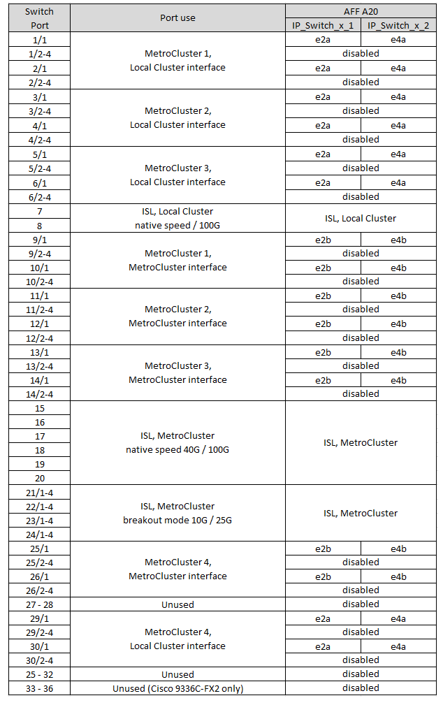

= MetroCluster IP 設定中Cisco 3232C 或 36 連接埠Cisco 9336C 交換器的平台連接埠分配
:allow-uri-read: 
:icons: font
:imagesdir: ../media/

[role="lead"]
連接埠在MetroCluster 一個靜態IP組態中的使用取決於交換器機型和平台類型。

使用組態表之前，請先檢閱下列考量事項：

* 本節的表格適用於未連接 NS224 儲存的 Cisco 3232C 交換器或 36 連接埠 Cisco 9336C-FX2 交換器。
+
如果您有 12 埠 Cisco 9336C-FX2 交換機，請使用link:port-usage-9336c-fx-2-12-port.html["12 連接埠 Cisco 9336C-FX2 交換器的平台連接埠分配"] 。

+
如果您有 36 連接埠 Cisco 9336C-FX2 交換機，並且至少一個 MetroCluster 設定或 DR 組將 NS224 機架連接到 MetroCluster 交換機，請使用link:port_usage_9336c_shared.html["連接 NS224 儲存的 36 連接埠 Cisco 9336C-FX2 交換器的平台連接埠分配"] 。

* 下表顯示站台A的連接埠使用量站台B使用相同的纜線
* 您無法為交換器設定不同速度的連接埠（例如，100 Gbps 連接埠和 40 Gbps 連接埠的混合）。
* 如果您使用MetroCluster 交換器設定單一的支援、請使用* MetroCluster 支援1*連接埠群組。
+
追蹤 MetroCluster 連接埠群組（ MetroCluster 1 、 MetroCluster 2 、 MetroCluster 3 或 MetroCluster 4 ）。使用RcfFileGenerator-工具時、您將需要此工具、如本組態程序稍後所述。

* RcfFileGeneratorfor MetroCluster EscIP也提供每個交換器的每埠纜線總覽。
+
使用此纜線總覽來驗證纜線。

* 對於 MetroCluster ISL 、 25G 中斷模式需要 RCF 檔案版本 v2.10 或更新版本。
* ONTAP 9.13.1 或更新版本和 RCF 檔案版本 2.00 必須使用「 MetroCluster 4 」群組中 FAS8200 或 AFF A300 以外的平台。

NOTE: RCF 檔案版本與用於產生檔案的 RCFfilegenerator 工具版本不同。例如、您可以使用 RCFfilegenerator v1.6c 產生 RCF 檔案版本 2.00 。

== 請為您的組態選擇正確的纜線配置表

請使用下表來判斷您應遵循的纜線表。

[cols="25,75"]
|===
| 如果您的系統 ... | 使用此纜線表 ... 

| AFF A150 ， ASA A150 FAS2750 ， AFF A220 FAS500f ， AFF C250 ， ASA C250 AFF A250 ， ASA A250 | <<table_1_cisco_3232c_9336c,Cisco 3232C 或 Cisco 9336C-FX2 平台連接埠指派（第 1 章）>> 

| AFF A20 | <<table_2_cisco_3232c_9336c,Cisco 3232C 或 Cisco 9336C-FX2 平台連接埠指派（第 2 章）>> 

| AFF A30 ， AFF C30 FAS50 AFF C60  a| 
下表取決於您使用的是 25G （第 3a 組）還是 100g （第 3b 組）乙太網路卡。

* <<table_3a_cisco_3232c_9336c,Cisco 3232C 或 Cisco 9336C-FX2 平台連接埠指派（第 3a 至 25G 章）>>
* <<table_3b_cisco_3232c_9336c,Cisco 3232C 或 Cisco 9336C-FX2 平台連接埠指派（第 3b 章 - 100g ）>>

| FAS8200 、 AFF A300 | <<table_4_cisco_3232c_9336c,Cisco 3232C 或 Cisco 9336C-FX2 平台連接埠指派（第 4 章）>> 

| AFF A320 FAS8300 、 AFF C400 、 ASA C400 、 FAS8700 AFF A400 、 ASA A400 | <<table_5_cisco_3232c_9336c,Cisco 3232C 或 Cisco 9336C-FX2 平台連接埠指派（第 5 章）>> 

| AFF A50 | <<table_6_cisco_3232c_9336c,Cisco 3232C 或 Cisco 9336C-FX2 平台連接埠指派（第 6 章）>> 

| FAS9000 、 AFF A700 AFF C800 、 ASA C800 、 AFF A800 、 ASA A800 FAS9500 、 AFF A900 、 ASA A900 | <<table_7_cisco_3232c_9336c,Cisco 3232C 或 Cisco 9336C-FX2 平台連接埠指派（第 7 章）>> 

| FAS70 ， AFF A70 AFF C80 FAS90 ， AFF A90 AFF A1K | <<table_8_cisco_3232c_9336c,Cisco 3232C 或 Cisco 9336C-FX2 平台連接埠指派（第 8 章）>> 
|===
.Cisco 3232C 或 Cisco 9336C-FX2 平台連接埠指派（第 1 章）
檢閱平台連接埠指派以連接 AFF A150 、 ASA A150 、 FAS2750 、 AFF A220 、 FAS500f 、 AFF C250 、 ASA C250 、 AFF A250 或 ASA A250 系統至 Cisco 3232C 或 9336C-FX2 交換器：

image:../media/mcc-ip-cabling-a150-a220-a250-to-a-cisco-3232c-or-cisco-9336c-switch-9161.png["顯示 Cisco 3232C 或 Cisco 9336C-FX2 平台連接埠指派"]

.Cisco 3232C 或 Cisco 9336C-FX2 平台連接埠指派（第 2 章）
檢閱平台連接埠指派，將 AFF A20 系統連接至 Cisco 3232C 或 9336C-FX2 交換器：

.Cisco 3232C 或 Cisco 9336C-FX2 平台連接埠指派（第 3a 章）
檢閱平台連接埠指派，將 AFF A30 ， AFF C30 ， AFF C60 或 FAS50 系統連接至使用四埠 25G 乙太網路卡的 Cisco 3232C 或 9336C-FX2 交換器。

NOTE: 此組態需要插槽 4 中的四埠 25G 乙太網路卡，才能連接本機叢集和 HA 介面。

image:../media/mccip-cabling-a30-c30-fas50-c60-25G.png["顯示 Cisco 3232C 或 Cisco 9336C-FX2 平台連接埠指派"]

.Cisco 3232C 或 Cisco 9336C-FX2 平台連接埠指派（第 3b 章）
檢閱平台連接埠指派，將 AFF A30 ， AFF C30 ， AFF C60 或 FAS50 系統連接至使用雙埠 100g 乙太網路卡的 Cisco 3232C 或 9336C-FX2 交換器。

NOTE: 此組態需要插槽 4 中的雙埠 100g 乙太網路卡，才能連接本機叢集和 HA 介面。

image:../media/mccip-cabling-a30-c30-fas50-c60-100G.png["顯示 Cisco 3232C 或 Cisco 9336C-FX2 平台連接埠指派"]

.Cisco 3232C 或 Cisco 9336C-FX2 平台連接埠指派（第 4 章）
檢閱平台連接埠指派、將 FAS8200 或 AFF A300 系統連接至 Cisco 3232C 或 9336C-FX2 交換器：

image::../media/mccip-cabling-fas8200-a300-updated.png[顯示 Cisco 3232C 或 Cisco 9336C-FX2 平台連接埠指派]

如果您是從舊版 RCF 檔案升級、則纜線組態可能會使用「 MetroCluster 4 」群組中的連接埠（連接埠 25/26 和 29/30 ）。

.Cisco 3232C 或 Cisco 9336C-FX2 平台連接埠指派（第 5 章）
檢閱平台連接埠指派、以連接 AFF A320 、 FAS8300 、 AFF C400 、 ASA C400 、 FAS8700 、 AFF A400 或 ASA A400 系統至 Cisco 3232C 或 9336C-FX2 交換器：

image::../media/mcc_ip_cabling_a320_a400_cisco_3232C_or_9336c_switch.png[顯示 Cisco 3232C 或 Cisco 9336C-FX2 平台連接埠指派]

NOTE: 使用「 MetroCluster 4 」群組中的連接埠需要 ONTAP 9.13.1 或更新版本。

.Cisco 3232C 或 Cisco 9336C-FX2 平台連接埠指派（第 6 章）
檢閱平台連接埠指派，將 AFF A50 系統連接至 Cisco 3232C 或 9336C-FX2 交換器：

image::../media/mcc-ip-cabling-aff-a50-cisco-3232c-9336c-9161.png[顯示 Cisco 3232C 或 Cisco 9336C-FX2 平台連接埠指派]

.Cisco 3232C 或 Cisco 9336C-FX2 平台連接埠指派（第 7 章）
檢閱平台連接埠指派以連接 FAS9000 、 AFF A700 、 AFF C800 、 ASA C800 、 AFF A800 、 ASA A800 、 FAS9500 、 AFF A900 或 ASA A900 系統至 Cisco 3232C 或 9336C-FX2 交換器：

image::../media/mcc_ip_cabling_fas9000_a700_fas9500_a800_a900_cisco_3232C_or_9336c_switch.png[顯示 Cisco 3232C 或 Cisco 9336C-FX2 平台連接埠指派]

* 附註 1* ：如果您使用的是 X91440A 介面卡（ 40Gbps ），請使用連接埠 E4A 和 e4e 或 E4A 和 e8a 。如果您使用的是 X91153A 介面卡（ 100Gbps ），請使用連接埠 E4A 和 e4b 或 E4A 和 e8a 。

NOTE: 使用「 MetroCluster 4 」群組中的連接埠需要 ONTAP 9.13.1 或更新版本。

.Cisco 3232C 或 Cisco 9336C-FX2 平台連接埠指派（第 8 章）
檢閱平台連接埠指派，將 AFF A70 ， FAS70 ， AFF C80 ， FAS90 ， AFF A90 或 AFF A1K 系統連接至 Cisco 3232C 或 9336C-FX2 交換器：

image:../media/mccip-cabling-a70-fas70-a90-c80-fas90-a1k-updated.png["顯示 Cisco 3232C 或 Cisco 9336C-FX2 平台連接埠指派"]
