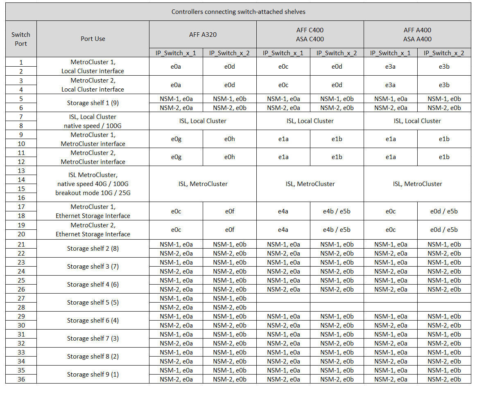
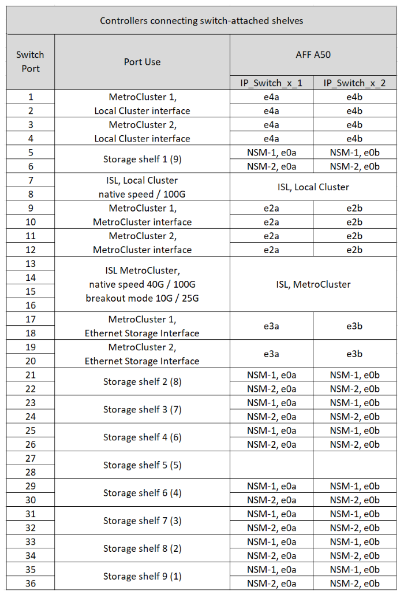

= 在MetroCluster IP 設定中連接 NS224 儲存的 36 連接埠Cisco 9336C-FX2 交換器的平台連接埠分配
:allow-uri-read: 
:icons: font
:imagesdir: ../media/

[role="lead"]
連接埠在MetroCluster 一個靜態IP組態中的使用取決於交換器機型和平台類型。

使用組態表之前，請先檢閱下列考量事項：

* 當至少一個 MetroCluster 配置或 DR 群組將 NS224 架連接到 MetroCluster 交換器時，本節中的表格適用於 36 連接埠 Cisco 9336C-FX2 交換器。
+
如果您有 36 連接埠 Cisco 9336C-FX2 交換機，但未連接 NS224 存儲，請使用link:port_usage_3232c_9336c.html["Cisco 3232C 或 36 連接埠 Cisco 9336C-FX2 交換器的平台連接埠分配"] 。

+
如果您有 12 埠 Cisco 9336C-FX2 交換機，請使用link:port-usage-9336c-fx-2-12-port.html["12 連接埠 Cisco 9336C-FX2 交換器的平台連接埠分配"] 。

+

NOTE: 12 連接埠 Cisco 9336C-FX2 交換器不支援將 NS224 架連接到 MetroCluster 交換器。

* 使用線纜連接 Cisco 9336C-FX2 交換器和 NS224 儲存時，最多只能有兩個 MetroCluster 設定或災難復原群組。至少一個 MetroCluster 設定或災難復原群組必須將 NS224 磁碟架連接到 MetroCluster 交換器。您只能將未連接交換器連接的 NS224 磁碟架的平台連接為第二個 MetroCluster 設定或第二個災難復原群組。
+
如果您的第二個 MetroCluster 或 DR 群組未將 NS224 磁碟架連接到 MetroCluster 交換機，請依照<<tables_not_connecting_ns224,未連接交換器連接的 NS224 機架的控制器的佈線表>> 。

* 只有在選擇第一個平台時、 RcfFileGenerator 才會顯示符合資格的平台。
* 連接一個八節點或兩個四節點 MetroCluster 組態需要 ONTAP 9.14.1 或更新版本。

== 請為您的組態選擇正確的纜線配置表

請檢閱正確的連接埠指派表以瞭解您的組態。本節中有兩組纜線配置表：

* <<tables_connecting_ns224,用於連接交換器連接 NS224 機櫃的控制器的纜線表>>
* <<tables_not_connecting_ns224,未連接交換器連接 NS224 機櫃的控制器纜線表>>

=== 連接交換器連接 NS224 機櫃的控制器

確定連接交換器連接 NS224 機櫃的控制器應遵循哪個連接埠指派表。

[cols="25,75"]
|===
| 平台 | 使用此纜線表 ... 

| AFF C30 ， AFF A30 AFF C60  a| 
下表取決於您使用的是 25G （第 1a 組）還是 100g （第 1b 組）乙太網路卡。

* <<table_1a_cisco_9336c_fx2,Cisco 9336C-FX2 交換器，連接 NS224 儲存平台連接埠指派（第 1a 章 - 25G 章）>>
* <<table_1b_cisco_9336c_fx2,Cisco 9336C-FX2 交換器，連接 NS224 儲存平台連接埠指派（第 1b 章 - 100g ）>>

| AFF A320 AFF C400 、 ASA C400 AFF A400 、 ASA A400 | <<table_2_cisco_9336c_fx2,Cisco 9336C-FX2 交換器，連接 NS224 儲存平台連接埠指派（第 2 章）>> 

| AFF A50 | <<table_3_cisco_9336c_fx2,Cisco 9336C-FX2 交換器，連接 NS224 儲存平台連接埠指派（第 3 章）>> 

| AFF A700 AFF C800 、 ASA C800 、 AFF A800 AFF A900 、 ASA A900 | <<table_4_cisco_9336c_fx2,Cisco 9336C-FX2 交換器，連接 NS224 儲存平台連接埠指派（第 4 章）>> 

| AFF A70 AFF C80 AFF A90 AFF A1K | <<table_5_cisco_9336c_fx2,Cisco 9336C-FX2 交換器，連接 NS224 儲存平台連接埠指派（第 5 章）>> 
|===
.Cisco 9336C-FX2 交換器，連接 NS224 儲存平台連接埠指派（第 1a 章）
檢閱平台連接埠指派，將 AFF A30 ， AFF C30 或 AFF C60 系統連接至使用四埠 25G 乙太網路卡的交換器連接至 Cisco 9336C-FX2 交換器。

NOTE: 此組態需要插槽 4 中的四埠 25G 乙太網路卡，才能連接本機叢集和 HA 介面。

image:../media/mccip-cabling-greeley-connecting-a30-c30-fas50-c60-25G.png["顯示連接 NS224 儲存平台連接埠指派的 Cisco 9336C-FX2 交換器"]

.Cisco 9336C-FX2 交換器，連接 NS224 儲存平台連接埠指派（第 1b 章）
檢閱平台連接埠指派，將 AFF A30 ， AFF C30 或 AFF C60 系統連接至交換器連接的 NSS24 機櫃，並使用雙埠 100g 乙太網路卡將其連接至 Cisco 9336C-FX2 交換器。

NOTE: 此組態需要插槽 4 中的雙埠 100g 乙太網路卡，才能連接本機叢集和 HA 介面。

image:../media/mccip-cabling-greeley-connecting-a30-c30-fas50-c60-100G.png["顯示連接 NS224 儲存平台連接埠指派的 Cisco 9336C-FX2 交換器"]

.Cisco 9336C-FX2 交換器，連接 NS224 儲存平台連接埠指派（第 2 章）
檢閱平台連接埠指派，將 AFF A320 ， AFF C400 ， ASA C400 ， AFF A400 或 ASA A400 系統連接至交換器連接的 NSS24 機櫃與 Cisco 9336C-FX2 交換器：

.Cisco 9336C-FX2 交換器，連接 NS224 儲存平台連接埠指派（第 3 章）
檢閱平台連接埠指派，將連接交換器連接 NSS24 機櫃的 AFF A50 系統連接至 Cisco 9336C-FX2 交換器：

.Cisco 9336C-FX2 交換器，連接 NS224 儲存平台連接埠指派（第 4 章）
檢閱平台連接埠指派，將 AFF A700 ， AFF C800 ， ASA C800 ， AFF A800 ， AFF A900 或 ASA A900 系統連接至交換器連接的 NSS24 機櫃與 Cisco 9336C-FX2 交換器：

image:../media/mcc_ip_cabling_a700_c800_a800_a900_to_cisco_9336c_shared_switch.png["顯示連接 NS224 儲存平台連接埠指派的 Cisco 9336C-FX2 交換器"]

* 附註 1* ：如果您使用的是 X91440A 介面卡（ 40Gbps ），請使用連接埠 E4A 和 e4e 或 E4A 和 e8a 。如果您使用的是 X91153A 介面卡（ 100Gbps ），請使用連接埠 E4A 和 e4b 或 E4A 和 e8a 。

.Cisco 9336C-FX2 交換器，連接 NS224 儲存平台連接埠指派（第 5 章）
檢閱平台連接埠指派，將 AFF A70 ， AFF C80 ， AFF A90 或 AFF A1K 系統連接至連接交換器的 NSS24 機櫃與 Cisco 9336C-FX2 交換器：

image::../media/mccip-cabling-greeley-connecting-a70-c80-a-90-fas90-a1k.png[顯示連接 NS224 儲存平台連接埠指派的 Cisco 9336C-FX2 交換器]

=== 控制器未連接交換器連接的 NS224 機櫃

確定未連接交換器連接 NS224 機櫃的控制器應遵循哪個連接埠指派表。

[cols="25,75"]
|===
| 平台 | 使用此纜線表 ... 

| AFF A150 、 ASA A150 FAS2750 、 AFF A220 | <<table_6_cisco_9336c_fx2,Cisco 9336C-FX2 交換器未連接 NS224 儲存平台連接埠指派（第 6 章）>> 

| AFF A20 | <<table_7_cisco_9336c_fx2,Cisco 9336C-FX2 交換器未連接 NS224 儲存平台連接埠指派（第 7 章）>> 

| FAS500f AFF C250 、 ASA C250 AFF A250 、 ASA A250 | <<table_8_cisco_9336c_fx2,Cisco 9336C-FX2 交換器未連接 NS224 儲存平台連接埠指派（第 8 章）>> 

| AFF C30 ， AFF A30 FAS50 AFF C60  a| 
下表取決於您使用的是 25G （群組 9a ）還是 100g （群組 9b ）乙太網路卡。

* <<table_9a_cisco_9336c_fx2,Cisco 9336C-FX2 交換器未連接 NS224 儲存平台連接埠指派（第 9A 章）>>
* <<table_9b_cisco_9336c_fx2,Cisco 9336C-FX2 交換器未連接 NS224 儲存平台連接埠指派（第 9b 章）>>

| FAS8200 、 AFF A300 | <<table_10_cisco_9336c_fx2,Cisco 9336C-FX2 交換器未連接 NS224 儲存平台連接埠指派（第 10 章）>> 

| AFF A320 FAS8300 、 AFF C400 、 ASA C400 、 FAS8700 AFF A400 、 ASA A400 | <<table_11_cisco_9336c_fx2,Cisco 9336C-FX2 交換器未連接 NS224 儲存平台連接埠指派（第 11 章）>> 

| AFF A50 | <<table_12_cisco_9336c_fx2,Cisco 9336C-FX2 交換器未連接 NS224 儲存平台連接埠指派（第 12 章）>> 

| FAS9000 、 AFF A700 AFF C800 、 ASA C800 、 AFF A800 、 ASA A800 FAS9500 、 AFF A900 、 ASA A900 | <<table_13_cisco_9336c_fx2,Cisco 9336C-FX2 交換器未連接 NS224 儲存平台連接埠指派（第 13 章）>> 

| FAS70 ， AFF A70 AFF C80 FAS90 ， AFF A90 AFF A1K | <<table_14_cisco_9336c_fx2,Cisco 9336C-FX2 交換器未連接 NS224 儲存平台連接埠指派（第 14 章）>> 
|===
.Cisco 9336C-FX2 交換器未連接 NS224 儲存平台連接埠指派（第 6 章）
檢閱平台連接埠指派，以將未連接交換器連接 NSS24 機櫃的 AFF A150 ， ASA A150 ， FAS2750 或 AFF A220 系統連接至 Cisco 9336C-FX2 交換器：

image::../media/mcc-ip-cabling-a-aff-a150-asa-a150-fas2750-aff-a220-to-a-cisco-9336c-shared-switch.png[顯示 Cisco 9336C-FX2 交換器未連接 NS224 儲存平台連接埠指派]

.Cisco 9336C-FX2 交換器未連接 NS224 儲存平台連接埠指派（第 7 章）
檢閱平台連接埠指派，以連接未連接交換器連接 NSS24 機櫃至 Cisco 9336C-FX2 交換器的 AFF A20 系統：

image:../media/mcc-ip-aff-a20-to-a-cisco-9336c-shared-switch-not-connecting.png["顯示 Cisco 9336C-FX2 交換器未連接 NS224 儲存平台連接埠指派"]

.Cisco 9336C-FX2 交換器未連接 NS224 儲存平台連接埠指派（第 8 章）
檢閱平台連接埠指派，以將未連接交換器連接 NSS24 機櫃的 FAS500f ， AFF C250 ， ASA C250 ， AFF A250 或 ASA A250 系統連接至 Cisco 9336C-FX2 交換器：

image::../media/mcc-ip-cabling-c250-asa-c250-a250-asa-a250-to-cisco-9336c-shared-switch.png[顯示 Cisco 9336C-FX2 交換器未連接 NS224 儲存平台連接埠指派]

.Cisco 9336C-FX2 交換器未連接 NS224 儲存平台連接埠指派（第 9A 章）
檢閱平台連接埠指派，將未使用四埠 25G 乙太網路卡連接交換器連接的 NSS24 機櫃的 AFF A30 ， AFF C30 ， AFF C60 或 FAS50 系統連接至 Cisco 9336C-FX2 交換器：

NOTE: 此組態需要插槽 4 中的四埠 25G 乙太網路卡，才能連接本機叢集和 HA 介面。

image:../media/mccip-cabling-greeley-not-connecting-a30-c30-fas50-c60-25G.png["顯示 Cisco 9336C-FX2 交換器未連接 NS224 儲存平台連接埠指派"]

.Cisco 9336C-FX2 交換器未連接 NS224 儲存平台連接埠指派（第 9b 章）
檢閱平台連接埠指派，將未使用雙連接埠 100g 乙太網路卡連接交換器連接的 NSS24 機櫃連接至 Cisco 9336C-FX2 交換器的 AFF A30 ， AFF C30 ， AFF C60 或 FAS50 系統連接線：

NOTE: 此組態需要插槽 4 中的雙埠 100g 乙太網路卡，才能連接本機叢集和 HA 介面。

image:../media/mccip-cabling-greeley-not-connecting-a30-c30-fas50-c60-100G.png["顯示連接 NS224 儲存平台連接埠指派的 Cisco 9336C-FX2 交換器"]

.Cisco 9336C-FX2 交換器未連接 NS224 儲存平台連接埠指派（第 10 章）
檢閱平台連接埠指派，將未連接交換器連接 NSS24 機櫃的 FAS8200 或 AFF A300 系統連接至 Cisco 9336C-FX2 交換器：

image::../media/mcc-ip-cabling-fas8200-affa300-to-cisco-9336c-shared-switch.png[顯示連接 NS224 儲存平台連接埠指派的 Cisco 9336C-FX2 交換器]

.Cisco 9336C-FX2 交換器未連接 NS224 儲存平台連接埠指派（第 11 章）
檢閱平台連接埠指派，以將未連接交換器的 NSS24 機櫃連接至 Cisco 9336C-FX2 交換器的 AFF A320 ， FAS8700 ， AFF A400 ， ASA C400 ， FAS8300 ， AFF C400 或 ASA A400 系統連接線：

image::../media/mcc_ip_cabling_a320_fas8300_a400_fas8700_to_a_cisco_9336c_shared_switch.png[顯示 Cisco 9336C-FX2 交換器未連接 NS224 儲存平台連接埠指派]

.Cisco 9336C-FX2 交換器未連接 NS224 儲存平台連接埠指派（第 12 章）
檢閱平台連接埠指派，將未連接交換器連接 NSS24 機櫃的 AFF A50 系統連接至 Cisco 9336C-FX2 交換器：

image::../media/mcc-ip-cabling-aff-a50-cisco-9336c-shared-switch-not-connecting.png[顯示 Cisco 9336C-FX2 交換器未連接 NS224 儲存平台連接埠指派]

.Cisco 9336C-FX2 交換器未連接 NS224 儲存平台連接埠指派（第 13 章）
檢閱平台連接埠指派，以連接未將交換器連接的 NSS24 機櫃連接至 ASA C800 Cisco 9336C-FX2 交換器的 FAS9000 ， AFF A700 AFF A800 AFF A900 ， ASA A800 ， FAS9500 ， AFF C800 或 ASA A900 系統：

image::../media/mcc_ip_cabling_a700_a800_fas9000_fas9500_to_cisco_9336c_shared_switch.png[顯示 Cisco 9336C-FX2 交換器未連接 NS224 儲存平台連接埠指派]

* 附註 1* ：如果您使用的是 X91440A 介面卡（ 40Gbps ），請使用連接埠 E4A 和 e4e 或 E4A 和 e8a 。如果您使用的是 X91153A 介面卡（ 100Gbps ），請使用連接埠 E4A 和 e4b 或 E4A 和 e8a 。

.Cisco 9336C-FX2 交換器未連接 NS224 儲存平台連接埠指派（第 14 章）
檢閱平台連接埠指派，將未連接交換器連接的 NSS24 機櫃連接至 Cisco 9336C-FX2 交換器的 AFF A70 ， FAS70 ， AFF C80 ， FAS90 ， AFF A90 或 AFF A1K 系統連接線：

image::../media/mccip-cabling-greeley-not-connecting-a70-c80-a-90-fas90-a1k.png[顯示 Cisco 9336C-FX2 交換器未連接 NS224 儲存平台連接埠指派]
