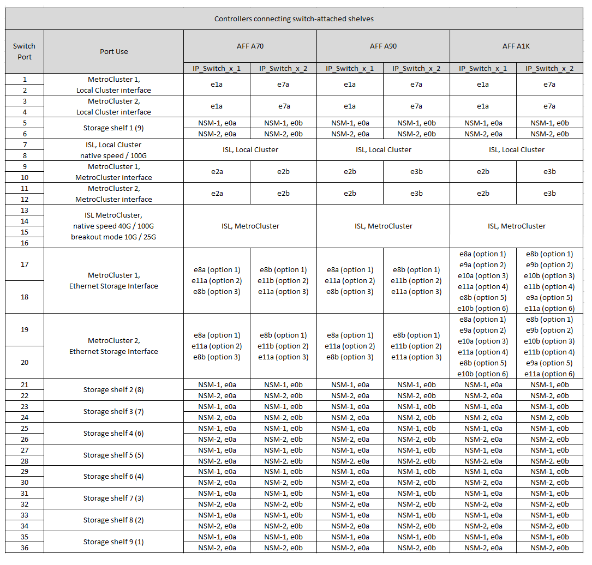
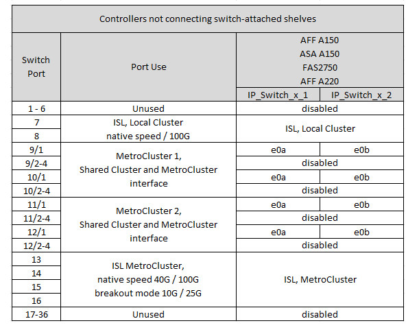

= Cisco 9336C-FX2 共享交換器的平台連接埠指派
:allow-uri-read: 
:icons: font
:imagesdir: ../media/

[role="lead"]
連接埠在MetroCluster 一個靜態IP組態中的使用取決於交換器機型和平台類型。

使用表格之前、請先檢閱下列考量事項：

* 至少有一個 MetroCluster 組態或 DR 群組必須支援交換器連接的 NS224 機櫃。
* 不支援交換器附加 NS224 機櫃的平台、只能以第二個 MetroCluster 組態或第二個 DR 群組的形式連接。
* 只有在選擇第一個平台時、 RcfFileGenerator 才會顯示符合資格的平台。
* 連接一個八節點或兩個四節點 MetroCluster 組態需要 ONTAP 9.14.1 或更新版本。

== 請為您的組態選擇正確的纜線配置表

請檢閱正確的連接埠指派表以瞭解您的組態。本節中有兩組纜線配置表：

* <<tables_connecting_ns224,連接至交換器連接 NS224 機櫃之控制器的纜線表>>
* <<tables_not_connecting_ns224,未連接至交換器連接 NS224 機櫃的控制器纜線表>>

=== 控制器連接至交換器連接的 NS224 機櫃

確定連接至交換器連接 NS224 機櫃的控制器應遵循哪個連接埠指派表。

[cols="2*"]
|===
| 平台 | 使用此纜線表 ... 

| AFF A320 AFF C400 、 ASA C400 AFF A400 、 ASA A400 | <<table_1_cisco_9336c_fx2,Cisco 9336C-FX2 共享交換器平台連接埠指派（第 1 章）>> 

| AFF A700 AFF C800 、 ASA C800 、 AFF A800 AFF A900 、 ASA A900 | <<table_2_cisco_9336c_fx2,Cisco 9336C-FX2 共享交換器平台連接埠指派（第 2 章）>> 

| AFF A90 AFF A70 AFF A1K * 注意： * 這些系統需要 ONTAP 9.15.1 或更新版本。 | <<table_3_cisco_9336c_fx2,Cisco 9336C-FX2 共享交換器平台連接埠指派（第 3 章）>> 
|===
.Cisco 9336C-FX2 共享交換器平台連接埠指派（第 1 章）
檢閱平台連接埠指派、以連接 AFF A320 、 AFF C400 、 ASA C400 、 AFF A400 或 ASA A400 系統、將交換器連接的 NSS24 機櫃連接至 Cisco 9336C-FX2 共用交換器：

image::../media/mcc_ip_cabling_a320_c400_a400_to_cisco_9336c_shared_switch.png[顯示 Cisco 9336C-FX2 共享交換器平台連接埠指派]

* 附註 1* ：如果您使用的是 X91440A 介面卡（ 40Gbps ）、請使用連接埠 E4A 和 e4e 或 E4A 和 e8a 。如果您使用的是 X91153A 介面卡（ 100Gbps ）、請使用連接埠 E4A 和 e4b 或 E4A 和 e8a 。

.Cisco 9336C-FX2 共享交換器平台連接埠指派（第 2 章）
檢閱平台連接埠指派以連接 AFF A700 、 AFF C800 、 ASA C800 、 AFF A800 、 AFF A900 、 或 ASA A900 系統、將交換器連接的 NSS24 機櫃連接至 Cisco 9336C-FX2 共用交換器：

image::../media/mcc_ip_cabling_a700_c800_a800_a900_to_cisco_9336c_shared_switch.png[顯示 Cisco 9336C-FX2 共享交換器平台連接埠指派]

* 附註 1* ：如果您使用的是 X91440A 介面卡（ 40Gbps ）、請使用連接埠 E4A 和 e4e 或 E4A 和 e8a 。如果您使用的是 X91153A 介面卡（ 100Gbps ）、請使用連接埠 E4A 和 e4b 或 E4A 和 e8a 。

.Cisco 9336C-FX2 共享交換器平台連接埠指派（第 3 章）
檢閱平台連接埠指派、將 AFF A90 、 AFF A70 或 AFF A1K 系統連接至 Cisco 9336C-FX2 共用交換器的交換器連接至交換器連接的 NSS24 機櫃：

NOTE: 本表中的系統需要 ONTAP 9.15.1 或更新版本。

對於連接交換器的叢集、 AFF A90 或 AFF A70 節點上相同的叢集連接埠應位於同一台交換器上。例如、 node1 上的 e1a 和 node2 上的 e1a 應該連接到一個叢集交換器。同樣地、兩個節點的第二個叢集連接埠也應連接至第二個叢集交換器。共享叢集 HA 連接埠的交叉連線、其中節點 1 的 e1a 連接至 IP_Switch_x_1 、節點 2 的 e1a 連接至 IP_Switch_x_2 、可防止 HA 通訊失敗。

=== 控制器未連接至交換器連接的 NS224 機櫃

確定未連接至交換器連接 NS224 機櫃的控制器應遵循哪個連接埠指派表。

[cols="2*"]
|===
| 平台 | 使用此纜線表 ... 

| AFF A150 、 ASA A150 FAS2750 、 AFF A220 | <<table_4_cisco_9336c_fx2,Cisco 9336C-FX2 共享交換器平台連接埠指派（第 4 章）>> 

| FAS500f AFF C250 、 ASA C250 AFF A250 、 ASA A250 | <<table_5_cisco_9336c_fx2,Cisco 9336C-FX2 共享交換器平台連接埠指派（第 5 章）>> 

| FAS8200 、 AFF A300 | <<table_6_cisco_9336c_fx2,Cisco 9336C-FX2 共享交換器平台連接埠指派（第 6 章）>> 

| AFF A320 FAS8300 、 AFF C400 、 ASA C400 、 FAS8700 AFF A400 、 ASA A400 | <<table_7_cisco_9336c_fx2,Cisco 9336C-FX2 共享交換器平台連接埠指派（第 7 章）>> 

| FAS9000 、 AFF A700 AFF C800 、 ASA C800 、 AFF A800 、 ASA A800 FAS9500 、 AFF A900 、 ASA A900 | <<table_8_cisco_9336c_fx2,Cisco 9336C-FX2 共享交換器平台連接埠指派（第 8 章）>> 

| AFF A70 AFF A90 AFF A1K * 注意： * 這些系統需要 ONTAP 9.15.1 或更新版本。 | <<table_9_cisco_9336c_fx2,Cisco 9336C-FX2 共享交換器平台連接埠指派（第 9 章）>> 
|===
.Cisco 9336C-FX2 共享交換器平台連接埠指派（第 4 章）
檢閱平台連接埠指派、以將未連接交換器連接的 NSS24 機櫃連接至 Cisco 9336C-FX2 共用交換器的 AFF A150 、 ASA A150 、 FAS2750 或 AFF A220 系統連接線：

.Cisco 9336C-FX2 共享交換器平台連接埠指派（第 5 章）
檢閱平台連接埠指派、以連接未將交換器附加 NSS24 機櫃連接至 Cisco 9336C-FX2 共用交換器的 FAS500f 、 AFF C250 、 ASA C250 、 AFF A250 或 ASA A250 系統：

image::../media/mcc-ip-cabling-c250-asa-c250-a250-asa-a250-to-cisco-9336c-shared-switch.png[顯示 Cisco 9336C-FX2 共享交換器平台連接埠指派]

.Cisco 9336C-FX2 共享交換器平台連接埠指派（第 6 章）
檢閱平台連接埠指派、以連接未將交換器附加 NSS24 機櫃連接至 Cisco 9336C-FX2 共用交換器的 FAS8200 或 AFF A300 系統：

image::../media/mcc-ip-cabling-fas8200-affa300-to-cisco-9336c-shared-switch.png[顯示 Cisco 9336C-FX2 共享交換器平台連接埠指派]

.Cisco 9336C-FX2 共享交換器平台連接埠指派（第 7 章）
檢閱平台連接埠指派、以連接 AFF A320 、 FAS8300 、 AFF C400 、 ASA C400 、 FAS8700 、 未將交換器連接的 NSS24 機櫃連接至 Cisco 9336C-FX2 共用交換器的 AFF A400 或 ASA A400 系統：

image::../media/mcc_ip_cabling_a320_fas8300_a400_fas8700_to_a_cisco_9336c_shared_switch.png[顯示 Cisco 9336C-FX2 共享交換器平台連接埠指派]

* 附註 1* ：如果您使用的是 X91440A 介面卡（ 40Gbps ）、請使用連接埠 E4A 和 e4e 或 E4A 和 e8a 。如果您使用的是 X91153A 介面卡（ 100Gbps ）、請使用連接埠 E4A 和 e4b 或 E4A 和 e8a 。

.Cisco 9336C-FX2 共享交換器平台連接埠指派（第 8 章）
檢閱平台連接埠指派以連接 FAS9000 、 AFF A700 、 AFF C800 、 ASA C800 、 AFF A800 、 ASA A800 、 FAS9500 、 AFF A900 或 ASA A900 系統、未將交換器連接的 NSS24 機櫃連接至 Cisco 9336C-FX2 共用交換器：

image::../media/mcc_ip_cabling_a700_a800_fas9000_fas9500_to_cisco_9336c_shared_switch.png[顯示 Cisco 9336C-FX2 共享交換器平台連接埠指派]

* 附註 1* ：如果您使用的是 X91440A 介面卡（ 40Gbps ）、請使用連接埠 E4A 和 e4e 或 E4A 和 e8a 。如果您使用的是 X91153A 介面卡（ 100Gbps ）、請使用連接埠 E4A 和 e4b 或 E4A 和 e8a 。

.Cisco 9336C-FX2 共享交換器平台連接埠指派（第 9 章）
檢閱平台連接埠指派、以將未連接交換器的 NSS24 機櫃連接至 Cisco 9336C-FX2 共用交換器的 AFF A70 、 AFF A90 或 AFF A1K 系統進行纜線連接：

NOTE: 本表中的系統需要 ONTAP 9.15.1 或更新版本。

image::../media/mcc_ip_cabling_a70_a90_a1k_to_no_shelves_cisco_9336c_shared_switch.png[顯示 Cisco 9336C-FX2 共享交換器平台連接埠指派]
