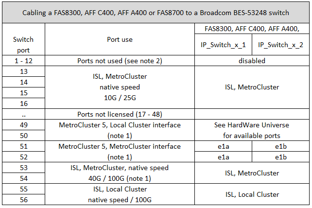

= 適用於Broadcom支援的BG-53248 IP交換器的平台連接埠指派
:allow-uri-read: 
:icons: font
:imagesdir: ../media/

[role="lead"]
連接埠在MetroCluster 一個靜態IP組態中的使用取決於交換器機型和平台類型。

交換器無法與不同速度的遠端ISL連接埠搭配使用（例如、連接至10 Gbps ISL連接埠的25 Gbps連接埠）。

.下表附註：
. 對於某些平台、您可以使用連接埠49 - 54進行MetroCluster 支援或MetroCluster 連接支援。
+
這些連接埠需要額外授權。

. 只能將使用A320系統的單MetroCluster 一四節點的資訊技術連接至交換器。
+
此組態不支援需要交換式叢集的功能、包括MetroCluster 從FFC移轉至IP的程序和技術更新程序。

. 配置Broadcom B3B-53248交換器的部分A320系統可能不支援所有功能。AFF
+
不支援任何需要將本機叢集連線連線至交換器的組態或功能。例如、下列組態和程序不受支援：

+
** 八節點MetroCluster 的不完整組態
** 從MetroCluster 靜態FC移轉至MetroCluster 靜態IP組態
** 重新整理四節點MetroCluster 的靜態IP組態（ONTAP 不含更新版本的更新版本）

. 如果您連接兩MetroCluster 個支援對象的組態、並同時使用相同的控制器類型、則必須使用MetroCluster 支援對象群組3和4。如果控制器不同、則必須使用MetroCluster 任一類型的「支援埠群組3」和「4」、MetroCluster 另一類型的「支援埠群組1」和「2」。
+
** 例如、如果您連線：
+
*** 兩MetroCluster 個僅包含FAS2750/AFF A220或FAS500f/AFF A250的支援支援組態、您必須選取MetroCluster 「支援組3和4」。
*** 兩MetroCluster 種支援不同MetroCluster 的支援對象為FAS2750/AFF A220類型、另一種是FAS500f/AFF A250、您必須為其中一種選擇連接埠群組3和4、另一種選擇連接埠群組1和2。在中 https://mysupport.netapp.com/site/tools/tool-eula/rcffilegenerator["RcfFileGeneratorfor MetroCluster EfIP"]下拉式欄位1和2只會在您在下拉式欄位3和4中選取平台之後、才會填入支援的平台。請參閱 link:../install-ip/using_rcf_generator.html["使用連接埠表格搭配RcfFileGeneratorR工具或多MetroCluster 種支援的組態"] 如需如何使用連接埠表格的詳細資訊、

== 交換器連接埠的使用、適用於AFF FASA220或FAS2750系統

image::../media/mcc_ip_cabling_a_aff_a220_or_fas2750_to_a_broadcom_bes_53248_switch.png[MCC IP將AFF 一個名為「a 2 220」或「fas2750」的纜線連接至Broadcom bes 53248交換器]

== 交換器連接埠使用率、適用於AFF 不符合需求的A250或FAS500f系統

image::../media/mcc_ip_cabling_a_aff_a250_or_fas500f_to_a_broadcom_bes_53248_switch.png[MCC IP纜線AFF 連接至Broadcom bes 53248交換器的功能是將一個3250或fas500f]

== 交換器連接埠的使用方式、可結合使用AFF Arf2 A250或FAS500f與AFF Arf2 A220或FAS2750系統

image::../media/mcc_ip_cabling_aff_a250_and_ a220_to_a_broadcom_bes_53248_switch.png[MCC IP纜線AFF 連接至Broadcom bes 53248交換器的功能為250和A220]

== 交換器連接埠的使用情形、適用於AFF 不支援的A300或FAS8200系統

image::../media/mcc_ip_cabling_a_aff_a300_or_fas8200_to_a_broadcom_bes_53248_switch.png[MCC IP將AFF 一個名為「不實」的纜線連接至Broadcom bes 53248交換器]

image::../media/mcc_ip_cabling_a_aff_a320_to_a_broadcom_bes_53248_switch.png[MCC IP將AFF 一個不含A320的纜線連接至一個Broadcom bes 53248交換器]

== 交換器連接埠的使用、適用於AFF FASA400、FAS8300或FAS8700系統

