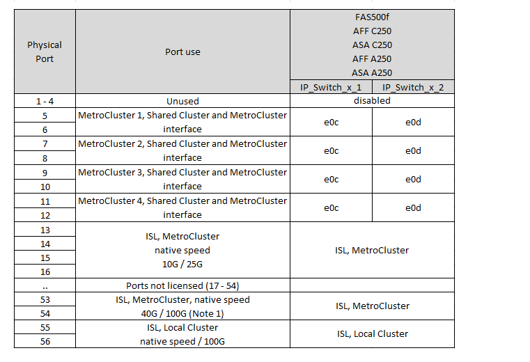
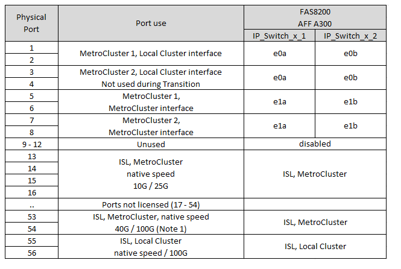

= 適用於Broadcom支援的BG-53248 IP交換器的平台連接埠指派
:allow-uri-read: 
:icons: font
:imagesdir: ../media/

[role="lead"]
連接埠在MetroCluster 一個靜態IP組態中的使用取決於交換器機型和平台類型。

交換器無法與不同速度的遠端ISL連接埠搭配使用（例如、連接至10 Gbps ISL連接埠的25 Gbps連接埠）。

.使用表格之前、請先檢閱此資訊：
* 如果您設定交換器進行 MetroCluster FC 到 IP 的轉換、則會根據您選擇的目標平台使用下列連接埠：
+
[cols="75,25"]
|===
| 目標平台 | 連接埠 

| FAS500f 、 AFF C250 、 ASA C250 、 AFF A250 、 ASA A250 、 FAS8400 、 AFF C400 、 ASA C400 、 AFF A400 、 ASA A400 、 或 FAS8700 平台 | 連接埠 1 - 6 、 10Gbps 

| FAS8200 或 AFF A300 平台 | 連接埠 3 - 4 和 9 - 12 、 10Gbps 
|===
* 配置Broadcom B3B-53248交換器的部分A320系統可能不支援所有功能。AFF
+
不支援任何需要將本機叢集連線連線至交換器的組態或功能。例如、下列組態和程序不受支援：

+
** 八節點MetroCluster 的不完整組態
** 從MetroCluster 靜態FC移轉至MetroCluster 靜態IP組態
** 重新整理四節點MetroCluster 的靜態IP組態（ONTAP 不含更新版本的更新版本）

== 請為您的組態選擇正確的纜線配置表

請使用下表來判斷您應遵循的纜線表。

[cols="2*"]
|===
| 如果您的系統 ... | 使用此纜線表 ... 

 a| 
AFF A150 、 ASA A150

FAS2750

VA220 AFF
| <<table_1_bes_53248,Broadcom BS-53248 平台連接埠指派（群組 1 ）>> 

| FAS500f AFF C250 、 ASA C250 AFF A250 、 ASA A250 | <<table_2_bes_53248,Broadcom BS-53248 平台連接埠指派（群組 2 ）>> 

| FAS8200 、 AFF A300 | <<table_3_bes_53248,Broadcom BS-53248 平台連接埠指派（群組 3 ）>> 

| 解答320 AFF | <<table_4_bes_53248,Broadcom BS-53248 平台連接埠指派（群組 4 ）>> 

| FAS8300 AFF C400 、 ASA C400 AFF A400 、 ASA A400 FAS8700 | <<table_5_bes_53248,Broadcom BS-53248 平台連接埠指派（第 5 組）>> 
|===
.Broadcom BS-53248 平台連接埠指派（群組 1 ）
檢閱平台連接埠指派、將 AFF A150 、 ASA A150 、 FAS2750 或 AFF A220 系統連接至 Broadcom BS-53248 交換器：

image::../media/mcc_ip_cabling_a_aff_asa_a150_a220_fas2750_to_a_broadcom_bes_53248_switch.png[顯示 Broadcom BS-53248 平台連接埠指派]

* * 附註 1* ：使用這些連接埠需要額外授權。
* 如果兩個 MetroCluster 組態使用的平台相同、 NetApp 建議您針對一個組態選取「 MetroCluster 3 」群組、而針對另一個組態選取「 MetroCluster 4 」群組。如果平台不同、則您必須為第一個組態選取「 MetroCluster 3 」或「 MetroCluster 4 」、而為第二個組態選取「 MetroCluster 1 」或「 MetroCluster 2 」。

.Broadcom BS-53248 平台連接埠指派（群組 2 ）
檢閱平台連接埠指派、將 FAS500f 、 AFF C250 、 ASA C250 、 AFF A250 或 ASA A250 系統連接至 Broadcom BS-53248 交換器：

* * 附註 1* ：使用這些連接埠需要額外授權。
* 如果兩個 MetroCluster 組態使用的平台相同、 NetApp 建議您針對一個組態選取「 MetroCluster 3 」群組、而針對另一個組態選取「 MetroCluster 4 」群組。如果平台不同、則您必須為第一個組態選取「 MetroCluster 3 」或「 MetroCluster 4 」、而為第二個組態選取「 MetroCluster 1 」或「 MetroCluster 2 」。

.Broadcom BS-53248 平台連接埠指派（群組 3 ）
查看平台連接埠指派、將 FAS8200 或 AFF A300 系統連接至 Broadcom BS-53248 交換器：

* * 附註 1* ：使用這些連接埠需要額外授權。

.Broadcom BS-53248 平台連接埠指派（群組 4 ）
檢閱平台連接埠指派、將 AFF A320 系統連接至 Broadcom BS-53248 交換器：

image::../media/mcc-ip-cabling-a-aff-a320-to-a-broadcom-bes-53248-switch.png[顯示 Broadcom BS-53248 平台連接埠指派]

* * 附註 1* ：使用這些連接埠需要額外授權。
* * 附註 2 * ：只能將使用 AFF A320 系統的單一四節點 MetroCluster 連接至交換器。
+
此組態不支援需要交換式叢集的功能。這包括 MetroCluster FC 到 IP 的轉換和技術更新程序。

.Broadcom BS-53248 平台連接埠指派（第 5 組）
檢閱平台連接埠指派以連接 FAS8400 、 AFF C400 、 ASA C400 、 AFF A400 、 ASA A400 、 或 FAS8700 系統轉到 Broadcom BE-53248 交換器：

image::../media/mcc-ip-cabling-a-fas8300-a400-c400-or-fas8700-to-a-broadcom-bes-53248-switch.png[顯示 Broadcom BS-53248 平台連接埠指派]

* * 附註 1* ：使用這些連接埠需要額外授權。
* * 附註 2 * ：只能將使用 AFF A320 系統的單一四節點 MetroCluster 連接至交換器。
+
此組態不支援需要交換式叢集的功能。這包括 MetroCluster FC 到 IP 的轉換和技術更新程序。

