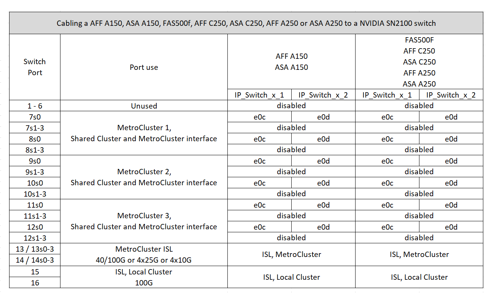
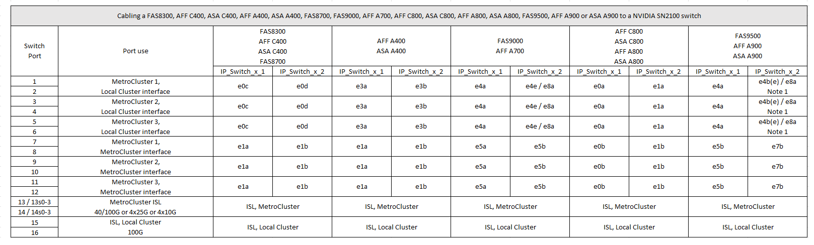

= 適用於NVIDIA支援SN2100 IP交換器的平台連接埠指派
:allow-uri-read: 
:icons: font
:imagesdir: ../media/

[role="lead"]
連接埠在MetroCluster 一個靜態IP組態中的使用取決於交換器機型和平台類型。

== 支援的組態

目前不支援下列組態：

* FC到IP的轉換MetroCluster

.使用組態表之前、請先檢閱這些考量事項
* 連接八節點或兩個四節點 MetroCluster 組態需要 ONTAP 9.14.1 或更新版本、以及 RCF 檔案 2.00 版或更新版本。
* 如果您連接多MetroCluster 個支援的組態、請依照相應的表格進行。例如：
+
** 如果您連接兩個 AFF A700 類型的四節點 MetroCluster 組態、請連接第一個 MetroCluster （如「 MetroCluster 1 」所示）、第二個 MetroCluster （如 AFF A700 表中的「 MetroCluster 2 」所示）。

NOTE: 連接埠13和14可在原生速度模式下使用、支援40 Gbps和100 Gbps、或在中斷模式下使用、以支援4 x 25 Gbps或4 x 10 Gbps。如果他們使用原生速度模式、則會顯示為連接埠 13 和 14 。如果使用中斷模式（ 4 × 25 Gbps 或 4 × 10 Gbps ）、則會將它們表示為連接埠 13s0 － 3 和 14s0 － 3 。

以下各節將說明實體纜線的佈線大綱。您也可以參閱 https://mysupport.netapp.com/site/tools/tool-eula/rcffilegenerator["RcfFileGenerator"] 以取得詳細的纜線連接資訊。

== AFF A150 、 ASA A150 、 FAS500f 、 AFF C250 、 ASA C250 、 AFF A250 或 ASA A250 系統至 NVIDIA SN2100 交換器

== 連接 FAS8400 、 AFF C400 、 ASA C400 、 AFF A400 、 ASA A400 、 FAS8700 、 FAS9000 、 AFF A700 、 AFF C800 、 ASA C800 、 AFF A800 、 ASA A800 、 FAS9500 、 AFF A900 或 ASA A900 系統、連接至 NVIDIA SN2100 交換器

* 附註 1* ：如果您使用的是 X91440A 介面卡（ 40Gbps ）、請使用連接埠 E4A 和 e4e 或 E4A 和 e8a 。如果您使用的是 X91153A 介面卡（ 100Gbps ）、請使用連接埠 E4A 和 e4b 或 E4A 和 e8a 。
