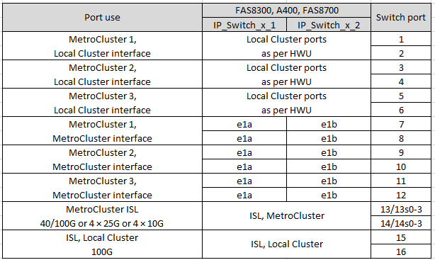
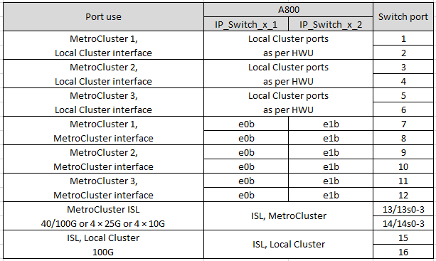

= 適用於NVIDIA支援SN2100 IP交換器的平台連接埠指派
:allow-uri-read: 
:icons: font
:imagesdir: ../media/

[role="lead"]
連接埠在MetroCluster 一個靜態IP組態中的使用取決於交換器機型和平台類型。

== 支援的組態

目前支援下列平台：

* FAS500f / AFF FASA250
* FAS8300 / AFF FASA400
* FAS8700
* FAS9000 / AFF E4A700
* 解答800 AFF

目前不支援下列平台和組態：

* FC到IP的轉換MetroCluster
* 八節點MetroCluster 的不全功能組態

如果您連接多MetroCluster 個支援的組態、請依照相應的表格進行。例如：

* 如果您連接兩MetroCluster 個AFF 類型為「叢集A700」的四節點位向組態、請連接MetroCluster 第一個顯示為MetroCluster 「支援1」的資訊、然後連接MetroCluster 另一個顯示為MetroCluster 「支援2」的資訊。AFF

NOTE: 連接埠13和14可在原生速度模式下使用、支援40 Gbps和100 Gbps、或在中斷模式下使用、以支援4 x 25 Gbps或4 x 10 Gbps。如果使用原生速度模式、則會顯示為連接埠13和14。如果他們使用中斷模式、即4 x 25 Gbps或4 x 10 Gbps、則表示為13s-3和14s-3。

以下各節將說明實體纜線的佈線大綱。您也可以參閱 https://mysupport.netapp.com/site/tools/tool-eula/rcffilegenerator["RcfFileGenerator"] 以取得詳細的纜線連接資訊。

== 交換器連接埠使用率、適用於AFF 不符合需求的A250或FAS500f系統

image::../media/mcc_ip_cabling_A250_MSN2100.png[MCC IP纜線A250 MSN2100]

== 交換器連接埠的使用、適用於AFF FASA400、FAS8300或FAS8700系統

== 交換器連接埠用途AFF 、適用於FASA700或FAS9000

image::../media/mcc_ip_cabling_A700_MSN2100.png[MCC IP纜線A700 MSN2100]

== 交換器連接埠使用AFF 率

