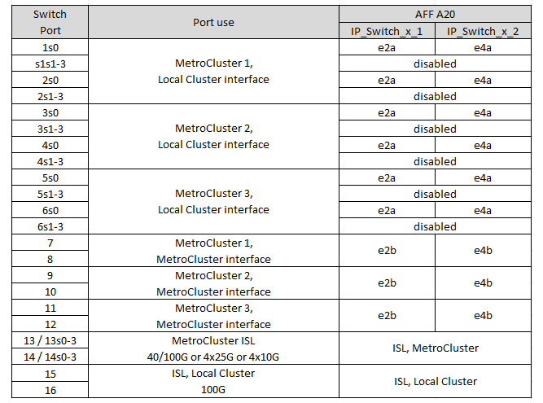

= 適用於NVIDIA支援SN2100 IP交換器的平台連接埠指派
:allow-uri-read: 
:icons: font
:imagesdir: ../media/

[role="lead"]
連接埠在MetroCluster 一個靜態IP組態中的使用取決於交換器機型和平台類型。

使用組態表之前，請先檢閱下列考量事項：

* 連接八節點或兩個四節點 MetroCluster 組態需要 ONTAP 9.14.1 或更新版本、以及 RCF 檔案 2.00 版或更新版本。
+

NOTE: RCF 檔案版本與用於產生檔案的 RCFfilegenerator 工具版本不同。例如、您可以使用 RCFfilegenerator v1.6c 產生 RCF 檔案版本 2.00 。

* 如果您連接多MetroCluster 個支援的組態、請依照相應的表格進行。例如：
+
** 如果您連接兩個 AFF A700 類型的四節點 MetroCluster 組態、請連接第一個 MetroCluster （如「 MetroCluster 1 」所示）、第二個 MetroCluster （如 AFF A700 表中的「 MetroCluster 2 」所示）。

NOTE: 連接埠13和14可在原生速度模式下使用、支援40 Gbps和100 Gbps、或在中斷模式下使用、以支援4 x 25 Gbps或4 x 10 Gbps。如果他們使用原生速度模式、則會顯示為連接埠 13 和 14 。如果使用中斷模式（ 4 × 25 Gbps 或 4 × 10 Gbps ）、則會將它們表示為連接埠 13s0 － 3 和 14s0 － 3 。

以下各節將說明實體纜線的佈線大綱。您也可以參閱 https://mysupport.netapp.com/site/tools/tool-eula/rcffilegenerator["RcfFileGenerator"] 以取得詳細的纜線連接資訊。

== 請為您的組態選擇正確的纜線配置表

請使用下表來判斷您應遵循的纜線表。

[cols="2*"]
|===
| 如果您的系統 ... | 使用此纜線表 ... 

 a| 
AFF A150 、 ASA A150

FAS500f

AFF C250 、 ASA C250

AFF A250 、 ASA A250
| <<table_1_nvidia_sn2100,NVIDIA SN2100 平台連接埠指派（群組 1 ）>> 

| AFF A20 | <<table_2_nvidia_sn2100,NVIDIA SN2100 平台連接埠指派（群組 2 ）>> 

| AFF C30 ， AFF A30 AFF C60 | <<table_3_nvidia_sn2100,NVIDIA SN2100 平台連接埠指派（群組 3 ）>> 

| FAS8300 AFF C400 、 ASA C400 AFF A400 、 ASA A400 FAS8700 FAS9000 、 AFF A700 | <<table_4_nvidia_sn2100,NVIDIA SN2100 平台連接埠指派（群組 4 ）>> 

| AFF A50 | <<table_5_nvidia_sn2100,NVIDIA SN2100 平台連接埠指派（群組 5 ）>> 

| AFF C800 、 ASA C800 AFF A800 、 ASA A800 FAS9500 AFF A900 、 ASA A900 | <<table_6_nvidia_sn2100,NVIDIA SN2100 平台連接埠指派（群組 6 ）>> 

| FAS70 ， AFF A70 AFF C80 FAS90 ， AFF A90 AFF A1K | <<table_7_nvidia_sn2100,NVIDIA SN2100 平台連接埠指派（群組 7 ）>> 
|===
.NVIDIA SN2100 平台連接埠指派（群組 1 ）
檢閱平台連接埠指派、以連接 AFF A150 、 ASA A150 、 FAS500f 、 AFF C250 、 ASA C250 、 AFF A250 或 ASA A250 系統至 NVIDIA SN2100 交換器：

[#table_1_nvidia_sn2100]
image::../media/mcc-ip-cabling-aff-asa-a150-fas500f-a25-c250-MSN2100.png[顯示 NVIDIA SN2100 平台連接埠指派]

.NVIDIA SN2100 平台連接埠指派（群組 2 ）
檢閱平台連接埠指派，將 AFF A20 系統連接至 NVIDIA SN2100 交換器：

[#table_2_nvidia_sn2100]

.NVIDIA SN2100 平台連接埠指派（群組 3 ）
檢閱平台連接埠指派、將 AFF C30 、 AFF A30 或 AFF C60 系統連接至 NVIDIA SN2100 交換器：

[#table_3_nvidia_sn2100]
image::../media/mccip-cabling-aff-a30-c30-c60-nvidia-sn2100.png[顯示 NVIDIA SN2100 平台連接埠指派]

.NVIDIA SN2100 平台連接埠指派（群組 4 ）
檢閱平台連接埠指派以連接 FAS8400 、 AFF C400 、 ASA C400 、 AFF A400 、 ASA A400 、 FAS8700 、 FAS9000 或 AFF A700 系統連接至 NVIDIA SN2100 交換器：

image::../media/mccip-cabling-fas8300-aff-a400-c400-a700-fas900-nvidaia-sn2100.png[顯示 NVIDIA SN2100 平台連接埠指派]

* 附註 1* ：如果您使用的是 X91440A 介面卡（ 40Gbps ），請使用連接埠 E4A 和 e4e 或 E4A 和 e8a 。如果您使用的是 X91153A 介面卡（ 100Gbps ），請使用連接埠 E4A 和 e4b 或 E4A 和 e8a 。

.NVIDIA SN2100 平台連接埠指派（群組 5 ）
檢閱平台連接埠指派，將 AFF A50 系統連接至 NVIDIA SN2100 交換器：

[#table_5_nvidia_sn2100]
image::../media/mccip-cabling-aff-a50-nvidia-sn2100.png[顯示 NVIDIA SN2100 平台連接埠指派]

.NVIDIA SN2100 平台連接埠指派（群組 6 ）
檢閱平台連接埠指派、以連接 AFF C800 、 ASA C800 、 AFF A800 、 ASA A800 、 FAS9500 、 AFF A900 或 ASA A900 系統至 NVIDIA SN2100 交換器：

image::../media/mcc_ip_cabling_fas8300_aff_asa_a800_a900_fas9500_MSN2100.png[顯示 NVIDIA SN2100 平台連接埠指派]

* 附註 1* ：如果您使用的是 X91440A 介面卡（ 40Gbps ），請使用連接埠 E4A 和 e4e 或 E4A 和 e8a 。如果您使用的是 X91153A 介面卡（ 100Gbps ），請使用連接埠 E4A 和 e4b 或 E4A 和 e8a 。

.NVIDIA SN2100 平台連接埠指派（群組 7 ）
檢閱平台連接埠指派，將 FAS70 ， AFF A70 ， AFF C80 ， FAS90 ， AFF A90 或 AFF A1K 系統連接至 NVIDIA SN2100 交換器：

image::../media/mccip-cabling-fas90-fas70-aff-a70--a90-c80-a1k-nvidia-sn2100.png[顯示 NVIDIA SN2100 平台連接埠指派]
