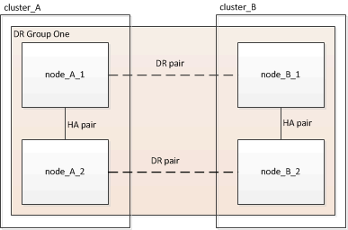

= 驗證元件的ha-config狀態
:allow-uri-read: 

[role="lead"]
在非原廠預先設定的靜態IP組態中MetroCluster 、您必須驗證控制器和機箱元件的ha-config狀態是否設定為「mCCIP」、以便正常開機。對於從原廠接收的系統、此值已預先設定、您不需要驗證。

系統必須處於維護模式。

.步驟
. 顯示控制器模組和機箱的HA狀態：
+
《ha-config show》

+
控制器模組和機箱應顯示「mCCIP」值。

. 如果控制器的顯示系統狀態不是「mCCIP」、請設定控制器的HA狀態：
+
「ha-config modify控制器mccip」

. 如果機箱的顯示系統狀態不是「mCCIP」、請設定機箱的HA狀態：
+
「ha-config modify機箱mccip」

. 在MetroCluster 整個過程中的每個節點上重複上述步驟。

== 還原控制器模組的系統預設值

[role="lead"]
重設並還原控制器模組的預設值。

. 在載入程式提示下、將環境變數恢復為預設設定：「et-Defaults」
. 將節點開機至開機功能表：「boot_ONTAP功能表」
+
執行此命令之後、請等待開機功能表顯示。

. 清除節點組態：
+
--
** 如果您使用的系統已設定為ADP、請從開機功能表中選取選項「9a」、並在出現提示時回應「yes」。
+

NOTE: 此程序會中斷營運。

+
下列畫面顯示開機功能表提示：

+
[listing]
----

Please choose one of the following:

    (1) Normal Boot.
    (2) Boot without /etc/rc.
    (3) Change password.
    (4) Clean configuration and initialize all disks.
    (5) Maintenance mode boot.
    (6) Update flash from backup config.
    (7) Install new software first.
    (8) Reboot node.
    (9) Configure Advanced Drive Partitioning.
    Selection (1-9)?  9a
########## WARNING ##########

    This is a disruptive operation and will result in the
    loss of all filesystem data. Before proceeding further,
    make sure that:
    1) This option (9a) has been executed or will be executed
    on the HA partner node, prior to reinitializing either
    system in the HA-pair.
    2) The HA partner node is currently in a halted state or
    at the LOADER prompt.

    Do you still want to continue (yes/no)? yes
----

--
+
** 如果您的系統未設定ADP、請在開機功能表提示字元中輸入「wepeconfig」、然後按Enter。
+
下列畫面顯示開機功能表提示：

+
[listing]
----

Please choose one of the following:

    (1) Normal Boot.
    (2) Boot without /etc/rc.
    (3) Change password.
    (4) Clean configuration and initialize all disks.
    (5) Maintenance mode boot.
    (6) Update flash from backup config.
    (7) Install new software first.
    (8) Reboot node.
    (9) Configure Advanced Drive Partitioning.
    Selection (1-9)?  wipeconfig
This option deletes critical system configuration, including cluster membership.
Warning: do not run this option on a HA node that has been taken over.
Are you sure you want to continue?: yes
Rebooting to finish wipeconfig request.
----

== 手動指派磁碟機至集區0

如果您沒有從原廠收到預先設定的系統、您可能必須手動指派Pool 0磁碟機。視平台機型和系統是否使用ADP而定、您必須針對MetroCluster 各個節點手動指派磁碟機至資源池0、以利執行各項功能。您使用的程序取決於ONTAP 您所使用的版本。

* <<man_assign_pool_0_9_4,手動指派集區0的磁碟機（ONTAP 適用於更新版本的更新版本）>>
* <<man_assign_pool_0_9_3,手動指派集區0的磁碟機（ONTAP 發揮作用9.3）>>

=== 手動指派集區0的磁碟機（ONTAP 適用於更新版本的更新版本）

如果系統尚未在原廠預先設定、且不符合自動磁碟指派的要求、您必須手動指派Pool 0磁碟機。

此程序適用於執行ONTAP 版本為4、9.4或更新版本的組態。

若要判斷您的系統是否需要手動指派磁碟、您應該檢閱 link:concept_considerations_drive_assignment.html["自動指派磁碟機和ONTAP ADP系統的考量事項、位於更新版本的更新版本"]。

您可以在維護模式中執行這些步驟。此程序必須在組態中的每個節點上執行。

本節的範例以下列假設為基礎：

* node_a_1和node_a_2擁有下列磁碟機：
+
** 站台_A-bider_1（本機）
** 站台_B-s櫃_2（遠端）

* node_B_1和node_B_2在下列項目上擁有磁碟機：
+
** 站台_B-s櫃_1（本機）
** 站台_A-bider_2（遠端）

.步驟
. 顯示開機功能表：
+
Boot_ONTAP功能表

. 選取選項「9a」。
+
下列畫面顯示開機功能表提示：

+
[listing]
----

Please choose one of the following:

    (1) Normal Boot.
    (2) Boot without /etc/rc.
    (3) Change password.
    (4) Clean configuration and initialize all disks.
    (5) Maintenance mode boot.
    (6) Update flash from backup config.
    (7) Install new software first.
    (8) Reboot node.
    (9) Configure Advanced Drive Partitioning.
    Selection (1-9)?  9a
########## WARNING ##########

    This is a disruptive operation and will result in the
    loss of all filesystem data. Before proceeding further,
    make sure that:
    1) This option (9a) has been executed or will be executed
    on the HA partner node (and DR/DR-AUX partner nodes if
    applicable), prior to reinitializing any system in the
    HA-pair (or MetroCluster setup).
    2) The HA partner node (and DR/DR-AUX partner nodes if
    applicable) is currently waiting at the boot menu.

    Do you still want to continue (yes/no)? yes
----
. 節點重新啟動時、請在系統提示時按Ctrl-C以顯示開機功能表、然後選取*維護模式開機*選項。
. 在維護模式中、手動指派節點上本機集合體的磁碟機：
+
「磁碟指派_disk-id_-p 0 -s _local-node-sysid_」

+
磁碟機應對稱指派、因此每個節點的磁碟機數量都相同。下列步驟適用於每個站台有兩個儲存櫃的組態。

+
.. 在設定node_a_1時、請從se_a-balle_1手動將磁碟機從插槽0到11指派給節點A1的Pool0。
.. 在設定node_a_2時、請從s加 層櫃1手動指派磁碟機、從插槽12到23、將磁碟機指派給節點A2的Pool0。
.. 在設定node_B_1時、請從ssite _B-sider_1手動將磁碟機從插槽0到11指派給節點B1的Pool0。
.. 在設定node_B_2時、請從ssite _B-sider_1手動將磁碟機從插槽12指派至節點B2的Pool0。

. 結束維護模式：
+
《停止》

. 顯示開機功能表：
+
Boot_ONTAP功能表

. 從開機功能表中選取選項「4」、然後讓系統開機。
. 在「介紹IP」組態的其他節點上重複上述步驟MetroCluster 。
. 請前往 link:concept_configure_the_mcc_software_in_ontap.html#setting-up-ontap["設定ONTAP 功能"]。

=== 手動指派集區0的磁碟機（ONTAP 發揮作用9.3）

如果每個節點至少有兩個磁碟櫃、您可以使用ONTAP的自動指派功能來自動指派本機（Pool 0）磁碟。

當節點處於維護模式時、您必須先將適當磁碟櫃上的單一磁碟指派給資源池0。然後、將機櫃上的其餘磁碟自動指派給同一個資源池。ONTAP從原廠接收的系統不需要執行此工作、因為原廠系統具有集區0、可容納預先設定的根Aggregate。

本程序適用於執行ONTAP 不符合功能的組態。

如果您從MetroCluster 原廠收到您的不確定組態、則不需要執行此程序。原廠節點已設定集區0磁碟和根Aggregate。

此程序僅適用於每個節點至少有兩個磁碟櫃的情況、這可讓磁碟在磁碟櫃層級進行自動指派。如果您無法使用機櫃層級的自動指派、則必須手動指派本機磁碟、使每個節點都有本機磁碟集區（Pool 0）。

這些步驟必須在維護模式下執行。

本節中的範例假設下列磁碟櫃：

* node_a_1擁有下列項目上的磁碟：
+
** 站台_A-bider_1（本機）
** 站台_B-s櫃_2（遠端）

* node_a_2已連線至：
+
** 站台_A-bider_3（本機）
** 站台_B-sider_4（遠端）

* 節點B_1已連線至：
+
** 站台_B-s櫃_1（本機）
** 站台_A-bider_2（遠端）

* 節點B_2已連線至：
+
** 站台_B-s櫃_3（本機）
** 站台_A-bider_4（遠端）

.步驟
. 在每個節點上手動指派單一磁碟作為根Aggregate：
+
「磁碟指派_disk-id_-p 0 -s _local-node-sysid_」

+
這些磁碟的手動指派功能可讓ONTAP 您在每個磁碟櫃上指派其餘的磁碟。

+
.. 在node_a_1上、手動將一個磁碟從本機se_A-bider_1指派至Pool 0。
.. 在node_a_2上、手動將一個磁碟從本機se_A-bider_3指派給資源池0。
.. 在node_B_1上、手動指派一個磁碟從本機se_B-b-bider_1到Pool 0。
.. 在node_B_2上、手動將一個磁碟從本機se_B-b-bider_3指派給資源池0。

. 使用開機功能表上的選項「4」來啟動站台A的每個節點：
+
您應該先在節點上完成此步驟、然後再繼續下一個節點。

+
.. 結束維護模式：
+
《停止》

.. 顯示開機功能表：
+
Boot_ONTAP功能表

.. 從開機功能表中選取選項「4」、然後繼續。

. 使用開機功能表上的選項「4」、在站台B開機每個節點：
+
您應該先在節點上完成此步驟、然後再繼續下一個節點。

+
.. 結束維護模式：
+
《停止》

.. 顯示開機功能表：
+
Boot_ONTAP功能表

.. 從開機功能表中選取選項「4」、然後繼續。

== 設定ONTAP 功能

每個節點開機後、系統會提示您執行基本節點和叢集組態。設定叢集後、您將返回ONTAP 到還原CLI以建立集合體並建立MetroCluster 該組態。

.開始之前
* 您必須使用纜線連接MetroCluster 的the不可用的功能組態。
* 您不得設定服務處理器。

如果您需要以網路方式開機新的控制器、請參閱 link:../upgrade/task_upgrade_controllers_in_a_four_node_ip_mcc_us_switchover_and_switchback_mcc_ip.html#netbooting-the-new-controllers["Netbooting新的控制器模組"]。

這項工作必須在MetroCluster 整個叢集上執行、且必須採用支援功能的組態。

.步驟
. 如果您尚未啟動本機站台上的每個節點、請將其全部開機。
+
如果系統處於維護模式、您需要發出halt命令以結束維護模式、然後發出「boot_ontap」命令來啟動系統並進入叢集設定。

. 在每個叢集中的第一個節點上、繼續執行各項提示以設定叢集
+
.. 請依照系統提供的指示啟用AutoSupport 「支援功能」工具。
+
輸出應類似於下列內容：

+
[listing]
----
Welcome to the cluster setup wizard.

    You can enter the following commands at any time:
    "help" or "?" - if you want to have a question clarified,
    "back" - if you want to change previously answered questions, and
    "exit" or "quit" - if you want to quit the cluster setup wizard.
    Any changes you made before quitting will be saved.

    You can return to cluster setup at any time by typing "cluster setup".
    To accept a default or omit a question, do not enter a value.

    This system will send event messages and periodic reports to NetApp Technical
    Support. To disable this feature, enter
    autosupport modify -support disable
    within 24 hours.

    Enabling AutoSupport can significantly speed problem determination and
    resolution should a problem occur on your system.
    For further information on AutoSupport, see:
    http://support.netapp.com/autosupport/

    Type yes to confirm and continue {yes}: yes

.
.
.
----
.. 回應提示來設定節點管理介面。
+
這些提示類似於下列內容：

+
[listing]
----
Enter the node management interface port [e0M]:
Enter the node management interface IP address: 172.17.8.229
Enter the node management interface netmask: 255.255.254.0
Enter the node management interface default gateway: 172.17.8.1
A node management interface on port e0M with IP address 172.17.8.229 has been created.
----
.. 回應提示來建立叢集。
+
這些提示類似於下列內容：

+
[listing]
----
Do you want to create a new cluster or join an existing cluster? {create, join}:
create

Do you intend for this node to be used as a single node cluster? {yes, no} [no]:
no

Existing cluster interface configuration found:

Port MTU IP Netmask
e0a 1500 169.254.18.124 255.255.0.0
e1a 1500 169.254.184.44 255.255.0.0

Do you want to use this configuration? {yes, no} [yes]: no

System Defaults:
Private cluster network ports [e0a,e1a].
Cluster port MTU values will be set to 9000.
Cluster interface IP addresses will be automatically generated.

Do you want to use these defaults? {yes, no} [yes]: no

Enter the cluster administrator's (username "admin") password:

Retype the password:

Step 1 of 5: Create a Cluster
You can type "back", "exit", or "help" at any question.

List the private cluster network ports [e0a,e1a]:
Enter the cluster ports' MTU size [9000]:
Enter the cluster network netmask [255.255.0.0]: 255.255.254.0
Enter the cluster interface IP address for port e0a: 172.17.10.228
Enter the cluster interface IP address for port e1a: 172.17.10.229
Enter the cluster name: cluster_A

Creating cluster cluster_A

Starting cluster support services ...

Cluster cluster_A has been created.
----
.. 新增授權、設定叢集管理SVM、並回應提示輸入DNS資訊。
+
這些提示類似於下列內容：

+
[listing]
----
Step 2 of 5: Add Feature License Keys
You can type "back", "exit", or "help" at any question.

Enter an additional license key []:

Step 3 of 5: Set Up a Vserver for Cluster Administration
You can type "back", "exit", or "help" at any question.

Enter the cluster management interface port [e3a]:
Enter the cluster management interface IP address: 172.17.12.153
Enter the cluster management interface netmask: 255.255.252.0
Enter the cluster management interface default gateway: 172.17.12.1

A cluster management interface on port e3a with IP address 172.17.12.153 has been created. You can use this address to connect to and manage the cluster.

Enter the DNS domain names: lab.netapp.com
Enter the name server IP addresses: 172.19.2.30
DNS lookup for the admin Vserver will use the lab.netapp.com domain.

Step 4 of 5: Configure Storage Failover (SFO)
You can type "back", "exit", or "help" at any question.

SFO will be enabled when the partner joins the cluster.

Step 5 of 5: Set Up the Node
You can type "back", "exit", or "help" at any question.

Where is the controller located []: svl
----
.. 回應提示、啟用儲存容錯移轉並設定節點。
+
這些提示類似於下列內容：

+
[listing]
----
Step 4 of 5: Configure Storage Failover (SFO)
You can type "back", "exit", or "help" at any question.

SFO will be enabled when the partner joins the cluster.

Step 5 of 5: Set Up the Node
You can type "back", "exit", or "help" at any question.

Where is the controller located []: site_A
----
.. 完成節點的組態、但不要建立資料集合體。
+
您可以使用ONTAP 「靜態系統管理程式」、將網頁瀏覽器指向叢集管理IP位址 (https://172.17.12.153)[]。

+
https://docs.netapp.com/ontap-9/topic/com.netapp.doc.onc-sm-help/GUID-DF04A607-30B0-4B98-99C8-CB065C64E670.html["使用System Manager進行叢集管理（9.0至9.6版）"^]

+
https://docs.netapp.com/us-en/ontap/index.html["系統管理程式（9.7版及更新版本）ONTAP"^]

. 依照提示啟動下一個控制器並將其加入叢集。
. 確認節點已設定為高可用度模式：
+
「儲存容錯移轉顯示欄位模式」

+
如果不是、您必須在每個節點上設定HA模式、然後重新啟動節點：

+
"torage容錯移轉修改-mode ha -nod_norlocalhost_"

+
此命令會設定高可用度模式、但不會啟用儲存容錯移轉。儲存容錯移轉功能會在MetroCluster 稍後設定支援功能時自動啟用。

. 確認您有四個連接埠設定為叢集互連：
+
「網路連接埠展示」

+
目前尚未設定好這個介面、且不會出現在命令輸出中。MetroCluster

+
以下範例顯示node_a_1上的兩個叢集連接埠：

+
[listing]
----
cluster_A::*> network port show -role cluster

Node: node_A_1

                                                                       Ignore

                                                  Speed(Mbps) Health   Health

Port      IPspace      Broadcast Domain Link MTU  Admin/Oper  Status   Status

--------- ------------ ---------------- ---- ---- ----------- -------- ------

e4a       Cluster      Cluster          up   9000  auto/40000 healthy  false

e4e       Cluster      Cluster          up   9000  auto/40000 healthy  false

Node: node_A_2

                                                                       Ignore

                                                  Speed(Mbps) Health   Health

Port      IPspace      Broadcast Domain Link MTU  Admin/Oper  Status   Status

--------- ------------ ---------------- ---- ---- ----------- -------- ------

e4a       Cluster      Cluster          up   9000  auto/40000 healthy  false

e4e       Cluster      Cluster          up   9000  auto/40000 healthy  false

4 entries were displayed.
----
. 在合作夥伴叢集上重複這些步驟。

返回ONTAP 到指令行介面、MetroCluster 執行後續的工作、完成整套的功能。

== 將叢集設定成MetroCluster 一個不只是一個的組態

您必須對等處理叢集、鏡射根Aggregate、建立鏡射資料Aggregate、然後發出命令來實作MetroCluster 該等作業系統。

=== 停用自動磁碟機指派（如果在ONTAP 功能更新9.4中進行手動指派）

在支援率9.4的情況ONTAP 下、如果MetroCluster 您的支援率IP組態每個站台的外部儲存磁碟櫃少於四個、您就必須停用所有節點上的自動磁碟指派功能、並手動指派磁碟機。

不需要ONTAP 在更新版本的版本中執行此工作。

此工作不適用於AFF 內部機櫃且無外部機櫃的不適用。

link:concept_considerations_drive_assignment.html["自動指派磁碟機和ONTAP ADP系統的考量事項、位於更新版本的更新版本"]

.步驟
. 停用自動磁碟指派：
+
「torage disk option modify -node_name -autodassign Off」（磁碟選項修改節點節點名稱自動指派關閉）

+
您需要在MetroCluster 所有節點上發出此命令、以供使用。

=== 驗證集區0磁碟機的磁碟機指派

您必須確認遠端磁碟機對節點可見且已正確指派。

自動指派取決於儲存系統平台模式和磁碟機櫃配置。

link:concept_considerations_drive_assignment.html["自動指派磁碟機和ONTAP ADP系統的考量事項、位於更新版本的更新版本"]

.步驟
. 確認已自動指派集區0磁碟機：
+
「尖碑秀」

+
以下範例顯示AFF 沒有外部磁碟櫃的Shelfa800系統的「叢集A」輸出。

+
四分之一（8個磁碟機）會自動指派給「node_a_1」、而四分之一則會自動指派給「node_a_2」。其餘磁碟機將是遠端（Pool 1）磁碟機、適用於「node_B_1」和「node_B_2」。

+
[listing]
----
cluster_A::*> disk show
                 Usable     Disk      Container           Container
Disk             Size       Shelf Bay Type    Type        Name      Owner
---------------- ---------- ----- --- ------- ----------- --------- --------
node_A_1:0n.12   1.75TB     0     12  SSD-NVM shared      aggr0     node_A_1
node_A_1:0n.13   1.75TB     0     13  SSD-NVM shared      aggr0     node_A_1
node_A_1:0n.14   1.75TB     0     14  SSD-NVM shared      aggr0     node_A_1
node_A_1:0n.15   1.75TB     0     15  SSD-NVM shared      aggr0     node_A_1
node_A_1:0n.16   1.75TB     0     16  SSD-NVM shared      aggr0     node_A_1
node_A_1:0n.17   1.75TB     0     17  SSD-NVM shared      aggr0     node_A_1
node_A_1:0n.18   1.75TB     0     18  SSD-NVM shared      aggr0     node_A_1
node_A_1:0n.19   1.75TB     0     19  SSD-NVM shared      -         node_A_1
node_A_2:0n.0    1.75TB     0     0   SSD-NVM shared      aggr0_node_A_2_0 node_A_2
node_A_2:0n.1    1.75TB     0     1   SSD-NVM shared      aggr0_node_A_2_0 node_A_2
node_A_2:0n.2    1.75TB     0     2   SSD-NVM shared      aggr0_node_A_2_0 node_A_2
node_A_2:0n.3    1.75TB     0     3   SSD-NVM shared      aggr0_node_A_2_0 node_A_2
node_A_2:0n.4    1.75TB     0     4   SSD-NVM shared      aggr0_node_A_2_0 node_A_2
node_A_2:0n.5    1.75TB     0     5   SSD-NVM shared      aggr0_node_A_2_0 node_A_2
node_A_2:0n.6    1.75TB     0     6   SSD-NVM shared      aggr0_node_A_2_0 node_A_2
node_A_2:0n.7    1.75TB     0     7   SSD-NVM shared      -         node_A_2
node_A_2:0n.24   -          0     24  SSD-NVM unassigned  -         -
node_A_2:0n.25   -          0     25  SSD-NVM unassigned  -         -
node_A_2:0n.26   -          0     26  SSD-NVM unassigned  -         -
node_A_2:0n.27   -          0     27  SSD-NVM unassigned  -         -
node_A_2:0n.28   -          0     28  SSD-NVM unassigned  -         -
node_A_2:0n.29   -          0     29  SSD-NVM unassigned  -         -
node_A_2:0n.30   -          0     30  SSD-NVM unassigned  -         -
node_A_2:0n.31   -          0     31  SSD-NVM unassigned  -         -
node_A_2:0n.36   -          0     36  SSD-NVM unassigned  -         -
node_A_2:0n.37   -          0     37  SSD-NVM unassigned  -         -
node_A_2:0n.38   -          0     38  SSD-NVM unassigned  -         -
node_A_2:0n.39   -          0     39  SSD-NVM unassigned  -         -
node_A_2:0n.40   -          0     40  SSD-NVM unassigned  -         -
node_A_2:0n.41   -          0     41  SSD-NVM unassigned  -         -
node_A_2:0n.42   -          0     42  SSD-NVM unassigned  -         -
node_A_2:0n.43   -          0     43  SSD-NVM unassigned  -         -
32 entries were displayed.
----
+
下列範例顯示「叢集B」輸出：

+
[listing]
----
cluster_B::> disk show
                 Usable     Disk              Container   Container
Disk             Size       Shelf Bay Type    Type        Name      Owner
---------------- ---------- ----- --- ------- ----------- --------- --------

Info: This cluster has partitioned disks. To get a complete list of spare disk
capacity use "storage aggregate show-spare-disks".
node_B_1:0n.12   1.75TB     0     12  SSD-NVM shared      aggr0     node_B_1
node_B_1:0n.13   1.75TB     0     13  SSD-NVM shared      aggr0     node_B_1
node_B_1:0n.14   1.75TB     0     14  SSD-NVM shared      aggr0     node_B_1
node_B_1:0n.15   1.75TB     0     15  SSD-NVM shared      aggr0     node_B_1
node_B_1:0n.16   1.75TB     0     16  SSD-NVM shared      aggr0     node_B_1
node_B_1:0n.17   1.75TB     0     17  SSD-NVM shared      aggr0     node_B_1
node_B_1:0n.18   1.75TB     0     18  SSD-NVM shared      aggr0     node_B_1
node_B_1:0n.19   1.75TB     0     19  SSD-NVM shared      -         node_B_1
node_B_2:0n.0    1.75TB     0     0   SSD-NVM shared      aggr0_node_B_1_0 node_B_2
node_B_2:0n.1    1.75TB     0     1   SSD-NVM shared      aggr0_node_B_1_0 node_B_2
node_B_2:0n.2    1.75TB     0     2   SSD-NVM shared      aggr0_node_B_1_0 node_B_2
node_B_2:0n.3    1.75TB     0     3   SSD-NVM shared      aggr0_node_B_1_0 node_B_2
node_B_2:0n.4    1.75TB     0     4   SSD-NVM shared      aggr0_node_B_1_0 node_B_2
node_B_2:0n.5    1.75TB     0     5   SSD-NVM shared      aggr0_node_B_1_0 node_B_2
node_B_2:0n.6    1.75TB     0     6   SSD-NVM shared      aggr0_node_B_1_0 node_B_2
node_B_2:0n.7    1.75TB     0     7   SSD-NVM shared      -         node_B_2
node_B_2:0n.24   -          0     24  SSD-NVM unassigned  -         -
node_B_2:0n.25   -          0     25  SSD-NVM unassigned  -         -
node_B_2:0n.26   -          0     26  SSD-NVM unassigned  -         -
node_B_2:0n.27   -          0     27  SSD-NVM unassigned  -         -
node_B_2:0n.28   -          0     28  SSD-NVM unassigned  -         -
node_B_2:0n.29   -          0     29  SSD-NVM unassigned  -         -
node_B_2:0n.30   -          0     30  SSD-NVM unassigned  -         -
node_B_2:0n.31   -          0     31  SSD-NVM unassigned  -         -
node_B_2:0n.36   -          0     36  SSD-NVM unassigned  -         -
node_B_2:0n.37   -          0     37  SSD-NVM unassigned  -         -
node_B_2:0n.38   -          0     38  SSD-NVM unassigned  -         -
node_B_2:0n.39   -          0     39  SSD-NVM unassigned  -         -
node_B_2:0n.40   -          0     40  SSD-NVM unassigned  -         -
node_B_2:0n.41   -          0     41  SSD-NVM unassigned  -         -
node_B_2:0n.42   -          0     42  SSD-NVM unassigned  -         -
node_B_2:0n.43   -          0     43  SSD-NVM unassigned  -         -
32 entries were displayed.

cluster_B::>
----

=== 對等連接叢集

在不支援的組態中、叢集MetroCluster 必須處於對等關係中、以便彼此通訊、並執行MetroCluster 對恢復災難至關重要的資料鏡射。

http://docs.netapp.com/ontap-9/topic/com.netapp.doc.exp-clus-peer/home.html["叢集與SVM對等化快速組態"^]

link:concept_considerations_peering.html#considerations-when-using-dedicated-ports["使用專用連接埠時的考量事項"]

link:concept_considerations_peering.html#considerations-when-sharing-data-ports["共享資料連接埠時的考量"]

=== 設定叢集間生命體以進行叢集對等

您必須在MetroCluster 連接埠上建立叢集間的LIF、以便在各個連接埠之間進行通訊。您可以使用也有資料流量的專用連接埠或連接埠。

==== 在專用連接埠上設定叢集間LIF

您可以在專用連接埠上設定叢集間的LIF。這樣做通常會增加複寫流量的可用頻寬。

.步驟
. 列出叢集中的連接埠：
+
「網路連接埠展示」

+
如需完整的命令語法、請參閱手冊頁。

+
以下範例顯示cluster01中的網路連接埠：

+
[listing]
----

cluster01::> network port show
                                                             Speed (Mbps)
Node   Port      IPspace      Broadcast Domain Link   MTU    Admin/Oper
------ --------- ------------ ---------------- ----- ------- ------------
cluster01-01
       e0a       Cluster      Cluster          up     1500   auto/1000
       e0b       Cluster      Cluster          up     1500   auto/1000
       e0c       Default      Default          up     1500   auto/1000
       e0d       Default      Default          up     1500   auto/1000
       e0e       Default      Default          up     1500   auto/1000
       e0f       Default      Default          up     1500   auto/1000
cluster01-02
       e0a       Cluster      Cluster          up     1500   auto/1000
       e0b       Cluster      Cluster          up     1500   auto/1000
       e0c       Default      Default          up     1500   auto/1000
       e0d       Default      Default          up     1500   auto/1000
       e0e       Default      Default          up     1500   auto/1000
       e0f       Default      Default          up     1500   auto/1000
----
. 判斷哪些連接埠可用於叢集間通訊：
+
「網路介面show -field home-port、curr-port」

+
如需完整的命令語法、請參閱手冊頁。

+
以下範例顯示尚未指派連接埠「e0e」和「e0f」的LIF：

+
[listing]
----

cluster01::> network interface show -fields home-port,curr-port
vserver lif                  home-port curr-port
------- -------------------- --------- ---------
Cluster cluster01-01_clus1   e0a       e0a
Cluster cluster01-01_clus2   e0b       e0b
Cluster cluster01-02_clus1   e0a       e0a
Cluster cluster01-02_clus2   e0b       e0b
cluster01
        cluster_mgmt         e0c       e0c
cluster01
        cluster01-01_mgmt1   e0c       e0c
cluster01
        cluster01-02_mgmt1   e0c       e0c
----
. 為專用連接埠建立容錯移轉群組：
+
「網路介面容錯移轉群組可建立-vserver _system_svm_-容 錯移轉群組_容 錯移轉群組_-鎖 定_forby_OR_logical_ports _」

+
以下範例將連接埠「e0e」和「e0f」指派給系統「VMcluster01」上的容錯移轉群組「'inter01'」：

+
[listing]
----
cluster01::> network interface failover-groups create -vserver cluster01 -failover-group
intercluster01 -targets
cluster01-01:e0e,cluster01-01:e0f,cluster01-02:e0e,cluster01-02:e0f
----
. 確認已建立容錯移轉群組：
+
「網路介面容錯移轉群組顯示」

+
如需完整的命令語法、請參閱手冊頁。

+
[listing]
----
cluster01::> network interface failover-groups show
                                  Failover
Vserver          Group            Targets
---------------- ---------------- --------------------------------------------
Cluster
                 Cluster
                                  cluster01-01:e0a, cluster01-01:e0b,
                                  cluster01-02:e0a, cluster01-02:e0b
cluster01
                 Default
                                  cluster01-01:e0c, cluster01-01:e0d,
                                  cluster01-02:e0c, cluster01-02:e0d,
                                  cluster01-01:e0e, cluster01-01:e0f
                                  cluster01-02:e0e, cluster01-02:e0f
                 intercluster01
                                  cluster01-01:e0e, cluster01-01:e0f
                                  cluster01-02:e0e, cluster01-02:e0f
----
. 在系統SVM上建立叢集間LIF、並將它們指派給容錯移轉群組。
+
|===

| 版本ONTAP | 命令 

 a| 
9.6及更新版本
 a| 
「網路介面create -vserver _system_svm_-lif_lif_name_-service-policy default-intercluster -home-node_-home-port _port_-address _port_ip_-netask _netask_-容 錯移轉群組_容 錯移轉_group_」

 a| 
9.5及更早版本
 a| 
「網路介面create -vserver _system_svm_-lif_lif_name_-role inter-cluster -home-node_node_-home-port _port_-address _port_ip_-netask_-over-group _furobet_group _」

|===
+
如需完整的命令語法、請參閱手冊頁。

+
以下範例會在容錯移轉群組「'intercluster01」中建立叢集間LIF「'cluster01_icl01」和「'cluster01_icl02」：

+
[listing]
----
cluster01::> network interface create -vserver cluster01 -lif cluster01_icl01 -service-
policy default-intercluster -home-node cluster01-01 -home-port e0e -address 192.168.1.201
-netmask 255.255.255.0 -failover-group intercluster01

cluster01::> network interface create -vserver cluster01 -lif cluster01_icl02 -service-
policy default-intercluster -home-node cluster01-02 -home-port e0e -address 192.168.1.202
-netmask 255.255.255.0 -failover-group intercluster01
----
. 驗證是否已建立叢集間的LIF：
+
|===

| * ONTAP 在S69.6及更新版本中：* 

 a| 
「網路介面show -service-policy default-intercluster」

| * ONTAP 在《S19.5及更早版本》中：* 

 a| 
「網路介面show -role intercluster」

|===
+
如需完整的命令語法、請參閱手冊頁。

+
[listing]
----
cluster01::> network interface show -service-policy default-intercluster
            Logical    Status     Network            Current       Current Is
Vserver     Interface  Admin/Oper Address/Mask       Node          Port    Home
----------- ---------- ---------- ------------------ ------------- ------- ----
cluster01
            cluster01_icl01
                       up/up      192.168.1.201/24   cluster01-01  e0e     true
            cluster01_icl02
                       up/up      192.168.1.202/24   cluster01-02  e0f     true
----
. 驗證叢集間的LIF是否為備援：
+
|===

| * ONTAP 在S69.6及更新版本中：* 

 a| 
「網路介面show -service-policy default-intercluster -容 錯移轉」

| * ONTAP 在《S19.5及更早版本》中：* 

 a| 
「網路介面show -role intercluster -容 錯移轉」

|===
+
如需完整的命令語法、請參閱手冊頁。

+
下列範例顯示、「e0e」連接埠上的叢集間lifs「cluster01_icl01」和「cluster01_icl02」將容錯移轉至「e0f」連接埠。

+
[listing]
----
cluster01::> network interface show -service-policy default-intercluster –failover
         Logical         Home                  Failover        Failover
Vserver  Interface       Node:Port             Policy          Group
-------- --------------- --------------------- --------------- --------
cluster01
         cluster01_icl01 cluster01-01:e0e   local-only      intercluster01
                            Failover Targets:  cluster01-01:e0e,
                                               cluster01-01:e0f
         cluster01_icl02 cluster01-02:e0e   local-only      intercluster01
                            Failover Targets:  cluster01-02:e0e,
                                               cluster01-02:e0f
----

link:concept_considerations_peering.html#considerations-when-using-dedicated-ports["使用專用連接埠時的考量事項"]

==== 在共享的資料連接埠上設定叢集間LIF

您可以在與資料網路共用的連接埠上設定叢集間的LIF。如此可減少叢集間網路所需的連接埠數量。

. 列出叢集中的連接埠：
+
「網路連接埠展示」

+
如需完整的命令語法、請參閱手冊頁。

+
以下範例顯示cluster01中的網路連接埠：

+
[listing]
----

cluster01::> network port show
                                                             Speed (Mbps)
Node   Port      IPspace      Broadcast Domain Link   MTU    Admin/Oper
------ --------- ------------ ---------------- ----- ------- ------------
cluster01-01
       e0a       Cluster      Cluster          up     1500   auto/1000
       e0b       Cluster      Cluster          up     1500   auto/1000
       e0c       Default      Default          up     1500   auto/1000
       e0d       Default      Default          up     1500   auto/1000
cluster01-02
       e0a       Cluster      Cluster          up     1500   auto/1000
       e0b       Cluster      Cluster          up     1500   auto/1000
       e0c       Default      Default          up     1500   auto/1000
       e0d       Default      Default          up     1500   auto/1000
----
. 在系統SVM上建立叢集間LIF：
+
|===

| * ONTAP 在S69.6及更新版本中：* 

 a| 
「網路介面create -vserver _system_Svm_-lif_lif_name_-service-policy default-intercluster -home-node_-home-port _port_-address_port_ip_-netask _netask_」

| * ONTAP 在《S19.5及更早版本》中：* 

 a| 
「網路介面create -vserver _system_Svm_-lif_lif_name_-role inter-cluster -home-node_node_-home-port _port_-address_port_ip_-netask_netask_」

|===
+
如需完整的命令語法、請參閱手冊頁。

+
下列範例會建立叢集間LIF「cluster01_icl01」和「cluster01_icl02」：

+
[listing]
----

cluster01::> network interface create -vserver cluster01 -lif cluster01_icl01 -service-
policy default-intercluster -home-node cluster01-01 -home-port e0c -address 192.168.1.201
-netmask 255.255.255.0

cluster01::> network interface create -vserver cluster01 -lif cluster01_icl02 -service-
policy default-intercluster -home-node cluster01-02 -home-port e0c -address 192.168.1.202
-netmask 255.255.255.0
----
. 驗證是否已建立叢集間的LIF：
+
|===

| * ONTAP 在S69.6及更新版本中：* 

 a| 
「網路介面show -service-policy default-intercluster」

| * ONTAP 在《S19.5及更早版本》中：* 

 a| 
「網路介面show -role intercluster」

|===
+
如需完整的命令語法、請參閱手冊頁。

+
[listing]
----
cluster01::> network interface show -service-policy default-intercluster
            Logical    Status     Network            Current       Current Is
Vserver     Interface  Admin/Oper Address/Mask       Node          Port    Home
----------- ---------- ---------- ------------------ ------------- ------- ----
cluster01
            cluster01_icl01
                       up/up      192.168.1.201/24   cluster01-01  e0c     true
            cluster01_icl02
                       up/up      192.168.1.202/24   cluster01-02  e0c     true
----
. 驗證叢集間的LIF是否為備援：
+
|===

| * ONTAP 在S69.6及更新版本中：* 

 a| 
「網路介面show–service-policy default-intercluster -faulty」

| * ONTAP 在《S19.5及更早版本》中：* 

 a| 
「網路介面show -role intercluster -容 錯移轉」

|===
+
如需完整的命令語法、請參閱手冊頁。

+
以下範例顯示、叢集間連接埠「叢集01 _icl01」和「叢集01 _icl02」將容錯移轉至「e0d」連接埠。

+
[listing]
----
cluster01::> network interface show -service-policy default-intercluster –failover
         Logical         Home                  Failover        Failover
Vserver  Interface       Node:Port             Policy          Group
-------- --------------- --------------------- --------------- --------
cluster01
         cluster01_icl01 cluster01-01:e0c   local-only      192.168.1.201/24
                            Failover Targets: cluster01-01:e0c,
                                              cluster01-01:e0d
         cluster01_icl02 cluster01-02:e0c   local-only      192.168.1.201/24
                            Failover Targets: cluster01-02:e0c,
                                              cluster01-02:e0d
----

link:concept_considerations_peering.html#considerations-when-sharing-data-ports["共享資料連接埠時的考量"]

=== 建立叢集對等關係

您可以使用叢集對等項create命令、在本機與遠端叢集之間建立對等關係。建立對等關係之後、您可以在遠端叢集上執行叢集對等建立、將其驗證至本機叢集。

.開始之前
* 您必須在叢集中每個要處理的節點上建立叢集間生命體。
* 叢集必須執行ONTAP 的是不含更新版本的版本。

.步驟
. 在目的地叢集上、建立與來源叢集的對等關係：
+
「叢集對等端點建立-產生密碼-優惠到期日_mm/DD/YYYY hh：mm:ss|1...7天|1...168hours_-對等 端點位元組_Peer_LIF_IP_-IPspace _IPspace_」

+
如果您同時指定「-genere-phrase」和「-peer-addrs」、則只有在「-per-addrs」中指定叢集間生命體的叢集才能使用所產生的密碼。

+
如果不使用自訂IPspace、您可以忽略「-IPSpace」選項。如需完整的命令語法、請參閱手冊頁。

+
下列範例會在未指定的遠端叢集上建立叢集對等關係：

+
[listing]
----
cluster02::> cluster peer create -generate-passphrase -offer-expiration 2days

                     Passphrase: UCa+6lRVICXeL/gq1WrK7ShR
                Expiration Time: 6/7/2017 08:16:10 EST
  Initial Allowed Vserver Peers: -
            Intercluster LIF IP: 192.140.112.101
              Peer Cluster Name: Clus_7ShR (temporary generated)

Warning: make a note of the passphrase - it cannot be displayed again.
----
. 在來源叢集上、驗證來源叢集到目的地叢集的驗證：
+
「叢集對等端點create -對等 端點addrs _Peer_LIF_IPS_-IPSpace _IPspace_」

+
如需完整的命令語法、請參閱手冊頁。

+
下列範例驗證本機叢集到叢集間LIF IP位址「192.140.112.101」和「192.140.112.102」的遠端叢集：

+
[listing]
----
cluster01::> cluster peer create -peer-addrs 192.140.112.101,192.140.112.102

Notice: Use a generated passphrase or choose a passphrase of 8 or more characters.
        To ensure the authenticity of the peering relationship, use a phrase or sequence of characters that would be hard to guess.

Enter the passphrase:
Confirm the passphrase:

Clusters cluster02 and cluster01 are peered.
----
+
出現提示時、請輸入對等關係的通關密碼。

. 確認已建立叢集對等關係：
+
「叢集對等端點顯示-instance」

+
[listing]
----
cluster01::> cluster peer show -instance

                               Peer Cluster Name: cluster02
                   Remote Intercluster Addresses: 192.140.112.101, 192.140.112.102
              Availability of the Remote Cluster: Available
                             Remote Cluster Name: cluster2
                             Active IP Addresses: 192.140.112.101, 192.140.112.102
                           Cluster Serial Number: 1-80-123456
                  Address Family of Relationship: ipv4
            Authentication Status Administrative: no-authentication
               Authentication Status Operational: absent
                                Last Update Time: 02/05 21:05:41
                    IPspace for the Relationship: Default
----
. 檢查對等關係中節點的連線能力和狀態：
+
「叢集同儕健康展」

+
[listing]
----
cluster01::> cluster peer health show
Node       cluster-Name                Node-Name
             Ping-Status               RDB-Health Cluster-Health  Avail…
---------- --------------------------- ---------  --------------- --------
cluster01-01
           cluster02                   cluster02-01
             Data: interface_reachable
             ICMP: interface_reachable true       true            true
                                       cluster02-02
             Data: interface_reachable
             ICMP: interface_reachable true       true            true
cluster01-02
           cluster02                   cluster02-01
             Data: interface_reachable
             ICMP: interface_reachable true       true            true
                                       cluster02-02
             Data: interface_reachable
             ICMP: interface_reachable true       true            true
----

=== 建立DR群組

您必須在叢集之間建立災難恢復（DR）群組關係。

您可以在MetroCluster 支援此功能的叢集上執行此程序、以在兩個叢集的節點之間建立DR關係。

NOTE: 建立DR群組之後、就無法變更DR關係。

.步驟
. 在每個節點上輸入下列命令、確認節點已準備好建立DR群組：
+
「組態設定顯示狀態」MetroCluster

+
命令輸出應顯示節點已就緒：

+
[listing]
----
cluster_A::> metrocluster configuration-settings show-status
Cluster                    Node          Configuration Settings Status
-------------------------- ------------- --------------------------------
cluster_A                  node_A_1      ready for DR group create
                           node_A_2      ready for DR group create
2 entries were displayed.
----
+
[listing]
----
cluster_B::> metrocluster configuration-settings show-status
Cluster                    Node          Configuration Settings Status
-------------------------- ------------- --------------------------------
cluster_B                  node_B_1      ready for DR group create
                           node_B_2      ready for DR group create
2 entries were displayed.
----
. 建立DR群組：
+
「組態設定DR-group create -合作 夥伴叢集_合作夥伴叢集名稱_-local-node-node-name_-reme-node-node-node-name_」MetroCluster

+
此命令只發出一次。不需要在合作夥伴叢集上重複執行。在命令中、您可以指定遠端叢集的名稱、以及合作夥伴叢集上的一個本機節點和一個節點的名稱。

+
您指定的兩個節點已設定為DR合作夥伴、其他兩個節點（未在命令中指定）則設定為DR群組中的第二個DR配對。輸入此命令後、這些關係便無法變更。

+
下列命令會建立這些DR配對：

+
** node_a_1和node_b_1
** node_a_2和node_b_2

+
[listing]
----
Cluster_A::> metrocluster configuration-settings dr-group create -partner-cluster cluster_B -local-node node_A_1 -remote-node node_B_1
[Job 27] Job succeeded: DR Group Create is successful.
----

=== 設定及連線MetroCluster 功能

您必須設定MetroCluster 用於複寫每個節點儲存和非揮發性快取的Eshow IP介面。然後、您就可以使用MetroCluster 靜態IP介面建立連線。這會建立用於儲存複寫的iSCSI連線。

.關於這項工作
--

NOTE: 您必須MetroCluster 謹慎選擇不完整的IP位址、因為在初始組態之後、您無法變更這些位址。

--
* 您必須為每個節點建立兩個介面。這些介面必須與MetroCluster 在RESRCF檔案中定義的VLAN相關聯。
* 您必須在MetroCluster 同一個VLAN中建立所有的S21 IP介面「a」連接埠、MetroCluster 並在另一個VLAN中建立所有的S21 IP介面「B」連接埠。請參閱 link:concept_considerations_mcip.html["關於靜態IP組態的考量MetroCluster"]。
+
--
[NOTE]
====
** 某些平台會使用VLAN作為MetroCluster 支援靜態IP介面。根據預設、這兩個連接埠各自使用不同的VLAN：10和20。您也可以使用「MetroCluster 還原組態設定介面create」命令中的「-vlan-id參數」、指定高於100（介於101和4095之間）的不同（非預設）VLAN。
** 從ONTAP 《支援範圍》9.9.1開始、如果您使用的是第3層組態、則在建立MetroCluster 支援範圍介面時、也必須指定「閘道」參數。請參閱 link:../install-ip/concept_considerations_layer_3.html["第3層廣域網路的考量"]。

====
--
+
如果使用的VLAN是10/20或大於100、則可將下列平台機型新增至現有MetroCluster 的支援功能組態。如果使用任何其他VLAN、則MetroCluster 無法將這些平台新增至現有組態、因為無法設定此介面。如果您使用任何其他平台、則VLAN組態並不相關、ONTAP 因為在介紹中並不需要。

+
|===

| 支援各種平台AFF | 支援各種平台FAS 

 a| 
** VA220 AFF
** VA250 AFF
** 解答400 AFF

 a| 
** FAS2750
** FAS500f
** FAS8300
** FAS8700

|===

範例中使用下列IP位址和子網路：

|===

| 節點 | 介面 | IP 位址 | 子網路 

 a| 
node_a_1
 a| 
支援的IP介面1. MetroCluster
 a| 
10.1.1.1
 a| 
10.1.1/24

 a| 
IP介面2. MetroCluster
 a| 
10.1.2.1
 a| 
10.1.2/24

 a| 
節點_a_2
 a| 
支援的IP介面1. MetroCluster
 a| 
10.1.1.2
 a| 
10.1.1/24

 a| 
IP介面2. MetroCluster
 a| 
10.1.2.2
 a| 
10.1.2/24

 a| 
節點_B_1
 a| 
支援的IP介面1. MetroCluster
 a| 
10.1.1.3
 a| 
10.1.1/24

 a| 
IP介面2. MetroCluster
 a| 
10.1.2.3
 a| 
10.1.2/24

 a| 
節點_B_2
 a| 
支援的IP介面1. MetroCluster
 a| 
10.1.1.4
 a| 
10.1.1/24

 a| 
IP介面2. MetroCluster
 a| 
10.1.2.4
 a| 
10.1.2/24

|===
根據平台模式、由下列表格所示、由站台介面使用的實體連接埠MetroCluster 。

|===
| 平台模式 | IP連接埠MetroCluster | 附註 

 a| 
解答900 AFF
 a| 
e5b.
 a| 

 a| 
e7b.

 a| 
解答800 AFF
 a| 
e0b.
 a| 

 a| 
e1b

 a| 
產品包括A700和FAS900 AFF
 a| 
e5a
 a| 

 a| 
e5b.

 a| 
解答400 AFF
 a| 
E3A.
 a| 

 a| 
e3b.

 a| 
解答320 AFF
 a| 
e0g
 a| 

 a| 
電子0小時

 a| 
適用於A300和FAS8200 AFF
 a| 
e1a.
 a| 

 a| 
e1b

 a| 
解答A220和FAS2750 AFF
 a| 
e0a
 a| 
在這些系統上、這些實體連接埠也會用作叢集介面。

 a| 
e0b.

 a| 
FASA250和FAS500f AFF
 a| 
e0c
 a| 

 a| 
e0d

 a| 
FAS8300和FAS8700
 a| 
e0c
 a| 

 a| 
e0d

|===
下列範例中的連接埠用途適用於AFF 不含任何功能的FASA700或FAS9000系統。

.步驟
. 確認每個節點都已啟用磁碟自動指派：
+
「顯示磁碟選項」

+
磁碟自動指派將會依機櫃指派集區0和集區1磁碟。

+
「自動指派」欄會指出是否已啟用磁碟自動指派。

+
[listing]
----

Node        BKg. FW. Upd.  Auto Copy   Auto Assign  Auto Assign Policy
----------  -------------  ----------  -----------  ------------------
node_A_1             on           on           on           default
node_A_2             on           on           on           default
2 entries were displayed.
----
. 確認MetroCluster 您可以在節點上建立靜態IP介面：
+
「組態設定顯示狀態」MetroCluster

+
所有節點均應就緒：

+
[listing]
----

Cluster       Node         Configuration Settings Status
----------    -----------  ---------------------------------
cluster_A
              node_A_1     ready for interface create
              node_A_2     ready for interface create
cluster_B
              node_B_1     ready for interface create
              node_B_2     ready for interface create
4 entries were displayed.
----
. 在「'node_a_1'」上建立介面。
+
--
[NOTE]
====
** 以下範例中的連接埠用途是AFF 針對某個不完善的A700或FAS9000系統（e5a和e5b）。您必須依照上述說明、在正確的連接埠上為您的平台模式設定介面。
** 從ONTAP 《支援範圍》9.9.1開始、如果您使用的是第3層組態、則在建立MetroCluster 支援範圍介面時、也必須指定「閘道」參數。請參閱 link:concept_considerations_layer_3.html["第3層廣域網路的考量"]。
** 如果您MetroCluster 不想使用預設的VLAN ID、則可在支援VLAN for the Suse IP介面的平台機型上、加入「-vlan-id」參數。

====
--
+
.. 在「'node_a_1'」的連接埠「'e5a'」上設定介面：
+
「靜態組態設定介面create -cluster名稱_cluster名稱_-home-node-node-name_-home-port e5a -address_-netask_` MetroCluster

+
下列範例顯示在IP位址為「10.1.1.1」的「node_a_1」上、在連接埠「e5a」上建立介面：

+
[listing]
----
cluster_A::> metrocluster configuration-settings interface create -cluster-name cluster_A -home-node node_A_1 -home-port e5a -address 10.1.1.1 -netmask 255.255.255.0
[Job 28] Job succeeded: Interface Create is successful.
cluster_A::>
----
.. 在「'node_a_1'」的連接埠「'e5b'」上設定介面：
+
「靜態組態設定介面」會建立-cluster名稱_cluster名稱_-home-node-node-name_-home-port e5b -address_-netask_` MetroCluster

+
以下範例顯示在IP位址為「'10.1.2.1'」的「節點_a_1'」上、在連接埠「'e5b'」上建立介面：

+
[listing]
----
cluster_A::> metrocluster configuration-settings interface create -cluster-name cluster_A -home-node node_A_1 -home-port e5b -address 10.1.2.1 -netmask 255.255.255.0
[Job 28] Job succeeded: Interface Create is successful.
cluster_A::>
----

+

NOTE: 您可以使用「MetroCluster flex-configuration interface show」命令來驗證這些介面是否存在。

. 在「'node_a_2'」上建立介面。
+
--
[NOTE]
====
** 下列範例中的連接埠用途是AFF 針對某個不符合技術需求的產品（例如：a）或FAS9000系統（「e5a」和「e5b」）。您必須依照上述說明、在正確的連接埠上為您的平台模式設定介面。
** 從ONTAP 《支援範圍》9.9.1開始、如果您使用的是第3層組態、則在建立MetroCluster 支援範圍介面時、也必須指定「閘道」參數。請參閱 link:concept_considerations_layer_3.html["第3層廣域網路的考量"]。
** 如果您MetroCluster 不想使用預設的VLAN ID、則可在支援VLAN for the Suse IP介面的平台機型上、加入「-vlan-id」參數。

====
--
+
.. 在「'node_a_2'」的連接埠「'e5a'」上設定介面：
+
「靜態組態設定介面create -cluster名稱_cluster名稱_-home-node-node-name_-home-port e5a -address_-netask_` MetroCluster

+
以下範例顯示在IP位址為「10.1.1.2」的「'node_a_2'」上、在連接埠「'e5a'」上建立介面：

+
[listing]
----
cluster_A::> metrocluster configuration-settings interface create -cluster-name cluster_A -home-node node_A_2 -home-port e5a -address 10.1.1.2 -netmask 255.255.255.0
[Job 28] Job succeeded: Interface Create is successful.
cluster_A::>
----
+
如果您MetroCluster 不想使用預設的VLAN ID、則可在支援VLAN for the Suse IP介面的平台機型中加入「-vlan-id」參數。以下範例顯示AFF 適用於VLAN ID為「'120'」的32位元組系統的命令：

+
[listing]
----
cluster_A::> metrocluster configuration-settings interface create -cluster-name cluster_A -home-node node_A_2 -home-port e0a -address 10.1.1.2 -netmask 255.255.255.0 -vlan-id 120
[Job 28] Job succeeded: Interface Create is successful.
cluster_A::>
----
.. 在「'node_a_2'」的連接埠「'e5b'」上設定介面：
+
「靜態組態設定介面」會建立-cluster名稱_cluster名稱_-home-node-node-name_-home-port e5b -address_-netask_` MetroCluster

+
以下範例顯示在IP位址為「10.1.2.2」的「節點_a_2」上、在連接埠「'e5b'」上建立介面：

+
[listing]
----
cluster_A::> metrocluster configuration-settings interface create -cluster-name cluster_A -home-node node_A_2 -home-port e5b -address 10.1.2.2 -netmask 255.255.255.0
[Job 28] Job succeeded: Interface Create is successful.
cluster_A::>
----
+
如果您MetroCluster 不想使用預設的VLAN ID、則可在支援VLAN for the Suse IP介面的平台機型中加入「-vlan-id」參數。以下範例顯示AFF 適用於VLAN ID為「'220'」之ArfeA220系統的命令：

+
[listing]
----
cluster_A::> metrocluster configuration-settings interface create -cluster-name cluster_A -home-node node_A_2 -home-port e0b -address 10.1.2.2 -netmask 255.255.255.0 -vlan-id 220
[Job 28] Job succeeded: Interface Create is successful.
cluster_A::>
----

. 在「'node_B_1'」上建立介面。
+
--
[NOTE]
====
** 下列範例中的連接埠用途是AFF 針對某個不符合技術需求的產品（例如：a）或FAS9000系統（「e5a」和「e5b」）。您必須依照上述說明、在正確的連接埠上為您的平台模式設定介面。
** 從ONTAP 《支援範圍》9.9.1開始、如果您使用的是第3層組態、則在建立MetroCluster 支援範圍介面時、也必須指定「閘道」參數。請參閱 link:concept_considerations_layer_3.html["第3層廣域網路的考量"]。
** 如果您MetroCluster 不想使用預設的VLAN ID、則可在支援VLAN for the Suse IP介面的平台機型上、加入「-vlan-id」參數。

====
--
+
.. 在「'node_B_1'」的連接埠「'e5a'」上設定介面：
+
「靜態組態設定介面create -cluster名稱_cluster名稱_-home-node-node-name_-home-port e5a -address_-netask_` MetroCluster

+
以下範例顯示在IP位址為「10.1.1.3」的「'node_B_1'」上、在連接埠「'e5a'」上建立介面：

+
[listing]
----
cluster_A::> metrocluster configuration-settings interface create -cluster-name cluster_A -home-node node_B_1 -home-port e5a -address 10.1.1.3 -netmask 255.255.255.0
[Job 28] Job succeeded: Interface Create is successful.cluster_A::>
----
.. 在「'node_B_1'」的連接埠「'e5b'」上設定介面：
+
「靜態組態設定介面create -cluster名稱_cluster名稱_-home-node-node-name_-home-port e5a -address_-netask_` MetroCluster

+
以下範例顯示在IP位址為「10.1.2.3」的「'node_b_1'」上、在連接埠「e5b」上建立介面：

+
[listing]
----
cluster_A::> metrocluster configuration-settings interface create -cluster-name cluster_A -home-node node_B_1 -home-port e5b -address 10.1.2.3 -netmask 255.255.255.0
[Job 28] Job succeeded: Interface Create is successful.cluster_A::>
----

. 在「'node_B_2'」上建立介面。
+
--
[NOTE]
====
** 以下範例中的連接埠用途是AFF 針對某個不完善的A700或FAS9000系統（e5a和e5b）。您必須依照上述說明、在正確的連接埠上為您的平台模式設定介面。
** 從ONTAP 《支援範圍》9.9.1開始、如果您使用的是第3層組態、則在建立MetroCluster 支援範圍介面時、也必須指定「閘道」參數。請參閱 link:concept_considerations_layer_3.html["第3層廣域網路的考量"]。
** 如果您MetroCluster 不想使用預設的VLAN ID、則可在支援VLAN for the Suse IP介面的平台機型上、加入「-vlan-id」參數。

====
--
+
.. 在「'node_B_2'」的連接埠「'e5a'」上設定介面：
+
「靜態組態設定介面create -cluster名稱_cluster名稱_-home-node-node-name_-home-port e5a -address_-netask_` MetroCluster

+
以下範例顯示在IP位址為「10.1.1.4」的「'node_B_2'」上、在連接埠「'e5a'」上建立介面：

+
[listing]
----
cluster_B::>metrocluster configuration-settings interface create -cluster-name cluster_B -home-node node_B_2 -home-port e5a -address 10.1.1.4 -netmask 255.255.255.0
[Job 28] Job succeeded: Interface Create is successful.cluster_A::>
----
.. 在「'node_b_2'」的連接埠「'e5b'」上設定介面：
+
「靜態組態設定介面」會建立-cluster名稱_cluster名稱_-home-node-node-name_-home-port e5b -address_-netask_` MetroCluster

+
以下範例顯示在IP位址為「10.1.2.4」的「'node_b_2'」上、在連接埠「'e5b'」上建立介面：

+
[listing]
----
cluster_B::> metrocluster configuration-settings interface create -cluster-name cluster_B -home-node node_B_2 -home-port e5b -address 10.1.2.4 -netmask 255.255.255.0
[Job 28] Job succeeded: Interface Create is successful.
cluster_A::>
----

. 確認介面已設定：
+
「顯示組態設定介面」MetroCluster

+
以下範例顯示每個介面的組態狀態均已完成。

+
[listing]
----
cluster_A::> metrocluster configuration-settings interface show
DR                                                              Config
Group Cluster Node    Network Address Netmask         Gateway   State
----- ------- ------- --------------- --------------- --------- ----------
1     cluster_A  node_A_1
                 Home Port: e5a
                      10.1.1.1     255.255.255.0   -         completed
                 Home Port: e5b
                      10.1.2.1     255.255.255.0   -         completed
                 node_A_2
                 Home Port: e5a
                      10.1.1.2     255.255.255.0   -         completed
                 Home Port: e5b
                      10.1.2.2     255.255.255.0   -         completed
      cluster_B  node_B_1
                 Home Port: e5a
                      10.1.1.3     255.255.255.0   -         completed
                 Home Port: e5b
                      10.1.2.3     255.255.255.0   -         completed
                 node_B_2
                 Home Port: e5a
                      10.1.1.4     255.255.255.0   -         completed
                 Home Port: e5b
                      10.1.2.4     255.255.255.0   -         completed
8 entries were displayed.
cluster_A::>
----
. 確認節點已準備好連接MetroCluster 支援中心介面：
+
「組態設定顯示狀態」MetroCluster

+
以下範例顯示所有處於「連線準備」狀態的節點：

+
[listing]
----

Cluster       Node         Configuration Settings Status
----------    -----------  ---------------------------------
cluster_A
              node_A_1     ready for connection connect
              node_A_2     ready for connection connect
cluster_B
              node_B_1     ready for connection connect
              node_B_2     ready for connection connect
4 entries were displayed.
----
. 建立連線：
+
「組態設定連線」MetroCluster

+
您發出此命令後、無法變更IP位址。

+
以下範例顯示「叢集_a'」已成功連線：

+
[listing]
----
cluster_A::> metrocluster configuration-settings connection connect
[Job 53] Job succeeded: Connect is successful.
cluster_A::>
----
. 確認已建立連線：
+
「組態設定顯示狀態」MetroCluster

+
應完成所有節點的組態設定狀態：

+
[listing]
----

Cluster       Node         Configuration Settings Status
----------    -----------  ---------------------------------
cluster_A
              node_A_1     completed
              node_A_2     completed
cluster_B
              node_B_1     completed
              node_B_2     completed
4 entries were displayed.
----
. 確認iSCSI連線已建立：
+
.. 變更為進階權限層級：
+
"進階權限"

+
當系統提示您繼續進入進階模式時、您必須使用「y」回應、並看到進階模式提示（'*>'）。

.. 顯示連線：
+
「iSCSI啟動器展示」

+
在執行ONTAP Se9.5的系統上MetroCluster 、每個叢集上應有八個應出現在輸出中的EID IP啟動器。

+
在執行ONTAP 部分為9.4及更早版本的系統上、MetroCluster 每個叢集上應有四個應出現在輸出中的「不知道IP啟動器」。

+
以下範例顯示MetroCluster 執行ONTAP S25 9.5的叢集上的八個SIP啟動器：

+
[listing]
----
cluster_A::*> storage iscsi-initiator show
Node Type Label    Target Portal           Target Name                      Admin/Op
---- ---- -------- ------------------      -------------------------------- --------

cluster_A-01
     dr_auxiliary
              mccip-aux-a-initiator
                   10.227.16.113:65200     prod506.com.company:abab44       up/up
              mccip-aux-a-initiator2
                   10.227.16.113:65200     prod507.com.company:abab44       up/up
              mccip-aux-b-initiator
                   10.227.95.166:65200     prod506.com.company:abab44       up/up
              mccip-aux-b-initiator2
                   10.227.95.166:65200     prod507.com.company:abab44       up/up
     dr_partner
              mccip-pri-a-initiator
                   10.227.16.112:65200     prod506.com.company:cdcd88       up/up
              mccip-pri-a-initiator2
                   10.227.16.112:65200     prod507.com.company:cdcd88       up/up
              mccip-pri-b-initiator
                   10.227.95.165:65200     prod506.com.company:cdcd88       up/up
              mccip-pri-b-initiator2
                   10.227.95.165:65200     prod507.com.company:cdcd88       up/up
cluster_A-02
     dr_auxiliary
              mccip-aux-a-initiator
                   10.227.16.112:65200     prod506.com.company:cdcd88       up/up
              mccip-aux-a-initiator2
                   10.227.16.112:65200     prod507.com.company:cdcd88       up/up
              mccip-aux-b-initiator
                   10.227.95.165:65200     prod506.com.company:cdcd88       up/up
              mccip-aux-b-initiator2
                   10.227.95.165:65200     prod507.com.company:cdcd88       up/up
     dr_partner
              mccip-pri-a-initiator
                   10.227.16.113:65200     prod506.com.company:abab44       up/up
              mccip-pri-a-initiator2
                   10.227.16.113:65200     prod507.com.company:abab44       up/up
              mccip-pri-b-initiator
                   10.227.95.166:65200     prod506.com.company:abab44       up/up
              mccip-pri-b-initiator2
                   10.227.95.166:65200     prod507.com.company:abab44       up/up
16 entries were displayed.
----
.. 返回管理權限層級：
+
「et -priv. admin」

. 確認節點已準備好最終實作MetroCluster 支援的功能：
+
「不一樣的秀」MetroCluster

+
[listing]
----
cluster_A::> metrocluster node show
DR                               Configuration  DR
Group Cluster Node               State          Mirroring Mode
----- ------- ------------------ -------------- --------- ----
-     cluster_A
              node_A_1           ready to configure -     -
              node_A_2           ready to configure -     -
2 entries were displayed.
cluster_A::>
----
+
[listing]
----
cluster_B::> metrocluster node show
DR                               Configuration  DR
Group Cluster Node               State          Mirroring Mode
----- ------- ------------------ -------------- --------- ----
-     cluster_B
              node_B_1           ready to configure -     -
              node_B_2           ready to configure -     -
2 entries were displayed.
cluster_B::>
----

=== 驗證或手動執行Pool 1磁碟機指派

視儲存組態而定、您必須驗證資源池1磁碟機指派、或針對MetroCluster 各個節點手動指派磁碟機至資源池1、以利進行支援。

您使用的程序取決於ONTAP 您所使用的版本。

|===

| 組態類型 | 程序 

 a| 
系統符合自動指派磁碟機的要求、如果執行ONTAP 的是還原9.3、則會從原廠收到。
 a| 
<<Verifying disk assignment for pool 1 disks>>

 a| 
此組態包括三個磁碟櫃、或如果其中包含四個以上的磁碟櫃、則四個磁碟櫃的倍數（例如七個磁碟櫃）不均、且執行ONTAP 的是S29.5。
 a| 
<<Manually assigning drives for pool 1 (ONTAP 9.4 or later)>>

 a| 
此組態不包括每個站台四個儲存櫃、而且執行ONTAP 的是NetApp 9.4
 a| 
<<Manually assigning drives for pool 1 (ONTAP 9.4 or later)>>

 a| 
系統未從原廠接收、且執行ONTAP 原廠提供的還原9.3系統已預先設定指派的磁碟機。
 a| 
<<Manually assigning disks for pool 1 (ONTAP 9.3)>>

|===

==== 驗證集區1磁碟的磁碟指派

您必須確認遠端磁碟對節點可見且已正確指派。

使用「支援組態設定的連線」命令建立完整套的支援IP介面和連線之後、您必須至少等待十分鐘、才能完成磁碟自動指派MetroCluster 。MetroCluster

命令輸出將以下列格式顯示磁碟名稱：

「node-name:0m.i1.0L1」

link:concept_considerations_drive_assignment.html["自動指派磁碟機和ONTAP ADP系統的考量事項、位於更新版本的更新版本"]

.步驟
. 確認已自動指派集區1磁碟：
+
「尖碑秀」

+
下列輸出顯示AFF 沒有外部機櫃的不含A800系統輸出。

+
磁碟機自動指派已將四分之一（8個磁碟機）指派給「node_a_1」、再將四分之一指派給「節點_a_2」。其餘磁碟機將是「'node_B_1'」和「'node_B_2'」的遠端（Pool1）磁碟。

+
[listing]
----
cluster_B::> disk show -host-adapter 0m -owner node_B_2
                    Usable     Disk              Container   Container
Disk                Size       Shelf Bay Type    Type        Name      Owner
----------------    ---------- ----- --- ------- ----------- --------- --------
node_B_2:0m.i0.2L4  894.0GB    0     29  SSD-NVM shared      -         node_B_2
node_B_2:0m.i0.2L10 894.0GB    0     25  SSD-NVM shared      -         node_B_2
node_B_2:0m.i0.3L3  894.0GB    0     28  SSD-NVM shared      -         node_B_2
node_B_2:0m.i0.3L9  894.0GB    0     24  SSD-NVM shared      -         node_B_2
node_B_2:0m.i0.3L11 894.0GB    0     26  SSD-NVM shared      -         node_B_2
node_B_2:0m.i0.3L12 894.0GB    0     27  SSD-NVM shared      -         node_B_2
node_B_2:0m.i0.3L15 894.0GB    0     30  SSD-NVM shared      -         node_B_2
node_B_2:0m.i0.3L16 894.0GB    0     31  SSD-NVM shared      -         node_B_2
8 entries were displayed.

cluster_B::> disk show -host-adapter 0m -owner node_B_1
                    Usable     Disk              Container   Container
Disk                Size       Shelf Bay Type    Type        Name      Owner
----------------    ---------- ----- --- ------- ----------- --------- --------
node_B_1:0m.i2.3L19 1.75TB     0     42  SSD-NVM shared      -         node_B_1
node_B_1:0m.i2.3L20 1.75TB     0     43  SSD-NVM spare       Pool1     node_B_1
node_B_1:0m.i2.3L23 1.75TB     0     40  SSD-NVM shared       -        node_B_1
node_B_1:0m.i2.3L24 1.75TB     0     41  SSD-NVM spare       Pool1     node_B_1
node_B_1:0m.i2.3L29 1.75TB     0     36  SSD-NVM shared       -        node_B_1
node_B_1:0m.i2.3L30 1.75TB     0     37  SSD-NVM shared       -        node_B_1
node_B_1:0m.i2.3L31 1.75TB     0     38  SSD-NVM shared       -        node_B_1
node_B_1:0m.i2.3L32 1.75TB     0     39  SSD-NVM shared       -        node_B_1
8 entries were displayed.

cluster_B::> disk show
                    Usable     Disk              Container   Container
Disk                Size       Shelf Bay Type    Type        Name      Owner
----------------    ---------- ----- --- ------- ----------- --------- --------
node_B_1:0m.i1.0L6  1.75TB     0     1   SSD-NVM shared      -         node_A_2
node_B_1:0m.i1.0L8  1.75TB     0     3   SSD-NVM shared      -         node_A_2
node_B_1:0m.i1.0L17 1.75TB     0     18  SSD-NVM shared      -         node_A_1
node_B_1:0m.i1.0L22 1.75TB     0     17 SSD-NVM shared - node_A_1
node_B_1:0m.i1.0L25 1.75TB     0     12 SSD-NVM shared - node_A_1
node_B_1:0m.i1.2L2  1.75TB     0     5 SSD-NVM shared - node_A_2
node_B_1:0m.i1.2L7  1.75TB     0     2 SSD-NVM shared - node_A_2
node_B_1:0m.i1.2L14 1.75TB     0     7 SSD-NVM shared - node_A_2
node_B_1:0m.i1.2L21 1.75TB     0     16 SSD-NVM shared - node_A_1
node_B_1:0m.i1.2L27 1.75TB     0     14 SSD-NVM shared - node_A_1
node_B_1:0m.i1.2L28 1.75TB     0     15 SSD-NVM shared - node_A_1
node_B_1:0m.i2.1L1  1.75TB     0     4 SSD-NVM shared - node_A_2
node_B_1:0m.i2.1L5  1.75TB     0     0 SSD-NVM shared - node_A_2
node_B_1:0m.i2.1L13 1.75TB     0     6 SSD-NVM shared - node_A_2
node_B_1:0m.i2.1L18 1.75TB     0     19 SSD-NVM shared - node_A_1
node_B_1:0m.i2.1L26 1.75TB     0     13 SSD-NVM shared - node_A_1
node_B_1:0m.i2.3L19 1.75TB     0 42 SSD-NVM shared - node_B_1
node_B_1:0m.i2.3L20 1.75TB     0 43 SSD-NVM shared - node_B_1
node_B_1:0m.i2.3L23 1.75TB     0 40 SSD-NVM shared - node_B_1
node_B_1:0m.i2.3L24 1.75TB     0 41 SSD-NVM shared - node_B_1
node_B_1:0m.i2.3L29 1.75TB     0 36 SSD-NVM shared - node_B_1
node_B_1:0m.i2.3L30 1.75TB     0 37 SSD-NVM shared - node_B_1
node_B_1:0m.i2.3L31 1.75TB     0 38 SSD-NVM shared - node_B_1
node_B_1:0m.i2.3L32 1.75TB     0 39 SSD-NVM shared - node_B_1
node_B_1:0n.12      1.75TB     0 12 SSD-NVM shared aggr0 node_B_1
node_B_1:0n.13      1.75TB     0 13 SSD-NVM shared aggr0 node_B_1
node_B_1:0n.14      1.75TB     0 14 SSD-NVM shared aggr0 node_B_1
node_B_1:0n.15      1.75TB 0 15 SSD-NVM shared aggr0 node_B_1
node_B_1:0n.16      1.75TB 0 16 SSD-NVM shared aggr0 node_B_1
node_B_1:0n.17      1.75TB 0 17 SSD-NVM shared aggr0 node_B_1
node_B_1:0n.18      1.75TB 0 18 SSD-NVM shared aggr0 node_B_1
node_B_1:0n.19      1.75TB 0 19 SSD-NVM shared - node_B_1
node_B_1:0n.24      894.0GB 0 24 SSD-NVM shared - node_A_2
node_B_1:0n.25      894.0GB 0 25 SSD-NVM shared - node_A_2
node_B_1:0n.26      894.0GB 0 26 SSD-NVM shared - node_A_2
node_B_1:0n.27      894.0GB 0 27 SSD-NVM shared - node_A_2
node_B_1:0n.28      894.0GB 0 28 SSD-NVM shared - node_A_2
node_B_1:0n.29      894.0GB 0 29 SSD-NVM shared - node_A_2
node_B_1:0n.30      894.0GB 0 30 SSD-NVM shared - node_A_2
node_B_1:0n.31      894.0GB 0 31 SSD-NVM shared - node_A_2
node_B_1:0n.36      1.75TB 0 36 SSD-NVM shared - node_A_1
node_B_1:0n.37      1.75TB 0 37 SSD-NVM shared - node_A_1
node_B_1:0n.38      1.75TB 0 38 SSD-NVM shared - node_A_1
node_B_1:0n.39      1.75TB 0 39 SSD-NVM shared - node_A_1
node_B_1:0n.40      1.75TB 0 40 SSD-NVM shared - node_A_1
node_B_1:0n.41      1.75TB 0 41 SSD-NVM shared - node_A_1
node_B_1:0n.42      1.75TB 0 42 SSD-NVM shared - node_A_1
node_B_1:0n.43      1.75TB 0 43 SSD-NVM shared - node_A_1
node_B_2:0m.i0.2L4  894.0GB 0 29 SSD-NVM shared - node_B_2
node_B_2:0m.i0.2L10 894.0GB 0 25 SSD-NVM shared - node_B_2
node_B_2:0m.i0.3L3  894.0GB 0 28 SSD-NVM shared - node_B_2
node_B_2:0m.i0.3L9  894.0GB 0 24 SSD-NVM shared - node_B_2
node_B_2:0m.i0.3L11 894.0GB 0 26 SSD-NVM shared - node_B_2
node_B_2:0m.i0.3L12 894.0GB 0 27 SSD-NVM shared - node_B_2
node_B_2:0m.i0.3L15 894.0GB 0 30 SSD-NVM shared - node_B_2
node_B_2:0m.i0.3L16 894.0GB 0 31 SSD-NVM shared - node_B_2
node_B_2:0n.0       1.75TB 0 0 SSD-NVM shared aggr0_rha12_b1_cm_02_0 node_B_2
node_B_2:0n.1 1.75TB 0 1 SSD-NVM shared aggr0_rha12_b1_cm_02_0 node_B_2
node_B_2:0n.2 1.75TB 0 2 SSD-NVM shared aggr0_rha12_b1_cm_02_0 node_B_2
node_B_2:0n.3 1.75TB 0 3 SSD-NVM shared aggr0_rha12_b1_cm_02_0 node_B_2
node_B_2:0n.4 1.75TB 0 4 SSD-NVM shared aggr0_rha12_b1_cm_02_0 node_B_2
node_B_2:0n.5 1.75TB 0 5 SSD-NVM shared aggr0_rha12_b1_cm_02_0 node_B_2
node_B_2:0n.6 1.75TB 0 6 SSD-NVM shared aggr0_rha12_b1_cm_02_0 node_B_2
node_B_2:0n.7 1.75TB 0 7 SSD-NVM shared - node_B_2
64 entries were displayed.

cluster_B::>

cluster_A::> disk show
Usable Disk Container Container
Disk Size Shelf Bay Type Type Name Owner
---------------- ---------- ----- --- ------- ----------- --------- --------
node_A_1:0m.i1.0L2 1.75TB 0 5 SSD-NVM shared - node_B_2
node_A_1:0m.i1.0L8 1.75TB 0 3 SSD-NVM shared - node_B_2
node_A_1:0m.i1.0L18 1.75TB 0 19 SSD-NVM shared - node_B_1
node_A_1:0m.i1.0L25 1.75TB 0 12 SSD-NVM shared - node_B_1
node_A_1:0m.i1.0L27 1.75TB 0 14 SSD-NVM shared - node_B_1
node_A_1:0m.i1.2L1 1.75TB 0 4 SSD-NVM shared - node_B_2
node_A_1:0m.i1.2L6 1.75TB 0 1 SSD-NVM shared - node_B_2
node_A_1:0m.i1.2L7 1.75TB 0 2 SSD-NVM shared - node_B_2
node_A_1:0m.i1.2L14 1.75TB 0 7 SSD-NVM shared - node_B_2
node_A_1:0m.i1.2L17 1.75TB 0 18 SSD-NVM shared - node_B_1
node_A_1:0m.i1.2L22 1.75TB 0 17 SSD-NVM shared - node_B_1
node_A_1:0m.i2.1L5 1.75TB 0 0 SSD-NVM shared - node_B_2
node_A_1:0m.i2.1L13 1.75TB 0 6 SSD-NVM shared - node_B_2
node_A_1:0m.i2.1L21 1.75TB 0 16 SSD-NVM shared - node_B_1
node_A_1:0m.i2.1L26 1.75TB 0 13 SSD-NVM shared - node_B_1
node_A_1:0m.i2.1L28 1.75TB 0 15 SSD-NVM shared - node_B_1
node_A_1:0m.i2.3L19 1.75TB 0 42 SSD-NVM shared - node_A_1
node_A_1:0m.i2.3L20 1.75TB 0 43 SSD-NVM shared - node_A_1
node_A_1:0m.i2.3L23 1.75TB 0 40 SSD-NVM shared - node_A_1
node_A_1:0m.i2.3L24 1.75TB 0 41 SSD-NVM shared - node_A_1
node_A_1:0m.i2.3L29 1.75TB 0 36 SSD-NVM shared - node_A_1
node_A_1:0m.i2.3L30 1.75TB 0 37 SSD-NVM shared - node_A_1
node_A_1:0m.i2.3L31 1.75TB 0 38 SSD-NVM shared - node_A_1
node_A_1:0m.i2.3L32 1.75TB 0 39 SSD-NVM shared - node_A_1
node_A_1:0n.12 1.75TB 0 12 SSD-NVM shared aggr0 node_A_1
node_A_1:0n.13 1.75TB 0 13 SSD-NVM shared aggr0 node_A_1
node_A_1:0n.14 1.75TB 0 14 SSD-NVM shared aggr0 node_A_1
node_A_1:0n.15 1.75TB 0 15 SSD-NVM shared aggr0 node_A_1
node_A_1:0n.16 1.75TB 0 16 SSD-NVM shared aggr0 node_A_1
node_A_1:0n.17 1.75TB 0 17 SSD-NVM shared aggr0 node_A_1
node_A_1:0n.18 1.75TB 0 18 SSD-NVM shared aggr0 node_A_1
node_A_1:0n.19 1.75TB 0 19 SSD-NVM shared - node_A_1
node_A_1:0n.24 894.0GB 0 24 SSD-NVM shared - node_B_2
node_A_1:0n.25 894.0GB 0 25 SSD-NVM shared - node_B_2
node_A_1:0n.26 894.0GB 0 26 SSD-NVM shared - node_B_2
node_A_1:0n.27 894.0GB 0 27 SSD-NVM shared - node_B_2
node_A_1:0n.28 894.0GB 0 28 SSD-NVM shared - node_B_2
node_A_1:0n.29 894.0GB 0 29 SSD-NVM shared - node_B_2
node_A_1:0n.30 894.0GB 0 30 SSD-NVM shared - node_B_2
node_A_1:0n.31 894.0GB 0 31 SSD-NVM shared - node_B_2
node_A_1:0n.36 1.75TB 0 36 SSD-NVM shared - node_B_1
node_A_1:0n.37 1.75TB 0 37 SSD-NVM shared - node_B_1
node_A_1:0n.38 1.75TB 0 38 SSD-NVM shared - node_B_1
node_A_1:0n.39 1.75TB 0 39 SSD-NVM shared - node_B_1
node_A_1:0n.40 1.75TB 0 40 SSD-NVM shared - node_B_1
node_A_1:0n.41 1.75TB 0 41 SSD-NVM shared - node_B_1
node_A_1:0n.42 1.75TB 0 42 SSD-NVM shared - node_B_1
node_A_1:0n.43 1.75TB 0 43 SSD-NVM shared - node_B_1
node_A_2:0m.i2.3L3 894.0GB 0 28 SSD-NVM shared - node_A_2
node_A_2:0m.i2.3L4 894.0GB 0 29 SSD-NVM shared - node_A_2
node_A_2:0m.i2.3L9 894.0GB 0 24 SSD-NVM shared - node_A_2
node_A_2:0m.i2.3L10 894.0GB 0 25 SSD-NVM shared - node_A_2
node_A_2:0m.i2.3L11 894.0GB 0 26 SSD-NVM shared - node_A_2
node_A_2:0m.i2.3L12 894.0GB 0 27 SSD-NVM shared - node_A_2
node_A_2:0m.i2.3L15 894.0GB 0 30 SSD-NVM shared - node_A_2
node_A_2:0m.i2.3L16 894.0GB 0 31 SSD-NVM shared - node_A_2
node_A_2:0n.0 1.75TB 0 0 SSD-NVM shared aggr0_node_A_2_0 node_A_2
node_A_2:0n.1 1.75TB 0 1 SSD-NVM shared aggr0_node_A_2_0 node_A_2
node_A_2:0n.2 1.75TB 0 2 SSD-NVM shared aggr0_node_A_2_0 node_A_2
node_A_2:0n.3 1.75TB 0 3 SSD-NVM shared aggr0_node_A_2_0 node_A_2
node_A_2:0n.4 1.75TB 0 4 SSD-NVM shared aggr0_node_A_2_0 node_A_2
node_A_2:0n.5 1.75TB 0 5 SSD-NVM shared aggr0_node_A_2_0 node_A_2
node_A_2:0n.6 1.75TB 0 6 SSD-NVM shared aggr0_node_A_2_0 node_A_2
node_A_2:0n.7 1.75TB 0 7 SSD-NVM shared - node_A_2
64 entries were displayed.

cluster_A::>
----

==== 手動指派集區1的磁碟機（ONTAP 發揮作用9.4或更新版本）

如果系統未在原廠預先設定、且不符合自動磁碟指派的要求、您必須手動指派遠端集區1磁碟機。

此程序適用於執行ONTAP 版本為4、9.4或更新版本的組態。

有關判斷系統是否需要手動指派磁碟的詳細資料、請參閱 link:concept_considerations_drive_assignment.html["自動指派磁碟機和ONTAP ADP系統的考量事項、位於更新版本的更新版本"]。

如果每個站台的組態僅包含兩個外部磁碟櫃、則每個站台的集區1個磁碟機應從同一個磁碟櫃共用、如下列範例所示：

* 節點A_1是在site_B-b櫃_2（遠端）的托架0-11中指派磁碟機
* 節點_a_2在磁碟槽12-23中指派磁碟機、位於site_B-bid櫃_2（遠端）

.步驟
. 在「支援IP」組態的每個節點中MetroCluster 、將遠端磁碟機指派給資源池1。
+
.. 顯示未指派磁碟機的清單：
+
「顯示主機介面卡0m -container類型未指派」

+
[listing]
----
cluster_A::> disk show -host-adapter 0m -container-type unassigned
                     Usable           Disk    Container   Container
Disk                   Size Shelf Bay Type    Type        Name      Owner
---------------- ---------- ----- --- ------- ----------- --------- --------
6.23.0                    -    23   0 SSD     unassigned  -         -
6.23.1                    -    23   1 SSD     unassigned  -         -
.
.
.
node_A_2:0m.i1.2L51       -    21  14 SSD     unassigned  -         -
node_A_2:0m.i1.2L64       -    21  10 SSD     unassigned  -         -
.
.
.
48 entries were displayed.

cluster_A::>
----
.. 將遠端磁碟機的擁有權（0m）指派給第一個節點的集區1（例如、「node_a_1'」）：
+
「磁碟指派磁碟_disk-id_-pool 1 -OOwner_node-name_」

+
「磁碟ID」必須識別遠端磁碟櫃上的磁碟機「Owner-node-name」。

.. 確認磁碟機已指派給資源池1：
+
「顯示主機介面卡0m -container類型未指派」

+
--

NOTE: 用於存取遠端磁碟機的iSCSI連線顯示為0m裝置。

--
+
下列輸出顯示磁碟機已指派「'23'」磁碟機、因為它們不再出現在未指派磁碟機的清單中：

+
[listing]
----
cluster_A::> disk show -host-adapter 0m -container-type unassigned
                     Usable           Disk    Container   Container
Disk                   Size Shelf Bay Type    Type        Name      Owner
---------------- ---------- ----- --- ------- ----------- --------- --------
node_A_2:0m.i1.2L51       -    21  14 SSD     unassigned  -         -
node_A_2:0m.i1.2L64       -    21  10 SSD     unassigned  -         -
.
.
.
node_A_2:0m.i2.1L90       -    21  19 SSD     unassigned  -         -
24 entries were displayed.

cluster_A::>
----
.. 重複這些步驟、將集區1磁碟機指派給站台A上的第二個節點（例如「節點_a_2」）。
.. 在站台B上重複這些步驟

==== 手動指派集區1的磁碟（ONTAP 發揮作用）（發揮作用9.3）

如果每個節點至少有兩個磁碟櫃、您可以使用ONTAP的自動指派功能來自動指派遠端（集區1）磁碟。

您必須先將機櫃上的磁碟指派給集區1。然後、將機櫃上的其餘磁碟自動指派給同一個資源池。ONTAP

本程序適用於執行ONTAP 不符合功能的組態。

此程序僅適用於每個節點至少有兩個磁碟櫃的情況、這可讓磁碟在磁碟櫃層級自動指派。

如果您無法使用機櫃層級的自動指派、則必須手動指派遠端磁碟、讓每個節點都有遠端磁碟集區（Pool 1）。

「自動磁碟指派」功能可依機櫃指派磁碟。ONTAP例如：

* 此時會自動將site_B-b櫃_2上的所有磁碟指派給node_a_1的資源池1
* 此時會自動將site_B-b櫃_4上的所有磁碟指派給node_a_2的資源池1
* 此時會自動將site_A-ble_2上的所有磁碟指派給node_B_1的Pool1
* 此時會自動將site_A-ble_4上的所有磁碟指派給node_B_2的Pool1

您必須在每個磁碟櫃上指定一個磁碟、才能「調整」自動指派。

.步驟
. 在「支援IP」組態的每個節點中MetroCluster 、將遠端磁碟指派給資源池1。
+
.. 顯示未指派磁碟的清單：
+
「顯示主機介面卡0m -container類型未指派」

+
[listing]
----
cluster_A::> disk show -host-adapter 0m -container-type unassigned
                     Usable           Disk    Container   Container
Disk                   Size Shelf Bay Type    Type        Name      Owner
---------------- ---------- ----- --- ------- ----------- --------- --------
6.23.0                    -    23   0 SSD     unassigned  -         -
6.23.1                    -    23   1 SSD     unassigned  -         -
.
.
.
node_A_2:0m.i1.2L51       -    21  14 SSD     unassigned  -         -
node_A_2:0m.i1.2L64       -    21  10 SSD     unassigned  -         -
.
.
.
48 entries were displayed.

cluster_A::>
----
.. 選取遠端磁碟（0m）並將磁碟的擁有權指派給第一個節點的集區1（例如、「node_a_1`」）：
+
「磁碟指派-disk disk-id -pool 1 -Owner-node-name」

+
「磁碟ID」必須識別遠端機櫃上的磁碟「Owner-node-name」。

+
此功能可自動指派包含指定磁碟之遠端機櫃上的所有磁碟。ONTAP

.. 等待至少60秒後、磁碟自動指派才會進行、然後確認磁碟櫃上的遠端磁碟已自動指派給資源池1：
+
「顯示主機介面卡0m -container類型未指派」

+
--

NOTE: 用於存取遠端磁碟的iSCSI連線顯示為設備0m。

--
+
下列輸出顯示磁碟機「'23'」現已指派、不再顯示：

+
[listing]
----
cluster_A::> disk show -host-adapter 0m -container-type unassigned
                     Usable           Disk    Container   Container
Disk                   Size Shelf Bay Type    Type        Name      Owner
---------------- ---------- ----- --- ------- ----------- --------- --------
node_A_2:0m.i1.2L51       -    21  14 SSD     unassigned  -         -
node_A_2:0m.i1.2L64       -    21  10 SSD     unassigned  -         -
node_A_2:0m.i1.2L72       -    21  23 SSD     unassigned  -         -
node_A_2:0m.i1.2L74       -    21   1 SSD     unassigned  -         -
node_A_2:0m.i1.2L83       -    21  22 SSD     unassigned  -         -
node_A_2:0m.i1.2L90       -    21   7 SSD     unassigned  -         -
node_A_2:0m.i1.3L52       -    21   6 SSD     unassigned  -         -
node_A_2:0m.i1.3L59       -    21  13 SSD     unassigned  -         -
node_A_2:0m.i1.3L66       -    21  17 SSD     unassigned  -         -
node_A_2:0m.i1.3L73       -    21  12 SSD     unassigned  -         -
node_A_2:0m.i1.3L80       -    21   5 SSD     unassigned  -         -
node_A_2:0m.i1.3L81       -    21   2 SSD     unassigned  -         -
node_A_2:0m.i1.3L82       -    21  16 SSD     unassigned  -         -
node_A_2:0m.i1.3L91       -    21   3 SSD     unassigned  -         -
node_A_2:0m.i2.0L49       -    21  15 SSD     unassigned  -         -
node_A_2:0m.i2.0L50       -    21   4 SSD     unassigned  -         -
node_A_2:0m.i2.1L57       -    21  18 SSD     unassigned  -         -
node_A_2:0m.i2.1L58       -    21  11 SSD     unassigned  -         -
node_A_2:0m.i2.1L59       -    21  21 SSD     unassigned  -         -
node_A_2:0m.i2.1L65       -    21  20 SSD     unassigned  -         -
node_A_2:0m.i2.1L72       -    21   9 SSD     unassigned  -         -
node_A_2:0m.i2.1L80       -    21   0 SSD     unassigned  -         -
node_A_2:0m.i2.1L88       -    21   8 SSD     unassigned  -         -
node_A_2:0m.i2.1L90       -    21  19 SSD     unassigned  -         -
24 entries were displayed.

cluster_A::>
----
.. 重複這些步驟、將集區1磁碟指派給站台A的第二個節點（例如、「node_a_2」）。
.. 在站台B上重複這些步驟

=== 啟用ONTAP 在支援功能方面的自動指派磁碟機9.4

在本程序先前所述的程序中、如果停用自動磁碟機指派、則必須在所有節點上重新啟用。ONTAP

link:concept_considerations_drive_assignment.html["自動指派磁碟機和ONTAP ADP系統的考量事項、位於更新版本的更新版本"]

.步驟
. 啟用自動磁碟指派：
+
「torage disk option modify -node_node_name_-autodassign on」

+
您必須在MetroCluster 所有節點上發出此命令、以供使用。

=== 鏡射根Aggregate

您必須鏡射根Aggregate以提供資料保護。

根據預設、根Aggregate會建立為RAID-DP類型Aggregate。您可以將根Aggregate從RAID-DP變更為RAID4類型Aggregate。下列命令會修改RAID4類型Aggregate的根Aggregate：

"torage Aggregate modify–aggreg_name_-raidtype RAID4"

NOTE: 在非ADP系統上、可在鏡射Aggregate之前或之後、將Aggregate的RAID類型從預設RAID-DP修改為RAID4。

.步驟
. 鏡射根Aggregate：
+
"儲存Aggregate mirror _aggreg_name_"

+
下列命令會鏡射控制器a_1的根Aggregate：

+
[listing]
----
controller_A_1::> storage aggregate mirror aggr0_controller_A_1
----
+
這會鏡射Aggregate、因此它由位於遠端MetroCluster 站台的本機叢和遠端叢組成。

. 針對MetroCluster 「資訊功能」組態中的每個節點、重複上述步驟。

https://docs.netapp.com/ontap-9/topic/com.netapp.doc.dot-cm-vsmg/home.html["邏輯儲存管理"]

=== 在每個節點上建立鏡射資料Aggregate

您必須在DR群組中的每個節點上建立鏡射資料Aggregate。

.關於這項工作
* 您應該知道新的Aggregate將使用哪些磁碟機。
* 如果您的系統中有多種磁碟機類型（異質儲存設備）、您應該瞭解如何確保選取正確的磁碟機類型。
* 磁碟機由特定節點擁有；當您建立Aggregate時、該Aggregate中的所有磁碟機都必須由同一個節點擁有、此節點會成為該Aggregate的主節點。
+
在使用ADP的系統中、會使用分割區來建立集合體、將每個磁碟機分割至P1、P2和P3分割區。

* Aggregate名稱應符合您在規劃MetroCluster 時所決定的名稱配置。
+
https://docs.netapp.com/ontap-9/topic/com.netapp.doc.dot-cm-psmg/home.html["磁碟與Aggregate管理"]

.步驟
. 顯示可用備援磁碟機清單：
+
「torage disk show -spare -Owner_node_name_」

. 建立Aggregate：
+
"集合體建立-鏡射真"

+
如果您已登入叢集管理介面上的叢集、則可以在叢集中的任何節點上建立集合體。若要確保在特定節點上建立Aggregate、請使用「節點」「參數」或指定該節點擁有的磁碟機。

+
您可以指定下列選項：

+
** Aggregate的主節點（也就是在正常作業中擁有Aggregate的節點）。
** 要新增至集合體的特定磁碟機清單。
** 要納入的磁碟機數量。
+

NOTE: 在可用磁碟機數量有限的最低支援組態中、您必須使用force-min-Aggregate選項來建立三個磁碟RAID-DP Aggregate。

** 用於Aggregate的Checksum樣式。
** 要使用的磁碟機類型。
** 要使用的磁碟機大小。
** 使用的磁碟機速度。
** 集合體上RAID群組的RAID類型。
** RAID群組中可包含的磁碟機數目上限。
** 是否允許使用不同RPM的磁碟機。
+
如需這些選項的詳細資訊、請參閱儲存Aggregate create手冊頁。

+
下列命令會建立10個磁碟的鏡射Aggregate：

+
[listing]
----
cluster_A::> storage aggregate create aggr1_node_A_1 -diskcount 10 -node node_A_1 -mirror true
[Job 15] Job is queued: Create aggr1_node_A_1.
[Job 15] The job is starting.
[Job 15] Job succeeded: DONE
----

. 驗證新Aggregate的RAID群組和磁碟機：
+
「torage Aggregate show-STATUS -Aggregate _gregate名稱_」

=== 實作MetroCluster 此功能組態

您必須執行「MetroCluster flexfconfigure」命令、才能以MetroCluster 一套功能完善的功能來啟動資料保護功能。

.關於這項工作
* 每個叢集至少應有兩個非根鏡射資料集合體。
+
您可以使用storage Aggregate show命令來驗證。

+

NOTE: 如果您要使用單一鏡射資料Aggregate、請參閱 <<step1_single_mirrored,步驟1.>> 以取得相關指示。

* 控制器和機箱的ha-config狀態必須為「mCCIP」。

您可以在MetroCluster 任何節點上發出「flexconfigure」命令一次、以啟用MetroCluster 該組態。您不需要在每個站台或節點上發出命令、也不需要在哪個節點或站台上發出命令。

「Sof the flexconfigure」命令會自動配對兩個節點、使兩個叢集的系統ID最低、成為災難恢復（DR）合作夥伴。MetroCluster在四節點MetroCluster 的不全功能組態中、有兩個DR合作夥伴配對。第二個DR配對是從兩個具有較高系統ID的節點建立。

.步驟
. [step1_sine_fonized]以MetroCluster 下列格式設定支援功能：
+
|===

| 如果MetroCluster 您的組態有... | 然後執行此動作... 

 a| 
多個資料集合體
 a| 
在任何節點的提示下、設定MetroCluster 「MetroCluster 功能不全的節點名稱」

 a| 
單一鏡射資料Aggregate
 a| 
.. 在任何節點的提示下、變更為進階權限層級：
+
"進階權限"

+
當系統提示您繼續進入進階模式時、您必須使用「y」回應、並看到進階模式提示（'*>'）。

.. 使用MetroCluster 「-allow-with e-Aggregate（允許單一Aggregate）true參數設定功能：
+
「MetroCluster 配合單一Aggregate true node-name」

.. 返回管理權限層級：
+
「et -priv. admin」

|===
+
--
[NOTE]
====
最佳實務做法是擁有多個資料集合體。如果第一個DR群組只有一個Aggregate、而您想要新增一個具有單一Aggregate的DR群組、則必須將中繼資料磁碟區從單一資料Aggregate中移出。如需此程序的詳細資訊、請參閱 link:../maintain/task_move_a_metadata_volume_in_mcc_configurations.html["在MetroCluster 不完整的組態中移動中繼資料磁碟區"]。

====
--
+
下列命令可在MetroCluster DR群組中包含「'controller _a_1'」的所有節點上啟用支援功能：

+
[listing]
----
cluster_A::*> metrocluster configure -node-name controller_A_1

[Job 121] Job succeeded: Configure is successful.
----
. 驗證站台A的網路狀態：
+
「網路連接埠展示」

+
以下範例顯示四節點MetroCluster 的列舉使用網路連接埠：

+
[listing]
----
cluster_A::> network port show
                                                          Speed (Mbps)
Node   Port      IPspace   Broadcast Domain Link   MTU    Admin/Oper
------ --------- --------- ---------------- ----- ------- ------------
controller_A_1
       e0a       Cluster   Cluster          up     9000  auto/1000
       e0b       Cluster   Cluster          up     9000  auto/1000
       e0c       Default   Default          up     1500  auto/1000
       e0d       Default   Default          up     1500  auto/1000
       e0e       Default   Default          up     1500  auto/1000
       e0f       Default   Default          up     1500  auto/1000
       e0g       Default   Default          up     1500  auto/1000
controller_A_2
       e0a       Cluster   Cluster          up     9000  auto/1000
       e0b       Cluster   Cluster          up     9000  auto/1000
       e0c       Default   Default          up     1500  auto/1000
       e0d       Default   Default          up     1500  auto/1000
       e0e       Default   Default          up     1500  auto/1000
       e0f       Default   Default          up     1500  auto/1000
       e0g       Default   Default          up     1500  auto/1000
14 entries were displayed.
----
. 驗MetroCluster 證MetroCluster 以支援功能驗證的兩個站台的支援功能組態。
+
.. 從站台A驗證組態：
+
《不看》MetroCluster

+
[listing]
----
cluster_A::> metrocluster show

Configuration: IP fabric

Cluster                   Entry Name          State
------------------------- ------------------- -----------
 Local: cluster_A         Configuration state configured
                          Mode                normal
Remote: cluster_B         Configuration state configured
                          Mode                normal
----
.. 從站台B驗證組態：
+
《不看》MetroCluster

+
[listing]
----
cluster_B::> metrocluster show

Configuration: IP fabric

Cluster                   Entry Name          State
------------------------- ------------------- -----------
 Local: cluster_B         Configuration state configured
                          Mode                normal
Remote: cluster_A         Configuration state configured
                          Mode                normal
----

. 為了避免非揮發性記憶體鏡射可能發生的問題、請重新啟動四個節點中的每個節點：
+
「節點重新開機-節點_norme-name_-real-takeover true」

. 在MetroCluster 兩個叢集上發出「show」命令、以再次驗證組態。

=== 在八節點組態中設定第二個DR群組

重複先前的工作、以設定第二個DR群組中的節點。

=== 建立無鏡射的資料集合體

您也可以針對MetroCluster 不需要由支援的組態所提供的備援鏡像的資料、建立無鏡射的資料集合體。

.關於這項工作
* 您應該知道新的Aggregate將使用哪些磁碟機或陣列LUN。
* 如果您的系統中有多種磁碟機類型（異質儲存設備）、您應該瞭解如何驗證選取的磁碟機類型是否正確。

IMPORTANT: 在S不明IP組態中、切換後無法存取遠端無鏡射集合體MetroCluster

NOTE: 無鏡射的Aggregate必須是擁有它們的節點的本機集合體。

* 磁碟機和陣列LUN由特定節點擁有；當您建立Aggregate時、該Aggregate中的所有磁碟機都必須由同一個節點擁有、而該節點會成為該Aggregate的主節點。
* Aggregate名稱應符合您在規劃MetroCluster 時所決定的名稱配置。
* _磁碟與Aggregate管理_包含更多有關鏡射Aggregate的資訊。

.步驟
. 啟用無鏡射的Aggregate部署：
+
「MetroCluster 支援無鏡射的Aggr-deployment true」

. 確認磁碟自動指派已停用：
+
顯示「磁碟選項」

. 安裝並連接將包含無鏡射集合體的磁碟櫃。
+
您可以使用平台和磁碟櫃的_安裝與設定_文件中的程序。

+
https://docs.netapp.com/platstor/index.jsp["VMware及其技術資料中心AFF FAS"]

. 手動將新機櫃上的所有磁碟指派給適當的節點：
+
「磁碟指派磁碟_disk-id_-Owner_Owner-node-name_」

. 建立Aggregate：
+
《torage aggregate create》

+
如果您已登入叢集管理介面上的叢集、則可以在叢集中的任何節點上建立集合體。若要驗證是否已在特定節點上建立Aggregate、您應該使用「-node-」參數、或指定該節點擁有的磁碟機。

+
您也必須確保只將未鏡射磁碟櫃上的磁碟機納入到集合體中。

+
您可以指定下列選項：

+
** Aggregate的主節點（也就是在正常作業中擁有Aggregate的節點）。
** 要新增至集合體的特定磁碟機或陣列LUN清單。
** 要納入的磁碟機數量。
** 用於Aggregate的Checksum樣式。
** 要使用的磁碟機類型。
** 要使用的磁碟機大小。
** 使用的磁碟機速度。
** 集合體上RAID群組的RAID類型。
** RAID群組中可包含的磁碟機或陣列LUN數目上限。
** 是否允許使用不同RPM的磁碟機。
+
如需這些選項的詳細資訊、請參閱儲存Aggregate create手冊頁。

+
下列命令會建立10個磁碟的無鏡射Aggregate：

+
[listing]
----
controller_A_1::> storage aggregate create aggr1_controller_A_1 -diskcount 10 -node controller_A_1
[Job 15] Job is queued: Create aggr1_controller_A_1.
[Job 15] The job is starting.
[Job 15] Job succeeded: DONE
----

. 驗證新Aggregate的RAID群組和磁碟機：
+
「torage Aggregate show-STATUS -Aggregate _gregate名稱_」

. 停用無鏡射Aggregate部署：
+
「MetroCluster 支援-無鏡射- aggr-deployment假」

. 確認磁碟自動指派已啟用：
+
顯示「磁碟選項」

https://docs.netapp.com/ontap-9/topic/com.netapp.doc.dot-cm-psmg/home.html["磁碟與Aggregate管理"^]

=== 正在檢查MetroCluster 功能組態

您可以檢查MetroCluster 功能組態中的元件和關係是否正常運作。您應該在初始組態設定後、以及MetroCluster 變更任何的功能後進行檢查。您也應該在協商（計畫性）切換或切換作業之前進行檢查。

如果在MetroCluster 兩個叢集上的短時間內發出兩次「支援驗證執行」命令、可能會發生衝突、而且命令可能無法收集所有資料。後續的「MetroCluster 示例檢查show」命令不會顯示預期的輸出。

.步驟
. 檢查組態：
+
《不一樣的跑程》MetroCluster

+
命令會以背景工作的形式執行、而且可能不會立即完成。

+
[listing]
----
cluster_A::> metrocluster check run
The operation has been started and is running in the background. Wait for
it to complete and run "metrocluster check show" to view the results. To
check the status of the running metrocluster check operation, use the command,
"metrocluster operation history show -job-id 2245"
----
+
[listing]
----
cluster_A::> metrocluster check show
Last Checked On: 9/13/2018 20:41:37

Component           Result
------------------- ---------
nodes               ok
lifs                ok
config-replication  ok
aggregates          ok
clusters            ok
connections         ok
6 entries were displayed.
----
. 顯示最新MetroCluster 的「不檢流程」命令更詳細的結果：
+
《不看集合體表演》MetroCluster

+
「觀看叢集節目」MetroCluster

+
《不執行組態複寫的展示》MetroCluster

+
《不看利夫秀》MetroCluster

+
「不需要節點顯示」MetroCluster

+
「示例檢查show」命令顯示最近執行的「示例檢查run」命令的結果。MetroCluster MetroCluster在MetroCluster 使用「MetroCluster show」命令之前、請務必先執行「支援檢查執行」命令、以便顯示最新的資訊。

+
以下範例顯示MetroCluster 「用作『用作檢查集合式show’命令輸出、以確保四節點MetroCluster 的效能正常運作：

+
[listing]
----
cluster_A::> metrocluster check aggregate show

Last Checked On: 8/5/2014 00:42:58

Node                  Aggregate                  Check                      Result
---------------       --------------------       ---------------------      ---------
controller_A_1        controller_A_1_aggr0
                                                 mirroring-status           ok
                                                 disk-pool-allocation       ok
                                                 ownership-state            ok
                      controller_A_1_aggr1
                                                 mirroring-status           ok
                                                 disk-pool-allocation       ok
                                                 ownership-state            ok
                      controller_A_1_aggr2
                                                 mirroring-status           ok
                                                 disk-pool-allocation       ok
                                                 ownership-state            ok

controller_A_2        controller_A_2_aggr0
                                                 mirroring-status           ok
                                                 disk-pool-allocation       ok
                                                 ownership-state            ok
                      controller_A_2_aggr1
                                                 mirroring-status           ok
                                                 disk-pool-allocation       ok
                                                 ownership-state            ok
                      controller_A_2_aggr2
                                                 mirroring-status           ok
                                                 disk-pool-allocation       ok
                                                 ownership-state            ok

18 entries were displayed.
----
+
以下範例顯示MetroCluster 「不知道叢集show」命令輸出、可確保四節點MetroCluster 的效能正常。這表示叢集已準備好在必要時執行協調式切換。

+
[listing]
----
Last Checked On: 9/13/2017 20:47:04

Cluster               Check                           Result
--------------------- ------------------------------- ---------
mccint-fas9000-0102
                      negotiated-switchover-ready     not-applicable
                      switchback-ready                not-applicable
                      job-schedules                   ok
                      licenses                        ok
                      periodic-check-enabled          ok
mccint-fas9000-0304
                      negotiated-switchover-ready     not-applicable
                      switchback-ready                not-applicable
                      job-schedules                   ok
                      licenses                        ok
                      periodic-check-enabled          ok
10 entries were displayed.
----

https://docs.netapp.com/ontap-9/topic/com.netapp.doc.dot-cm-psmg/home.html["磁碟與Aggregate管理"^]

https://docs.netapp.com/ontap-9/topic/com.netapp.doc.dot-cm-nmg/home.html["網路與LIF管理"^]

=== 正在完成ONTAP 功能組態設定

設定、啟用及檢查MetroCluster 完整套組態後、您可以視ONTAP 需要新增額外的SVM、網路介面及其他功能、以繼續完成叢集組態。

== 驗證切換、修復及切換

您應該驗證MetroCluster 該組態的切換、修復及切換作業。

. 使用協商切換、修復及切換的程序 https://docs.netapp.com/ontap-9/topic/com.netapp.doc.dot-mcc-mgmt-dr/home.html["支援管理與災難恢復MetroCluster"]

== 設定MetroCluster 斷功能器或ONTAP 不含資料的資訊

您可以下載並安裝在第三個站台MetroCluster 上、也可以下載或安裝《斷位器》軟體、或是從ONTAP 《e ONTAP 2》9.7開始安裝。

您必須有一個Linux主機、可以透過網路連線到MetroCluster 位在整個過程中的兩個叢集。具體要求請參閱MetroCluster 《斷器》ONTAP 或《資訊系統》文件。

如果您要連線至現有的斷路器或ONTAP 不知如何使用的資料保護器執行個體、則需要使用者名稱、密碼和斷路器或訊務管理器服務的IP位址。

如果您必須安裝ONTAP 全新的《不景不景》執行個體、請依照指示安裝及設定軟體。

link:concept_configure_the_ontap_mediator_for_unplanned_automatic_switchover.html["針對ONTAP 非計畫性自動切換設定「功能不全」服務"]

如果您必須安裝新的Tiebreaker軟體執行個體、請依照指示安裝及設定軟體。

https://docs.netapp.com/ontap-9/topic/com.netapp.doc.hw-metrocluster-tiebreaker/home.html["物件斷路器軟體安裝與組態MetroCluster"]

您無法同時使用MetroCluster 相同ONTAP 的ESITireaker軟體和ESITERator MetroCluster 、以及相同的ESITESE組態。

link:concept_prepare_for_the_mcc_installation.html#considerations-for-using-ontap-mediator-or-metrocluster-tiebreaker["使用ONTAP 《不知道如何使用》或MetroCluster 《斷邊器》的考量"]

.步驟
. 設定ONTAP 「不適用」服務或Tiebreaker軟體：
+
** 如果您正在使用ONTAP 現有的《不知道如何使用》執行個體、請將ONTAP 《不知道如何使用》服務新增ONTAP 至《不知道如何使用》：
+
「支援組態設定的中介者add -中介 者位址_ip-address-of中介者主機_」MetroCluster

** 如果您使用的是Tiebreaker軟體、請參閱Tiebreaker文件。
+
https://docs.netapp.com/ontap-9/topic/com.netapp.doc.hw-metrocluster-tiebreaker/home.html["物件斷路器軟體安裝與組態MetroCluster"]

== 保護組態備份檔案

您可以指定遠端URL（HTTP或FTP）來上傳組態備份檔案、以及本機叢集中的預設位置、為叢集組態備份檔案提供額外的保護。

.步驟
. 設定組態備份檔案的遠端目的地URL：
+
「系統組態備份設定修改_url-of destination_」

+
使用CLI進行叢集管理包含「管理組態備份」一節下的其他資訊。

https://docs.netapp.com/ontap-9/topic/com.netapp.doc.dot-cm-sag/home.html["系統管理"^]
