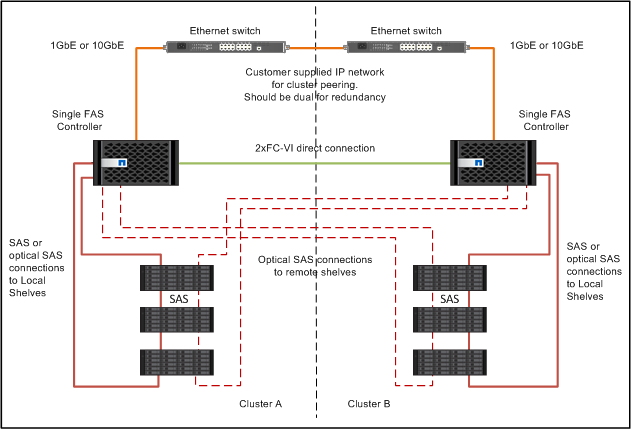

= 將控制器彼此連接、並連接至儲存櫃
:allow-uri-read: 
:icons: font
:imagesdir: ../media/

[role="lead"]
控制器FC-VI介面卡必須直接連接至彼此。控制器SAS連接埠必須連接至遠端和本機儲存堆疊。

這項工作必須在MetroCluster 兩個地方執行。

.步驟
. 連接FC-VI連接埠。
+
image::../media/mcc_cabling_fc_vi_controller_to_partner.gif[MCC將光纖通道VI控制器連接至合作夥伴]

+
上圖為典型的代表性纜線連線。特定的FC-VI連接埠會因控制器模組而異。

+
** FAS8200和AFF FASA300控制器模組可透過以下兩種選項之一來訂購：FC-VI連線能力：
+
*** 內建連接埠0e和0f是以FC-VI模式設定。
*** FC-VI卡上的連接埠1a和1b會插入插槽1。

** 例如、EFCA700和FAS9000儲存系統控制器模組各使用四個FC-VI連接埠。AFF
** 呢？A400和FAS8300儲存系統控制器模組使用FC-VI連接埠2a和2b。AFF

. 連接SAS連接埠。
+
下圖顯示連線。視控制器模組上可用的SAS和FC-VI連接埠而定、您的連接埠使用量可能會有所不同。

+

