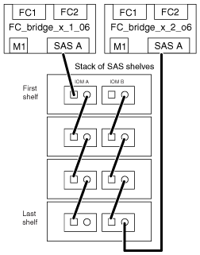

= 使用IOM6或IOM3模組、將連接至磁碟櫃的FibreBridge 6500N橋接器進行纜線連接
:allow-uri-read: 
:icons: font
:imagesdir: ../media/

[role="lead"]
設定橋接器之後、您可以開始為新系統佈線。FibreBridge 6500N橋接器使用QSFP連接器。

請先開機並等待至少10秒鐘、再連接連接埠。SAS纜線連接器採用鎖定式設計；若方向正確放入SAS連接埠、連接器會卡入定位、而磁碟櫃SAS連接埠LNK LED會亮起綠色。對於磁碟櫃、請插入SAS纜線連接器、拉片朝下（位於連接器底部）。

由於採用IOM12模組的磁碟機櫃不支援使用該磁碟櫃、因此請勿使用FIBRIBridge 6500N橋接器。

.步驟
. 以菊環鏈方式將每個堆疊中的磁碟櫃串連在一起。
+
如需菊環鏈式磁碟櫃的相關資訊、請參閱磁碟櫃模型的_安裝與服務指南_。

. 對於每個磁碟櫃堆疊、將IOM連接至第一個磁碟櫃的方形連接埠、連接至光纖橋接器A的SAS連接埠A
. 對於每個磁碟櫃堆疊、將最後一個磁碟櫃的IOM B圓形連接埠纜線連接至光纖橋接器B的SAS連接埠A
+
每個橋接器都有一條路徑可通往其磁碟櫃堆疊。橋接器A會透過第一個機櫃連接至堆疊的A側、而橋接器B會透過最後一個機櫃連接至堆疊的B側。

+

NOTE: SAS連接埠B橋接器已停用。

+
下圖顯示一組連接至四個磁碟櫃堆疊的橋接器：

+

