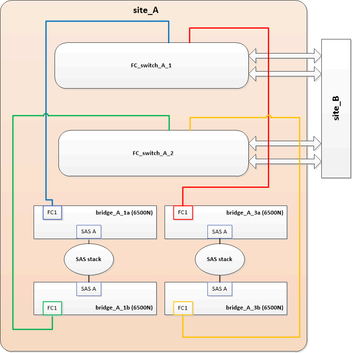
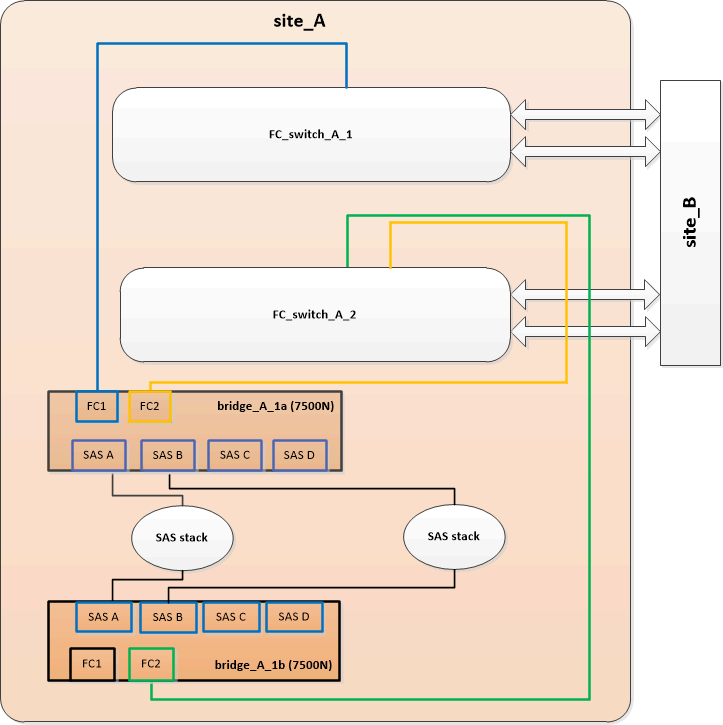

= 以7600N或7500N橋接器取代一對FibreBridge 6500N橋接器
:allow-uri-read: 
:icons: font
:imagesdir: ../media/

[role="lead"]
若要善用光纖橋接器7600N或7500N橋接器上的額外FC2連接埠、並降低機架使用率、您可以不中斷地更換6500N橋接器、並在單一一連接埠的一對光纖橋接器7600N或7500N橋接器之後、合併最多四個儲存堆疊。

.開始之前
您需要管理員密碼、才能存取FTP或scp伺服器。

.關於這項工作
在下列情況下、您應該使用此程序：

* 您將一對採用FibreBridge 7600N或7500N橋接器的FibreBridge 6500N橋接器替換成一對。
+
更換後、配對中的兩個橋接器必須是相同的機型。

* 您先前以7600N或7500N橋接器取代單一的FibreBridge 6500N橋接器、現在正在取代配對中的第二個橋接器。
* 您有一對採用可用SAS連接埠的FIBreBridge 7600N或7500N橋接器、而且您正在整合目前使用FIBreBridge 6500N橋接器連接的SAS儲存堆疊。

此程序不中斷營運、約需兩小時完成。

.相關資訊
link:task_replace_a_sle_fc_to_sas_bridge.html["更換單一FC對SAS橋接器"]

== 驗證儲存設備連線能力

在更換橋接器之前、您應該先確認橋接器和儲存設備的連線能力。熟悉命令輸出之後、即可在進行組態變更後、確認連線能力。

您可以在MetroCluster 進行維護的站台上、從執行此功能的任何一個控制器模組的管理提示字元發出這些命令。

. 在MetroCluster 任一個介紹節點上輸入下列命令、以確認與磁碟的連線：
+
執行本機sysconfig -v

+
輸出顯示連接至控制器上啟動器連接埠的磁碟、並識別連接至FC對SAS橋接器的磁碟櫃：

+
[listing]
----

node_A_1> run local sysconfig -v
NetApp Release 9.3.2X18: Sun Dec 13 01:23:24 PST 2017
System ID: 4068741258 (node_A_1); partner ID: 4068741260 (node_B_1)
System Serial Number: 940001025471 (node_A_1)
System Rev: 70
System Storage Configuration: Multi-Path HA**<=== Configuration should be multi-path HA**
.
.
.
slot 0: FC Host Adapter 0g (QLogic 8324 rev. 2, N-port, <UP>)**<=== Initiator port**
		Firmware rev:      7.5.0
		Flash rev:         0.0.0
		Host Port Id:      0x60130
		FC Node Name:      5:00a:098201:bae312
		FC Port Name:      5:00a:098201:bae312
		SFP Vendor:        UTILITIES CORP.
		SFP Part Number:   FTLF8529P3BCVAN1
		SFP Serial Number: URQ0Q9R
		SFP Capabilities:  4, 8 or 16 Gbit
		Link Data Rate:    16 Gbit
		Switch Port:       brcd6505-fcs40:1
  **<List of disks visible to port\>**
		 ID     Vendor   Model            FW    Size
		brcd6505-fcs29:12.126L1527     : NETAPP   X302_HJUPI01TSSM NA04 847.5GB (1953525168 512B/sect)
		brcd6505-fcs29:12.126L1528     : NETAPP   X302_HJUPI01TSSA NA02 847.5GB (1953525168 512B/sect)
		.
		.
		.
		**<List of FC-to-SAS bridges visible to port\>**
		FC-to-SAS Bridge:
		brcd6505-fcs40:12.126L0        : ATTO     FibreBridge6500N 1.61  FB6500N102980
		brcd6505-fcs42:13.126L0        : ATTO     FibreBridge6500N 1.61  FB6500N102980
		brcd6505-fcs42:6.126L0         : ATTO     FibreBridge6500N 1.61  FB6500N101167
		brcd6505-fcs42:7.126L0         : ATTO     FibreBridge6500N 1.61  FB6500N102974
		.
		.
		.
  **<List of storage shelves visible to port\>**
		brcd6505-fcs40:12.shelf6: DS4243  Firmware rev. IOM3 A: 0200  IOM3 B: 0200
		brcd6505-fcs40:12.shelf8: DS4243  Firmware rev. IOM3 A: 0200  IOM3 B: 0200
		.
		.
		.
----

== 熱交換的FibreBridge 6500N橋接器、以建立一對FIBreBridge 7600N或7500N橋接器

若要熱交換一或兩個FibreBridge 6500N橋接器、以建立一對採用一對FibreBridge 7600N或7500N橋接器的組態、您必須一次更換一個橋接器、並遵循正確的佈線程序。新的纜線與原始纜線不同。

.關於這項工作
如果符合下列條件、您也可以使用此程序：

* 您要更換一對連接至同一堆疊SAS儲存設備的FIBreBridge 6500N橋接器。
* 您先前已在配對中更換一台FibreBridge 6500N橋接器、而您的儲存堆疊則設定為使用一個FIBreBridge 6500N橋接器和一個FIBreBridge 7600N或7500N橋接器。
+
在這種情況下、您應該從以下步驟開始、將底部的 FiberBridge 6500N 橋接器熱交換至 FiberBridge 7600N 或 7500N 橋接器。

下圖顯示初始組態的範例、其中四個連接兩個SAS儲存堆疊的FIBEBridge 6500N橋接器：

.步驟
. 依照下列準則、使用中的程序、將頂部的 FiberBridge 6500N 橋接器與 FiberBridge 7600N 或 7500N 橋接器熱交換 link:task_replace_a_sle_fc_to_sas_bridge.html#hot_swap_6500n["使用光纖橋接器7600N或7500N橋接器熱交換光纖橋接器6500N"]：
+
** 將光纖橋接器7600N或7500N橋接器FC1連接埠連接至交換器或控制器。
+
這是與連接到FIBiBridge 6500N橋接器FC1連接埠相同的連線。

** 此時請勿連接FibreBridge 7600N或7500N橋接FC2連接埠。下圖顯示已更換bridge _a_1a、現在是一座FibreBridge 7600N或7500N橋接器：

+
image::../media/consolidating_stacks_1st_7500n_in_place.gif[使用第一台 FibreBridge 7500N 整合堆疊]

. 確認連線至橋接連接的磁碟、並在組態中看到新的FibreBridge 7500N：
+
執行本機sysconfig -v

+
[listing]
----

node_A_1> run local sysconfig -v
NetApp Release 9.3.2X18: Sun Dec 13 01:23:24 PST 2015
System ID: 0536872165 (node_A_1); partner ID: 0536872141 (node_B_1)
System Serial Number: 940001025465 (node_A_1)
System Rev: 70
System Storage Configuration: Multi-Path HA**<=== Configuration should be multi-path HA**
.
.
.
slot 0: FC Host Adapter 0g (QLogic 8324 rev. 2, N-port, <UP>)**<=== Initiator port**
		Firmware rev:      7.5.0
		Flash rev:         0.0.0
		Host Port Id:      0x60100
		FC Node Name:      5:00a:098201:bae312
		FC Port Name:      5:00a:098201:bae312
		SFP Vendor:        FINISAR CORP.
		SFP Part Number:   FTLF8529P3BCVAN1
		SFP Serial Number: URQ0R1R
		SFP Capabilities:  4, 8 or 16 Gbit
		Link Data Rate:    16 Gbit
		Switch Port:       brcd6505-fcs40:1
  **<List of disks visible to port\>**
		 ID     Vendor   Model            FW    Size
		brcd6505-fcs40:12.126L1527     : NETAPP   X302_HJUPI01TSSM NA04 847.5GB (1953525168 512B/sect)
		brcd6505-fcs40:12.126L1528     : NETAPP   X302_HJUPI01TSSA NA02 847.5GB (1953525168 512B/sect)
		.
		.
		.
		**<List of FC-to-SAS bridges visible to port\>**
		FC-to-SAS Bridge:
		brcd6505-fcs40:12.126L0        : ATTO     FibreBridge7500N A30H  FB7500N100104**<===**
		brcd6505-fcs42:13.126L0        : ATTO     FibreBridge6500N 1.61  FB6500N102980
		brcd6505-fcs42:6.126L0         : ATTO     FibreBridge6500N 1.61  FB6500N101167
		brcd6505-fcs42:7.126L0         : ATTO     FibreBridge6500N 1.61  FB6500N102974
		.
		.
		.
  **<List of storage shelves visible to port\>**
		brcd6505-fcs40:12.shelf6: DS4243  Firmware rev. IOM3 A: 0200  IOM3 B: 0200
		brcd6505-fcs40:12.shelf8: DS4243  Firmware rev. IOM3 A: 0200  IOM3 B: 0200
		.
		.
		.
----
. 依照下列準則、使用中的程序、將底部的 FiberBridge 6500N 橋接器與 FiberBridge 7600N 或 7500N 橋接器熱交換 link:task_replace_a_sle_fc_to_sas_bridge.html#hot_swap_6500n["使用光纖橋接器7600N或7500N橋接器熱交換光纖橋接器6500N"]：
+
** 將光纖橋接器7600N或7500N橋接器FC2連接埠連接至交換器或控制器。
+
這是與連接到FIBiBridge 6500N橋接器FC1連接埠相同的連線。

** 此時請勿連接 FibreBridge 7600N 或 7500N 橋接器 FC1 連接埠。image:../media/consolidating_stacks_2nd_7500n_in_place.gif["使用第二台 FibreBridge 7500N 整合堆疊"]

. 確認與橋接式連線磁碟的連線：
+
執行本機sysconfig -v

+
輸出顯示連接至控制器上啟動器連接埠的磁碟、並識別連接至FC對SAS橋接器的磁碟櫃：

+
[listing]
----

node_A_1> run local sysconfig -v
NetApp Release 9.3.2X18: Sun Dec 13 01:23:24 PST 2015
System ID: 0536872165 (node_A_1); partner ID: 0536872141 (node_B_1)
System Serial Number: 940001025465 (node_A_1)
System Rev: 70
System Storage Configuration: Multi-Path HA**<=== Configuration should be multi-path HA**
.
.
.
slot 0: FC Host Adapter 0g (QLogic 8324 rev. 2, N-port, <UP>)**<=== Initiator port**
		Firmware rev:      7.5.0
		Flash rev:         0.0.0
		Host Port Id:      0x60100
		FC Node Name:      5:00a:098201:bae312
		FC Port Name:      5:00a:098201:bae312
		SFP Vendor:        FINISAR CORP.
		SFP Part Number:   FTLF8529P3BCVAN1
		SFP Serial Number: URQ0R1R
		SFP Capabilities:  4, 8 or 16 Gbit
		Link Data Rate:    16 Gbit
		Switch Port:       brcd6505-fcs40:1
  **<List of disks visible to port\>**
		 ID     Vendor   Model            FW    Size
		brcd6505-fcs40:12.126L1527     : NETAPP   X302_HJUPI01TSSM NA04 847.5GB (1953525168 512B/sect)
		brcd6505-fcs40:12.126L1528     : NETAPP   X302_HJUPI01TSSA NA02 847.5GB (1953525168 512B/sect)
		.
		.
		.
		**<List of FC-to-SAS bridges visible to port\>**
		FC-to-SAS Bridge:
		brcd6505-fcs40:12.126L0        : ATTO     FibreBridge7500N A30H  FB7500N100104
		brcd6505-fcs42:13.126L0        : ATTO     FibreBridge7500N A30H  FB7500N100104
		.
		.
		.
  **<List of storage shelves visible to port\>**
		brcd6505-fcs40:12.shelf6: DS4243  Firmware rev. IOM3 A: 0200  IOM3 B: 0200
		brcd6505-fcs40:12.shelf8: DS4243  Firmware rev. IOM3 A: 0200  IOM3 B: 0200
		.
		.
		.
----

== 將儲存設備整合到FIBreBridge 7600N或7500N橋接器之後時、連接橋接SAS連接埠

將多個SAS儲存堆疊整合到一對採用可用SAS連接埠的光纖橋接器7600N或7500N橋接器之後時、您必須將上方和下方SAS纜線移到新的橋接器。

.關於這項工作
FibreBridge 6500N橋接SAS連接埠使用QSFP連接器。FibreBridge 7600N或7500N橋接SAS連接埠使用Mini-SAS連接器。

IMPORTANT: 如果您將SAS纜線插入錯誤的連接埠、從SAS連接埠拔下纜線時、必須等待至少120秒、才能將纜線插入其他SAS連接埠。如果您無法這麼做、系統將無法辨識纜線是否已移至其他連接埠。

NOTE: 連接連接埠之前、請至少等待10秒鐘。SAS纜線連接器採用鎖定式設計；若方向正確放入SAS連接埠、連接器會卡入定位、而磁碟櫃SAS連接埠LNK LED會亮起綠色。若為磁碟櫃、請插入SAS纜線連接器、拉片朝下（位於連接器底部）。

.步驟
. 拔下連接SAS A連接埠的纜線、將頂端的FibreBridge 6500N橋接器連接至頂端的SAS機櫃、請務必記下其所連接儲存櫃上的SAS連接埠。
+
下列範例以藍色顯示纜線：

+
image::../media/consolidating_stacks_sas_top_before.gif[在佈線到 FibreBridge 7500N 之前整合 SAS 堆疊]

. 使用含迷你SAS接頭的纜線、將儲存櫃上的相同SAS連接埠連接至頂端的FibreBridge 7600N或7500N橋接器的SAS B連接埠。
+
下列範例以藍色顯示纜線：

+
image::../media/consolidating_stacks_sas_top_after.gif[整合後的 SAS 頂部佈線]

. 拔下連接底部FibreBridge 6500N橋接器SAS A連接埠至頂端SAS機櫃的纜線、請務必記下其所連接儲存櫃上的SAS連接埠。
+
此纜線以綠色顯示於下列範例中：

+
image::../media/consolidating_stacks_sas_bottom_before.gif[整合到底層機架之前的綠色 SAS 佈線]

. 使用含迷你SAS接頭的纜線、將儲存櫃上的相同SAS連接埠連接至底部的FibreBridge 7600N或7500N橋接器的SAS B連接埠。
+
此纜線以綠色顯示於下列範例中：

+
image::../media/consolidating_stacks_sas_bottom_after.gif[整合後的 SAS 底部佈線]

. 確認與橋接式連線磁碟的連線：
+
執行本機sysconfig -v

+
輸出顯示連接至控制器上啟動器連接埠的磁碟、並識別連接至FC對SAS橋接器的磁碟櫃：

+
[listing]
----

node_A_1> run local sysconfig -v
NetApp Release 9.3.2X18: Sun Dec 13 01:23:24 PST 2015
System ID: 0536872165 (node_A_1); partner ID: 0536872141 (node_B_1)
System Serial Number: 940001025465 (node_A_1)
System Rev: 70
System Storage Configuration: Multi-Path HA**<=== Configuration should be multi-path HA**
.
.
.
slot 0: FC Host Adapter 0g (QLogic 8324 rev. 2, N-port, <UP>)**<=== Initiator port**
		Firmware rev:      7.5.0
		Flash rev:         0.0.0
		Host Port Id:      0x60100
		FC Node Name:      5:00a:098201:bae312
		FC Port Name:      5:00a:098201:bae312
		SFP Vendor:        FINISAR CORP.
		SFP Part Number:   FTLF8529P3BCVAN1
		SFP Serial Number: URQ0R1R
		SFP Capabilities:  4, 8 or 16 Gbit
		Link Data Rate:    16 Gbit
		Switch Port:       brcd6505-fcs40:1
  **<List of disks visible to port\>**
		 ID     Vendor   Model            FW    Size
		brcd6505-fcs40:12.126L1527     : NETAPP   X302_HJUPI01TSSM NA04 847.5GB (1953525168 512B/sect)
		brcd6505-fcs40:12.126L1528     : NETAPP   X302_HJUPI01TSSA NA02 847.5GB (1953525168 512B/sect)
		.
		.
		.
		**<List of FC-to-SAS bridges visible to port\>**
		FC-to-SAS Bridge:
		brcd6505-fcs40:12.126L0        : ATTO     FibreBridge7500N A30H  FB7500N100104
		brcd6505-fcs42:13.126L0        : ATTO     FibreBridge7500N A30H  FB7500N100104
		.
		.
		.
  **<List of storage shelves visible to port\>**
		brcd6505-fcs40:12.shelf6: DS4243  Firmware rev. IOM3 A: 0200  IOM3 B: 0200
		brcd6505-fcs40:12.shelf8: DS4243  Firmware rev. IOM3 A: 0200  IOM3 B: 0200
		.
		.
		.
----
. 移除不再連接至SAS儲存設備的舊型光纖橋接器6500N。
. 等待兩分鐘、讓系統辨識變更。
. 如果系統纜線不正確、請拔下纜線、修正纜線、然後重新連接正確的纜線。
. 如有必要、請重複上述步驟、使用SAS連接埠C、然後使用D、將新的FIBREBridge 7600N或7500N橋接器後面最多移到兩個額外的SAS堆疊
+
每個SAS堆疊都必須連接至頂端和底部橋接器上的相同SAS連接埠。例如、如果堆疊的頂端連線連接至頂端橋接SAS B連接埠、則底部連線必須連接至底部橋接器的SAS B連接埠。

+
image::../media/consolidation_sas_bottom_connection_4_stacks.gif[四個堆疊的 SAS 底部佈線]

== 將FIBIBreBridge 7600N或7500N橋接器新增至組態時、請更新分區

當您將Fibre Bridge 6500N橋接器更換為Fibre Bridge 7600N或7500N橋接器、並使用Fibre Bridge 7600N或7500N橋接器上的兩個FC連接埠時、必須變更分區。所需的變更取決ONTAP 於您執行的是9.1或9.1或更新版本的版本。

=== 將FIBLIBUBridge 7500N橋接器新增至組態時更新分區（ONTAP 不含於F19.1之前）

當您將Fibre Bridge 6500N橋接器更換為Fibre Bridge 7500N橋接器、並使用Fibre Bridge 7500N橋接器上的兩個FC連接埠時、必須變更分區。每個區域最多可有四個啟動器連接埠。您使用的分區取決於您執行ONTAP 的是9.1版或9.1版或更新版本之前的版本

.關於這項工作
本工作中的特定分區適用於ONTAP 9.1版之前的版本的版本。

分區變更是為了避免ONTAP 使用不必要的問題、因為不超過四個FC啟動器連接埠可以有通往磁碟的路徑。在重新配置以整合磁碟櫃之後、現有的分區會使八個FC連接埠可連線至每個磁碟。您必須變更分區、將每個區域中的啟動器連接埠減少為四個。

下圖顯示站台A上變更前的分區：

image::../media/zoning_consolidation_site_a_before.gif[FibreBridge 變更先前站點 A 的分區合併]

.步驟
. 從每個現有區域移除一半啟動器連接埠、並為Fibre Bridge 7500N FC2連接埠建立新的區域、藉此更新FC交換器的儲存區域。
+
新FC2連接埠的區域將包含從現有區域移除的啟動器連接埠。在圖中、這些區域會以虛線顯示。

+
如需分區命令的詳細資訊、請參閱的FC交換器區段 link:../install-fc/index.html["Fabric附加MetroCluster 的安裝與組態"] 或 link:../install-stretch/concept_considerations_differences.html["延伸MetroCluster 安裝與組態"]。

+
下列範例顯示整合前後各區域的儲存區域和連接埠。連接埠由_DOMAIN_port_配對來識別。

+
** 網域5包含交換器FC_switch_a_1。
** 網域6包含交換器FC_switch_a_2。
** 網域7由交換器FC_switch_B_1組成。
** 網域8由交換器FC_SWIT_B_2組成。

|===

| 整合之前或之後 | 區域 | 網域與連接埠 | 圖表中的色彩（圖表僅顯示站台A） 

 a| 
整合前的區域。四個Fibre Bridge 6500N橋接器上的每個FC連接埠都有一個區域。
 a| 
Stor_a_1a-FC1
 a| 
5、1、5、2、5、4、5、7、1； 7、2；7、4；7、5；5、6
 a| 
紫色+藍色虛線+藍色

 a| 
Stor_a_1b-FC1
 a| 
6、1、6、2、6、4、6、5、8、1； 8、2、8、4、8、5、6、6
 a| 
褐色+虛線褐色+綠色

 a| 
STOR_A_2a-FC1
 a| 
5、1、5、2、5、4、5、7、1； 7、2、7、4、7、5、5
 a| 
紫色+虛線紫色+紅色

 a| 
Stor_a_2b-FC1
 a| 
6、1、6、2、6、4、6、5、8、1； 8、2、8、4、8、5、6、7
 a| 
褐色+深褐色+橘黃色虛線

 a| 
整合後的區域。兩個Fibre Bridge 7500N橋接器上的每個FC連接埠都有一個區域。
 a| 
Stor_a_1a-FC1
 a| 
7、1、7、4、5、1、5、4、5、6
 a| 
紫色+藍色

 a| 
Stor_a_1b-FC1
 a| 
7、2；7、5；5、2；5、5；5、7
 a| 
呈紫色虛線+紅色

 a| 
Stor_a_1a-FC2
 a| 
8、1、8、4、6、1、6、4、6
 a| 
褐色+綠色

 a| 
STOR_A_1b-FC2
 a| 
8、2、8、5、6、2、6、5、6、7
 a| 
褐色虛線+橘色

|===
下圖顯示整合後站台A的分區：

image::../media/zoning_consolidation_site_a_after.gif[FibreBridge 變更後站點 A 的分區合併]

=== 將FIBLIBUBridge 7600N或7500N橋接器新增至組態時、更新分區（ONTAP 更新版本：

當您將Fibre Bridge 6500N橋接器更換為Fibre Bridge 7600N或7500N橋接器、並使用Fibre Bridge 7600N或7500N橋接器上的兩個FC連接埠時、必須變更分區。每個區域最多可有四個啟動器連接埠。

.關於這項工作
* 此工作適用於ONTAP 不含更新版本的版本。
* 支援FIBreBridge 7600N橋接器的ONTAP 版本可在支援方面的更新版本中獲得支援。
* 本工作中的特定分區適用於ONTAP 更新版本的版本。
* 分區變更是為了避免ONTAP 使用不必要的問題、因為不超過四個FC啟動器連接埠可以有通往磁碟的路徑。
+
在重新配置以整合磁碟櫃之後、現有的分區會使八個FC連接埠可連線至每個磁碟。您必須變更分區、將每個區域中的啟動器連接埠減少為四個。

.步驟
. 從每個現有區域移除一半啟動器連接埠、並為Fibre Bridge 7600N或7500N FC2連接埠建立新區域、藉此更新FC交換器的儲存區域。
+
新FC2連接埠的區域將包含從現有區域移除的啟動器連接埠。

+
請參閱的FC交換器一節 link:../install-fc/index.html["Fabric附加MetroCluster 的安裝與組態"] 以取得分區命令的詳細資訊。

== 將Fibre Bridge 7600N或7500N橋接器新增至組態時、將第二個橋接器FC連接埠的纜線連接

若要為儲存堆疊提供多個路徑、當您將光纖橋接器7600N或7500N橋接器新增至組態時、您可以將每個光纖橋接器上的第二個FC連接埠纜線。

.開始之前
分區必須經過調整、才能為第二個FC連接埠提供區域。

.步驟
. 將頂端橋接器的FC2連接埠纜線連接至FC_switch_a_2上的正確連接埠。
+

. 將底部橋接器的FC1連接埠纜線連接至FC_switch_a_1上的正確連接埠。
+
image::../media/consolidating_stacks_final.gif[最終堆疊整合佈線]

. 確認與橋接式連線磁碟的連線：
+
執行本機sysconfig -v

+
輸出顯示連接至控制器上啟動器連接埠的磁碟、並識別連接至FC對SAS橋接器的磁碟櫃：

+
[listing]
----

node_A_1> run local sysconfig -v
NetApp Release 9.3.2X18: Sun Dec 13 01:23:24 PST 2015
System ID: 0536872165 (node_A_1); partner ID: 0536872141 (node_B_1)
System Serial Number: 940001025465 (node_A_1)
System Rev: 70
System Storage Configuration: Multi-Path HA**<=== Configuration should be multi-path HA**
.
.
.
slot 0: FC Host Adapter 0g (QLogic 8324 rev. 2, N-port, <UP>)**<=== Initiator port**
		Firmware rev:      7.5.0
		Flash rev:         0.0.0
		Host Port Id:      0x60100
		FC Node Name:      5:00a:098201:bae312
		FC Port Name:      5:00a:098201:bae312
		SFP Vendor:        FINISAR CORP.
		SFP Part Number:   FTLF8529P3BCVAN1
		SFP Serial Number: URQ0R1R
		SFP Capabilities:  4, 8 or 16 Gbit
		Link Data Rate:    16 Gbit
		Switch Port:       brcd6505-fcs40:1
  **<List of disks visible to port\>**
		 ID     Vendor   Model            FW    Size
		brcd6505-fcs40:12.126L1527     : NETAPP   X302_HJUPI01TSSM NA04 847.5GB (1953525168 512B/sect)
		brcd6505-fcs40:12.126L1528     : NETAPP   X302_HJUPI01TSSA NA02 847.5GB (1953525168 512B/sect)
		.
		.
		.
		**<List of FC-to-SAS bridges visible to port\>**
		FC-to-SAS Bridge:
		brcd6505-fcs40:12.126L0        : ATTO     FibreBridge7500N A30H  FB7500N100104
		brcd6505-fcs42:13.126L0        : ATTO     FibreBridge7500N A30H  FB7500N100104
		.
		.
		.
  **<List of storage shelves visible to port\>**
		brcd6505-fcs40:12.shelf6: DS4243  Firmware rev. IOM3 A: 0200  IOM3 B: 0200
		brcd6505-fcs40:12.shelf8: DS4243  Firmware rev. IOM3 A: 0200  IOM3 B: 0200
		.
		.
		.
----

== 停用FC到SAS橋接器上未使用的SAS連接埠

變更橋接器的纜線之後、您應該停用FC至SAS橋接器上任何未使用的SAS連接埠、以避免健全狀況監視器發出與未使用連接埠相關的警示。

.步驟
. 停用頂端FC對SAS橋接器上未使用的SAS連接埠：
+
.. 登入橋接CLI。
.. 停用任何未使用的連接埠。
+
[NOTE]
====
如果您已設定Atto 7500N橋接器、則預設會啟用所有SAS連接埠（A到D）、而且您必須停用未使用的SAS連接埠：

"Asport"Disable _SAS port_"（停用_SAS連接埠_）

====
+
如果使用SAS連接埠A和B、則必須停用SAS連接埠C和D。在下列範例中、未使用的SAS連接埠C和D會停用：

+
[listing]
----
Ready. *
SASPortDisable C

SAS Port C has been disabled.

Ready. *
SASPortDisable D

SAS Port D has been disabled.

Ready. *
----
.. 儲存橋接器組態：+「Save Configuration」（儲存組態）
+
下列範例顯示SAS連接埠C和D已停用。請注意、星號不再出現、表示組態已儲存。

+
[listing]
----
Ready. *
SaveConfiguration

Ready.
----

. 在底部FC到SAS橋接器上重複上述步驟。

