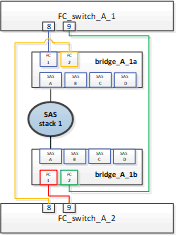

= 在以架構附加MetroCluster 的功能性的架構中、以不中斷營運的方式更換機櫃
:allow-uri-read: 
:icons: font
:imagesdir: ../media/

[role="lead"]
您可能需要知道如何在不中斷營運的情況下、以架構附加MetroCluster 的功能進行汰換。

NOTE: 此程序僅適用於以網路連接MetroCluster 的功能為基礎的功能。

== 停用對機櫃的存取

在更換機櫃模組之前、您必須先停用機櫃存取。

檢查組態的整體健全狀況。如果系統看起來不正常、請先解決問題再繼續。

.步驟
. 從兩個叢集、將所有磁碟離線至受影響的機櫃堆疊：
+
"aggr offline _plex名稱_"

+
範例顯示執行 ONTAP 之控制器的離線 Plex 命令。

+
[listing]
----

cluster_A_1::> storage aggregate plex offline -aggr aggrA_1_0 -plex plex0
cluster_A_1::> storage aggregate plex offline -aggr dataA_1_data -plex plex0
cluster_A_2::> storage aggregate plex offline -aggr aggrA_2_0 -plex plex0
cluster_A_2::> storage aggregate plex offline -aggr dataA_2_data -plex plex0
----
. 驗證叢體是否離線：
+
「aggr狀態：-aggr_name_」

+
範例顯示驗證執行cMode之控制器的Aggregate離線的命令。

+
[listing]
----

Cluster_A_1::> storage aggregate show -aggr aggrA_1_0
Cluster_A_1::> storage aggregate show -aggr dataA_1_data
Cluster_A_2::> storage aggregate show -aggr aggrA_2_0
Cluster_A_2::> storage aggregate show -aggr dataA_2_data
----
. 視連接目標機櫃的橋接器是連接單一SAS堆疊或兩個以上SAS堆疊而定、停用SAS連接埠或交換器連接埠：
+
** 如果橋接器連接單一SAS堆疊、請使用適當的命令來停用橋接器所連接的交換器連接埠。
+
下列範例顯示連接單一SAS堆疊的一對橋接器、其中包含目標機櫃：

+

+
每個交換器上的交換器連接埠8和9會將橋接器連接至網路。

+
以下範例顯示Brocade交換器上停用的連接埠8和9。

+
[listing]
----
FC_switch_A_1:admin> portDisable 8
FC_switch_A_1:admin> portDisable 9

FC_switch_A_2:admin> portDisable 8
FC_switch_A_2:admin> portDisable 9
----
+
以下範例顯示Cisco交換器上的連接埠8和9已停用。

+
[listing]
----
FC_switch_A_1# conf t
FC_switch_A_1(config)# int fc1/8
FC_switch_A_1(config)# shut
FC_switch_A_1(config)# int fc1/9
FC_switch_A_1(config)# shut
FC_switch_A_1(config)# end

FC_switch_A_2# conf t
FC_switch_A_2(config)# int fc1/8
FC_switch_A_2(config)# shut
FC_switch_A_2(config)# int fc1/9
FC_switch_A_2(config)# shut
FC_switch_A_2(config)# end
----
** 如果橋接器連接兩個或多個SAS堆疊、請停用連接橋接器與目標機櫃的SAS連接埠：+「ASportDisable _port number_」
+
下列範例顯示連接四個SAS堆疊的一對橋接器。SAS堆疊2包含目標機櫃：

+
image::../media/mcc_shelf_replacement_bridges_with_four_stacks.gif[含四個堆疊的MCC機櫃替換橋接器]

+
SAS連接埠B會將橋接器連接至目標機櫃。只要停用兩個磁碟櫃上的SAS連接埠B、其他SAS堆疊就能在更換程序期間繼續提供資料。

+
在此情況下、請停用SAS連接埠、將橋接器連接至目標機櫃：

+
「ASportDisable _port number_」

+
下列範例顯示SAS連接埠B已從橋接器停用、並驗證是否已停用。您必須在兩個橋接器上重複執行命令。

+
[listing]
----
Ready. *
SASPortDisable B

SAS Port B has been disabled.
----

. 如果您先前已停用交換器連接埠、請確認它們已停用：
+
《秀》

+
此範例顯示Brocade交換器上的交換器連接埠已停用。

+
[listing]
----

FC_switch_A_1:admin> switchShow
FC_switch_A_2:admin> switchShow
----
+
此範例顯示Cisco交換器上的交換器連接埠已停用。

+
[listing]
----

FC_switch_A_1# show interface fc1/6
FC_switch_A_2# show interface fc1/6
----
. 等待ONTAP 看到磁碟遺失。
. 關閉您要更換的機櫃。

== 更換機櫃

在插入新的機櫃和機櫃模組並進行纜線連接之前、您必須實際移除所有纜線和機櫃。

.步驟
. 移除所有磁碟、並從要更換的磁碟櫃拔下所有纜線。
. 移除機櫃模組。
. 插入新的機櫃。
. 將新磁碟插入新磁碟櫃。
. 插入機櫃模組。
. 將機櫃（SAS或Power）連接至纜線。
. 開啟機櫃電源。

== 重新啟用存取並驗證作業

更換機櫃之後、您需要重新啟用存取功能、並確認新機櫃是否正常運作。

.步驟
. 確認磁碟櫃的電源正常、而且IOM模組上的連結存在。
. 根據下列情況啟用交換器連接埠或SAS連接埠：
+
[cols="1,3"]
|===

| 選項 | 步驟 

 a| 
*如果您先前已停用交換器連接埠*
 a| 
.. 啟用交換器連接埠：
+
「portEnable _port number_」

+
範例顯示在Brocade交換器上啟用交換器連接埠。

+
[listing]
----

Switch_A_1:admin> portEnable 6
Switch_A_2:admin> portEnable 6
----
+
範例顯示Cisco交換器上正在啟用的交換器連接埠。

+
[listing]
----

Switch_A_1# conf t
Switch_A_1(config)# int fc1/6
Switch_A_1(config)# no shut
Switch_A_1(config)# end

Switch_A_2# conf t
Switch_A_2(config)# int fc1/6
Switch_A_2(config)# no shut
Switch_A_2(config)# end
----

 a| 
*如果您先前已停用SAS連接埠*
 a| 
.. 啟用SAS連接埠、將堆疊連接至機櫃位置：
+
「ASportEnable _port number_」

+
範例顯示正在從橋接器啟用SAS連接埠A、並驗證是否已啟用。

+
[listing]
----
Ready. *
SASPortEnable A

SAS Port A has been enabled.
----

|===
. 如果您先前已停用交換器連接埠、請確認這些連接埠已啟用且已上線、而且所有裝置都已正確登入：
+
《秀》

+
此範例顯示「交換顯示」命令、用於驗證Brocade交換器是否在線上。

+
[listing]
----

Switch_A_1:admin> SwitchShow
Switch_A_2:admin> SwitchShow
----
+
此範例顯示「交換器顯示」命令、用於驗證Cisco交換器是否在線上。

+
[listing]
----

Switch_A_1# show interface fc1/6
Switch_A_2# show interface fc1/6
----
+

NOTE: 幾分鐘後ONTAP 、即可偵測到已插入新磁碟、並針對每個新磁碟顯示訊息。

. 驗證ONTAP 下列項目是否已偵測到磁碟：
+
「syssconfig -A」

. 線上先前離線的叢體：
+
"aggr online？_plex名稱_'

+
範例顯示將plexes放置在執行cMode的控制器上的命令。

+
[listing]
----

Cluster_A_1::> storage aggregate plex online -aggr aggr1 -plex plex2
Cluster_A_1::> storage aggregate plex online -aggr aggr2 -plex plex6
Cluster_A_1::> storage aggregate plex online -aggr aggr3 -plex plex1
----
+
系統會開始重新同步。

+

NOTE: 您可以使用「aggr STATUS _-agger_name_」命令來監控重新同步的進度。

