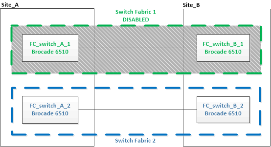

= 升級至新的Brocade FC交換器
:allow-uri-read: 
:icons: font
:imagesdir: ../media/

[role="lead"]
如果您要升級至新的Brocade FC交換器、則必須更換第一個Fabric中的交換器、確認MetroCluster 該交換器組態可完全正常運作、然後更換第二個Fabric中的交換器。

* 此功能組態必須健全且正常運作。MetroCluster
* 這個交換器架構由四個Brocade交換器組成。MetroCluster
+
下列步驟中的圖例顯示目前的交換器。

* 交換器必須執行最新支援的韌體。
+
https://mysupport.netapp.com/matrix["NetApp 互通性對照表工具"^]

* 此程序不中斷營運、約需兩小時完成。
* 您需要管理員密碼、才能存取FTP或scp伺服器。

交換器架構一次升級一個。

在本程序結束時、所有四個交換器都會升級為新的交換器。

image::../media/brocade_upgr_to_g620_replacement_completed.gif[Brocade升級至g620更換完成]

.步驟
. 停用第一個交換器架構：
+
h.*FC_switch_a_1:admin> switchCfgPersistentDisable*

+
[listing]
----
FC_switch_A_1:admin> switchCfgPersistentDisable
----
+

. 更換MetroCluster 同一個站台上的舊交換器。
+
.. 拔下並移除停用的交換器。
.. 在機架中安裝新的交換器。
+
image::../media/brocade_upgr_to_g620_replaced_a_1.gif[Brocade升級至g620取代1]

.. 停用新交換器：
+
「witchCfgPeristentDisable」

+
命令會停用交換器架構中的兩個交換器。

+
[listing]
----
FC_switch_A_1:admin> switchCfgPersistentDisable
----
.. 使用建議的連接埠指派來連接新交換器。
+
link:concept_port_assignments_for_fc_switches_when_using_ontap_9_1_and_later.html["FC交換器的連接埠指派（使用ONTAP 版本不含更新版本）"]

.. 在合作夥伴MetroCluster 的支援網站重複這些子步驟、以更換第一個交換器架構中的第二個交換器。
+
已更換Fabric 1中的兩個交換器。

+
image::../media/brocade_upgr_to_g620_replaced_b_1.gif[Brocade升級至g620取代b 1]

. 開啟新交換器的電源、讓它們開機。
. 下載新交換器的RCF檔案。
. 依照下載頁面上的指示、將RCF檔案套用至Fabric中的兩個新交換器。
. 儲存交換器組態：
+
「cfgSave」

. 等待10分鐘、讓組態穩定下來。
. 在MetroCluster 任一個介紹節點上輸入下列命令、以確認與磁碟的連線：
+
執行本機sysconfig -v

+
輸出顯示連接至控制器上啟動器連接埠的磁碟、並識別連接至FC對SAS橋接器的磁碟櫃：

+
[listing]
----

node_A_1> run local sysconfig -v
NetApp Release 9.3.2X18: Sun Dec 13 01:23:24 PST 2017
System ID: 4068741258 (node_A_1); partner ID: 4068741260 (node_B_1)
System Serial Number: 940001025471 (node_A_1)
System Rev: 70
System Storage Configuration: Multi-Path HA**<=== Configuration should be multi-path HA**
.
.
.
slot 0: FC Host Adapter 0g (QLogic 8324 rev. 2, N-port, <UP>)**<=== Initiator port**
		Firmware rev:      7.5.0
		Flash rev:         0.0.0
		Host Port Id:      0x60130
		FC Node Name:      5:00a:098201:bae312
		FC Port Name:      5:00a:098201:bae312
		SFP Vendor:        UTILITIES CORP.
		SFP Part Number:   FTLF8529P3BCVAN1
		SFP Serial Number: URQ0Q9R
		SFP Capabilities:  4, 8 or 16 Gbit
		Link Data Rate:    16 Gbit
		Switch Port:       brcd6505-fcs40:1
  **<List of disks visible to port\>**
		 ID     Vendor   Model            FW    Size
		brcd6505-fcs29:12.126L1527     : NETAPP   X302_HJUPI01TSSM NA04 847.5GB (1953525168 512B/sect)
		brcd6505-fcs29:12.126L1528     : NETAPP   X302_HJUPI01TSSA NA02 847.5GB (1953525168 512B/sect)
		.
		.
		.
		**<List of FC-to-SAS bridges visible to port\>**
		FC-to-SAS Bridge:
		brcd6505-fcs40:12.126L0        : ATTO     FibreBridge6500N 1.61  FB6500N102980
		brcd6505-fcs42:13.126L0        : ATTO     FibreBridge6500N 1.61  FB6500N102980
		brcd6505-fcs42:6.126L0         : ATTO     FibreBridge6500N 1.61  FB6500N101167
		brcd6505-fcs42:7.126L0         : ATTO     FibreBridge6500N 1.61  FB6500N102974
		.
		.
		.
  **<List of storage shelves visible to port\>**
		brcd6505-fcs40:12.shelf6: DS4243  Firmware rev. IOM3 A: 0200  IOM3 B: 0200
		brcd6505-fcs40:12.shelf8: DS4243  Firmware rev. IOM3 A: 0200  IOM3 B: 0200
		.
		.
		.
----
. 返回交換器提示、確認交換器韌體版本：
+
《Firmwarreshow》

+
交換器必須執行最新支援的韌體。

+
https://mysupport.netapp.com/matrix["NetApp 互通性對照表工具"]

. 模擬切換作業：
+
.. 在任何節點的提示下、變更為進階權限等級：+「權限進階」
+
當系統提示您繼續進入進階模式、並看到進階模式提示（*>）時、您需要使用「y」回應。

.. 使用「-Simulate（模擬）”參數執行切換作業：
+
《不一樣的切換-模擬》MetroCluster

.. 返回管理權限層級：
+
「et -priv. admin」

. 在第二個交換器架構上重複上述步驟。

重複上述步驟之後、所有四個交換器都已升級、MetroCluster 而且此功能可正常運作。

image::../media/brocade_upgr_to_g620_replacement_completed.gif[Brocade升級至g620更換完成]
