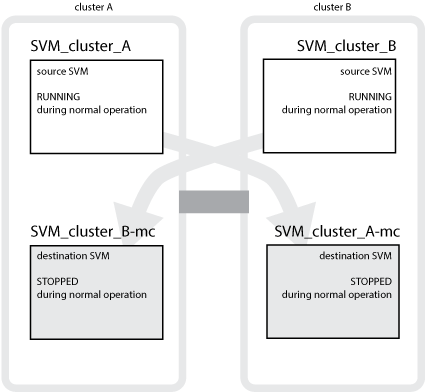
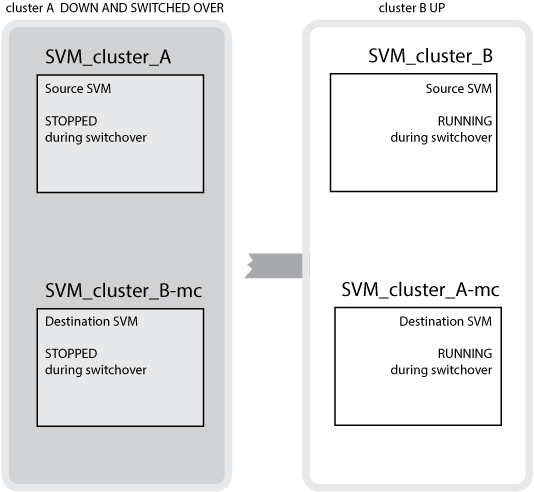
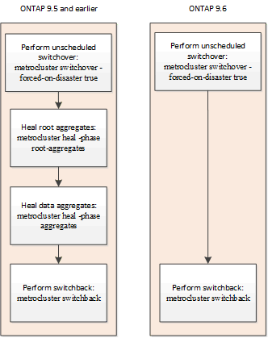

= 瞭MetroCluster 解資料保護與災難恢復
:allow-uri-read: 
:icons: font
:imagesdir: ../media/

[role="lead"]
瞭解MetroCluster NetApp如何保護資料、並提供透明的故障恢復功能、讓您輕鬆且有效率地管理切換和切換活動、這點很有幫助。

使用鏡射來保護叢集中的資料。MetroCluster它透過單MetroCluster 一的支援功能來提供災難恢復功能、可在倖存者站台上啟動次要功能、以提供原本由受災難影響的主要站台所擁有的鏡射資料。

== 八節點和四節點MetroCluster 的不完整組態如何提供本機容錯移轉和切換功能

八節點和四節點MetroCluster 的支援能力可同時保護本機層級和叢集層級的資料。如果您要設定MetroCluster 一個不完整的組態、您必須知道MetroCluster 哪些是使用各種組態來保護資料。

透過使用兩個實體分隔的鏡射叢集來保護資料。MetroCluster每個叢集都會同步鏡射另一個叢集的資料與儲存虛擬機器（SVM）組態。當某個站台發生災難時、系統管理員可以啟動鏡射SVM、並開始從存續站台提供鏡射資料。此外、每個叢集中的節點都設定為HA配對、提供本機容錯移轉的層級。

=== 本機HA資料保護如何在MetroCluster 一個不一樣的組態中運作

您需要瞭解HA配對如何在MetroCluster 功能不清的組態中運作。

連接網路中的兩個叢集提供雙向災難恢復、其中每個叢集都可以是另一個叢集的來源和備份。每個叢集都包含兩個節點、這些節點是設定為HA配對。如果單一節點組態發生故障或需要維護、儲存容錯移轉可將該節點的作業傳輸至其本機HA合作夥伴。

下圖顯示MetroCluster 了一個不實的FC組態。除了MetroCluster 叢集交換器提供HA互連之外、HA功能在靜態IP組態中是相同的。

image::../media/mcc_hw_architecture_local_ha.gif[MCC HW架構本機Ha]

.相關資訊
https://docs.netapp.com/ontap-9/topic/com.netapp.doc.dot-cm-hacg/home.html["高可用度組態"^]

== 如何利用此功能進行資料與組態複寫MetroCluster

透過各種功能、可在兩個景點之間同步複寫資料和組態。MetroCluster ONTAP MetroCluster

=== 組態複寫服務的組態保護

透過自動將資訊複寫到DR合作夥伴、此功能可保護不經更新的功能。ONTAP MetroCluster

CRS會將本機節點組態同步複寫至合作夥伴叢集的DR合作夥伴。此複寫作業是透過叢集對等網路進行。

複寫的資訊包括叢集組態和SVM組態。

=== 在執行SVM MetroCluster 的過程中複寫SVM

支援SVM的支援區塊組態複寫服務（CRS）可提供備援資料伺服器組態、以及資料磁碟區鏡射功能。ONTAP如果發生切換、來源SVM會關閉、而位於存續叢集上的目的地SVM會變成作用中。

NOTE: 目的地SVM在MetroCluster 整個過程中、其名稱會自動加上「`-MC」後置詞、以協助識別它們。如果SVM名稱包含句點、則會在第一個句點之前套用尾碼「`-MC」、而將尾碼「`-MC」附加到目的地SVM名稱之後。MetroCluster例如、如果SVM名稱為SVM.DNs.name、則字尾「`-MC」會附加為SVM-MC.DNs.name。

以下範例顯示SVM for a MetroCluster Sf還原 組態、其中「'VM_叢 集_a'」是來源站台上的SVM、而「'VM_叢 集_A-MC」是災難恢復站台上的同步目的地集合體。

* SVM_叢 集_A用於處理叢集A上的資料
+
它是同步來源SVM、代表SVM組態（l生命、傳輸協定和服務）、以及SVM所屬磁碟區中的資料。組態和資料會複寫到SVM_叢 集_A-MC、這是位於叢集B的同步目的地SVM

* SVM_叢 集_B在叢集B上提供資料
+
它是同步來源SVM、代表位於叢集A上的SVM_叢 集_B-MC的組態和資料

* SVM_叢 集_B-MC是同步目的地SVM、在MetroCluster 正常且健全地操作此功能的過程中會停止。
+
成功從叢集B切換至叢集A時、SVM_叢 集B會停止、SVM_叢 集_B-MC會啟動、並開始從叢集A處理資料

* SVM_叢 集_A-MC是同步目的地SVM、會在MetroCluster 正常且健全地操作此功能的過程中停止。
+
在成功從叢集A切換至叢集B的過程中、Svm_cluster _A會停止、Svm_cluster _A-MC會啟動、並開始從叢集B處理資料

如果發生切換、則存續叢集上的遠端叢集會上線、而次要SVM會開始提供資料。

切換後的遠端彈性可用度取決於MetroCluster 哪種組態類型：

* 對於SFC組態、在切換後、如果透過ISL存取災難站台儲存設備、本機和遠端叢集都會維持在線上狀態。MetroCluster
+
如果ISL故障且無法使用災難站台儲存設備、同步目的地SVM會開始從存續站台提供資料。

* 對於支援靜態IP的組態、遠端叢集的可用度取決於下列版本：MetroCluster ONTAP
+
** 從ONTAP 版本不支援的9.5開始、當災難站台節點仍保持開機狀態時、本機和遠端系統仍會保持連線。
** 在發行版不含故障的版本之前、只能從存續網站上的本地叢取得儲存設備。ONTAP
+
同步目的地SVM開始從存續站台提供資料。

.相關資訊
https://docs.netapp.com/ontap-9/topic/com.netapp.doc.dot-cm-sag/home.html["系統管理"^]

=== 如何使用NetApp功能來提供資料備援MetroCluster SyncMirror

鏡射集合體使用SyncMirror 功能提供資料備援、並包含來源與目的地儲存虛擬機器（SVM）擁有的磁碟區。資料會複寫到合作夥伴叢集上的磁碟集區。也支援無鏡射的Aggregate。

下表顯示切換後未鏡射Aggregate的狀態（線上或離線）：

|===

| 切換類型 | 州/省 

 a| 
議定切換（NSO）
 a| 
線上

 a| 
自動非計畫性切換（AUSO）
 a| 
線上

 a| 
非計畫性切換（USO）
 a| 
* 如果儲存設備無法使用：離線
* 如果有可用的儲存設備：線上

|===

NOTE: 切換之後、如果未鏡射的Aggregate位於DR合作夥伴節點、而且交換器間連結（ISL）發生故障、則該本機節點可能會失敗。

下圖顯示如何在合作夥伴叢集之間鏡射磁碟集區。本機plexes（位於Pool0）中的資料會複寫到遠端plexes（位於Pool1）。

IMPORTANT: 如果使用混合式Aggregate、SyncMirror 由於固態磁碟（SSD）層已滿、因此在出現故障時、效能可能會降低。

image::../media/mcc_mirroring_of_pools.gif[資源池的MCC鏡射]

=== NVRAM或NVMEM快取鏡射與動態鏡射如何在MetroCluster 各種組態中運作

儲存控制器中的非揮發性記憶體（NVRAM或NVMEM、視平台機型而定）會在本機鏡射至本機HA合作夥伴、並從遠端鏡射至合作夥伴站台上的遠端災難恢復（DR）合作夥伴。如果發生本機容錯移轉或切換、此組態可讓非揮發性快取中的資料得以保留。

在MetroCluster 非包含在靜態組態中的HA配對中、每個儲存控制器都會維護兩個非揮發性快取分割區：一個用於自己、一個用於HA合作夥伴。

在四節點MetroCluster 的靜態組態中、每個儲存控制器的非揮發性快取會分為四個分割區。在雙節點MetroCluster 的不全功能組態中、HA合作夥伴分割區和DR輔助分割區不會被使用、因為儲存控制器並未設定為HA配對。

|===

2+| 儲存控制器的非揮發性快取 

| 以功能為設計目標MetroCluster | 在非MetroCluster HA配對中 

 a| 
image:../media/mcc_nvram_quartering.gif[""]
 a| 
image:../media/mcc_nvram_split_in_non_mcc_ha_pair.gif[""]

|===
非揮發性快取儲存下列內容：

* 本機分割區保留儲存控制器尚未寫入磁碟的資料。
* HA合作夥伴分割區擁有儲存控制器HA合作夥伴的本機快取複本。
+
在雙節點MetroCluster 的不二組態中、沒有HA合作夥伴分割區、因為儲存控制器並未設定為HA配對。

* DR合作夥伴分割區擁有儲存控制器DR合作夥伴的本機快取複本。
+
DR合作夥伴是合作夥伴叢集中與本機節點配對的節點。

* DR輔助合作夥伴分割區包含儲存控制器DR輔助合作夥伴的本機快取複本。
+
DR輔助合作夥伴是本機節點DR合作夥伴的HA合作夥伴。如果有HA接管（當組態處於正常運作或MetroCluster 進行了迴轉之後）、就需要此快取。

+
在雙節點MetroCluster 的不二組態中、沒有DR輔助合作夥伴分割區、因為儲存控制器並未設定為HA配對。

例如、節點的本機快取（node_a_1）會在MetroCluster 本機和遠端鏡射到各個景點。下圖顯示node_a_1的本機快取鏡射至HA合作夥伴（node_a_2）和DR合作夥伴（node_B_1）：

image::../media/mcc_nvram_mirroring_example.gif[MCC NVRAM鏡射範例]

==== 發生本機HA接管事件時的動態鏡射

如果在四節點MetroCluster 的現象組態中發生本機HA接管、接管節點將無法再做為其DR合作夥伴的鏡射。為了讓DR鏡射繼續、鏡射會自動切換至DR輔助裝置。成功還原之後、鏡射會自動返回DR合作夥伴。

例如、node_B_1失敗、由node_B_2接管。node_a_1的本機快取無法再鏡射至node_B_1。鏡射會切換至DR輔助合作夥伴node_B_2。

image::../media/mcc_nvram_mirroring_example_dynamic_dr_aux.gif[MCC NVRAM鏡射範例動態DR輔助]

== 災難類型和恢復方法

您必須熟悉不同類型的故障和災難、才能使用MetroCluster 此功能進行適當的回應。

* 單節點故障
+
本機HA配對中的單一元件故障。

+
在四節點MetroCluster 的非核心組態中、此故障可能會導致自動或協商接管受損節點、視故障元件而定。資料恢復請參閱_高可用度組態指南_。

+
在雙節點MetroCluster 的不間斷組態中、此故障會導致自動非計畫性切換（AUSO）。

* 整個站台的控制器故障
+
所有的控制器模組都會在站台因電力中斷、設備更換或災難而故障。通常、無法區分故障和災難的不完整組態。MetroCluster然而MetroCluster 、諸如《斷證人軟體》等見證軟體可以區分它們。如果交換器間連結（ISL）和交換器已開啟、而且儲存設備可存取、則整個站台的控制器故障情況可能會導致自動切換。

+
_High-Availability Configuration Guide_提供更多資訊、說明如何從不含控制器故障的站台範圍控制器故障中恢復、以及包含一個或多個控制器的故障。

* ISL故障
+
站台之間的連結會失敗。此功能不需執行任何動作。MetroCluster每個節點都會繼續正常提供資料、但鏡像不會寫入個別的災難恢復站台、因為無法存取這些站台。

* 多重連續故障
+
多個元件會依序故障。例如、控制器模組、交換器架構和機櫃會依序故障、進而導致儲存容錯移轉、光纖備援、SyncMirror 以及連續保護不受停機和資料遺失影響的功能。

下表顯示故障類型、對應的災難恢復（DR）機制和恢復方法：

NOTE: AUSO（自動非計畫性切換）不支援MetroCluster 使用於各種IP組態。

|===

.2+| 故障類型 2+| DR機制 2+| 恢復方法摘要 

| 四節點組態 | 雙節點組態 | 四節點組態 | 雙節點組態 

| 單節點故障 | 本機HA容錯移轉 | AUSO | 如果啟用自動容錯移轉和還原、則不需要。 | 恢復節點之後、MetroCluster 需要使用「還原階段集合體」、「MetroCluster 還原階段根集合體」和MetroCluster 「還原還原」命令來手動修復和切換。附註：MetroCluster 執行版本號為「S什麼」MetroCluster 的知識產權配置不需要使用「什麼」指令ONTAP 。 

| 站台故障 2+| 交換MetroCluster 2.3+| 恢復節點之後、MetroCluster 需要使用「還原」MetroCluster 和「還原」命令手動修復和切換。執行版本資訊9.5的各個知識產權組態不需要使用「MetroCluster 指令集」命令MetroCluster 。ONTAP 

| 整個站台的控制器故障 | 僅當災難站台的儲存設備可供存取時、才會顯示AUSO。 | AUSO（與單節點故障相同） 

| 多重連續故障 | 本機HA容錯移轉、然後MetroCluster 使用MetroCluster flex供 切換的強制災難備援命令進行強制切換。附註：視故障元件而定、可能不需要強制切換。 | 使用「Sof switchover -Forced on災難」命令強制切換。MetroCluster MetroCluster 

| ISL故障 2+| 不MetroCluster 需進行任何功能的切換；這兩個叢集可獨立提供資料 2+| 此類故障不需要。恢復連線後、儲存設備會自動重新同步。 
|===

== 八節點或四節點MetroCluster 的不中斷作業組態如何提供不中斷營運的功能

如果問題僅限於單一節點、則本機HA配對內的容錯移轉與還原功能可持續不中斷營運。在這種情況下MetroCluster 、不需要切換至遠端站台即可完成此功能。

由於八節點或四節點MetroCluster 的不間斷組態是由每個站台的一或多個HA配對所組成、因此每個站台都能承受本機故障並執行不中斷營運、而不需要切換至合作夥伴站台。HA配對的運作方式與非MetroCluster組態中的HA配對相同。

對於四節點和八節點MetroCluster 的支援、節點因緊急或停電而故障、可能會導致自動切換。

http://docs.netapp.com/ontap-9/topic/com.netapp.doc.dot-cm-hacg/home.html["高可用度組態"^]

如果在本機容錯移轉之後發生第二次故障、MetroCluster 則可透過不中斷營運的情況下繼續執行此功能。同樣地、在進行切換作業之後、如果其中一個仍在運作的節點發生第二次故障、本機容錯移轉事件也會持續提供不中斷營運的作業。在這種情況下、單一可用節點可為DR群組中的其他三個節點提供資料。

=== 在進行還原轉換時切換和切換MetroCluster

從FC到IP的轉換過程包括將靜態IP節點和IP交換器新增至現有的靜態FC組態、然後淘汰該功能的各個節點。MetroCluster MetroCluster MetroCluster MetroCluster根據轉換程序的階段、MetroCluster 還原、修復及切換作業會使用不同的工作流程。

請參閱 http://docs.netapp.com/ontap-9/topic/com.netapp.doc.dot-mcc-upgrade/GUID-1870FDC4-1774-4604-86A7-5C979C297ADA.html["轉換期間的切換、修復及切換作業"^]。

=== 切換後本機容錯移轉的後果

如果發生無法切換的情況、而在存續的站台發生問題、本機容錯移轉可提供持續且不中斷營運的作業。MetroCluster但是、系統因為不再處於備援組態、所以面臨風險。

如果在發生切換後發生本機容錯移轉、則單一控制器可為MetroCluster 採用此功能的所有儲存系統提供資料、進而導致可能的資源問題、而且容易發生其他故障。

== 雙節點MetroCluster 的不中斷作業組態如何提供不中斷營運的功能

如果兩個站台中有一個因為恐慌而發生問題、MetroCluster 則可透過此功能進行不中斷營運。如果電力中斷同時影響節點和儲存設備、則切換作業不會自動進行、而且會中斷、直到MetroCluster 發出「停止切換」命令為止。

由於所有儲存設備都是鏡射的、因此切換作業可在發生站台故障時、提供不中斷營運的恢復能力、這與HA配對中的儲存容錯移轉中發生節點故障的情況類似。

對於雙節點組態、在HA配對中觸發自動儲存容錯移轉的相同事件會觸發自動非計畫性切換（AUSO）。這表示雙節點MetroCluster 的「架構」組態具有與HA配對相同的保護層級。

.相關資訊
link:concept_understanding_mcc_data_protection_and_disaster_recovery.html["在不完整的FC組態中自動進行非計畫性切換MetroCluster"]

== 切換程序總覽

透過將儲存設備和用戶端存取從來源叢集移至遠端站台、透過此功能可在發生災難後立即恢復服務。MetroCluster您必須瞭解預期會發生哪些變更、以及在發生切換時需要執行哪些動作。

在切換作業期間、系統會執行下列動作：

* 屬於災難站台之磁碟的擁有權會變更為災難恢復（DR）合作夥伴。
+
這類似於高可用度（HA）配對中的本機容錯移轉、其中關機的合作夥伴磁碟所有權會變更為正常合作夥伴。

* 位於存續站台但屬於災難叢集中節點的存續叢集、會在存續站台的叢集上上線。
* 屬於災難站台的同步來源儲存虛擬機器（SVM）只會在協商切換期間關閉。
+

NOTE: 這僅適用於議定的切換。

* 系統會啟動屬於災難站台的同步目的地SVM。

切換時、DR合作夥伴的根集合體不會上線。

「不完整切換」命令會在整個DR群組的節點上切換、以利執行整個過程。MetroCluster MetroCluster例如、在八節點MetroCluster 的「列舉」組態中、它會在兩個DR群組中的節點之間切換。

如果您只要將服務切換至遠端站台、則應執行協調式切換、而不需隔離站台。如果儲存設備或設備不可靠、您應該圍籬災難站台、然後執行非計畫性的切換。當磁碟以交錯的方式開機時、隔離功能可防止RAID重建。

NOTE: 此程序僅適用於其他站台穩定且不打算離線的情況。

=== 切換期間的命令可用度

下表顯示切換期間命令的可用度：

|===

| 命令 | 可用度 

 a| 
《torage aggregate create》
 a| 
您可以建立Aggregate：

* 如果該節點屬於存續叢集的一部分

您無法建立Aggregate：

* 用於災難站台的節點
* 適用於屬於存續叢集一部分的節點

 a| 
"集合刪除"
 a| 
您可以刪除資料Aggregate。

 a| 
"集合鏡射"
 a| 
您可以為非鏡射的Aggregate建立叢。

 a| 
"集合重刪除"
 a| 
您可以刪除鏡射Aggregate的叢。

 a| 
《vserver create》
 a| 
您可以建立SVM：

* 如果其根磁碟區位於存續叢集所擁有的資料Aggregate中

您無法建立SVM：

* 如果其根Volume位於災難站台叢集所擁有的資料集合體中

 a| 
"vserver刪除"
 a| 
您可以同時刪除同步來源和同步目的地SVM。

 a| 
網路介面create -lif
 a| 
您可以為同步來源和同步目的地SVM建立資料SVM LIF。

 a| 
網路介面刪除-lif'
 a| 
您可以刪除同步來源和同步目的地SVM的資料SVM LIF。

 a| 
磁碟區建立
 a| 
您可以為同步來源和同步目的地SVM建立磁碟區。

* 對於同步來源SVM、磁碟區必須位於存續叢集所擁有的資料集合體中
* 對於同步目的地SVM、磁碟區必須位於災難站台叢集所擁有的資料集合體中

 a| 
磁碟區刪除
 a| 
您可以同時刪除同步來源和同步目的地SVM的磁碟區。

 a| 
《Volume Move》（Volume Move）
 a| 
您可以同時移動同步來源和同步目的地SVM的磁碟區。

* 對於同步來源SVM、仍在運作的叢集必須擁有目的地Aggregate
* 對於同步目的地SVM、災難站台叢集必須擁有目的地Aggregate

 a| 
' napmirror中斷'
 a| 
您可以中斷資料保護鏡像來源端點與目的地端點之間的SnapMirror關係。

|===

=== 切換MetroCluster 功能與不相同的功能

在支援靜態IP的組態中、由於遠端磁碟是透過遠端DR合作夥伴節點存取、因此當遠端節點在切換作業中關閉時、遠端磁碟就無法存取。MetroCluster這會導致MetroCluster 使用不相同的現象：

* 本機叢集擁有的鏡射Aggregate會降級。
* 從遠端叢集切換的鏡射Aggregate會降級。

NOTE: 當不鏡射的Aggregate支援MetroCluster 於某個不鏡射IP組態時、無法存取未從遠端叢集切換的無鏡射Aggregate。

=== 在HA接管期間、磁碟擁有權會有所變更、MetroCluster 而在四節點MetroCluster 的功能組態中、也會進行不全的功能切換

在高可用度和MetroCluster 可靠性作業期間、磁碟的擁有權會暫時自動變更。瞭解系統如何追蹤哪個節點擁有哪些磁碟、是很有幫助的。

在本指南中、控制器模組的獨特系統ID（從節點的NVRAM卡或NVMEM板取得）可用來識別哪個節點擁有特定磁碟。ONTAP視系統的HA或DR狀態而定、磁碟的擁有權可能會暫時變更。如果所有權因為HA接管或DR切換而變更、系統會記錄哪個節點是磁碟的原始（稱為「主」）擁有者、以便在HA恢復或DR切換後、能夠歸還擁有權。系統會使用下列欄位來追蹤磁碟擁有權：

* 擁有者
* 擁有者
* DR Home擁有者

在這個組態中、當發生切換時、節點可以取得合作夥伴叢集中節點原本擁有的集合體所有權。MetroCluster這類集合體稱為叢集外部集合體。叢集外部Aggregate的獨特功能是、它是叢集目前不知道的集合體、因此「DR主目錄擁有者」欄位用於顯示它是由協力叢集的節點所擁有。HA配對內的傳統外部Aggregate是由擁有者和主擁有者值不同識別、但叢集外部Aggregate的擁有者和主擁有者值相同；因此、您可以使用DR主擁有者值來識別叢集外部Aggregate。

隨著系統狀態的變更、欄位的值會隨之變更、如下表所示：

|===

.2+| 欄位 4+| 價值： 

| 正常運作 | 本機HA接管 | 交換MetroCluster | 切換期間的接管 

 a| 
擁有者
 a| 
具有磁碟存取權的節點ID。
 a| 
HA合作夥伴的ID、該合作夥伴可暫時存取磁碟。
 a| 
DR合作夥伴的ID、暫時可存取磁碟。
 a| 
DR輔助合作夥伴的ID、暫時可存取磁碟。

 a| 
擁有者
 a| 
HA配對內磁碟的原始擁有者ID。
 a| 
HA配對內磁碟的原始擁有者ID。
 a| 
DR合作夥伴的ID、亦即在切換期間HA配對中的主擁有者。
 a| 
DR合作夥伴的ID、亦即在切換期間HA配對中的主擁有者。

 a| 
DR Home擁有者
 a| 
空白
 a| 
空白
 a| 
磁碟原始擁有者ID（MetroCluster 在整個功能組態中）。
 a| 
磁碟原始擁有者ID（MetroCluster 在整個功能組態中）。

|===
下圖和表格提供一個範例、說明節點A_1磁碟集區1中實體位於叢集B的磁碟擁有權如何變更

image::../media/mcc_disk_ownership.gif[MCC磁碟擁有權]

|===

| 系統狀態MetroCluster | 擁有者 | 擁有者 | DR Home擁有者 | 附註 

 a| 
正常、所有節點皆可完全運作。
 a| 
node_a_1
 a| 
node_a_1
 a| 
不適用
 a| 

 a| 
本機HA接管、node_a_2接管了屬於其HA合作夥伴node_a_1的磁碟。
 a| 
節點_a_2
 a| 
node_a_1
 a| 
不適用
 a| 

 a| 
DR切換、node_B_1接管屬於其DR合作夥伴node_a_1的磁碟。
 a| 
節點_B_1
 a| 
節點_B_1
 a| 
node_a_1
 a| 
原始主節點ID會移至DR主節點擁有者欄位。在進行Aggregate切換或修復之後、擁有權會返回node_a_1。

 a| 
在DR切換和本機HA接管（雙重故障）中、node_B_2接管了屬於其HA節點_B_1的磁碟。
 a| 
節點_B_2
 a| 
節點_B_1
 a| 
node_a_1
 a| 
恢復後、擁有權會回到node_B_1。切換或修復之後、所有權會返回node_a_1。

 a| 
HA恢復和DR切換後、所有節點都能完全正常運作。
 a| 
node_a_1
 a| 
node_a_1
 a| 
不適用
 a| 

|===

=== 使用無鏡射Aggregate時的考量

如果您的組態包含無鏡射的Aggregate、則必須注意切換作業後可能發生的存取問題。

==== 進行需要關機的維護時、需要考慮無鏡射的集合體

如果您因為維護理由而需要全站台關機、而執行協調式切換、則應先手動將災難站台擁有的任何未鏡射集合體離線。

如果您不這麼做、仍在運作中的站台節點可能會因為多磁碟出現問題而停機。如果切換式無鏡射集合體離線或因為停電或ISL遺失而失去災難站台儲存設備的連線、就可能發生這種情況。

==== 無鏡射集合體和階層式命名空間的考量

如果您使用階層式命名空間、則應設定交會路徑、使該路徑中的所有磁碟區僅位於鏡射Aggregate上、或僅位於無鏡射Aggregate上。在交會路徑中設定混合使用無鏡射與鏡射的集合體、可能會導致在切換作業之後無法存取無鏡射的集合體。

==== 無鏡射集合體、CRS中繼資料磁碟區和資料SVM根磁碟區的考量

組態複寫服務（CRS）中繼資料磁碟區和資料SVM根磁碟區必須位於鏡射Aggregate上。您無法將這些磁碟區移至無鏡射的Aggregate。如果它們位於無鏡射的Aggregate上、則會對協調的切換和切換回復作業加以否決。如果發生這種情況、MetroCluster 「支援」命令會發出警告。

==== 無鏡射集合體和SVM的考量

應該僅在鏡射Aggregate上或僅在無鏡射Aggregate上設定SVM。設定混合使用無鏡射與鏡射的集合體、可能導致切換作業超過120秒、如果無鏡射的集合體未上線、則會導致資料中斷。

==== 無鏡射集合體和SAN的考量

LUN不應位於無鏡射的Aggregate上。在未鏡射的集合體上設定LUN、可能會導致切換作業超過120秒、並導致資料中斷。

=== 在不完整的FC組態中自動進行非計畫性切換MetroCluster

在SFC組態中MetroCluster 、某些情況可能會在整個站台的控制器無法提供不中斷營運的情況下觸發自動非計畫性切換（AUSO）。如果需要、可以停用AUSO。

NOTE: 不支援MetroCluster 自動非計畫性切換功能。

在功能不全的FC組態中、如果站台的所有節點都因為下列原因而故障、就會觸發AUSO：MetroCluster

* 關機
* 電力中斷
* 恐慌

NOTE: 在八節點MetroCluster 的不間斷FC組態中、如果HA配對中的兩個節點都失敗、您可以設定觸發AUSO的選項。

由於雙節點MetroCluster 的現象組態中沒有可用的本機HA容錯移轉、因此系統會執行AUSO、以便在控制器故障後繼續運作。此功能類似HA配對中的HA接管功能。在雙節點MetroCluster 的不間斷組態中、可在下列情況下觸發AUSO：

* 節點關機
* 節點電力中斷
* 節點緊急情況
* 節點重新開機

如果發生AUSO、受損節點的Pool0和Pool1磁碟的磁碟擁有權會變更為災難恢復（DR）合作夥伴。此擁有權變更可防止集合體在切換後進入降級狀態。

在自動切換之後、您必須手動執行修復和切換作業、以使控制器恢復正常運作。

==== 硬體輔助的AUSO、採用雙節點MetroCluster 的不間斷功能組態

在雙節點MetroCluster 的內存不整組態中、控制器模組的服務處理器（SP）會監控組態。在某些情況下、SP偵測故障的速度比ONTAP 使用本軟件更快。在這種情況下、SP會觸發AUSO。此功能會自動啟用。

SP會傳送及接收來自災難恢復合作夥伴的SNMP流量、以監控其健全狀況。

==== 在MetroCluster 不間斷FC組態中變更AUSO設定

根據預設、AUSO設為「auso-on叢集災難」。其狀態可在MetroCluster show命令中檢視。

NOTE: AUSO設定不適用於MetroCluster 不完整的IP組態。

您可以使用「MetroCluster fasmodify -auto-switchover故障網域自動停用」命令來停用AUSO。此命令可防止在DR站台範圍內的控制器故障中觸發AUSO。如果您想要在兩個站台上停用AUSO、則應該在兩個站台上執行此功能。

AUSO可透過「MetroCluster fasmodify -auto-switchover故障網域auso-on cluster -災難」命令重新啟用。

AUSO也可設為「auso-on-dr-group災難」。這項進階層級命令會在單一站台觸發HA容錯移轉的AUSO。這兩個站台都應該使用「MetroCluster frosmodify -auto-switchover故障網域auso-on-dr-group災難」命令來執行。

==== 切換期間的AUSO設定

發生切換時、AUSO設定會在內部停用、因為如果站台正在切換、就無法自動切換。

==== 從AUSO恢復

若要從AUSO恢復、您必須執行與計畫性切換相同的步驟。

link:task_perform_switchover_for_tests_or_maintenance.html["執行測試或維護的切換"]

=== 透過協調器輔助的自動非計畫性切換MetroCluster 功能、以支援各種不完整的IP組態

在S廳IP組態中MetroCluster 、系統可使用ONTAP 此功能偵測故障、並執行由內建人員輔助的自動非計畫性切換（MAUSO）。

NOTE: 不支援MAUSO MetroCluster 的不支援不支援以支援不支援的功能。

此功能可為不支援的IP節點提供信箱LUN。ONTAP MetroCluster這些LUN與ONTAP 運行於Linux主機上的《支援者》（不MetroCluster 含此功能）位於同一位置、而該主機與《支援者》（Sitites）實體區隔開。

這個節點會使用信箱資訊來判斷是否需要MAUSO。MetroCluster如果儲存控制器中的非揮發性記憶體（NVRAM或NVMEM、視平台機型而定）未鏡射至合作夥伴站台上的遠端災難恢復（DR）合作夥伴、則不會啟動MAUSO

== 修復過程中發生的情況MetroCluster （不含FC組態）

在MetroCluster 還原為SFC組態期間、鏡射Aggregate的重新同步會分階段進行、以便在修復的災難站台上準備節點以進行切換。這是一項計畫性事件、因此您可以完全掌控每個步驟、將停機時間降至最低。修復是在儲存設備和控制器元件上執行的兩步驟程序。

=== 資料Aggregate修復

在災難站台的問題解決之後、您將開始儲存設備修復階段：

. 檢查所有節點是否都已啟動、並在正常運作的站台上執行。
. 變更災難站台上所有Pool 0磁碟的擁有權、包括根Aggregate。

在此修復階段中、RAID子系統會重新同步鏡射Aggregate、WAFL 而此子系統則會重新播放在切換時發生故障集區1叢的鏡射Aggregate nvSAVE檔案。

如果某些來源儲存元件故障、命令會在適用的層級報告錯誤：儲存設備、Sanown或RAID。

如果未報告錯誤、則會成功重新同步集合體。此程序有時可能需要數小時才能完成。

link:../manage/task_verifiy_that_your_system_is_ready_for_a_switchover.html["修復組態"]

=== 根Aggregate修復

在集合體同步之後、您可以將CFO集合體和根集合體回饋給各自的DR合作夥伴、藉此開始控制器修復階段。

link:../manage/task_verifiy_that_your_system_is_ready_for_a_switchover.html["修復組態"]

== 修復過程中發生的情況MetroCluster （不完整的IP組態）

在MetroCluster 還原靜態IP組態期間、鏡射Aggregate的重新同步會分階段進行、以便在修復的災難站台上準備節點以進行切換。這是一項計畫性事件、因此您可以完全掌控每個步驟、將停機時間降至最低。修復是在儲存設備和控制器元件上執行的兩步驟程序。

=== 不一樣的功能與不相同的功能MetroCluster

在靜態IP組態中、您必須在執行修復作業之前、先啟動災難站台叢集中的節點。MetroCluster

災難站台叢集中的節點必須執行、以便在重新同步集合體時存取遠端iSCSI磁碟。

如果災難站台節點未執行、修復作業會失敗、因為災難節點無法執行所需的磁碟擁有權變更。

=== 資料Aggregate修復

在災難站台的問題解決之後、您將開始儲存設備修復階段：

. 檢查所有節點是否都已啟動、並在正常運作的站台上執行。
. 變更災難站台上所有Pool 0磁碟的擁有權、包括根Aggregate。

在此修復階段中、RAID子系統會重新同步鏡射Aggregate、WAFL 而此子系統則會重新播放在切換時發生故障集區1叢的鏡射Aggregate nvSAVE檔案。

如果某些來源儲存元件故障、命令會在適用的層級報告錯誤：儲存設備、Sanown或RAID。

如果未報告錯誤、則會成功重新同步集合體。此程序有時可能需要數小時才能完成。

link:../manage/task_verifiy_that_your_system_is_ready_for_a_switchover.html["修復組態"]

=== 根Aggregate修復

在集合體同步之後、您就會執行根集合體修復階段。在靜態IP組態中、此階段確認集合體已修復。MetroCluster

link:../manage/task_verifiy_that_your_system_is_ready_for_a_switchover.html["修復組態"]

== 切換後自動修復MetroCluster 靜態IP組態上的集合體

從推出時起、就能在協調切換時、自動修復以執行各項功能。ONTAP MetroCluster從ONTAP 支援非計畫性切換後的自動修復功能、從功能支援的SJS9.6開始。這就不再需要發佈「MetroCluster 恢復」命令。

=== 協商切換後的自動修復（從ONTAP 版本號為S9.5開始）

執行協調式切換（在沒有強制災難恢復true選項的情況下發出切換命令）之後、自動修復功能可簡化系統恢復正常運作所需的步驟。在具有自動修復功能的系統上、切換後會發生下列情況：

* 災難站台節點維持正常運作。
+
由於它們處於切換狀態、因此無法從本機鏡射叢中提供資料。

* 災難站台節點會移至「waiting for switchback」狀態。
+
您可以使用MetroCluster 作業系統show命令來確認災難站台節點的狀態。

* 您無需發出修復命令、即可執行切換回復作業。

此功能適用於MetroCluster 執行ONTAP 不含更新版本的靜態IP組態。不適用於MetroCluster 不適用於F精選FC組態。

在執行《示例》9.4及更早版本的靜態IP組態上、仍需要手動修復命令MetroCluster 。ONTAP

image::../media/mcc_so_sb_with_autoheal.gif[MCC sso sb、含自動修復功能]

=== 非排程切換後自動修復（從ONTAP S還原9.6開始）

從支援從S69.6開始的不排程切換MetroCluster 後、可在不經排程的情況下進行自動修復ONTAP 。非排程的切換是指您使用「強制災難時」選項來發出「切換」命令。

不支援MetroCluster 在非排程的切換後自動修復功能、而且在非排程的MetroCluster 切換到執行ONTAP 版本更新版本的支援版IP組態之後、仍需要手動修復命令。

在執行ONTAP 版本不含更新版本的系統上、非計畫性的切換後會發生下列情況：

* 視災難程度而定、災難站台節點可能會停機。
+
由於它們處於切換狀態、因此即使已啟動、也無法從本機鏡射叢中提供資料。

* 如果災難站台停機、當開機時、災難站台節點會移至「waiting for switchback」狀態。
+
如果災難現場仍在運行、系統會立即將其移至「等待切換」狀態。

* 修復作業會自動執行。
+
您可以使用「MetroCluster 還原作業show」命令來確認災難站台節點的狀態、以及修復作業是否成功。

=== 如果自動修復失敗

如果自動修復作業因故失敗、您必須MetroCluster 手動發出「還原」命令、如同ONTAP 執行於更新版本的版本ONTAP （不包括更新版本9.6）。您可以使用「MetroCluster 還原作業展示」和「MetroCluster 還原作業歷史記錄show -instance」命令來監控修復狀態、並判斷故障原因。

== 建立SVM以MetroCluster 進行不一樣的組態

您可以建立SVM以利MetroCluster 執行支援的組態、以便在叢集上提供同步災難恢復和高可用度的資料、這些叢集是針對MetroCluster 支援支援的組態所設定。

* 這兩個叢集必須採用MetroCluster 不含資訊的組態。
* Aggregate必須在兩個叢集上線可用。
* 如有需要、必須在兩個叢集上建立名稱相同的IPspaces。
* 如果在MetroCluster 不使用切換的情況下重新啟動構成該組態的叢集之一、則同步來源SVM可能會以「shited」（最快）的形式上線、而非以「sharted」（最快）的形式出現。

當您在MetroCluster 任一叢集上建立SVM時、SVM會建立為來源SVM、而合作夥伴SVM會自動建立名稱相同、但在合作夥伴叢集上會有「-MC」字尾。如果SVM名稱包含句點、則會在第一個句點之前套用「`-MC」字尾、例如SVM -MC。DNS名稱。

在這個組態中、您可以在叢集上建立64個SVM。MetroCluster支援128個SVM的支援。MetroCluster

. 使用「vserver create」命令。
+
以下範例顯示本機站台上的SVM與合作夥伴站台上的SVM子類型為「site-source"、而SVM的子類型為「site-destination'」：

+
[listing]
----
cluster_A::>vserver create -vserver vs4 -rootvolume vs4_root -aggregate aggr1
-rootvolume-security-style mixed
[Job 196] Job succeeded:
Vserver creation completed
----
+
SVM「'VS4'」是在本機站台上建立、SVM「'VS4-MC'」則是在合作夥伴站台上建立。

. 檢視新建立的SVM。
+
** 在本機叢集上、確認SVM的組態狀態：
+
《看不出》MetroCluster

+
下列範例顯示合作夥伴SVM及其組態狀態：

+
[listing]
----
cluster_A::> metrocluster vserver show

                      Partner    Configuration
Cluster     Vserver   Vserver    State
---------  --------  --------- -----------------
cluster_A   vs4       vs4-mc     healthy
cluster_B   vs1       vs1-mc     healthy
----
** 從本機和合作夥伴叢集、確認新設定的SVM狀態：
+
「vserver show command」

+
下列範例顯示SVM的管理和作業狀態：

+
[listing]
----
cluster_A::> vserver show

                             Admin   Operational Root
Vserver Type  Subtype        State   State       Volume     Aggregate
------- ----- -------       ------- --------    ----------- ----------
vs4     data  sync-source   running   running    vs4_root   aggr1

cluster_B::> vserver show

                               Admin   Operational  Root
Vserver Type  Subtype          State   State        Volume      Aggregate
------- ----- -------          ------  ---------    ----------- ----------
vs4-mc  data  sync-destination running stopped      vs4_root    aggr1
----

+
如果任何中繼作業（例如建立根磁碟區）失敗、且SVM處於「initializing」（初始化）狀態、則SVM建立可能會失敗。您必須刪除SVM並重新建立它。

SVM for MetroCluster the Sfor the Sfor the Sfor the Sfor the Sfor the Sfor the configuration是以1 GB的根Volume大小建立。同步來源SVM處於「執行中」狀態、同步目的地SVM則處於「最先進」狀態。

== 切換期間會發生什麼事

災難站台恢復並修復集合體之後、MetroCluster 此還原程序會將儲存設備和用戶端存取從災難恢復站台恢復到主叢集。

「還原」命令會將主站台恢復為完整、正常的還原操作。MetroCluster MetroCluster任何組態變更都會傳播到原始的SVM。然後、資料伺服器作業會傳回災難站台上的同步來源SVM、而在存續站台上運作的同步目的地SVM則會停用。

如果SVM在運作中的站台上刪除、MetroCluster 而該站台的交換組態處於切換狀態、則切換回復程序會執行下列動作：

* 刪除合作夥伴站台（前災難站台）上對應的SVM。
* 刪除刪除的SVM的任何對等關係。

