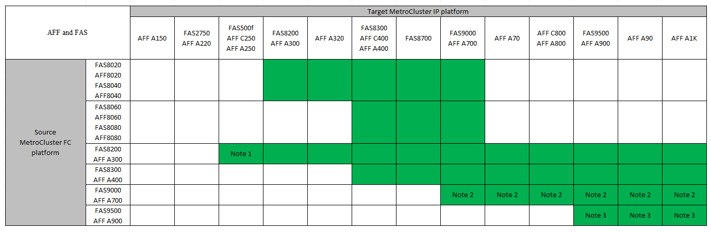

= 請選擇您的轉換程序
:allow-uri-read: 
:icons: font
:imagesdir: ../media/

[role="lead"]
轉換至MetroCluster 靜態IP組態時、您必須結合支援的平台機型。

您也應該確保MetroCluster 針對從MetroCluster 靜態FC組態轉換為MetroCluster 靜態IP組態的負載、使用適當的尺寸來調整此平台。

== 支援的平台組合

* 除非ONTAP 附註中另有說明或個別平台要求、否則所有轉換程序都需要使用更新版本的資訊。
* MetroCluster 組態中的所有節點都必須執行相同的 ONTAP 版本。例如、如果您有八個節點組態、則所有八個節點都必須執行相同的 ONTAP 版本。

[NOTE]
====
* 請勿超過平台「下限」的任何物件限制。套用兩個平台的較低物件限制。
* 如果目標平台限制低於 MetroCluster 限制、您必須重新設定 MetroCluster 、使其達到或低於目標平台限制、才能新增節點。
* 請參閱 link:https://hwu.netapp.com["Hardware Universe"^] 適用於平台限制。

====
.支援的 AFF 和 FAS 轉換組合
下表顯示支援的平台組合。您可以從左欄中的平台轉換至右側欄中所列的平台、如彩色表格儲存格所示。

例如MetroCluster 、支援從由AFF8060控制器模組組成的FESFC組態、轉換為AFF 由FESA400控制器模組組成的IP組態。

* 附註 1 ：此平台組合需要 ONTAP 9.11.1 或更新版本。
* 附註 2 ： FC 節點上的本機叢集介面必須有 40GbE 介面。
* 附註 3 ： FC 節點上的本機叢集介面必須有 100GbE 介面。

.支援的 ASA 轉換平台組合
下表顯示 ASA 系統支援的平台組合。

[cols="3*"]
|===
| 來源 MetroCluster FC 平台 | 目標 MetroCluster IP 平台 | 是否支援？ 

.2+| 解答400 ASA | 解答400 ASA | 是的 

| ASA A900 | 否 

.2+| ASA A900 | 解答400 ASA | 否 

| ASA A900 | 是的 
|===

== 請選擇您的轉換程序

您必須根據現有MetroCluster 的不規則功能（NetApp）組態、選擇轉換程序。

轉換程序會以IP交換器網路取代後端FC交換器網路或FC-VI連線。確切的程序取決於您的初始組態。

在轉換程序結束時、會淘汰原始平台和FC交換器（如果有）。

[cols="20,20,20,40"]
|===

| 正在啟動組態 | 不中斷營運或不中斷營運 | 需求 | 程序 

 a| 
四個或八個節點
 a| 
不中斷營運
 a| 
新平台支援新的儲存櫃。
 a| 
link:concept_nondisruptively_transitioning_from_a_four_node_mcc_fc_to_a_mcc_ip_configuration.html["程序連結"]

 a| 
兩個節點
 a| 
顛覆性
 a| 
新的儲存櫃同時支援原始與新平台。
 a| 
link:task_disruptively_transition_from_a_two_node_mcc_fc_to_a_four_node_mcc_ip_configuration.html["程序連結"]

 a| 
兩個節點
 a| 
顛覆性
 a| 
新的儲存櫃同時支援原始與新平台。必須淘汰舊的儲存櫃。
 a| 
link:task_disruptively_transition_while_move_volumes_from_old_shelves_to_new_shelves.html["程序連結"]

 a| 
兩個節點
 a| 
顛覆性
 a| 
新平台不支援舊的儲存櫃。必須淘汰舊的儲存櫃。
 a| 
link:task_disruptively_transition_when_exist_shelves_are_not_supported_on_new_controllers.html["程序連結"]

|===