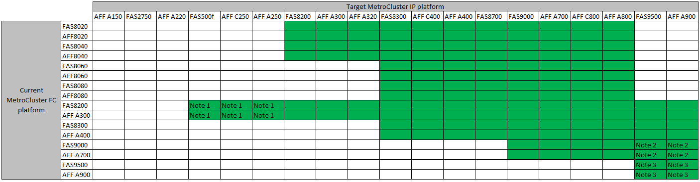

= 選擇您的轉換程序
:allow-uri-read: 
:icons: font
:imagesdir: ../media/

[role="lead"]
轉換至MetroCluster 靜態IP組態時、您必須結合支援的平台機型。您也應該確保MetroCluster 針對從MetroCluster 靜態FC組態轉換為MetroCluster 靜態IP組態的負載、使用適當的尺寸來調整此平台。

下表顯示支援的平台組合。您可以從左欄中的平台轉換至右側欄中所列的平台、如彩色表格儲存格所示。

例如MetroCluster 、支援從由AFF8060控制器模組組成的FESFC組態、轉換為AFF 由FESA400控制器模組組成的IP組態。

* 附註1：此平台組合需要ONTAP 使用更新版本的支援。
* 附註2：FC節點上的本機叢集介面必須使用40GbE介面。此平台組合需要ONTAP 使用更新版本的版本。
* 附註3：FC節點上的本機叢集介面必須使用100GbE介面。此平台組合需要ONTAP 使用更新版本的版本。
* 除非ONTAP 附註中另有說明或個別平台要求、否則所有轉換程序都需要使用更新版本的資訊。

NOTE: 請勿超過平台「下限」的任何物件限制。套用兩個平台的較低物件限制。請參閱 link:https://hwu.netapp.html["Hardware Universe"^] 適用於平台限制。

您必須根據現有MetroCluster 的不規則功能（NetApp）組態、選擇轉換程序。

轉換程序會以IP交換器網路取代後端FC交換器網路或FC-VI連線。確切的程序取決於您的初始組態。

在轉換程序結束時、會淘汰原始平台和FC交換器（如果有）。

[cols="20,20,20,40"]
|===

| 正在啟動組態 | 不中斷營運或不中斷營運 | 需求 | 程序 

 a| 
四個節點
 a| 
不中斷營運
 a| 
新平台支援新的儲存櫃。
 a| 
link:concept_requirements_for_fc_to_ip_transition_mcc.html["程序連結"]

 a| 
兩個節點
 a| 
顛覆性
 a| 
新的儲存櫃同時支援原始與新平台。
 a| 
link:task_disruptively_transition_from_a_two_node_mcc_fc_to_a_four_node_mcc_ip_configuration.html["程序連結"]

 a| 
兩個節點
 a| 
顛覆性
 a| 
新的儲存櫃同時支援原始與新平台。必須淘汰舊的儲存櫃。
 a| 
link:task_disruptively_transition_while_move_volumes_from_old_shelves_to_new_shelves.html["程序連結"]

 a| 
兩個節點
 a| 
顛覆性
 a| 
新平台不支援舊的儲存櫃。必須淘汰舊的儲存櫃。
 a| 
link:task_disruptively_transition_when_exist_shelves_are_not_supported_on_new_controllers.html["程序連結"]

|===

=== 轉換至Cisco 9336C-FX2共享交換器組態

不支援轉換至Cisco 9336C-FX2共用交換器組態。共享交換器組態_是交換器同時提供MetroCluster 支援鏈路的地方、也是儲存櫃連線的地方。

Cisco 9336C-FX2交換器僅提供MetroCluster 支援的不支援鏈路的組態。
