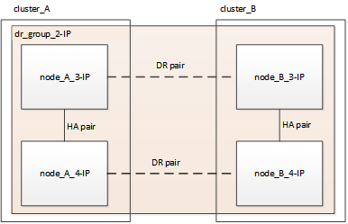

= 不中斷MetroCluster 營運的流程無法進行不中斷的移轉
:allow-uri-read: 
:icons: font
:imagesdir: ../media/

[role="lead"]
您必須遵循特定的工作流程、以確保順利進行不中斷營運的移轉作業。為您的組態選擇工作流程：

* <<四節點 FC 組態轉換工作流程>>
* <<八節點 FC 組態轉換工作流程>>

== 四節點 FC 組態轉換工作流程

轉換程序從健全的四節點MetroCluster 不含問題的FC組態開始。

image::../media/transition_dr_group_1_fc_nodes.png[轉換DR群組1的光纖通道節點]

新MetroCluster 的靜態IP節點會新增為第二個DR群組。

image::../media/transition_dr_groups_fc_and_ip.png[轉換DR群組光纖通道和IP]

資料會從舊的DR群組傳輸至新的DR群組、然後從組態中移除舊節點及其儲存設備、並予以停用。此程序以四節點MetroCluster 的靜態IP組態結束。

== 八節點 FC 組態轉換工作流程

轉換程序從健全的八節點 MetroCluster FC 組態開始。

image::../media/mcc_dr_group_c1.png[MCC DR 群組 C1]

新的 MetroCluster IP 節點會新增為第三個 DR 群組。

image::../media/mcc_dr_group_c2.png[MCC DR 群組 C2]

資料會從 DR_group_1-FC 傳輸至 DR_group_1-IP 、然後舊節點及其儲存設備會從組態中移除並解除委任。

NOTE: 如果您想要從八節點 FC 組態轉換為四節點 IP 組態、則必須將 DR_group_1-FC 和 DR_group_2-FC 中的所有資料轉換為新的 IP DR 群組（ DR_group_1-IP ）。然後您可以取消委任這兩個 FC DR 群組。移除 FC DR 群組之後、程序會以四節點 MetroCluster IP 組態結束。

image::../media/mcc_dr_group_c8.png[MCC DR 群組 C8]

將其餘的 MetroCluster IP 節點新增至現有的 MetroCluster 組態。重複此程序、將資料從 DR_group_2-FC 節點傳輸至 DR_group_2-IP 節點。

image::../media/mcc_dr_group_c7.png[MCC DR 群組 C7]

移除 DR_group_2-FC 之後、程序會以八節點 MetroCluster IP 組態結束。

image::../media/mcc_dr_group_c6.png[MCC DR 群組 C6]

== 轉換程序工作流程

您將使用下列工作流程來轉換MetroCluster 此功能。

image::../media/workflow_4n_transition_nondisruptive.png[工作流程4n轉換不中斷營運]
