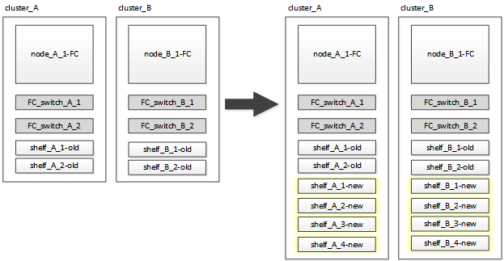

= 當新控制器不支援現有磁碟櫃時、會中斷轉換作業（ONTAP 版本號：NetApp 9.8及更新版本）
:allow-uri-read: 
:icons: font
:imagesdir: ../media/

[role="lead"]
從功能不完整的問題9.8開始ONTAP 、您可以中斷轉換雙節點MetroCluster 的支援功能、從現有磁碟機櫃搬移資料、即使新MetroCluster 的支援不支援現有的儲存櫃也沒問題。

* 只有在全新MetroCluster 的NetApp知識產權平台機型不支援現有的儲存櫃機型時、才應使用此程序。
* 執行ONTAP 支援此程序的系統支援使用支援的版本。
* 此程序會造成中斷。
* 此程序僅適用於雙節點MetroCluster 的不含功能的FC組態。
+
如果您有四節點MetroCluster 的不含功能的FC組態、請參閱 link:concept_choosing_your_transition_procedure_mcc_transition.html["選擇您的轉換程序"]。

* 您必須符合所有要求、並遵循程序中的所有步驟。

== 新節點不支援磁碟櫃時的轉換需求

在開始轉換程序之前、您必須確定組態符合要求。

.開始之前
* 現有的組態必須是雙節點架構附加或延伸MetroCluster 的支援、且所有節點都必須執行ONTAP 更新版本的支援。
+
全新MetroCluster 的SIP控制器模組應執行相同版本ONTAP 的S9.8。

* 現有平台和新平台必須是支援的轉換組合。
+
link:concept_supported_platforms_for_transition.html["支援不中斷營運的平台移轉"]

* 它必須符合中所述的所有需求和纜線 link:../install-fc/index.html["Fabric附加MetroCluster 的安裝與組態"]。
* 新控制器（node_a_1-IP、node_a_2-IP、node_B_1-IP和node_B_2-IP）所提供的新儲存機櫃必須受到舊控制器（node_a_1-FC和node_B_1-FC）的支援。
+
https://hwu.netapp.com["NetApp Hardware Universe"^]

* 全新MetroCluster 的SIP平台機型*不支援舊的儲存櫃。
+
https://hwu.netapp.com["NetApp Hardware Universe"^]

* 視現有磁碟櫃中可用的備用磁碟而定、必須新增額外的磁碟機。
+
這可能需要額外的磁碟機櫃。

+
每個控制器需要額外14至18個磁碟機：

+
** 三個Pool0磁碟機
** 三個Pool1磁碟機
** 兩個備用磁碟機
** 六到十個磁碟機用於系統磁碟區

* 您必須確保組態（包括新節點）不會超過組態的平台限制、包括磁碟機數、根Aggregate大小容量等
+
此資訊適用於每種平台模式、請參閱_NetApp Hardware Universe SUR__。

+
https://hwu.netapp.com["NetApp Hardware Universe"]

* 您必須能從MetroCluster 任何一個站台、或是依照程序的要求、對所有六個節點進行遠端主控台存取、或是規劃在站台之間的交通。

== 新控制器不支援磁碟櫃時、可中斷營運的移轉工作流程

如果新平台機型不支援現有的機櫃模型、您必須將新機櫃附加至舊組態、將資料移至新機櫃、然後轉換至新組態。

準備轉換時、請規劃各地點之間的差旅。請注意、當遠端節點機架安裝並連接纜線之後、您需要對節點進行序列終端機存取。在設定節點之前、「服務處理器」存取將無法使用。

image::../media/workflow_2n_transition_old_shelves_not_supported.png[不支援工作流程2n移轉舊磁碟櫃]

== 準備新的控制器模組

您必須清除新控制器模組和新儲存櫃上的組態和磁碟擁有權。

.步驟
. 新的儲存磁碟櫃連接至全新MetroCluster 的靜態IP控制器模組、請執行中的所有步驟 link:../transition/concept_requirements_for_fc_to_ip_transition_2n_mcc_transition.html#preparing-the-metrocluster-ip-controllers["準備MetroCluster 好執行功能"]。
. 將新的儲存櫃從全新MetroCluster 的知識區IP控制器模組拔下。

== 將新的磁碟櫃連接到現有MetroCluster 的不可靠FC控制器

您必須先將新的磁碟機櫃連接至現有的控制器模組、然後再轉換MetroCluster 至靜態IP組態。

.關於這項工作
下圖顯示MetroCluster 連接到該功能的新型磁碟櫃。

.步驟
. 停用node_a_1-FC和node_a_2-FC上的磁碟自動指派：
+
「磁碟選項modify -node-name_-autodassign Off」

+
必須在每個節點上發出此命令。

+
停用磁碟自動指派、以避免指派磁碟櫃新增至node_a_1-FC和node_B_1-FC。在轉換過程中、節點node_a_1-IP和node_B_2-IP需要磁碟、如果允許自動指派、則稍後需要先移除磁碟擁有權、才能將磁碟指派給node_a_1-IP和node_B_2-IP。

. 如有必要、請使用FC對SAS橋接器、將新的磁碟櫃連接至現有MetroCluster 的SFC節點。
+
請參閱中的要求與程序 link:../maintain/task_hot_add_a_sas_disk_shelf_in_a_direct_attached_mcc_configuration_us_sas_optical_cables.html["將儲存熱新增至MetroCluster 不適用於功能的FC組態"]

== 移轉根集合體、並將資料移至新的磁碟櫃

您必須將根集合體從舊磁碟機櫃移至MetroCluster 新的磁碟機櫃、以便供各個知識產權節點使用。

.關於這項工作
此工作是在現有節點（node_a_1-FC和node_B_1-FC）上進行轉換之前執行。

.步驟
. 從控制器節點_B_1-FC執行協調切換：
+
《不切換》MetroCluster

. 從node_B_1-FC執行修復集合體並修復恢復的根步驟：
+
《修復階段集合體》MetroCluster

+
「MetroCluster 修復階段根集合體」

. 開機控制器節點_a_1-FC：
+
Boot_ONTAP

. 將新磁碟櫃上的未擁有磁碟指派給適當的控制器節點節點_a_1-FC集區：
+
.. 識別磁碟櫃上的磁碟：
+
「磁碟顯示-機櫃Pool_0_bele-Fields container類型、diskpathnames」

+
「磁碟顯示-機櫃Pool_1_self-功能變數conter-type、diskpathnames」

.. 進入本機模式、以便在本機節點上執行命令：
+
執行本機

.. 指派磁碟：
+
"Disk Assign disk1disk2disk3disk...（磁碟指派磁碟1disk2disk3disk…） -p 0'

+
"Disk Assign disk4disk5disk6disk…（磁碟指派磁碟4disk5disk6disk…） -p 1`

.. 結束本機模式：
+
「退出」

. 建立新的鏡射Aggregate、成為控制器node_a_1-FC的新根Aggregate：
+
.. 將權限模式設為進階：
+
《et priv進階》

.. 建立Aggregate：
+
「Aggregate create -aggregate new_aggr -disklist disk1、disk2、disk3、…」 -mirror磁碟清單disk4disk5、disk6、… -raidtypesame-as現有根-force-less-gregate true aggr show -aggregate new_aggr -Fields百分點-snapshot space'

+
如果Snapshot空間百分比值低於5%、則必須將其增加至高於5%的值：

+
「aggr modify new_aggr -百分 點-snapshot space 5」

.. 將權限模式設回管理：
+
「et priv admin」

. 確認新的Aggregate已正確建立：
+
節點執行節點本機sysconfig -r

. 建立節點與叢集層級的組態備份：
+

NOTE: 在切換期間建立備份時、叢集會注意到恢復時的切換狀態。您必須確保系統組態的備份與上傳成功、因為沒有這份備份、*無法*在MetroCluster 叢集之間修改此功能。

+
.. 建立叢集備份：
+
「系統組態備份建立節點本機備份類型叢集-備份名稱_cluster備份名稱_」

.. 檢查叢集備份建立
+
「jobshow -id job-idStatus」

.. 建立節點備份：
+
「系統組態備份建立節點本機備份類型節點-備份名稱_node-backup-name_」

.. 檢查叢集與節點備份：
+
「系統組態備份展示」

+
您可以重複此命令、直到輸出中顯示這兩個備份。

. 製作備份複本。
+
備份必須儲存在不同的位置、因為當新的根磁碟區開機時、它們將會在本機遺失。

+
您可以將備份上傳至FTP或HTTP伺服器、或使用「scp」命令複製備份。

+
[cols="1,3"]
|===

| 程序 | 步驟 

 a| 
*將備份上傳至FTP或HTTP伺服器*
 a| 
.. 上傳叢集備份：
+
「系統組態備份上傳節點本機備份叢集備份名稱_目的地URL」

.. 上傳節點備份：
+
「系統組態備份上傳節點本機備份節點備份節點備份名稱_目的地URL」

 a| 
*使用安全複本將備份複製到遠端伺服器*
 a| 
從遠端伺服器使用下列scp命令：

.. 複製叢集備份：
+
「CP診斷de-mgmt-FC：/mroot/etc/backups/config/cate-backup-name.7z」

.. 複製節點備份：
+
「ccp diag@node-mgmt-fc：/mroot/etc/backups/config/cnode-backup-name.7z」

|===
. 停止node_a_1-FC：
+
"halt -node-ignore -quorum警告true "

. 將node_a_1-FC開機至維護模式：
+
Boot_ONTAP maint

. 從維護模式進行必要的變更、將Aggregate設為root：
+
.. 將HA原則設定為CFO：
+
《Aggr options new_aggr ha_policy CFO》

+
系統提示您繼續進行時、請回應「yes」。

+
[listing]
----
Are you sure you want to proceed (y/n)?
----
.. 將新的Aggregate設為root：
+
"aggr options new_aggr root"

.. 停止載入程式提示：
+
《停止》

. 啟動控制器並備份系統組態。
+
偵測到新的根磁碟區時、節點會以恢復模式開機

+
.. 啟動控制器：
+
Boot_ONTAP

.. 登入並備份組態。
+
登入時、您會看到下列警告：

+
[listing]
----
Warning: The correct cluster system configuration backup must be restored. If a backup
from another cluster or another system state is used then the root volume will need to be
recreated and NGS engaged for recovery assistance.
----
.. 進入進階權限模式：
+
"進階權限"

.. 將叢集組態備份到伺服器：
+
「系統組態備份下載-nodE local -source URL of server/cluster備份名稱.7z」

.. 將節點組態備份到伺服器：
+
「系統組態備份下載-nodE local -source URL of server/cnode-backup-name.7z」

.. 返回管理模式：
+
「et -priv. admin」

. 檢查叢集的健全狀況：
+
.. 發出下列命令：
+
「叢集展示」

.. 將權限模式設為進階：
+
"進階權限"

.. 驗證叢集組態詳細資料：
+
「叢集響鈴」

.. 返回管理權限層級：
+
「et -priv. admin」

. 確認MetroCluster 執行功能不正常的操作模式、並執行MetroCluster 功能不實的檢查。
+
.. 確認MetroCluster 執行功能組態、並確認操作模式正常：
+
《不看》MetroCluster

.. 確認顯示所有預期節點：
+
「不一樣的秀」MetroCluster

.. 發出下列命令：
+
《不一樣的跑程》MetroCluster

.. 顯示MetroCluster 檢查結果：
+
《不一樣的表演》MetroCluster

. 從控制器節點_B_1-FC執行切換：
+
《還原》MetroCluster

. 驗MetroCluster 證下列各項的功能：
+
.. 確認MetroCluster 執行功能組態、並確認操作模式正常：
+
《不看》MetroCluster

.. 執行功能檢查：MetroCluster
+
《不一樣的跑程》MetroCluster

.. 顯示MetroCluster 檢查結果：
+
《不一樣的表演》MetroCluster

. 將新的根磁碟區新增至Volume Location Database。
+
.. 將權限模式設為進階：
+
"進階權限"

.. 將磁碟區新增至節點：
+
「Volume add-other Volume–node_a_1-FC」

.. 返回管理權限層級：
+
「et -priv. admin」

. 檢查磁碟區是否現在可見且有mroot。
+
.. 顯示集合體：
+
《集合體展》

.. 驗證根Volume是否具有mroot：
+
「torage Aggregate show -Fields e-mroot」

.. 顯示磁碟區：
+
「Volume show」

. 建立新的安全性憑證以重新啟用System Manager存取：
+
「安全憑證建立- common-name _name_- type server -size 2048'

. 重複上述步驟、移轉node_a_1-FC所擁有之磁碟櫃上的集合體。
. 執行清除。
+
您必須在node_a_1-FC和node_B_1-FC上執行下列步驟、才能移除舊的根磁碟區和根Aggregate。

+
.. 刪除舊的根磁碟區：
+
執行本機

+
"volvol offline old_vol0"

+
"vol. destroy old_vol0"

+
「退出」

+
「Volume remove-other Volume -vserver node_name -volume old_vol0'」

.. 刪除原始根Aggregate：
+
"aggr offline -Aggregate old_aggr0_sente"

+
"aggr刪除-Aggregate old_aggr0_sentage"

. 將資料磁碟區移轉至新控制器上的集合體、一次一個磁碟區。
+
請參閱 http://docs.netapp.com/platstor/topic/com.netapp.doc.hw-upgrade-controller/GUID-AFE432F6-60AD-4A79-86C0-C7D12957FA63.html["建立Aggregate並將磁碟區移至新節點"^]

. 執行中的所有步驟、淘汰舊的機櫃 link:task_disruptively_transition_while_move_volumes_from_old_shelves_to_new_shelves.html["淘汰從node_a_1-FC和node_a_2-FC移出的磁碟櫃"]。

== 轉換組態

您必須遵循詳細的轉換程序。

.關於這項工作
在下列步驟中、您會被導向至其他主題。您必須依照所給的順序執行每個主題中的步驟。

.步驟
. 規劃連接埠對應。
+
執行中的所有步驟 link:../transition/concept_requirements_for_fc_to_ip_transition_2n_mcc_transition.html#mapping-ports-from-the-metrocluster-fc-nodes-to-the-metrocluster-ip-nodes["將連接埠從MetroCluster 靜態FC節點對應至MetroCluster 靜態IP節點"]。

. 準備MetroCluster 好用作不需要的IP控制器。
+
執行中的所有步驟 link:../transition/concept_requirements_for_fc_to_ip_transition_2n_mcc_transition.html#preparing-the-metrocluster-ip-controllers["準備MetroCluster 好執行功能"]。

. 驗MetroCluster 證整個過程的效能狀況。
+
執行中的所有步驟 link:../transition/concept_requirements_for_fc_to_ip_transition_2n_mcc_transition.html#verifying-the-health-of-the-metrocluster-fc-configuration["驗MetroCluster 證不完整的驗證功能"]。

. 準備並移除現有MetroCluster 的不含任何資料的FC節點。
+
執行中的所有步驟 link:../transition/task_transition_the_mcc_fc_nodes_2n_mcc_transition_supertask.html["轉換MetroCluster 功能不只是功能不一的FC節點"]。

. 新增MetroCluster 全新的靜態IP節點。
+
執行中的所有步驟 link:task_connect_the_mcc_ip_controller_modules_2n_mcc_transition_supertask.html["連接MetroCluster 靜態IP控制器模組"]。

. 完成全新MetroCluster 的更新及初始組態的更新。
+
執行中的所有步驟 link:task_configure_the_new_nodes_and_complete_transition.html["設定新節點並完成轉換"]。

