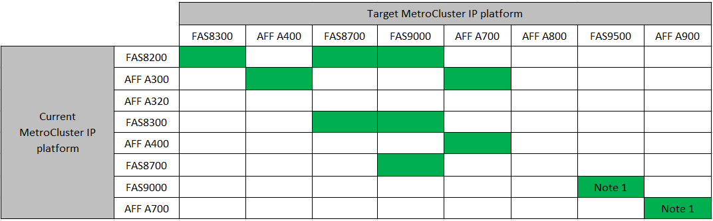

= 選擇控制器升級程序
:allow-uri-read: 
:icons: font
:imagesdir: ../media/

[role="lead"]
您使用的控制器升級程序取決於平台機型和MetroCluster 類型的支援。

在升級程序中、控制器會被新的控制器機型取代。儲存櫃機型不會升級。

* 在切換和切換程序中、MetroCluster 使用「還原切換」作業來為用戶端提供不中斷營運的服務、同時升級合作夥伴叢集上的控制器模組。
* 在ARL型控制器升級程序中、集合體重新配置作業可用於不中斷營運地將資料從舊組態移至新的升級組態。

== 選擇使用切換和切換程序的程序

請從下方的FC或IP表格中選取您目前的平台。如果目前平台列和目標平台欄的交會為空白、則不支援升級。

=== 支援MetroCluster 的支援功能升級

* 附註1：對於此升級、請使用此程序 link:task_upgrade_A700_to_A900_in_a_four_node_mcc_ip_us_switchover_and_switchback.html["使用交換器和切換功能（AFF 更新版本）、將控制器從功能性的A700/FAS9000升級AFF 至功能性的S還原A900/FAS9500 MetroCluster （以不整合的IP組態）ONTAP"]

=== 支援MetroCluster 的支援功能。FC控制器升級

image::../media/metrocluster_fc_upgrade_table.PNG[資訊通道升級表MetroCluster]

* 附註1：若在現有FAS8020或AFF8020節點上使用連接埠1c和1d進行FCVI連線時、要升級控制器、請參閱下列內容https://kb.netapp.com/Advice_and_Troubleshooting/Data_Protection_and_Security/MetroCluster/Upgrading_controllers_when_FCVI_connections_on_existing_FAS8020_or_AFF8020_nodes_use_ports_1c_and_1d["知識庫文章"^]。
* 附註2：AFF 僅ONTAP 在執行更新版本的系統上、才能使用內建連接埠0e和0f作為FC-VI連線、從Efso300或FAS8200平台進行控制器升級。或更早版本。如需詳細資訊、請參閱 link:https://mysupport.netapp.com/site/bugs-online/product/ONTAP/BURT/1507088["公開報告"^]。
* 附註3：如需此升級、請參閱 link:task_upgrade_A700_to_A900_in_a_four_node_mcc_fc_us_switchover_and_switchback.html["使用切換和切換功能（AFF 更新版本）、將控制器從功能不實的A700/FAS9000升級AFF 至功能不實的A900/FAS9500 MetroCluster （以功能不實的FC組態）ONTAP"]

[cols="2,1,1,2"]
|===

| 適用類型MetroCluster | 升級方法 | 版本ONTAP | 程序 

 a| 
FC
 a| 
使用「系統控制器更換」命令進行升級
 a| 
9.10.1及更新版本
 a| 
link:task_upgrade_controllers_system_control_commands_in_a_four_node_mcc_fc.html["程序連結"]

 a| 
FC
 a| 
使用CLI命令手動升級（AFF 僅適用於從E4A700/FAS9000升級AFF 至EWNE900/FAS9500）
 a| 
9.10.1及更新版本
 a| 
link:task_upgrade_A700_to_A900_in_a_four_node_mcc_fc_us_switchover_and_switchback.html["程序連結"]

 a| 
IP
 a| 
使用CLI命令手動升級（AFF 僅適用於從E4A700/FAS9000升級AFF 至EWNE900/FAS9500）
 a| 
9.10.1及更新版本
 a| 
link:task_upgrade_A700_to_A900_in_a_four_node_mcc_ip_us_switchover_and_switchback.html["程序連結"]

 a| 
FC
 a| 
使用CLI命令手動升級
 a| 
9.8及更新版本
 a| 
link:task_upgrade_controllers_in_a_four_node_fc_mcc_us_switchover_and_switchback_mcc_fc_4n_cu.html["程序連結"]

 a| 
IP
 a| 
使用CLI命令手動升級
 a| 
9.8及更新版本
 a| 
link:task_upgrade_controllers_in_a_four_node_ip_mcc_us_switchover_and_switchback_mcc_ip.html["程序連結"]

|===

== 使用Aggregate重新配置來選擇程序

在ARL型控制器升級程序中、集合體重新配置作業可用於不中斷營運地將資料從舊組態移至新的升級組態。

|===
| 適用類型MetroCluster | Aggregate重新配置 | 版本ONTAP | 程序 

 a| 
FC
 a| 
使用 `system controller replace` 命令並交換控制器模組和NVM（AFF 僅從還原A700升級至AFF 還原A900）
 a| 
9.10.1及更新版本
 a| 
https://docs.netapp.com/us-en/ontap-systems-upgrade/upgrade-arl-auto-affa900/index.html["程序連結"^]

 a| 
FC
 a| 
使用「系統控制器置換」命令
 a| 
9.8及更新版本
 a| 
https://docs.netapp.com/us-en/ontap-systems-upgrade/upgrade-arl-auto-app/index.html["程序連結"^]

 a| 
FC
 a| 
使用「系統控制器置換」命令
 a| 
9.5至9.7
 a| 
https://docs.netapp.com/us-en/ontap-systems-upgrade/upgrade-arl-auto/index.html["程序連結"^]

 a| 
FC
 a| 
使用手動ARL命令
 a| 
9.8
 a| 
https://docs.netapp.com/us-en/ontap-systems-upgrade/upgrade-arl-manual-app/index.html["程序連結"^]

 a| 
FC
 a| 
使用手動ARL命令
 a| 
9.7及更早版本
 a| 
https://docs.netapp.com/us-en/ontap-systems-upgrade/upgrade-arl-manual/index.html["程序連結"^]

|===