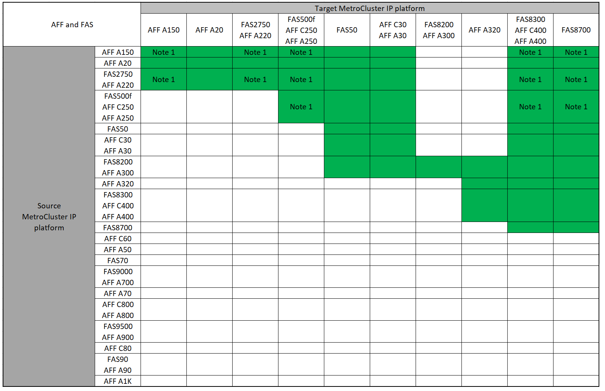
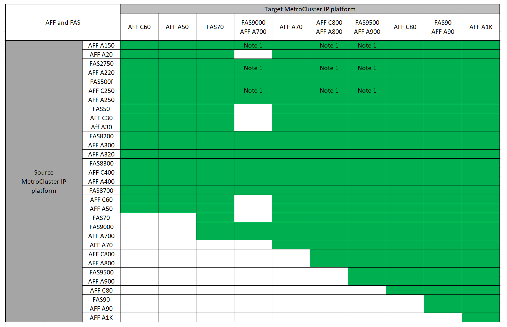

= 選擇系統重新整理方法
:allow-uri-read: 
:icons: font
:imagesdir: ../media/

[role="lead"]
您使用的系統更新程序取決於平台機型和MetroCluster 類型的功能。更新程序適用於控制器和儲存櫃。在重新整理程序中、MetroCluster 系統會將新的控制器和磁碟櫃新增至該組態、建立第二個DR群組、然後將資料以不中斷營運的方式移轉至新節點。然後、原始控制器就會淘汰。

== 支援MetroCluster 的支援功能：IP技術更新組合

* 新增負載之前、您必須先完成技術更新程序。
* MetroCluster 組態中的所有節點都必須執行相同的 ONTAP 版本。例如、如果您有八個節點組態、則所有八個節點都必須執行相同的 ONTAP 版本。請參閱link:https://hwu.netapp.com["Hardware Universe"^]以取得您的組合所支援的最低 ONTAP 版本。
* 請勿超過平台「下限」的任何物件限制。套用兩個平台的較低物件限制。
* 如果目標平台限制低於 MetroCluster 限制、您必須將 MetroCluster 重新設定為目標平台限制、然後再新增節點。
* 請參閱 link:https://hwu.netapp.com["Hardware Universe"^] 適用於平台限制。

=== 支援的 AFF 和 FAS MetroCluster IP 技術更新組合

下表顯示 MetroCluster IP 組態中用於重新整理 AFF 或 FAS 系統的支援平台組合。表格分成兩個群組：

* * 群組 1* 顯示 AFF A150 ， AFF A20 ，， AFF A220 ， FAS500f ， AFF C250 ， FAS8200 ， FAS50 ， AFF C400 C30 ， FAS2750 A30 ， AFF A250 ， AFF A300 ， AFF A400 ， FAS8300 ， AFF ， AFF A320 ， AFF 和 FAS8700 系統的組合。
* * 群組 2* 顯示 C60 ， AFF A50 ， FAS70 ， FAS9000 ， AFF A700 ， AFF A70 ， AFF C800 ， AFF ， FAS9500 ， AFF A900 ， AFF ， AFF A800 C80 ， FAS90 ， AFF A90 和 AFF A1K 系統的組合。

下列注意事項適用於這兩個群組：

* 附註 1 ：此組合需要 ONTAP 9.13.1 或更新版本。

[role="tabbed-block"]
====
.AFF 和 FAS 組合群組 1
--
檢閱 AFF A150 ， A20 ，， AFF A220 ， FAS500f ，， FAS8200 ， FAS50 ， AFF C30 ， AFF C250 A30 ， AFF A250 ， AFF C400 ， FAS2750 ， FAS8300 ， AFF A300 ， AFF A400 ， AFF A320 ， AFF ， AFF 和 FAS8700 系統的系統更新組合。

--
.AFF 和 FAS 組合群組 2
--
檢閱 C60 ， A50 ， FAS70 ， FAS9000 ， AFF A700 ， AFF A90 ， AFF A900 ， AFF ， FAS9500 ， AFF A70 ， AFF C800 ， AFF ， AFF A800 C80 ， FAS90 ， AFF 和 AFF A1K 系統的系統更新組合。

--
====

=== 支援的 ASA MetroCluster IP 技術更新組合

下表顯示在 MetroCluster IP 組態中重新整理 ASA 系統所支援的平台組合：

image::../media/mcc-ip-techrefresh-asa-9161.png[MetroCluster IP ASA 技術更新組合]

== 支援MetroCluster 的功能更新功能組合

* 新增負載之前、您必須先完成技術更新程序。
* MetroCluster 組態中的所有節點都必須執行相同的 ONTAP 版本。例如、如果您有八個節點組態、則所有八個節點都必須執行相同的 ONTAP 版本。請參閱link:https://hwu.netapp.com["Hardware Universe"^]以取得您的組合所支援的最低 ONTAP 版本。
* 請勿超過平台「下限」的任何物件限制。套用兩個平台的較低物件限制。
* 如果目標平台限制低於 MetroCluster 限制、您必須重新設定 MetroCluster 、使其達到或低於目標平台限制、才能新增節點。
* 請參閱 link:https://hwu.netapp.com["Hardware Universe"^] 適用於平台限制。

=== 支援的 AFF 和 FAS MetroCluster FC 技術更新組合

下表顯示 MetroCluster FC 組態中用於重新整理 AFF 或 FAS 系統的支援平台組合：

image::../media/metrocluster_fc_tech_refresh.png[NetApp技術更新MetroCluster]

=== 支援的 ASA MetroCluster FC 技術更新組合

下表顯示在 MetroCluster FC 組態中重新整理 ASA 系統所支援的平台組合：

[cols="3*"]
|===
| 來源 MetroCluster FC 平台 | 目的地 MetroCluster FC 平台 | 是否支援？ 

.2+| 解答400 ASA | 解答400 ASA | 是的 

| ASA A900 | 否 

.2+| ASA A900 | 解答400 ASA | 否 

| ASA A900 | 是的 
|===

== 選擇重新整理程序

從下表中選擇組態的重新整理程序：

[cols="2,1,1,2"]
|===
| 重新整理方法 | 組態類型 | 版本ONTAP | 程序 

 a| 
* 方法：展開MetroCluster 「資訊庫」組態、然後移除舊節點

 a| 
四節點FC
 a| 
9.6及更新版本
 a| 
link:task_refresh_4n_mcc_fc.html["程序連結"]

 a| 
* 方法：展開MetroCluster 「資訊庫」組態、然後移除舊節點

 a| 
四節點IP
 a| 
9.8及更新版本
 a| 
link:task_refresh_4n_mcc_ip.html["程序連結"]

|===