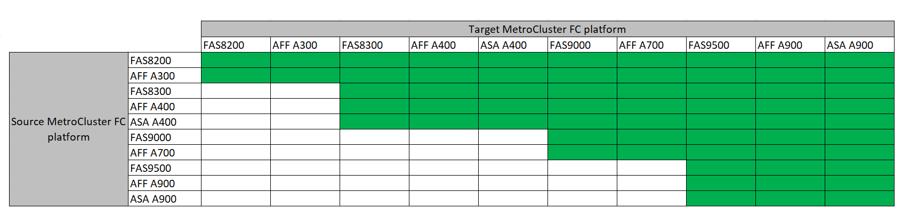

= 選擇系統重新整理方法
:allow-uri-read: 
:icons: font
:imagesdir: ../media/

[role="lead"]
您使用的系統更新程序取決於平台機型和MetroCluster 類型的功能。更新程序適用於控制器和儲存櫃。在重新整理程序中、MetroCluster 系統會將新的控制器和磁碟櫃新增至該組態、建立第二個DR群組、然後將資料以不中斷營運的方式移轉至新節點。然後、原始控制器就會淘汰。

=== 支援MetroCluster 的功能更新功能組合

* 新增負載之前、您必須先完成技術更新程序。
* MetroCluster 組態中的所有節點都必須執行相同的 ONTAP 版本。例如、如果您有八個節點組態、則所有八個節點都必須執行相同的 ONTAP 版本。
* 請勿超過平台「下限」的任何物件限制。套用兩個平台的較低物件限制。
* 如果目標平台限制低於 MetroCluster 限制、您必須重新設定 MetroCluster 、使其達到或低於目標平台限制、才能新增節點。
* 請參閱 link:https://hwu.netapp.com["Hardware Universe"^] 適用於平台限制。

=== 支援MetroCluster 的支援功能：IP技術更新組合

image::../media/metrocluster_techref_ip_914.png[MetroCluster IP 技術更新組合]

* 附註 1 ： * 此組合需要 ONTAP 9.13.1 或更新版本。

* 新增負載之前、您必須先完成技術更新程序。
* MetroCluster 組態中的所有節點都必須執行相同的 ONTAP 版本。例如、如果您有八個節點組態、則所有八個節點都必須執行相同的 ONTAP 版本。
* 請勿超過平台「下限」的任何物件限制。套用兩個平台的較低物件限制。
* 如果目標平台限制低於 MetroCluster 限制、您必須將 MetroCluster 重新設定為目標平台限制、然後再新增節點。
* 請參閱 link:https://hwu.netapp.com["Hardware Universe"^] 適用於平台限制。

[cols="2,1,1,2"]
|===
| 重新整理方法 | 組態類型 | 版本ONTAP | 程序 

 a| 
* 方法：展開MetroCluster 「資訊庫」組態、然後移除舊節點

 a| 
四節點FC
 a| 
9.6及更新版本
 a| 
link:task_refresh_4n_mcc_fc.html["程序連結"]

 a| 
* 方法：展開MetroCluster 「資訊庫」組態、然後移除舊節點

 a| 
四節點IP
 a| 
9.8及更新版本
 a| 
link:task_refresh_4n_mcc_ip.html["程序連結"]

|===