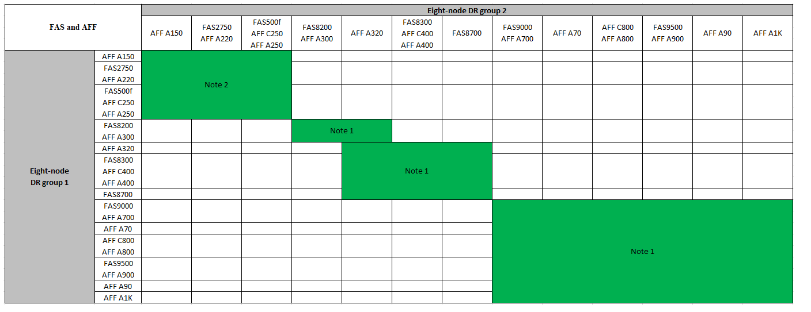
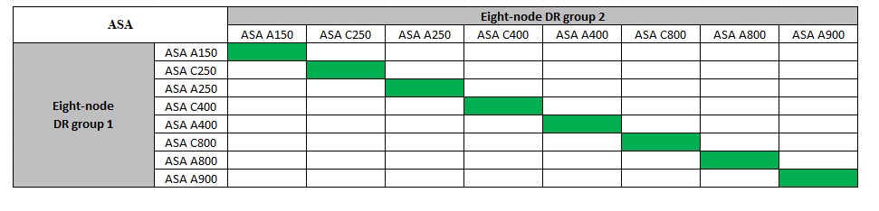

= 展開 MetroCluster IP 組態
:allow-uri-read: 
:icons: font
:imagesdir: ../media/

[role="lead"]
視 ONTAP 版本而定、您可以將四個新節點新增為新的 DR 群組、以擴充 MetroCluster IP 組態。

從 ONTAP 9.13.1 開始、您可以暫時擴充八節點 MetroCluster 組態、以重新整理控制器和儲存設備。請參閱 link:task_refresh_4n_mcc_ip.html["重新整理四節點或八節點 MetroCluster IP 組態（ ONTAP 9.8 及更新版本）"] 以取得更多資訊。

從更新版的支援版9.9.1開始ONTAP 、您可以將四個新節點新增到MetroCluster 作為第二個DR群組的支援版IP組態中。這會建立八節點MetroCluster 的不全功能組態。

.開始之前
* 舊節點和新節點必須執行相同版本ONTAP 的更新。
* 本程序說明將一個四節點 DR 群組新增至現有 MetroCluster IP 組態所需的步驟。如果要重新整理八節點組態、您必須為每個 DR 群組重複整個程序、一次新增一個。
* 確認新舊平台機型支援混合平台。
+
https://hwu.netapp.com["NetApp Hardware Universe"^]

* 確認 IP 交換器支援舊的和新的平台機型。
+
https://hwu.netapp.com["NetApp Hardware Universe"^]

* 如果您是 link:task_refresh_4n_mcc_ip.html["重新整理四節點或八節點 MetroCluster IP 組態"]、新節點必須有足夠的儲存空間來容納舊節點的資料、以及足夠的磁碟用於根集合體和備用磁碟。
* 確認您在舊節點上建立了預設的廣播網域。
+
當您將新節點新增至沒有預設廣播網域的現有叢集時、會使用通用唯一識別碼（ UUID ）而非預期名稱、為新節點建立節點管理生命期。如需詳細資訊、請參閱知識庫文章 https://kb.netapp.com/onprem/ontap/os/Node_management_LIFs_on_newly-added_nodes_generated_with_UUID_names["在以 UUID 名稱產生的新新增節點上執行節點管理階層"^]。

== 啟用主控台記錄

NetApp 強烈建議您在使用的裝置上啟用主控台記錄功能、並在執行此程序時採取下列動作：

* 在維護期間保持啟用 AutoSupport 。
* 在維護之前和之後觸發維護 AutoSupport 訊息、以在維護活動期間停用案例建立。
+
請參閱知識庫文章 link:https://kb.netapp.com/Support_Bulletins/Customer_Bulletins/SU92["如何在排程的維護期間、隱藏自動建立個案"^]。

* 啟用任何 CLI 工作階段的工作階段記錄。有關如何啓用會話日誌記錄的說明，請查看知識庫文章中的“日誌記錄會話輸出”部分 link:https://kb.netapp.com/on-prem/ontap/Ontap_OS/OS-KBs/How_to_configure_PuTTY_for_optimal_connectivity_to_ONTAP_systems["如何設定 Putty 以最佳化連線至 ONTAP 系統"^]。

== 此程序中的命名範例

此程序使用範例名稱來識別整個過程中涉及的DR群組、節點和交換器。

|===

| DR群組 | 叢集_A位於站台_A | 站台B的叢集B 

 a| 
Dr_group_1-old
 a| 
* node_a_1-old
* node_a_2-old

 a| 
* node_B_1-old
* node_B_2-old

 a| 
Dr_group_2-new
 a| 
* node_a_3-new
* node_a_4-new

 a| 
* node_B_3-new
* node_B_4-new

|===

== 啟用主控台記錄

NetApp 強烈建議您在使用的裝置上啟用主控台記錄功能、並在執行此程序時採取下列動作：

* 在維護期間保持啟用 AutoSupport 。
* 在維護之前和之後觸發維護 AutoSupport 訊息、以在維護活動期間停用案例建立。
+
請參閱知識庫文章 link:https://kb.netapp.com/Support_Bulletins/Customer_Bulletins/SU92["如何在排程的維護期間、隱藏自動建立個案"^]。

* 啟用任何 CLI 工作階段的工作階段記錄。有關如何啓用會話日誌記錄的說明，請查看知識庫文章中的“日誌記錄會話輸出”部分 link:https://kb.netapp.com/on-prem/ontap/Ontap_OS/OS-KBs/How_to_configure_PuTTY_for_optimal_connectivity_to_ONTAP_systems["如何設定 Putty 以最佳化連線至 ONTAP 系統"^]。

== 新增第二個 DR 群組時支援的平台組合

下表顯示八節點 MetroCluster IP 組態支援的平台組合。

[IMPORTANT]
====
* MetroCluster 組態中的所有節點都必須執行相同的 ONTAP 版本。例如、如果您有八個節點組態、則所有八個節點都必須執行相同的 ONTAP 版本。
* 此表中的組合僅適用於一般或永久性的 8 節點組態。
* 如果您使用的是轉換或重新整理程序、則本表 * 請勿 * 套用平台組合。
* 一個 DR 群組中的所有節點都必須是相同類型和組態。

====
.支援的 AFF 和 FAS MetroCluster IP 擴充組合
下表顯示在 MetroCluster IP 組態中擴充 AFF 或 FAS 系統所支援的平台組合：

* * 附註 1* ：這些組合需要 ONTAP 9.9.1 或更新版本（或平台支援的最低 ONTAP 版本）。
* * 附註 2 * ：這些組合需要 ONTAP 9.13.1 或更新版本（或平台支援的最低 ONTAP 版本）。

.支援的 ASA MetroCluster IP 擴充組合
下表顯示 MetroCluster IP 組態中擴充 ASA 系統所支援的平台組合：

== 在維護前傳送自訂AutoSupport 的支援訊息

在執行維護之前、您應發出AutoSupport 一份不知所知的訊息、通知NetApp技術支援部門正在進行維護。告知技術支援部門正在進行維護、可防止他們假設發生中斷、而開啟案例。

.關於這項工作
此工作必須在每MetroCluster 個站台上執行。

.步驟
. 為了避免自動產生支援案例、請傳送AutoSupport 一個不全的訊息、指出正在進行升級。
+
.. 發出下列命令：
+
`system node autosupport invoke -node * -type all -message "MAINT=10h Upgrading <old-model> to <new-model>`

+
此範例指定10小時的維護時間。您可能需要額外的時間、視您的計畫而定。

+
如果維護作業在時間結束之前完成、您可以叫用AutoSupport 指示維護期間結束的資訊消息：

+
「系統節點AutoSupport 不完整地叫用節點*-type all -most MAn=end」

.. 在合作夥伴叢集上重複執行命令。

== 新增 DR 群組時 VLAN 的考量事項

* 擴充 MetroCluster IP 組態時、適用下列 VLAN 考量：
+
某些平台會使用VLAN作為MetroCluster 支援靜態IP介面。根據預設、這兩個連接埠各自使用不同的VLAN：10和20。

+
如果支援、您也可以使用命令中的參數、指定大於 100 （介於 101 和 4095 之間）的不同（非預設） VLAN `-vlan-id` `metrocluster configuration-settings interface create` 。

+
下列平台 * 不 * 支援此 `-vlan-id` 參數：

+
** FAS8200與AFF FASA300
** 解答320 AFF
** FAS9000 和 AFF A700
** AFF C800 、 ASA C800 、 AFF A800 和 ASA A800
+
所有其他平台都支援此 `-vlan-id` 參數。

+
預設和有效的 VLAN 指派取決於平台是否支援此 `-vlan-id` 參數：

+
[role="tabbed-block"]
====
.支援 <code> 的平台 - VLAN - </code>
--
預設 VLAN ：

*** 如果 `-vlan-id` 未指定參數、則會使用 VLAN 10 建立介面、用於「 A 」連接埠、而 VLAN 20 則用於「 B 」連接埠。
*** 指定的 VLAN 必須符合 RCF 中選取的 VLAN 。

有效 VLAN 範圍：

*** 預設 VLAN 10 和 20
*** VLAN 101 及更高版本（介於 101 和 4095 之間）

--
.不支援 <code> 的平台 -vlan--卻 不支援 </code>
--
預設 VLAN ：

*** 不適用。介面不需要在 MetroCluster 介面上指定 VLAN 。交換器連接埠會定義所使用的 VLAN 。

有效 VLAN 範圍：

*** 產生 RCF 時未明確排除所有 VLAN 。RCF 會在 VLAN 無效時發出警示。

--
====

* 當您從四節點擴充至八節點 MetroCluster 組態時、兩個 DR 群組都會使用相同的 VLAN 。
* 如果兩個 DR 群組都無法使用相同的 VLAN 進行設定、您必須升級不支援參數的 DR 群組 `vlan-id` 、才能使用其他 DR 群組所支援的 VLAN 。
* 根據您的 ONTAP 版本、您可以在初始設定後變更某些 MetroCluster IP 介面內容。如需支援項目的詳細資訊、請參閱 link:../maintain/task-modify-ip-netmask-properties.html["修改 MetroCluster IP 介面的內容"] 。

== 驗MetroCluster 證資訊功能組態的健全狀況

在執行擴充之前、您必須先確認 MetroCluster 組態的健全狀況和連線能力。

.步驟
. 驗證MetroCluster 下列項目中的功能：ONTAP
+
.. 檢查系統是否具有多路徑：
+
`node run -node <node-name> sysconfig -a`

.. 檢查兩個叢集上的任何健全狀況警示：
+
「系統健全狀況警示顯示」

.. 確認MetroCluster 執行功能組態、並確認操作模式正常：
+
《不看》MetroCluster

.. 執行功能檢查：MetroCluster
+
《不一樣的跑程》MetroCluster

.. 顯示MetroCluster 檢查結果：
+
《不一樣的表演》MetroCluster

.. 執行Config Advisor
+
https://mysupport.netapp.com/site/tools/tool-eula/activeiq-configadvisor["NetApp下載Config Advisor"]

.. 執行Config Advisor 完功能後、請檢閱工具的輸出結果、並依照輸出中的建議來解決發現的任何問題。

. 驗證叢集是否正常：
+
「叢集展示」

+
[listing]
----
cluster_A::> cluster show
Node           Health  Eligibility
-------------- ------  -----------
node_A_1       true    true
node_A_2       true    true

cluster_A::>
----
. 驗證所有叢集連接埠是否正常運作：
+
「網路連接埠show -IPSpace Cluster」

+
[listing]
----
cluster_A::> network port show -ipspace Cluster

Node: node_A_1-old

                                                  Speed(Mbps) Health
Port      IPspace      Broadcast Domain Link MTU  Admin/Oper  Status
--------- ------------ ---------------- ---- ---- ----------- --------
e0a       Cluster      Cluster          up   9000  auto/10000 healthy
e0b       Cluster      Cluster          up   9000  auto/10000 healthy

Node: node_A_2-old

                                                  Speed(Mbps) Health
Port      IPspace      Broadcast Domain Link MTU  Admin/Oper  Status
--------- ------------ ---------------- ---- ---- ----------- --------
e0a       Cluster      Cluster          up   9000  auto/10000 healthy
e0b       Cluster      Cluster          up   9000  auto/10000 healthy

4 entries were displayed.

cluster_A::>
----
. 驗證所有叢集生命體是否正常運作：
+
「網路介面show -vserver叢集」

+
每個叢集LIF都應顯示為「真實」、並具有「狀態管理/作業者」的「正常」狀態

+
[listing]
----
cluster_A::> network interface show -vserver cluster

            Logical      Status     Network          Current       Current Is
Vserver     Interface  Admin/Oper Address/Mask       Node          Port    Home
----------- ---------- ---------- ------------------ ------------- ------- -----
Cluster
            node_A_1-old_clus1
                       up/up      169.254.209.69/16  node_A_1   e0a     true
            node_A_1-old_clus2
                       up/up      169.254.49.125/16  node_A_1   e0b     true
            node_A_2-old_clus1
                       up/up      169.254.47.194/16  node_A_2   e0a     true
            node_A_2-old_clus2
                       up/up      169.254.19.183/16  node_A_2   e0b     true

4 entries were displayed.

cluster_A::>
----
. 驗證是否已在所有叢集生命體上啟用自動還原：
+
「網路介面show -vserver叢集-功能 變數自動回復」

+
[listing]
----
cluster_A::> network interface show -vserver Cluster -fields auto-revert

          Logical
Vserver   Interface     Auto-revert
--------- ------------- ------------
Cluster
           node_A_1-old_clus1
                        true
           node_A_1-old_clus2
                        true
           node_A_2-old_clus1
                        true
           node_A_2-old_clus2
                        true

    4 entries were displayed.

cluster_A::>
----

== 從監控應用程式移除組態

如果現有的組態是使用MetroCluster 可ONTAP 啟動切換的ESITIOR軟體、或者其他協力廠商應用程式（例如ClusterLion）來監控、則MetroCluster 在升級之前、您必須先從監控軟體中移除該組態。

.步驟
. 移除MetroCluster 可啟動切換功能的斷路器、調解器或其他軟體中現有的物件組態。
+
[cols="2*"]
|===

| 如果您使用... | 使用此程序... 

 a| 
Tiebreaker
 a| 
link:../tiebreaker/concept_configuring_the_tiebreaker_software.html#commands-for-modifying-metrocluster-tiebreaker-configurations["移除MetroCluster 部分組態"]。

 a| 
中介者
 a| 
從資訊提示字元發出下列命令ONTAP ：

「取消組態設定中介程式」MetroCluster

 a| 
第三方應用程式
 a| 
請參閱產品文件。

|===
. 從MetroCluster 任何可啟動切換的第三方應用程式移除現有的功能。
+
請參閱應用程式的文件。

== 準備新的控制器模組

您必須準備好四MetroCluster 個新的資訊節點、並安裝正確ONTAP 的版本資訊。

.關於這項工作
此工作必須在每個新節點上執行：

* node_a_3-new
* node_a_4-new
* node_B_3-new
* node_B_4-new

在這些步驟中、您可以清除節點上的組態、並清除新磁碟機上的信箱區域。

.步驟
. 安裝新的控制器。
. 將新的 MetroCluster IP 節點連接至 IP 交換器、如所示 link:../install-ip/using_rcf_generator.html["連接 IP 交換器纜線"]。
. 使用下列程序設定 MetroCluster IP 節點：
+
.. link:../install-ip/task_sw_config_gather_info.html["收集必要資訊"]
.. link:../install-ip/task_sw_config_restore_defaults.html["還原控制器模組的系統預設值"]
.. link:../install-ip/task_sw_config_verify_haconfig.html["驗證元件的ha-config狀態"]
.. link:../install-ip/task_sw_config_assign_pool0.html#manually-assigning-drives-for-pool-0-ontap-9-4-and-later["手動指派集區 0 的磁碟機（ ONTAP 9.4 及更新版本）"]

. 在維護模式下、發出halt命令以結束維護模式、然後發出boot_ONTAP命令以啟動系統並進入叢集設定。
+
此時請勿完成叢集精靈或節點精靈。

== 升級RCF檔案

如果您要安裝新的交換器韌體、則必須先安裝交換器韌體、才能升級RCF檔案。

.關於這項工作
此程序會中斷升級RCF檔案的交換器流量。一旦套用新的RCF檔案、流量就會恢復。

.步驟
. 驗證組態的健全狀況。
+
.. 驗證MetroCluster 這些元件是否正常運作：
+
《不一樣的跑程》MetroCluster

+
[listing]
----
cluster_A::*> metrocluster check run

----

+
此作業會在背景執行。

+
.. 完成「畫面檢查」作業後MetroCluster 、請執行「MetroCluster 畫面檢查」以檢視結果。
+
大約五分鐘後、會顯示下列結果：

+
[listing]
----
-----------
::*> metrocluster check show

Component           Result
------------------- ---------
nodes               ok
lifs                ok
config-replication  ok
aggregates          ok
clusters            ok
connections         not-applicable
volumes             ok
7 entries were displayed.
----
.. 檢查執行MetroCluster 中的檢查作業狀態：
+
《不穩定作業歷史》顯示-job-id 38 MetroCluster

.. 確認沒有健全狀況警示：
+
「系統健全狀況警示顯示」

. 準備IP交換器以應用新的RCF檔案。
+
請依照交換器廠商的步驟進行：

+
** link:../install-ip/task_switch_config_broadcom.html["將Broadcom IP交換器重設為原廠預設值"]
** link:../install-ip/task_switch_config_cisco.html["將 Cisco IP 交換器重設為原廠預設值"]
** link:../install-ip/task_switch_config_nvidia.html["將NVIDIA IP SN2100交換器重設為原廠預設值"]

. 視交換器廠商而定、下載並安裝IP RCF檔案。
+

NOTE: 請依下列順序更新交換器：switch_a_1、switch_b_1、Switch_a_2、Switch_B_2

+
** link:../install-ip/task_switch_config_broadcom.html["下載並安裝 Broadcom IP RCF 檔案"]
** link:../install-ip/task_switch_config_cisco.html["下載並安裝 Cisco IP RCF 檔案"]
** link:../install-ip/task_switch_config_nvidia.html["下載並安裝 NVIDIA IP RCF 檔案"]
+

NOTE: 如果您有L2共用或L3網路組態、可能需要調整中繼/客戶交換器上的ISL連接埠。交換器連接埠模式可能會從「存取」模式變更為「主幹」模式。只有在交換器A_1和B_1之間的網路連線完全正常且網路正常時、才繼續升級第二個交換器配對（A_2、B_2）。

== 將新節點加入叢集

您必須將四MetroCluster 個全新的靜態IP節點新增至現有MetroCluster 的靜態組態。

.關於這項工作
您必須在兩個叢集上執行此工作。

.步驟
. 將新MetroCluster 的靜態IP節點新增至現有MetroCluster 的靜態組態。
+
.. 將第一個全新MetroCluster 的「支援IP」節點（node_a_1-new）加入現有MetroCluster 的「支援IP」組態。
+
[listing]
----

Welcome to the cluster setup wizard.

You can enter the following commands at any time:
  "help" or "?" - if you want to have a question clarified,
  "back" - if you want to change previously answered questions, and
  "exit" or "quit" - if you want to quit the cluster setup wizard.
     Any changes you made before quitting will be saved.

You can return to cluster setup at any time by typing "cluster setup".
To accept a default or omit a question, do not enter a value.

This system will send event messages and periodic reports to NetApp Technical
Support. To disable this feature, enter
autosupport modify -support disable
within 24 hours.

Enabling AutoSupport can significantly speed problem determination and
resolution, should a problem occur on your system.
For further information on AutoSupport, see:
http://support.netapp.com/autosupport/

Type yes to confirm and continue {yes}: yes

Enter the node management interface port [e0M]: 172.17.8.93

172.17.8.93 is not a valid port.

The physical port that is connected to the node management network. Examples of
node management ports are "e4a" or "e0M".

You can type "back", "exit", or "help" at any question.

Enter the node management interface port [e0M]:
Enter the node management interface IP address: 172.17.8.93
Enter the node management interface netmask: 255.255.254.0
Enter the node management interface default gateway: 172.17.8.1
A node management interface on port e0M with IP address 172.17.8.93 has been created.

Use your web browser to complete cluster setup by accessing https://172.17.8.93

Otherwise, press Enter to complete cluster setup using the command line
interface:

Do you want to create a new cluster or join an existing cluster? {create, join}:
join

Existing cluster interface configuration found:

Port    MTU     IP              Netmask
e0c     9000    169.254.148.217 255.255.0.0
e0d     9000    169.254.144.238 255.255.0.0

Do you want to use this configuration? {yes, no} [yes]: yes
.
.
.
----
.. 將第二MetroCluster 個全新的靜態IP節點（node_a_2-new）加入現有MetroCluster 的靜態IP組態。

. 重複這些步驟、將node_B_1-new和node_B_2-new加入叢集B

== 設定叢集間的生命體、建立MetroCluster 支援資訊介面、以及鏡射根集合體

您必須建立叢集對等的生命、在MetroCluster 新MetroCluster 的物件節點上建立一個物件介面。

.關於這項工作
* 範例中使用的主連接埠是平台專屬的連接埠。您應該使用 MetroCluster IP 節點平台專屬的主連接埠。
* 執行此工作之前、請先檢閱中的資訊 <<新增 DR 群組時 VLAN 的考量事項>> 。

.步驟
. 在新MetroCluster 的SURE IP節點上、使用下列程序來設定叢集間LIF：
+
link:../install-ip/task_sw_config_configure_clusters.html#peering-the-clusters["在專用連接埠上設定叢集間LIF"]

+
link:../install-ip/task_sw_config_configure_clusters.html#peering-the-clusters["在共享的資料連接埠上設定叢集間LIF"]

. 在每個站台上、確認已設定叢集對等：
+
「叢集同儕秀」

+
下列範例顯示叢集A上的叢集對等配置：

+
[listing]
----
cluster_A:> cluster peer show
Peer Cluster Name         Cluster Serial Number Availability   Authentication
------------------------- --------------------- -------------- --------------
cluster_B                 1-80-000011           Available      ok
----
+
下列範例顯示叢集B上的叢集對等配置：

+
[listing]
----
cluster_B:> cluster peer show
Peer Cluster Name         Cluster Serial Number Availability   Authentication
------------------------- --------------------- -------------- --------------
cluster_A                 1-80-000011           Available      ok
cluster_B::>
----
. 建立MetroCluster 適用於整個知識產權節點的DR群組：
+
「組態設定DR-group create -合作 夥伴叢集」MetroCluster

+
如需MetroCluster 有關「還原組態」設定和連線的詳細資訊、請參閱下列內容：

+
link:../install-ip/concept_considerations_mcip.html["關於靜態IP組態的考量MetroCluster"]

+
link:../install-ip/task_sw_config_configure_clusters.html#creating-the-dr-group["建立DR群組"]

+
[listing]
----
cluster_A::> metrocluster configuration-settings dr-group create -partner-cluster
cluster_B -local-node node_A_1-new -remote-node node_B_1-new
[Job 259] Job succeeded: DR Group Create is successful.
cluster_A::>
----
. 確認已建立DR群組。
+
「組態設定DR群組顯示」MetroCluster

+
[listing]
----
cluster_A::> metrocluster configuration-settings dr-group show

DR Group ID Cluster                    Node               DR Partner Node
----------- -------------------------- ------------------ ------------------
1           cluster_A
                                       node_A_1-old        node_B_1-old
                                       node_A_2-old        node_B_2-old
            cluster_B
                                       node_B_1-old        node_A_1-old
                                       node_B_2-old        node_A_2-old
2           cluster_A
                                       node_A_1-new        node_B_1-new
                                       node_A_2-new        node_B_2-new
            cluster_B
                                       node_B_1-new        node_A_1-new
                                       node_B_2-new        node_A_2-new
8 entries were displayed.

cluster_A::>
----
. 為MetroCluster 新加入MetroCluster 的「靜態IP」節點設定「靜態IP」介面：
+
[NOTE]
====
** 如果支援、您可以使用命令中的參數、指定大於 100 （介於 101 和 4095 之間）的不同（非預設） VLAN `-vlan-id` `metrocluster configuration-settings interface create` 。如需支援的平台資訊、請參閱 <<新增 DR 群組時 VLAN 的考量事項>> 。
** 您可以從MetroCluster 任一叢集設定靜態IP介面。

====
+
「功能組態設定介面create -cluster名稱」MetroCluster

+
[listing]
----
cluster_A::> metrocluster configuration-settings interface create -cluster-name cluster_A -home-node node_A_1-new -home-port e1a -address 172.17.26.10 -netmask 255.255.255.0
[Job 260] Job succeeded: Interface Create is successful.

cluster_A::> metrocluster configuration-settings interface create -cluster-name cluster_A -home-node node_A_1-new -home-port e1b -address 172.17.27.10 -netmask 255.255.255.0
[Job 261] Job succeeded: Interface Create is successful.

cluster_A::> metrocluster configuration-settings interface create -cluster-name cluster_A -home-node node_A_2-new -home-port e1a -address 172.17.26.11 -netmask 255.255.255.0
[Job 262] Job succeeded: Interface Create is successful.

cluster_A::> :metrocluster configuration-settings interface create -cluster-name cluster_A -home-node node_A_2-new -home-port e1b -address 172.17.27.11 -netmask 255.255.255.0
[Job 263] Job succeeded: Interface Create is successful.

cluster_A::> metrocluster configuration-settings interface create -cluster-name cluster_B -home-node node_B_1-new -home-port e1a -address 172.17.26.12 -netmask 255.255.255.0
[Job 264] Job succeeded: Interface Create is successful.

cluster_A::> metrocluster configuration-settings interface create -cluster-name cluster_B -home-node node_B_1-new -home-port e1b -address 172.17.27.12 -netmask 255.255.255.0
[Job 265] Job succeeded: Interface Create is successful.

cluster_A::> metrocluster configuration-settings interface create -cluster-name cluster_B -home-node node_B_2-new -home-port e1a -address 172.17.26.13 -netmask 255.255.255.0
[Job 266] Job succeeded: Interface Create is successful.

cluster_A::> metrocluster configuration-settings interface create -cluster-name cluster_B -home-node node_B_2-new -home-port e1b -address 172.17.27.13 -netmask 255.255.255.0
[Job 267] Job succeeded: Interface Create is successful.
----

. 驗證MetroCluster 是否已建立下列的靜態IP介面：
+
「顯示組態設定介面」MetroCluster

+
[listing]
----
cluster_A::>metrocluster configuration-settings interface show

DR                                                                    Config
Group Cluster Node    Network Address Netmask         Gateway         State
----- ------- ------- --------------- --------------- --------------- ---------
1     cluster_A
             node_A_1-old
                 Home Port: e1a
                      172.17.26.10    255.255.255.0   -               completed
                 Home Port: e1b
                      172.17.27.10    255.255.255.0   -               completed
              node_A_2-old
                 Home Port: e1a
                      172.17.26.11    255.255.255.0   -               completed
                 Home Port: e1b
                      172.17.27.11    255.255.255.0   -               completed
      cluster_B
             node_B_1-old
                 Home Port: e1a
                      172.17.26.13    255.255.255.0   -               completed
                 Home Port: e1b
                      172.17.27.13    255.255.255.0   -               completed
              node_B_1-old
                 Home Port: e1a
                      172.17.26.12    255.255.255.0   -               completed
                 Home Port: e1b
                      172.17.27.12    255.255.255.0   -               completed
2     cluster_A
             node_A_3-new
                 Home Port: e1a
                      172.17.28.10    255.255.255.0   -               completed
                 Home Port: e1b
                      172.17.29.10    255.255.255.0   -               completed
              node_A_3-new
                 Home Port: e1a
                      172.17.28.11    255.255.255.0   -               completed
                 Home Port: e1b
                      172.17.29.11    255.255.255.0   -               completed
      cluster_B
             node_B_3-new
                 Home Port: e1a
                      172.17.28.13    255.255.255.0   -               completed
                 Home Port: e1b
                      172.17.29.13    255.255.255.0   -               completed
              node_B_3-new
                 Home Port: e1a
                      172.17.28.12    255.255.255.0   -               completed
                 Home Port: e1b
                      172.17.29.12    255.255.255.0   -               completed
8 entries were displayed.

cluster_A>
----
. 連接MetroCluster 下列的靜態IP介面：
+
「組態設定連線」MetroCluster

+

NOTE: 此命令可能需要數分鐘才能完成。

+
[listing]
----
cluster_A::> metrocluster configuration-settings connection connect

cluster_A::>
----
. 驗證連接是否正確建立：MetroCluster 「不實組態設定連線顯示」
+
[listing]
----
cluster_A::> metrocluster configuration-settings connection show

DR                    Source          Destination
Group Cluster Node    Network Address Network Address Partner Type Config State
----- ------- ------- --------------- --------------- ------------ ------------
1     cluster_A
              node_A_1-old
                 Home Port: e1a
                      172.17.28.10    172.17.28.11    HA Partner   completed
                 Home Port: e1a
                      172.17.28.10    172.17.28.12    DR Partner   completed
                 Home Port: e1a
                      172.17.28.10    172.17.28.13    DR Auxiliary completed
                 Home Port: e1b
                      172.17.29.10    172.17.29.11    HA Partner   completed
                 Home Port: e1b
                      172.17.29.10    172.17.29.12    DR Partner   completed
                 Home Port: e1b
                      172.17.29.10    172.17.29.13    DR Auxiliary completed
              node_A_2-old
                 Home Port: e1a
                      172.17.28.11    172.17.28.10    HA Partner   completed
                 Home Port: e1a
                      172.17.28.11    172.17.28.13    DR Partner   completed
                 Home Port: e1a
                      172.17.28.11    172.17.28.12    DR Auxiliary completed
                 Home Port: e1b
                      172.17.29.11    172.17.29.10    HA Partner   completed
                 Home Port: e1b
                      172.17.29.11    172.17.29.13    DR Partner   completed
                 Home Port: e1b
                      172.17.29.11    172.17.29.12    DR Auxiliary completed

DR                    Source          Destination
Group Cluster Node    Network Address Network Address Partner Type Config State
----- ------- ------- --------------- --------------- ------------ ------------
1     cluster_B
              node_B_2-old
                 Home Port: e1a
                      172.17.28.13    172.17.28.12    HA Partner   completed
                 Home Port: e1a
                      172.17.28.13    172.17.28.11    DR Partner   completed
                 Home Port: e1a
                      172.17.28.13    172.17.28.10    DR Auxiliary completed
                 Home Port: e1b
                      172.17.29.13    172.17.29.12    HA Partner   completed
                 Home Port: e1b
                      172.17.29.13    172.17.29.11    DR Partner   completed
                 Home Port: e1b
                      172.17.29.13    172.17.29.10    DR Auxiliary completed
              node_B_1-old
                 Home Port: e1a
                      172.17.28.12    172.17.28.13    HA Partner   completed
                 Home Port: e1a
                      172.17.28.12    172.17.28.10    DR Partner   completed
                 Home Port: e1a
                      172.17.28.12    172.17.28.11    DR Auxiliary completed
                 Home Port: e1b
                      172.17.29.12    172.17.29.13    HA Partner   completed
                 Home Port: e1b
                      172.17.29.12    172.17.29.10    DR Partner   completed
                 Home Port: e1b
                      172.17.29.12    172.17.29.11    DR Auxiliary completed

DR                    Source          Destination
Group Cluster Node    Network Address Network Address Partner Type Config State
----- ------- ------- --------------- --------------- ------------ ------------
2     cluster_A
              node_A_1-new**
                 Home Port: e1a
                      172.17.26.10    172.17.26.11    HA Partner   completed
                 Home Port: e1a
                      172.17.26.10    172.17.26.12    DR Partner   completed
                 Home Port: e1a
                      172.17.26.10    172.17.26.13    DR Auxiliary completed
                 Home Port: e1b
                      172.17.27.10    172.17.27.11    HA Partner   completed
                 Home Port: e1b
                      172.17.27.10    172.17.27.12    DR Partner   completed
                 Home Port: e1b
                      172.17.27.10    172.17.27.13    DR Auxiliary completed
              node_A_2-new
                 Home Port: e1a
                      172.17.26.11    172.17.26.10    HA Partner   completed
                 Home Port: e1a
                      172.17.26.11    172.17.26.13    DR Partner   completed
                 Home Port: e1a
                      172.17.26.11    172.17.26.12    DR Auxiliary completed
                 Home Port: e1b
                      172.17.27.11    172.17.27.10    HA Partner   completed
                 Home Port: e1b
                      172.17.27.11    172.17.27.13    DR Partner   completed
                 Home Port: e1b
                      172.17.27.11    172.17.27.12    DR Auxiliary completed

DR                    Source          Destination
Group Cluster Node    Network Address Network Address Partner Type Config State
----- ------- ------- --------------- --------------- ------------ ------------
2     cluster_B
              node_B_2-new
                 Home Port: e1a
                      172.17.26.13    172.17.26.12    HA Partner   completed
                 Home Port: e1a
                      172.17.26.13    172.17.26.11    DR Partner   completed
                 Home Port: e1a
                      172.17.26.13    172.17.26.10    DR Auxiliary completed
                 Home Port: e1b
                      172.17.27.13    172.17.27.12    HA Partner   completed
                 Home Port: e1b
                      172.17.27.13    172.17.27.11    DR Partner   completed
                 Home Port: e1b
                      172.17.27.13    172.17.27.10    DR Auxiliary completed
              node_B_1-new
                 Home Port: e1a
                      172.17.26.12    172.17.26.13    HA Partner   completed
                 Home Port: e1a
                      172.17.26.12    172.17.26.10    DR Partner   completed
                 Home Port: e1a
                      172.17.26.12    172.17.26.11    DR Auxiliary completed
                 Home Port: e1b
                      172.17.27.12    172.17.27.13    HA Partner   completed
                 Home Port: e1b
                      172.17.27.12    172.17.27.10    DR Partner   completed
                 Home Port: e1b
                      172.17.27.12    172.17.27.11    DR Auxiliary completed
48 entries were displayed.

cluster_A::>
----
. 驗證磁碟自動指派與分割：
+
「展示池Pool1」

+
[listing]
----
cluster_A::> disk show -pool Pool1
                     Usable           Disk    Container   Container
Disk                   Size Shelf Bay Type    Type        Name      Owner
---------------- ---------- ----- --- ------- ----------- --------- --------
1.10.4                    -    10   4 SAS     remote      -         node_B_2
1.10.13                   -    10  13 SAS     remote      -         node_B_2
1.10.14                   -    10  14 SAS     remote      -         node_B_1
1.10.15                   -    10  15 SAS     remote      -         node_B_1
1.10.16                   -    10  16 SAS     remote      -         node_B_1
1.10.18                   -    10  18 SAS     remote      -         node_B_2
...
2.20.0              546.9GB    20   0 SAS     aggregate   aggr0_rha1_a1 node_a_1
2.20.3              546.9GB    20   3 SAS     aggregate   aggr0_rha1_a2 node_a_2
2.20.5              546.9GB    20   5 SAS     aggregate   rha1_a1_aggr1 node_a_1
2.20.6              546.9GB    20   6 SAS     aggregate   rha1_a1_aggr1 node_a_1
2.20.7              546.9GB    20   7 SAS     aggregate   rha1_a2_aggr1 node_a_2
2.20.10             546.9GB    20  10 SAS     aggregate   rha1_a1_aggr1 node_a_1
...
43 entries were displayed.

cluster_A::>
----
. 鏡射根Aggregate：
+
「torage Aggregate mirror -Aggregate aggr0_node_a_1-new'」

+

NOTE: 您必須在每MetroCluster 個環節上完成此步驟。

+
[listing]
----
cluster_A::> aggr mirror -aggregate aggr0_node_A_1-new

Info: Disks would be added to aggregate "aggr0_node_A_1-new"on node "node_A_1-new"
      in the following manner:

      Second Plex

        RAID Group rg0, 3 disks (block checksum, raid_dp)
                                                            Usable Physical
          Position   Disk                      Type           Size     Size
          ---------- ------------------------- ---------- -------- --------
          dparity    4.20.0                    SAS               -        -
          parity     4.20.3                    SAS               -        -
          data       4.20.1                    SAS         546.9GB  558.9GB

      Aggregate capacity available forvolume use would be 467.6GB.

Do you want to continue? {y|n}: y

cluster_A::>
----
. 驗證根集合體是否為鏡射：
+
《集合體展》

+
[listing]
----
cluster_A::> aggr show

Aggregate     Size Available Used% State   #Vols  Nodes            RAID Status
--------- -------- --------- ----- ------- ------ ---------------- ------------
aggr0_node_A_1-old
           349.0GB   16.84GB   95% online       1 node_A_1-old      raid_dp,
                                                                   mirrored,
                                                                   normal
aggr0_node_A_2-old
           349.0GB   16.84GB   95% online       1 node_A_2-old      raid_dp,
                                                                   mirrored,
                                                                   normal
aggr0_node_A_1-new
           467.6GB   22.63GB   95% online       1 node_A_1-new      raid_dp,
                                                                   mirrored,
                                                                   normal
aggr0_node_A_2-new
           467.6GB   22.62GB   95% online       1 node_A_2-new      raid_dp,
                                                                   mirrored,
                                                                   normal
aggr_data_a1
            1.02TB    1.01TB    1% online       1 node_A_1-old      raid_dp,
                                                                   mirrored,
                                                                   normal
aggr_data_a2
            1.02TB    1.01TB    1% online       1 node_A_2-old      raid_dp,
                                                                   mirrored,
----

== 完成新節點的新增作業

您必須將新的DR群組整合到MetroCluster 「更新」組態中、並在新節點上建立鏡射的資料集合體。

.步驟
. 重新整理MetroCluster 此功能的組態：
+
.. 進入進階權限模式：
+
"進階權限"

.. 重新整理任何節點上的 MetroCluster 組態：
+
[cols="30,70"]
|===

| 如果MetroCluster 您的組態有... | 然後執行此動作... 

 a| 
多個資料集合體
 a| 
在任何節點的提示下、執行：

`metrocluster configure <node-name>`

 a| 
一個或兩個站台的單一鏡射資料集合體
 a| 
在任何節點的提示下、使用 `-allow-with-one-aggregate true`下列參數設定 MetroCluster ：

`metrocluster configure -allow-with-one-aggregate true <node-name>`

|===
.. 重新啟動每個新節點：
+
`node reboot -node <node_name> -inhibit-takeover true`

.. 返回管理權限模式：
+
「et -priv. admin」

. 在每MetroCluster 個新的EFlash節點上建立鏡射的資料集合體：
+
`storage aggregate create -aggregate <aggregate-name> -node <node-name> -diskcount <no-of-disks> -mirror true`

+

NOTE: 每個站台至少必須建立一個鏡射資料Aggregate。建議MetroCluster 每個站台在支援每個站台的兩個鏡射資料集合體、以裝載MDV磁碟區、不過每個站台只支援一個集合體（但不建議）。MetroCluster 的一個站台只有一個鏡射的資料集合體、另一個站台則有多個鏡射的資料集合體、這是可以接受的。

+
下列範例顯示在node_a_1-new上建立Aggregate。

+
[listing]
----
cluster_A::> storage aggregate create -aggregate data_a3 -node node_A_1-new -diskcount 10 -mirror t

Info: The layout for aggregate "data_a3" on node "node_A_1-new" would be:

      First Plex

        RAID Group rg0, 5 disks (block checksum, raid_dp)
                                                            Usable Physical
          Position   Disk                      Type           Size     Size
          ---------- ------------------------- ---------- -------- --------
          dparity    5.10.15                   SAS               -        -
          parity     5.10.16                   SAS               -        -
          data       5.10.17                   SAS         546.9GB  547.1GB
          data       5.10.18                   SAS         546.9GB  558.9GB
          data       5.10.19                   SAS         546.9GB  558.9GB

      Second Plex

        RAID Group rg0, 5 disks (block checksum, raid_dp)
                                                            Usable Physical
          Position   Disk                      Type           Size     Size
          ---------- ------------------------- ---------- -------- --------
          dparity    4.20.17                   SAS               -        -
          parity     4.20.14                   SAS               -        -
          data       4.20.18                   SAS         546.9GB  547.1GB
          data       4.20.19                   SAS         546.9GB  547.1GB
          data       4.20.16                   SAS         546.9GB  547.1GB

      Aggregate capacity available for volume use would be 1.37TB.

Do you want to continue? {y|n}: y
[Job 440] Job succeeded: DONE

cluster_A::>
----
. 確認節點已新增至其DR群組。
+
[listing]
----
cluster_A::*> metrocluster node show

DR                               Configuration  DR
Group Cluster Node               State          Mirroring Mode
----- ------- ------------------ -------------- --------- --------------------
1     cluster_A
              node_A_1-old        configured     enabled   normal
              node_A_2-old        configured     enabled   normal
      cluster_B
              node_B_1-old        configured     enabled   normal
              node_B_2-old        configured     enabled   normal
2     cluster_A
              node_A_3-new        configured     enabled   normal
              node_A_4-new        configured     enabled   normal
      cluster_B
              node_B_3-new        configured     enabled   normal
              node_B_4-new        configured     enabled   normal
8 entries were displayed.

cluster_A::*>
----
. 以進階權限模式移動 MDV_CRS 磁碟區。
+
.. 顯示用於識別MDV磁碟區的磁碟區：
+
如果每個站台有單一鏡射資料Aggregate、請將兩個MDV磁碟區移到此單一Aggregate。如果您有兩個以上的鏡射資料集合體、請將每個MDV磁碟區移至不同的集合體。

+
如果您要將四節點 MetroCluster 組態擴充為永久性的八節點組態、則應將其中一個 MDV 磁碟區移至新的 DR 群組。

+
以下範例顯示「Volume show」輸出中的MDV磁碟區：

+
[listing]
----
cluster_A::> volume show
Vserver   Volume       Aggregate    State      Type       Size  Available Used%
--------- ------------ ------------ ---------- ---- ---------- ---------- -----
...

cluster_A   MDV_CRS_2c78e009ff5611e9b0f300a0985ef8c4_A
                       aggr_b1      -          RW            -          -     -
cluster_A   MDV_CRS_2c78e009ff5611e9b0f300a0985ef8c4_B
                       aggr_b2      -          RW            -          -     -
cluster_A   MDV_CRS_d6b0b313ff5611e9837100a098544e51_A
                       aggr_a1      online     RW         10GB     9.50GB    0%
cluster_A   MDV_CRS_d6b0b313ff5611e9837100a098544e51_B
                       aggr_a2      online     RW         10GB     9.50GB    0%
...
11 entries were displayed.mple
----
.. 設定進階權限層級：
+
"進階權限"

.. 一次移動一個MDV磁碟區：
+
`volume move start -volume <mdv-volume> -destination-aggregate <aggr-on-new-node> -vserver <svm-name>`

+
下列範例顯示將「MDV_CRS_d6b0b313ff5611e9837100a098544e51_A」移至「node_a_3」上的Aggregate「data_A3」的命令和輸出。

+
[listing]
----
cluster_A::*> vol move start -volume MDV_CRS_d6b0b313ff5611e9837100a098544e51_A -destination-aggregate data_a3 -vserver cluster_A

Warning: You are about to modify the system volume
         "MDV_CRS_d6b0b313ff5611e9837100a098544e51_A". This might cause severe
         performance or stability problems. Do not proceed unless directed to
         do so by support. Do you want to proceed? {y|n}: y
[Job 494] Job is queued: Move "MDV_CRS_d6b0b313ff5611e9837100a098544e51_A" in Vserver "cluster_A" to aggregate "data_a3". Use the "volume move show -vserver cluster_A -volume MDV_CRS_d6b0b313ff5611e9837100a098544e51_A" command to view the status of this operation.
----
.. 使用volume show命令檢查是否已成功移動MDV磁碟區：
+
`volume show <mdv-name>`

+
下列輸出顯示已成功移動MDV Volume。

+
[listing]
----
cluster_A::*> vol show MDV_CRS_d6b0b313ff5611e9837100a098544e51_B
Vserver     Volume       Aggregate    State      Type       Size  Available Used%
---------   ------------ ------------ ---------- ---- ---------- ---------- -----
cluster_A   MDV_CRS_d6b0b313ff5611e9837100a098544e51_B
                       aggr_a2      online     RW         10GB     9.50GB    0%
----

. 將epsilon從舊節點移至新節點：
+
.. 識別目前有epsilon的節點：
+
「叢集展示-欄位epsilon」

+
[listing]
----
cluster_B::*> cluster show -fields epsilon
node             epsilon
---------------- -------
node_A_1-old      true
node_A_2-old      false
node_A_3-new      false
node_A_4-new      false
4 entries were displayed.
----
.. 將舊節點（node_a_1-old）上的epsilon設為假：
+
`cluster modify -node <old-node> -epsilon false*`

.. 在新節點（node_a_3-new）上將epsilon設為true：
+
`cluster modify -node <new-node> -epsilon true`

.. 確認epsilon已移至正確的節點：
+
「叢集展示-欄位epsilon」

+
[listing]
----
cluster_A::*> cluster show -fields epsilon
node             epsilon
---------------- -------
node_A_1-old      false
node_A_2-old      false
node_A_3-new      true
node_A_4-new      false
4 entries were displayed.
----

. 如果您的系統支援端點對端點加密、您可以 link:../maintain/task-configure-encryption.html#enable-end-to-end-encryption["啟用端點對端點加密"] 在新的 DR 群組上。

