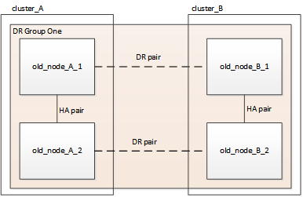

= 重新整理四節點MetroCluster 的不含功能的FC組態
:allow-uri-read: 
:icons: font
:imagesdir: ../media/

[role="lead"]
您可以將MetroCluster 組態擴充為八節點組態、然後移除舊的災難恢復（DR）群組、以四節點的形式升級控制器和儲存設備。

.關於這項工作
「舊節點」指您要取代的節點。

* 您只能使用MetroCluster 此程序在不含任何功能的基礎架構組態中重新整理特定的平台機型。
+
** 如需支援何種平台升級組合的資訊、請參閱MetroCluster 中的《The FzFC Refresh Table》 link:upgrade/concept_choosing_tech_refresh_mcc.html#supported-metrocluster-fc-tech-refresh-combinations["選擇系統重新整理方法"]。

.步驟
. 從舊節點收集資訊。
+
在此階段、四節點組態會顯示如下圖所示：

+

. 針對MetroCluster 您的類型執行四節點擴充程序中的所有步驟。
+
link:task_expand_a_four_node_mcc_fc_configuration_to_an_eight_node_configuration.html["將四節點MetroCluster 的不含資料的FC組態擴充至八節點組態"]

+
擴充程序完成後、組態會顯示如下圖所示：

+
image::../media/mcc_dr_group_b.png[MCC DR群組b]

. 移動CRS磁碟區。
+
執行中的步驟 https://docs.netapp.com/ontap-9/topic/com.netapp.doc.hw-metrocluster-service/task_move_a_metadata_volume_in_mcc_configurations.html["在MetroCluster 不完整的組態中移動中繼資料磁碟區"]。

. 使用下列程序、將資料從舊節點移至新節點 https://docs.netapp.com/platstor/topic/com.netapp.doc.hw-upgrade-controller/home.html["其他平台程序：控制器硬體升級Express"^]。
+
.. 執行中的所有步驟 http://docs.netapp.com/platstor/topic/com.netapp.doc.hw-upgrade-controller/GUID-AFE432F6-60AD-4A79-86C0-C7D12957FA63.html["建立Aggregate並將磁碟區移至新節點"]。
+

NOTE: 您可以選擇在建立時或之後鏡射集合體。

.. 執行中的所有步驟 http://docs.netapp.com/platstor/topic/com.netapp.doc.hw-upgrade-controller/GUID-95CA9262-327D-431D-81AA-C73DEFF3DEE2.html["將非SAN資料生命期和叢集管理生命期移至新節點"]。
.. 執行中的所有步驟 http://docs.netapp.com/platstor/topic/com.netapp.doc.hw-upgrade-controller/GUID-91EC7830-0C28-4C78-952F-6F956CC5A62F.html["從原始節點刪除SAN LIF"]。

. 請依照移除舊DR群組程序中的步驟進行。
+
link:concept_removing_a_disaster_recovery_group.html["移除災難恢復群組"]

+
移除舊的DR群組（DR群組1）之後、組態會顯示如下圖所示：

+
image::../media/mcc_dr_group_d.png[MCC DR群組d]

