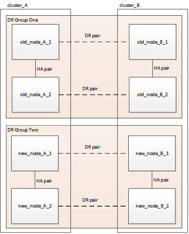
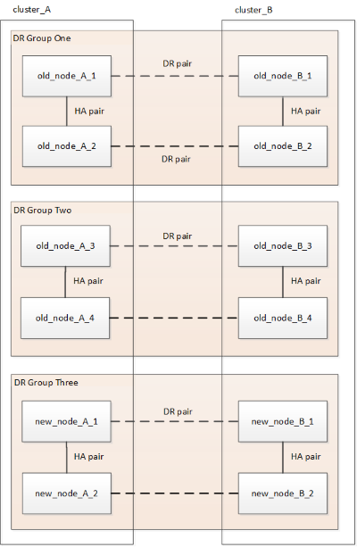

= 重新整理四節點或八節點 MetroCluster IP 組態（ ONTAP 9.8 及更新版本）
:allow-uri-read: 
:icons: font
:imagesdir: ../media/

[role="lead"]
您可以使用此程序來升級四節點或八節點組態中的控制器和儲存設備。

從 ONTAP 9.13.1 開始、您可以將組態擴充為暫時性的十二節點組態、然後移除舊的災難恢復（ DR ）群組、以八節點 MetroCluster IP 組態升級控制器和儲存設備。

從 ONTAP 9.8 開始、您可以將組態擴充為暫時性的八節點組態、然後移除舊的 DR 群組、以四節點 MetroCluster IP 組態中的控制器和儲存設備進行升級。

.關於這項工作
* 如果您有八節點組態、則系統必須執行 ONTAP 9.13.1 或更新版本。
* 如果您有四節點組態、則系統必須執行 ONTAP 9.8 或更新版本。
* 如果您也要升級 IP 交換器、則必須先升級它們、才能執行此重新整理程序。
* 本程序說明重新整理一個四節點 DR 群組所需的步驟。如果您有八個節點組態（兩個 DR 群組）、您可以重新整理一個或兩個 DR 群組。
+
如果您同時重新整理兩個 DR 群組、則必須一次重新整理一個 DR 群組。

* 「舊節點」指您要取代的節點。
* 對於八節點組態、必須支援來源和目標八節點 MetroCluster 平台組合。
+

NOTE: 如果您同時重新整理兩個 DR 群組、則在重新整理第一個 DR 群組之後、可能不支援平台組合。您必須重新整理兩個 DR 群組、才能達到支援的八節點組態。

* 您只能在 MetroCluster IP 組態中使用此程序來重新整理特定平台機型。
+
** 如需支援哪些平台升級組合的資訊、請參閱中的 MetroCluster IP 重新整理表格 link:../upgrade/concept_choosing_tech_refresh_mcc.html#supported-metrocluster-ip-tech-refresh-combinations["選擇系統重新整理方法"]。

* 適用來源與目標平台的下限。如果您移轉至較高的平台、則新平台的限制僅在所有 DR 群組的技術更新完成後才適用。
* 如果您對低於來源平台限制的平台執行技術更新、則在執行此程序之前、您必須調整並減少目標平台限制、以達到或低於目標平台限制。

.步驟
. 確認您在舊節點上建立了預設的廣播網域。
+
當您將新節點新增至沒有預設廣播網域的現有叢集時、會使用通用唯一識別碼（ UUID ）而非預期名稱、為新節點建立節點管理生命期。如需詳細資訊、請參閱知識庫文章 https://kb.netapp.com/onprem/ontap/os/Node_management_LIFs_on_newly-added_nodes_generated_with_UUID_names["在以 UUID 名稱產生的新新增節點上執行節點管理階層"^]。

. 從舊節點收集資訊。
+
在此階段、四節點組態會顯示如下圖所示：

+
image::../media/mcc_dr_group_a.png[MCC DR群組A]

+
八節點組態會顯示如下圖所示：

+
image::../media/mcc_dr_groups_8_node.gif[MCC DR群組8節點]

. 為了避免自動產生支援案例、請傳送AutoSupport 一個不全的訊息、指出正在進行升級。
+
.. 發出以下命令：+"System node" AutoSupport （系統節點）"esfinvoke -node"（節點）*-type all -most -most "MAn=10h正在將_old-temo_升級至_new模式"_"（系統節點名稱不完整）
+
下列範例指定10小時的維護時間。您可能想要根據計畫而多留一些時間。

+
如果維護作業在時間結束之前完成、您可以叫用AutoSupport 指示維護期間結束的資訊消息：

+
「系統節點AutoSupport 不完整地叫用節點*-type all -most MAn=end」

.. 在合作夥伴叢集上重複執行命令。

. 移除MetroCluster 可啟動切換功能的斷路器、調解器或其他軟體中現有的物件組態。
+
[cols="2*"]
|===

| 如果您使用... | 使用此程序... 

 a| 
Tiebreaker
 a| 
.. 使用tiebreaker CLI "monitor" remove"命令來移除MetroCluster 該組態。
+
在下列範例中、「叢集_a'」會從軟體中移除：

+
[listing]
----

NetApp MetroCluster Tiebreaker :> monitor remove -monitor-name cluster_A
Successfully removed monitor from NetApp MetroCluster Tiebreaker
software.
----
.. 使用斷路器 CLI 確認已正確移除 MetroCluster 組態 `monitor show -status` 命令。
+
[listing]
----

NetApp MetroCluster Tiebreaker :> monitor show -status
----

 a| 
中介者
 a| 
從資訊提示字元發出下列命令ONTAP ：

「取消組態設定中介程式」MetroCluster

 a| 
第三方應用程式
 a| 
請參閱產品文件。

|===
. 執行中的所有步驟 link:../upgrade/task_expand_a_four_node_mcc_ip_configuration.html["擴充 MetroCluster IP 組態"^] 可將新節點和儲存設備新增至組態。
+
當擴充程序完成時、會出現如下圖所示的暫存組態：

+
.暫時的八節點組態

+
.暫時性的十二節點組態

. 在兩個叢集上執行下列命令、確認可以進行接管、而且節點已連線：
+
「容錯移轉顯示」

+
[listing]
----
cluster_A::> storage failover show
                                    Takeover
Node           Partner              Possible    State Description
-------------- -------------------- ---------   ------------------
Node_FC_1      Node_FC_2              true      Connected to Node_FC_2
Node_FC_2      Node_FC_1              true      Connected to Node_FC_1
Node_IP_1      Node_IP_2              true      Connected to Node_IP_2
Node_IP_2      Node_IP_1              true      Connected to Node_IP_1
----
. 移動CRS磁碟區。
+
執行中的步驟 link:../maintain/task_move_a_metadata_volume_in_mcc_configurations.html["在MetroCluster 不完整的組態中移動中繼資料磁碟區"^]。

. 使用下列程序、將資料從舊節點移至新節點：
+
.. 執行中的所有步驟 https://docs.netapp.com/us-en/ontap-systems-upgrade/upgrade/upgrade-create-aggregate-move-volumes.html["建立Aggregate並將磁碟區移至新節點"^]。
+

NOTE: 您可以選擇在建立時或之後鏡射集合體。

.. 執行中的所有步驟 https://docs.netapp.com/us-en/ontap-systems-upgrade/upgrade/upgrade-move-lifs-to-new-nodes.html["將非 SAN 資料生命體和叢集管理生命體移至新節點"^]。

. 修改每個叢集之轉換節點的叢集對等端 IP 位址：
+
.. 使用識別叢集對等端點 `cluster peer show` 命令：
+
[listing]
----
cluster_A::> cluster peer show
Peer Cluster Name         Cluster Serial Number Availability   Authentication
------------------------- --------------------- -------------- --------------
cluster_B         1-80-000011           Unavailable    absent
----
+
... 修改叢集 A 對等 IP 位址：
+
`cluster peer modify -cluster cluster_A -peer-addrs node_A_3_IP -address-family ipv4`

.. 使用識別叢集 _B 對等端點 `cluster peer show` 命令：
+
[listing]
----
cluster_B::> cluster peer show
Peer Cluster Name         Cluster Serial Number Availability   Authentication
------------------------- --------------------- -------------- --------------
cluster_A         1-80-000011           Unavailable    absent
----
+
... 修改叢集 _B 對等 IP 位址：
+
`cluster peer modify -cluster cluster_B -peer-addrs node_B_3_IP -address-family ipv4`

.. 確認每個叢集的叢集對等 IP 位址都已更新：
+
... 使用確認每個叢集的 IP 位址都已更新 `cluster peer show -instance` 命令。
+
。 `Remote Intercluster Addresses` 下列範例中的欄位會顯示更新的 IP 位址。

+
叢集 A 的範例：

+
[listing]
----
cluster_A::> cluster peer show -instance

Peer Cluster Name: cluster_B
           Remote Intercluster Addresses: 172.21.178.204, 172.21.178.212
      Availability of the Remote Cluster: Available
                     Remote Cluster Name: cluster_B
                     Active IP Addresses: 172.21.178.212, 172.21.178.204
                   Cluster Serial Number: 1-80-000011
                    Remote Cluster Nodes: node_B_3-IP,
                                          node_B_4-IP
                   Remote Cluster Health: true
                 Unreachable Local Nodes: -
          Address Family of Relationship: ipv4
    Authentication Status Administrative: use-authentication
       Authentication Status Operational: ok
                        Last Update Time: 4/20/2023 18:23:53
            IPspace for the Relationship: Default
Proposed Setting for Encryption of Inter-Cluster Communication: -
Encryption Protocol For Inter-Cluster Communication: tls-psk
  Algorithm By Which the PSK Was Derived: jpake

cluster_A::>

----
+
叢集 B 的範例

+
[listing]
----
cluster_B::> cluster peer show -instance

                       Peer Cluster Name: cluster_A
           Remote Intercluster Addresses: 172.21.178.188, 172.21.178.196 <<<<<<<< Should reflect the modified address
      Availability of the Remote Cluster: Available
                     Remote Cluster Name: cluster_A
                     Active IP Addresses: 172.21.178.196, 172.21.178.188
                   Cluster Serial Number: 1-80-000011
                    Remote Cluster Nodes: node_A_3-IP,
                                          node_A_4-IP
                   Remote Cluster Health: true
                 Unreachable Local Nodes: -
          Address Family of Relationship: ipv4
    Authentication Status Administrative: use-authentication
       Authentication Status Operational: ok
                        Last Update Time: 4/20/2023 18:23:53
            IPspace for the Relationship: Default
Proposed Setting for Encryption of Inter-Cluster Communication: -
Encryption Protocol For Inter-Cluster Communication: tls-psk
  Algorithm By Which the PSK Was Derived: jpake

cluster_B::>
----

. 請依照中的步驟進行 link:concept_removing_a_disaster_recovery_group.html["移除災難恢復群組"] 移除舊的 DR 群組。
. 如果您想要在八節點組態中同時重新整理兩個 DR 群組、則必須針對每個 DR 群組重複整個程序。
+
移除舊的 DR 群組之後、組態會顯示如下圖所示：

+
.四節點組態
image::../media/mcc_dr_group_d.png[MCC DR群組d]

+
.八節點組態
image::../media/mcc_dr_group_c5.png[MCC DR 群組 C5]

. 確認MetroCluster 執行功能不正常的操作模式、並執行MetroCluster 功能不實的檢查。
+
.. 確認MetroCluster 執行功能組態、並確認操作模式正常：
+
《不看》MetroCluster

.. 確認顯示所有預期節點：
+
「不一樣的秀」MetroCluster

.. 發出下列命令：
+
《不一樣的跑程》MetroCluster

.. 顯示MetroCluster 檢查結果：
+
《不一樣的表演》MetroCluster

. 如有必要、請使用您的組態程序來還原監控功能。
+
[cols="2*"]
|===

| 如果您使用... | 請使用此程序 

 a| 
Tiebreaker
 a| 
link:../tiebreaker/concept_configuring_the_tiebreaker_software.html#adding-metrocluster-configurations["新增MetroCluster 功能"] 在_ MetroCluster 資料斷路器安裝與組態_中。

 a| 
中介者
 a| 
link:https://docs.netapp.com/us-en/ontap-metrocluster/install-ip/concept_mediator_requirements.html["從ONTAP 一套不實的IP組態設定「不實不作」MetroCluster 服務"] 在 MetroCluster IP 安裝與組態 _ 中。

 a| 
第三方應用程式
 a| 
請參閱產品文件。

|===
. 若要恢復自動產生支援案例、請傳送AutoSupport 一個不完整的訊息、表示維護已完成。
+
.. 發出下列命令：
+
「系統節點AutoSupport 不完整地叫用節點*-type all -most MAn=end」

.. 在合作夥伴叢集上重複執行命令。

