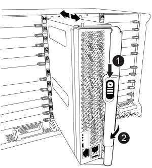

= 使用交換器和切換功能（AFF 更新版本）、將控制器從功能性的A700/FAS9000升級AFF 至功能性的S還原A900/FAS9500 MetroCluster （以不整合的IP組態）ONTAP
:allow-uri-read: 

[role="lead"]
您可以在MetroCluster 升級合作夥伴叢集上的控制器模組時、使用「支援交換」作業來為用戶端提供不中斷營運的服務。其他元件（例如儲存櫃或交換器）無法在此程序中進行升級。

.關於這項工作
* 若要將AFF 處理器2700控制器模組升級AFF 至更新版本、控制器必須執行ONTAP 版本為《更新版本》的版本。
* 若要將FAS9000控制器模組升級至FAS95000、控制器必須執行ONTAP 版本不只是執行版本不符合要求的版本。
* 組態中的所有控制器都應在相同的維護期間進行升級。
+
在MetroCluster 本維護活動之外、不支援以AFF 不支援使用NetApp的A700和AFF 不支援使用FASA900或FAS9000和FAS9500控制器來操作此組態。

* IP交換器必須執行支援的韌體版本。
* 您將在新平台上重複使用原始平台的IP位址、網路遮罩和閘道。
* 本程序中使用下列範例名稱、包括範例和圖形：
+
** 站台_A
+
*** 升級前：
+
**** node_a_1-A700
**** node_a_2-A700

*** 升級後：
+
**** node_a_1-A900
**** 節點_a_2-A900

** 站台_B
+
*** 升級前：
+
**** 節點_B_1-A700
**** 節點_B_2-A700

*** 升級後：
+
**** 節點_B_1-A900
**** 節點_B_2-A900

== 啟用主控台記錄

NetApp 強烈建議您在使用的裝置上啟用主控台記錄功能、並在執行此程序時採取下列動作：

* 在維護期間保持啟用 AutoSupport 。
* 在維護之前和之後觸發維護 AutoSupport 訊息、以在維護活動期間停用案例建立。
+
請參閱知識庫文章 link:https://kb.netapp.com/Support_Bulletins/Customer_Bulletins/SU92["如何在排程的維護期間、隱藏自動建立個案"^]。

* 啟用任何 CLI 工作階段的工作階段記錄。有關如何啓用會話日誌記錄的說明，請查看知識庫文章中的“日誌記錄會話輸出”部分 link:https://kb.netapp.com/on-prem/ontap/Ontap_OS/OS-KBs/How_to_configure_PuTTY_for_optimal_connectivity_to_ONTAP_systems["如何設定 Putty 以最佳化連線至 ONTAP 系統"^]。

== 升級MetroCluster 以供升級的控制器之用的流程、採用一套不需更新的IP組態

您可以使用工作流程圖來協助規劃升級工作。

image::../media/workflow_ip_upgrade.png[工作流程IP升級]

== 準備升級

在對現有MetroCluster 的版本進行任何變更之前、您必須檢查組態的健全狀況、準備新平台、以及執行其他雜項工作。

=== 清除AFF VMware的插槽7或FAS9000控制器

在一個不含任何功能的基礎架構上、使用位於插槽5和7的DR卡上的每個連接埠之一。MetroCluster AFF在開始升級之前、如果AFF 在插槽7中的插槽7或FAS9000中有插卡、您必須將其移至叢集所有節點的其他插槽。

=== 在升級控制器之前、請先更新MetroCluster RCF交換器檔案

執行此升級時、您必須更新MetroCluster 位於BIOS交換器上的RCF檔案。下表提供AFF 支援的VLAN範圍、以利執行不支援的FASA900/FAS9500/IP MetroCluster 組態。

|===

| 平台模式 | 支援的VLAN ID 

 a| 
* FASA900或FAS9500 AFF

 a| 
* 10.
* 20
* 範圍101到4096（含）的任何值。

|===
* 如果交換器未設定支援的最小RCF檔案版本、您必須更新RCF檔案。如需正確的交換器機型RCF檔案版本、請參閱 link:https://mysupport.netapp.com/site/tools/tool-eula/rcffilegenerator["RcfFileGenerator"^]。下列步驟適用於RCF檔案應用程式。

.步驟
. 準備IP交換器以應用新的RCF檔案。
+
請依照您的交換器廠商章節中的步驟進行：

+
** link:../install-ip/task_switch_config_broadcom.html#resetting-the-broadcom-ip-switch-to-factory-defaults["將Broadcom IP交換器重設為原廠預設值"]
** link:../install-ip/task_switch_config_cisco.html#resetting-the-cisco-ip-switch-to-factory-defaults["將 Cisco IP 交換器重設為原廠預設值"]
** link:../install-ip/task_switch_config_nvidia.html#reset-the-nvidia-ip-sn2100-switch-to-factory-defaults["將 NVIDIA IP 交換器重設為原廠預設值"]

. 下載並安裝RCF檔案。
+
請依照您的交換器廠商章節中的步驟進行：

+
** link:../install-ip/task_switch_config_broadcom.html#downloading-and-installing-the-broadcom-rcf-files["下載並安裝 Broadcom RCF 檔案"]
** link:../install-ip/task_switch_config_cisco.html#downloading-and-installing-the-cisco-ip-rcf-files["下載並安裝 Cisco IP RCF 檔案"]
** link:../install-ip/task_switch_config_nvidia.html#download-and-install-the-nvidia-rcf-files["下載並安裝 NVIDIA IP RCF 檔案"]

=== 將舊節點的連接埠對應至新節點

當從AFF EWSAE700升級至AFF EWSAF900或FAS9000至FAS9500時、您不會變更資料網路連接埠、FCP SAN介面卡連接埠、以及SAS和NVMe儲存連接埠。資料生命期會在升級期間和升級後持續運作。因此、您不需要將舊節點的網路連接埠對應至新節點。

=== 在現場升級之前、請先驗MetroCluster 證其健全狀況

在執行升級之前、您必須先驗證MetroCluster 整個過程的健全狀況和連線能力。

.步驟
. 驗證MetroCluster 下列項目中的功能：ONTAP
+
.. 檢查節點是否具有多路徑：+「節點執行-node-name_ sysconfig -A」
+
您應該為MetroCluster Eflexeconfiguration中的每個節點發出此命令。

.. 驗證組態中沒有損壞的磁碟：+「磁碟顯示-中斷」
+
您應該在MetroCluster Eflexeconfiguration中的每個節點上發出此命令。

.. 檢查是否有任何健全狀況警示：
+
「系統健全狀況警示顯示」

+
您應該在每個叢集上發出此命令。

.. 驗證叢集上的授權：
+
「系統授權展示」

+
您應該在每個叢集上發出此命令。

.. 驗證連接至節點的裝置：
+
「網路裝置探索秀」

+
您應該在每個叢集上發出此命令。

.. 確認兩個站台的時區和時間設定正確：
+
「叢集日期顯示」

+
您應該在每個叢集上發出此命令。您可以使用「叢集日期」命令來設定時間和時區。

. 確認MetroCluster 執行功能不正常的操作模式、並執行MetroCluster 功能不實的檢查。
+
.. 確認MetroCluster 此功能的組態、操作模式為「正常」：+ MetroCluster 「show」
.. 確認所有預期的節點均顯示：+「MetroCluster 不實節點顯示」
.. 發出下列命令：
+
《不一樣的跑程》MetroCluster

.. 顯示MetroCluster 檢查結果：
+
《不一樣的表演》MetroCluster

. 使用MetroCluster 「資訊工具」檢查「資訊系統」的纜線。Config Advisor
+
.. 下載並執行Config Advisor 更新。
+
https://mysupport.netapp.com/site/tools/tool-eula/activeiq-configadvisor["NetApp下載Config Advisor"^]

.. 執行Config Advisor 完功能後、請檢閱工具的輸出結果、並依照輸出中的建議來解決發現的任何問題。

=== 在升級之前收集資訊

在升級之前、您必須先收集每個節點的資訊、並視需要調整網路廣播網域、移除任何VLAN和介面群組、以及收集加密資訊。

.步驟
. 記錄每個節點的實體纜線、視需要標示纜線、以便正確連接新節點。
. 收集每個節點的下列命令輸出：
+
** 《不互連秀》MetroCluster
** 「組態設定連線顯示」MetroCluster
** 「網路介面show -role叢集、node-mgmt」
** 「網路連接埠show -node_name -type Physical」
** 「網路連接埠VLAN show -node-name_」
** 「網路連接埠ifgrp show -node_node_name_-instance」
** 「網路連接埠廣播網域節目」
** 「網路連接埠連線能力顯示-詳細資料」
** 「網路IPSpace節目」
** 「Volume show」
** 《集合體展》
** 「系統節點執行節點_norme-name_ sysconfig -A」
** 「Vserver FCP啟動器顯示」
** 「磁碟展示」
** 「顯示組態設定介面」MetroCluster

. 收集站台B（目前正在升級其平台的站台）的UUID：「MetroCluster 節點show -Fields node-cluster -uuid、node-uuid」
+
這些值必須在新的站台控制器模組上正確設定、以確保成功升級。將值複製到檔案、以便稍後在升級程序中複製到適當的命令。+下列範例顯示含有UID的命令輸出：

+
[listing]
----
cluster_B::> metrocluster node show -fields node-cluster-uuid, node-uuid
   (metrocluster node show)
dr-group-id cluster     node   node-uuid                            node-cluster-uuid
----------- --------- -------- ------------------------------------ ------------------------------
1           cluster_A node_A_1-A700 f03cb63c-9a7e-11e7-b68b-00a098908039 ee7db9d5-9a82-11e7-b68b-00a098908039
1           cluster_A node_A_2-A700 aa9a7a7a-9a81-11e7-a4e9-00a098908c35 ee7db9d5-9a82-11e7-b68b-00a098908039
1           cluster_B node_B_1-A700 f37b240b-9ac1-11e7-9b42-00a098c9e55d 07958819-9ac6-11e7-9b42-00a098c9e55d
1           cluster_B node_B_2-A700 bf8e3f8f-9ac4-11e7-bd4e-00a098ca379f 07958819-9ac6-11e7-9b42-00a098c9e55d
4 entries were displayed.
cluster_B::*

----
+
建議您將UUID記錄到如下表格中。

+
|===

| 叢集或節點 | UUID 

 a| 
叢集_B
 a| 
07958819-9ac6-11e7-9b42-00a098c9e55d

 a| 
節點_B_1-A700
 a| 
f37b240b-9ac1-11e7-9b42-00a098c9e55d

 a| 
節點_B_2-A700
 a| 
bf8e3f8f-9ac4-11e7-bd4e-00a098ca379f

 a| 
叢集_A
 a| 
ee7db9d5-9a82-11e7-b68b-00a098908039

 a| 
node_a_1-A700
 a| 
f03cb63c-9a7e-11e7-b68b-00a098908039

 a| 
node_a_2-A700
 a| 
aa9a7a7a-9a81-11e7-a4e9-00a098908c35

|===
. 如果MetroCluster 支援SAN組態、請收集相關資訊。
+
您應該收集下列命令的輸出：

+
** 「FCP介面卡顯示-instance」
** 「FCP介面show -instance」
** 「iSCSI介面展示」
** 「ucadmin show」

. 如果根磁碟區已加密、請收集並儲存用於金鑰管理程式的密碼：「安全金鑰管理程式備份顯示」
. 如果MetroCluster 這個節點正在使用磁碟區或集合體的加密功能、請複製金鑰和複製密碼的相關資訊。如需其他資訊、請參閱 https://docs.netapp.com/us-en/ontap/encryption-at-rest/backup-key-management-information-manual-task.html["手動備份內建金鑰管理資訊"^]。
+
.. 如果設定「Onboard Key Manager（機載金鑰管理程式）」、請在稍後的升級程序中輸入「ecurity key-manager Onboard show-Backup（機載顯示備份）」+。
.. 如果已設定企業金鑰管理（KMIP）、請發出下列命令：
+
....
security key-manager external show -instance
security key-manager key query
....

. 收集現有節點的系統ID：「MetroCluster Sic節點show -Fields node-SystemID、ha-合作 夥伴SystemID、DR-Partner SystemID、DR-auxiliary SystemID」
+
下列輸出顯示重新指派的磁碟機。

+
[listing]
----
::> metrocluster node show -fields node-systemid,ha-partner-systemid,dr-partner-systemid,dr-auxiliary-systemid

dr-group-id cluster     node     node-systemid ha-partner-systemid dr-partner-systemid dr-auxiliary-systemid
----------- ----------- -------- ------------- ------------------- ------------------- ---------------------
1           cluster_A node_A_1-A700   537403324     537403323           537403321           537403322
1           cluster_A node_A_2-A700   537403323     537403324           537403322          537403321
1           cluster_B node_B_1-A700   537403322     537403321           537403323          537403324
1           cluster_B node_B_2-A700   537403321     537403322           537403324          537403323
4 entries were displayed.
----

=== 移除內管或斷路器監控

在升級平台之前、如果MetroCluster 使用斷路器或調解器公用程式監控了該組態、您必須先移除監控。

.步驟
. 收集下列命令的輸出：
+
「iSCSI啟動器展示」

. 移除MetroCluster 可啟動切換功能的斷路器、調解器或其他軟體中現有的物件組態。
+
|===

| 如果您使用... | 使用此程序... 

 a| 
Tiebreaker
 a| 
link:../tiebreaker/concept_configuring_the_tiebreaker_software.html#removing-metrocluster-configurations["移除MetroCluster 部分組態"] 在「安裝MetroCluster 與組態」內容中

 a| 
中介者
 a| 
從資訊提示字元發出下列命令ONTAP ：

「取消組態設定中介程式」MetroCluster

 a| 
第三方應用程式
 a| 
請參閱產品文件。

|===

=== 在維護前傳送自訂AutoSupport 的支援訊息

在執行維護之前、您應發出AutoSupport 一份不知所知的訊息、通知技術支援人員正在進行維護。告知技術支援部門正在進行維護、可防止他們假設發生中斷、而開啟案例。

.關於這項工作
此工作必須在每MetroCluster 個站台上執行。

.步驟
. 登入叢集。
. 叫出AutoSupport 指示維護開始的消息：
+
「系統節點AutoSupport 不支援節點*-type all -most maints=_maintening-window-in-thing__」

+
"maintenance window-in-hours（維護時間間隔）"參數指定維護時間的長度、最長可達72小時。如果維護作業在時間結束之前完成、您可以叫用AutoSupport 指示維護期間結束的資訊消息：

+
「系統節點AutoSupport 不完整地叫用節點*-type all -most MAn=end」

. 在合作夥伴網站上重複這些步驟。

== 切換MetroCluster 整個過程

您必須將組態切換為站台A、才能升級站台B上的平台。

.關於這項工作
此工作必須在sSite _A上執行

完成此工作之後、Site_A會處於作用中狀態、並為兩個站台提供資料。站台_B處於非作用中狀態、準備開始升級程序。

image::../media/mcc_upgrade_cluster_a_in_switchover_A900.png[在switchover A900中、MCC升級叢集A]

.步驟
. 切換MetroCluster 到站台A的支援、以便站台B的節點升級：
+
.. 在se_a上發出下列命令：
+
「不需要更換控制器」MetroCluster

+
此作業可能需要數分鐘才能完成。

.. 監控切換作業：
+
《不穩定營運展》MetroCluster

.. 作業完成後、請確認節點處於切換狀態：
+
《不看》MetroCluster

.. 檢查MetroCluster 不實節點的狀態：
+
「不一樣的秀」MetroCluster

+
在控制器升級期間、會停用協調式切換後的Aggregate自動修復功能。站台B的節點會在「載入器」提示字元停止。

== 移除AFF 不完整的平台控制器模組和NVS

.關於這項工作
如果您尚未接地、請正確接地。

.步驟
. 從站台B的兩個節點收集bootarg值：「printenv」
. 關閉站台B的機箱電源

=== 移除AFF 「功能不整」或「FAS9000」控制器模組

請使用下列程序移除AFF 不適用的A700或FAS9000控制器模組

.步驟
. 在卸下控制器模組之前、請先從控制器模組拔下主控台纜線（如果有）和管理纜線。
. 解除鎖定並從機箱中取出控制器模組。
+
.. 將CAM把手上的橘色按鈕向下推、直到解鎖為止。
+

+
|===

| image:../media/number1.png["第1號"] | CAM握把釋放鈕 

| image:../media/number2.png["編號2"] | CAM握把 
|===
.. 旋轉CAM握把、使其完全脫離機箱的控制器模組、然後將控制器模組滑出機箱。將控制器模組滑出機箱時、請確定您支援控制器模組的底部。

=== 移除AFF 「FASA700」或「FAS9000 NVS」模組

請使用下列程序移除AFF 「不適用的」A700或FAS9000 NVS模組。

附註：NVS模組位於插槽6、高度是系統中其他模組的兩倍。

.步驟
. 解除鎖定、然後從插槽6移除NVS。
+
.. 按下有字母和編號的「CAM」按鈕。CAM按鈕會從機箱移出。
.. 向下轉動CAM栓鎖、直到其處於水平位置。此時、系統會從機箱中鬆脫、並移動數英吋。
.. 拉動模組面兩側的拉片、將NVS從機箱中移除。
+
image::../media/drw_a900_move-remove_NVRAM_module.png[移除模組]

+
|===

| image:../media/number1.png["第1名"] | I/O CAM栓鎖有編號和編號 

| image:../media/number2.png["第2名"] | I/O鎖定完全解除鎖定 
|===

. 如果您在AFF 使用附加模組做為ESIA700或FAS9000軟體上的核心傾印裝置、請勿將其傳輸至AFF ESIA900或FAS9500軟體。請勿將AFF 任何零件從無法識別的A700或FAS9000控制器模組和NVS移轉至AFF 無法識別的A900或FAS9500模組。

== 安裝AFF 「FASA900」或「FAS9500」的NVS和控制器模組

您必須在AFF 站台B的兩個節點上、安裝升級套件中所附的支援功能不支援的FASA900或FAS9500軟體與控制器模組請勿將coredump裝置從AFF 無法識別的A700或FAS9000 NVS模組移至AFF 無法識別的A900或FAS9500 NVS模組。

.關於這項工作
如果您尚未接地、請正確接地。

=== 安裝AFF 《不再需要的產品」

請使用下列程序、在AFF 站台B的兩個節點插槽6中安裝支援的ArfeA900或FAS9500

.步驟
. 將NVS與插槽6中機箱開孔的邊緣對齊。
. 將NVS輕推入插槽、直到帶有字母和編號的I/O CAM栓開始與I/O CAM栓接合為止、然後將I/O CAM栓完全推入、以將NVS鎖定到位。
+
image::../media/drw_a900_move-remove_NVRAM_module.png[移除模組]

+
|===

| image:../media/number1.png["第1名"] | I/O CAM栓鎖有編號和編號 

| image:../media/number2.png["第2名"] | I/O鎖定完全解除鎖定 
|===

=== 安裝AFF 「FASA900」或「FAS9500」控制器模組。

請使用下列程序來安裝AFF 《非洲的不規則及不規則」（FAS900）或「FAS9500」（FAS9500）控制器模組。

.步驟
. 將控制器模組的一端與機箱的開口對齊、然後將控制器模組輕推至系統的一半。
. 將控制器模組穩固地推入機箱、直到它與中間板完全接入。控制器模組完全就位時、鎖定鎖定鎖定會上升。注意：為避免損壞連接器、請勿在將控制器模組滑入機箱時過度施力。
. 將管理連接埠和主控台連接埠連接至控制器模組。
+

+
|===

| image:../media/number1.png["第1名"] | CAM握把釋放鈕 

| image:../media/number2.png["編號2"] | CAM握把 
|===
. 在每個節點的插槽7中安裝第二個X91146A卡。
+
.. 將e5b連線移至e7b。
.. 將e5a連線移至e5b。
+

NOTE: 叢集所有節點上的插槽 7 應為空的、如一節所述 <<upgrade_a700_a900_ip_map,將舊節點的連接埠對應至新節點>> 。

. 開啟機箱電源、並連接至序列主控台。
. BIOS初始化之後、如果節點啟動自動開機、請按Ctrl-C中斷自動開機
. 自動開機中斷後、節點會在載入程式提示字元停止。如果您未準時中斷自動開機、且節點1開始開機、請等待提示訊息、按Ctrl-C進入開機功能表。節點在開機功能表停止後、請使用選項8重新啟動節點、並在重新開機期間中斷自動開機。
. 在載入程式提示下、設定預設環境變數：Set-Defaults
. 儲存預設環境變數設定：「aveenv」

=== netboot節點位於se_B

在交換AFF 完FASA900或FAS9500控制器模組和NVS之後、您需要將AFF 該節點的叢集開機至NETBOOT或FAS9500節點、並安裝叢ONTAP 集上執行的相同的版本更新和修補程式層級。「netboot」一詞是指您從ONTAP 儲存在遠端伺服器上的不實映像進行開機。準備網路開機時、您必須在ONTAP 系統可以存取的網路伺服器上新增一份《支援》9開機映像。除非安裝在機箱中並已開啟電源、否則無法檢查ONTAP 安裝在AFF 架構套件上的支援媒體版本、例如：在執行於正在升級的S景 點A700或FAS9000系統上的支援功能、必須與執行此功能的支援功能相同、而且主要和備份開機映像都必須相符。ONTAP AFF ONTAP AFF您可以在開機功能表中執行netboot、然後執行wappeconfig命令來設定映像。如果控制器模組先前曾在另一個叢集中使用、則「wifeconfig」命令會清除開機媒體上的任何剩餘組態。

.開始之前
* 確認您可以使用系統存取HTTP伺服器。
* 您需要從ONTAP NetApp支援網站下載系統所需的系統檔案、以及正確版本的支援。

.關於這項工作
如果ONTAP 安裝的版本不同於原始控制器上安裝的版本、則您必須為新的控制器進行網路開機。安裝每個新的控制器之後、您可以從ONTAP 儲存在Web伺服器上的Image9映像來啟動系統。然後、您可以將正確的檔案下載到開機媒體裝置、以供後續系統開機。

.步驟
. 存取 https://mysupport.netapp.com/site/["NetApp 支援網站"^] 可下載用於執行系統netboot的文件。
. [step2-download-software]請ONTAP 從NetApp支援網站的軟體下載區段下載適當的支援軟體、並將「ONTAP-VERON_image.tgz」檔案儲存在可從網路存取的目錄中。
. 切換至網路存取目錄、並確認您所需的檔案可用。
. 您的目錄清單應包含<ONTAP_VERSION >\_image.tgz。
. 選擇下列其中一項動作來設定netboot連線。
+

NOTE: 您應該使用管理連接埠和IP做為netboot連線。請勿使用資料LIF IP、否則在執行升級時可能會發生資料中斷。

+
|===

| 如果動態主機組態傳輸協定（DCHP）是... | 然後... 

 a| 
執行中
 a| 
在開機環境提示字元中使用下列命令自動設定連線：「ifconfige0M -auto」

 a| 
未執行
 a| 
在開機環境提示字元中使用下列命令手動設定連線：「ifconfige0M -addr=<filer_addr>-mask=<netmask>-gateway=- dns =<dns _addr> domain=<dns網域>」

'<filer_addr>'是儲存系統的IP位址。「網路遮罩」是儲存系統的網路遮罩。「<閘道>」是儲存系統的閘道。'<DNs_addr>'是網路上名稱伺服器的IP位址。此參數為選用項目。'<DNs_domain>'是網域名稱服務（DNS）網域名稱。此參數為選用項目。附註：您的介面可能需要其他參數。在韌體提示字元中輸入「Help ifconfig」以取得詳細資料。

|===
. 在 node_B_1 上執行 netboot ：
`netboot` `\http://<web_server_ip/path_to_web_accessible_directory>/netboot/kernel`
+
「<path_to_the_web-易於 存取的目錄>」應該會引導您下載「<ONTAP_VERSION >\_image.tgz」 <<step2-download-software,步驟2>>。

+

NOTE: 請勿中斷開機。

. 請等待節點B_1現在在AFF 執行下列動作的情況下、從支援的支援範圍內啟動、並顯示開機功能表選項：
+
[listing]
----
Please choose one of the following:

(1)  Normal Boot.
(2)  Boot without /etc/rc.
(3)  Change password.
(4)  Clean configuration and initialize all disks.
(5)  Maintenance mode boot.
(6)  Update flash from backup config.
(7)  Install new software first.
(8)  Reboot node.
(9)  Configure Advanced Drive Partitioning.
(10) Set Onboard Key Manager recovery secrets.
(11) Configure node for external key management.
Selection (1-11)?
----
. 從開機功能表中、選取選項「（7）Install new software first（先安裝新軟體）」 此功能表選項會下載新ONTAP 的功能表映像、並將其安裝至開機裝置。附註：請忽略下列訊息：「HA配對不支援此程序進行不中斷升級。 本附註適用於不中斷營運ONTAP 的更新版軟體、不適用於控制器升級。
+
請務必使用netboot將新節點更新為所需映像。如果您使用其他方法在新控制器上安裝映像、可能會安裝不正確的映像。此問題適用於ONTAP 所有的版本。

. 如果系統提示您繼續此程序、請輸入 `y`，當系統提示您輸入套件時，請輸入 URL ：
`\http://<web_server_ip/path_to_web-accessible_directory>/<ontap_version>\_image.tgz`
. 完成下列子步驟以重新啟動控制器模組：
+
.. 當您看到以下提示時、請輸入「n」跳過備份恢復：「您現在要還原備份組態嗎？｛y | n｝
.. 當您看到以下提示時、請輸入「y」重新開機：「必須重新啟動節點、才能開始使用新安裝的軟體。是否要立即重新開機？｛y：n｝'控制器模組會重新開機、但會在開機功能表停止、因為開機裝置已重新格式化、而且需要還原組態資料。

. 出現提示時、請執行「wecponfig」命令、清除開機媒體上任何先前的組態：
+
.. 當您看到下列訊息時、請回答「yes」：「這將會刪除重要的系統組態、包括叢集成員資格。警告：請勿在已接管的HA節點上執行此選項。您確定要繼續嗎
.. 節點會重新開機以完成「wecpionfig」、然後在開機功能表停止。

. 從開機功能表中選取「5」選項以進入維護模式。對提示回答「yes」、直到節點停止於維護模式和命令提示字元\*。
. 重複這些步驟以netboot node_B_2。

=== 還原HBA組態

視控制器模組中是否有HBA卡及其組態而定、您必須針對站台的使用狀況正確設定這些卡。

.步驟
. 在維護模式中、設定系統中任何HBA的設定：
+
.. 檢查連接埠的目前設定：
+
「ucadmin show」

.. 視需要更新連接埠設定。

+
|===

| 如果您有此類型的HBA和所需模式... | 使用此命令... 

 a| 
CNA FC
 a| 
「ucadmin modify -m光纖信道-t啟動器_adapter-name_」

 a| 
CNA乙太網路
 a| 
「ucadmin modify -mode cna _adapter-name_」

 a| 
FC目標
 a| 
「fcadmin config -t target _adapter-name_」

 a| 
FC啟動器
 a| 
「fcadmin config -t啟動器_adapter-name_」

|===
. 結束維護模式：
+
《停止》

+
執行命令之後、請等到節點停止在載入程式提示字元。

. 將節點開機回「維護」模式、使組態變更生效：
+
Boot_ONTAP maint

. 驗證您所做的變更：
+
|===

| 如果您有這種HBA類型... | 使用此命令... 

 a| 
CNA
 a| 
「ucadmin show」

 a| 
FC
 a| 
「fcadmin show」

|===

=== 在新的控制器和機箱上設定HA狀態

您必須驗證控制器和機箱的HA狀態、並視需要更新狀態以符合您的系統組態。

.步驟
. 在維護模式中、顯示控制器模組和機箱的HA狀態：
+
《ha-config show》

+
所有元件的HA狀態都應該是「mCCIP」。

. 如果顯示的控制器或機箱系統狀態不正確、請設定HA狀態：
+
「ha-config modify控制器mccip」

+
「ha-config modify機箱mccip」

. 停止節點：「halt」
+
節點應在「loader>」提示字元停止。

. 在每個節點上、檢查系統日期、時間和時區：「顯示日期」
. 如有必要、請以UTC或格林尼治標準時間：「et date <mm/dd/ed/yed>'（設定日期<mm/dd/ym/西元年>）」設定日期
. 請在開機環境提示字元中使用下列命令檢查時間：「How Time」（顯示時間）
. 如有必要、請以UTC或格林尼治標準時間設定時間：「設定時間<hh：mm：ss>」
. 儲存設定：「aveenv」
. 收集環境變數：「prontenv」

== 更新交換器RCF檔案以容納新平台

您必須將交換器更新為支援新平台機型的組態。

.關於這項工作
您可以在包含目前正在升級之控制器的站台上執行此工作。在本程序所示的範例中、我們會先升級se_B。

站台A的交換器將在站台A上的控制器升級時升級。

.步驟
. 準備IP交換器以應用新的RCF檔案。
+
請依照您的交換器廠商章節中的步驟進行：

+
** link:../install-ip/task_switch_config_broadcom.html#resetting-the-broadcom-ip-switch-to-factory-defaults["將Broadcom IP交換器重設為原廠預設值"]
** link:../install-ip/task_switch_config_cisco.html#resetting-the-cisco-ip-switch-to-factory-defaults["將 Cisco IP 交換器重設為原廠預設值"]
** link:../install-ip/task_switch_config_nvidia.html#reset-the-nvidia-ip-sn2100-switch-to-factory-defaults["將NVIDIA IP SN2100交換器重設為原廠預設值"]

. 下載並安裝RCF檔案。
+
請依照您的交換器廠商章節中的步驟進行：

+
** link:../install-ip/task_switch_config_broadcom.html#downloading-and-installing-the-broadcom-rcf-files["下載並安裝 Broadcom RCF 檔案"]
** link:../install-ip/task_switch_config_cisco.html#downloading-and-installing-the-cisco-ip-rcf-files["下載並安裝 Cisco IP RCF 檔案"]
** link:../install-ip/task_switch_config_nvidia.html#download-and-install-the-nvidia-rcf-files["下載並安裝 NVIDIA IP RCF 檔案"]

== 設定新的控制器

此時應準備好新的控制器、並連接好纜線。

=== 設定MetroCluster 靜態IP bootarg變數

必須MetroCluster 在新的控制器模組上設定特定的靜態IP bootarg值。這些值必須與舊控制器模組上設定的值相符。

.關於這項工作
在此任務中，您將使用中升級過程前面確定的 UUID 和系統 ID <<在升級之前收集資訊>>。

.步驟
. 在「loader>」提示字元中、在s加 載點B的新節點上設定下列bootargs：
+
「etenv bootarg.mC.port_a_ip_config _local-ip-address/local-ip-mask,0、HA合作夥伴-ip-address、DR-partner-ip-address,DR-aux-partnersip-address,vlan-id_」

+
「etenv bootarg.mC.port_b_ip_config _local-ip-address/local-ip-mask,0、HA合作夥伴-ip-address,DR-partner-ip-address,DR-aux-partnersip-address,vlan-id_'」

+
下列範例設定節點_B_1-A900的值、第一個網路使用VLAN 120、第二個網路使用VLAN 130：

+
[listing]
----
setenv bootarg.mcc.port_a_ip_config 172.17.26.10/23,0,172.17.26.11,172.17.26.13,172.17.26.12,120
setenv bootarg.mcc.port_b_ip_config 172.17.27.10/23,0,172.17.27.11,172.17.27.13,172.17.27.12,130
----
+
下列範例設定節點_B_2-A900的值、第一個網路使用VLAN 120、第二個網路使用VLAN 130：

+
[listing]
----
setenv bootarg.mcc.port_a_ip_config 172.17.26.11/23,0,172.17.26.10,172.17.26.12,172.17.26.13,120
setenv bootarg.mcc.port_b_ip_config 172.17.27.11/23,0,172.17.27.10,172.17.27.12,172.17.27.13,130
----
. 在新節點的「載入器」提示下、設定UUID：
+
"etenv bootarg.mgwd.PARTNER_叢 集_uuid _PARTNER-叢 集-UUID_"

+
「etenv bootarg.mgwd.cluster _uuid _local-cluster -UUID」

+
「etenv bootarg.mCpr_PARTNER_uuid _DR-PARTNER-node-UUUID_」

+
「bootarg.mcc.aux_partner_uuid _DR-aux-合作 夥伴節點-UUUID_」

+
「bootarg.mcc_iscsi.node_uuid _local-node-UUID」

+
.. 在node_B_1-A900上設定UUID。
+
下列範例顯示在node_B_1-A900上設定UUID的命令：

+
[listing]
----
setenv bootarg.mgwd.cluster_uuid ee7db9d5-9a82-11e7-b68b-00a098908039
setenv bootarg.mgwd.partner_cluster_uuid 07958819-9ac6-11e7-9b42-00a098c9e55d
setenv bootarg.mcc.pri_partner_uuid f37b240b-9ac1-11e7-9b42-00a098c9e55d
setenv bootarg.mcc.aux_partner_uuid bf8e3f8f-9ac4-11e7-bd4e-00a098ca379f
setenv bootarg.mcc_iscsi.node_uuid f03cb63c-9a7e-11e7-b68b-00a098908039
----
.. 在node_B_2-A900上設定UUID：
+
下列範例顯示在node_B_2-A900上設定UUID的命令：

+
[listing]
----
setenv bootarg.mgwd.cluster_uuid ee7db9d5-9a82-11e7-b68b-00a098908039
setenv bootarg.mgwd.partner_cluster_uuid 07958819-9ac6-11e7-9b42-00a098c9e55d
setenv bootarg.mcc.pri_partner_uuid bf8e3f8f-9ac4-11e7-bd4e-00a098ca379f
setenv bootarg.mcc.aux_partner_uuid f37b240b-9ac1-11e7-9b42-00a098c9e55d
setenv bootarg.mcc_iscsi.node_uuid aa9a7a7a-9a81-11e7-a4e9-00a098908c35
----

. 如果原始系統已設定為ADP、請在每個替換節點的載入器提示字元中、啟用ADP：
+
「etenv bootarg.mCa.adp_enabledtrue」

. 設定下列變數：
+
「etenv bootarg.mCs.local_config_id _entite-sys-id_」

+
「etenv bootarg.mCd.dr_PARTNER_DR-PARTNER-sys-id_」

+

NOTE: 必須將'Setenv bootarg.mc.local_config_id'變數設定為*原始*控制器模組node_B_1-A700的sys-id。

+
.. 在node_B_1-A900上設定變數。
+
下列範例顯示在node_B_1-A900上設定值的命令：

+
[listing]
----
setenv bootarg.mcc.local_config_id 537403322
setenv bootarg.mcc.dr_partner 537403324
----
.. 在node_B_2-A900上設定變數。
+
下列範例顯示在node_B_2-A900上設定值的命令：

+
[listing]
----
setenv bootarg.mcc.local_config_id 537403321
setenv bootarg.mcc.dr_partner 537403323
----

. 如果使用加密搭配外部金鑰管理程式、請設定所需的bootargs：
+
bootarg.kmip.init.ipaddr`

+
bootarg.kmip.kmip.init.netmask`

+
bootarg.kmip.kmip.init.gateway`

+
bootarg.kmip.kmip.init.interface`

=== 重新指派根Aggregate磁碟

使用先前收集的系統、將根Aggregate磁碟重新指派給新的控制器模組。

.關於這項工作
這些步驟會在維護模式中執行。

.步驟
. 將系統開機至維護模式：
+
Boot_ONTAP maint

. 在「維護模式」提示字元中、顯示node_B_1-A900上的磁碟：
+
「展示-A'」

+
命令輸出顯示新控制器模組的系統ID（1574774970）。不過、根Aggregate磁碟仍由舊系統ID（537403322）擁有。此範例並未顯示MetroCluster 由其他節點所擁有的磁碟機、以供使用。

+
[listing]
----
*> disk show -a
Local System ID: 1574774970
DISK                  OWNER                 POOL   SERIAL NUMBER   HOME                  DR HOME
------------          ---------             -----  -------------   -------------         -------------
prod3-rk18:9.126L44   node_B_1-A700(537403322)  Pool1  PZHYN0MD     node_B_1-A700(537403322)  node_B_1-A700(537403322)
prod4-rk18:9.126L49  node_B_1-A700(537403322)  Pool1  PPG3J5HA     node_B_1-A700(537403322)  node_B_1-700(537403322)
prod4-rk18:8.126L21   node_B_1-A700(537403322)  Pool1  PZHTDSZD     node_B_1-A700(537403322)  node_B_1-A700(537403322)
prod2-rk18:8.126L2    node_B_1-A700(537403322)  Pool0  S0M1J2CF     node_B_1-(537403322)  node_B_1-A700(537403322)
prod2-rk18:8.126L3    node_B_1-A700(537403322)  Pool0  S0M0CQM5     node_B_1-A700(537403322)  node_B_1-A700(537403322)
prod1-rk18:9.126L27   node_B_1-A700(537403322)  Pool0  S0M1PSDW     node_B_1-A700(537403322)  node_B_1-A700(537403322)
.
.
.
----
. 將磁碟機櫃上的根Aggregate磁碟重新指派給新的控制器。
+
|===

| 如果您使用ADP ... | 然後使用此命令... 

 a| 
是的
 a| 
「磁碟重新指派-s _old-sysid_-d _new -sysid_-r _dr-Partner sysid_」

 a| 
否
 a| 
"Disk reassign-s _old-sysid_-d _new－sysid_"

|===
. 將磁碟機櫃上的根Aggregate磁碟重新指派給新的控制器：
+
"Disk reassign-s old-sysid -d new－sysid"

+
以下範例顯示在非ADP組態中重新指派磁碟機：

+
[listing]
----
*> disk reassign -s 537403322 -d 1574774970
Partner node must not be in Takeover mode during disk reassignment from maintenance mode.
Serious problems could result!!
Do not proceed with reassignment if the partner is in takeover mode. Abort reassignment (y/n)? n

After the node becomes operational, you must perform a takeover and giveback of the HA partner node to ensure disk reassignment is successful.
Do you want to continue (y/n)? y
Disk ownership will be updated on all disks previously belonging to Filer with sysid 537403322.
Do you want to continue (y/n)? y
----
. 確認根Aggregate的磁碟已正確重新指派舊移除：
+
「尖碑秀」

+
「torage aggr Status」（狀態）

+
[listing]
----

*> disk show
Local System ID: 537097247

  DISK                    OWNER                    POOL   SERIAL NUMBER   HOME                     DR HOME
------------              -------------            -----  -------------   -------------            -------------
prod03-rk18:8.126L18 node_B_1-A900(537097247)  Pool1  PZHYN0MD        node_B_1-A900(537097247)   node_B_1-A900(537097247)
prod04-rk18:9.126L49 node_B_1-A900(537097247)  Pool1  PPG3J5HA        node_B_1-A900(537097247)   node_B_1-A900(537097247)
prod04-rk18:8.126L21 node_B_1-A900(537097247)  Pool1  PZHTDSZD        node_B_1-A900(537097247)   node_B_1-A900(537097247)
prod02-rk18:8.126L2  node_B_1-A900(537097247)  Pool0  S0M1J2CF        node_B_1-A900(537097247)   node_B_1-A900(537097247)
prod02-rk18:9.126L29 node_B_1-A900(537097247)  Pool0  S0M0CQM5        node_B_1-A900(537097247)   node_B_1-A900(537097247)
prod01-rk18:8.126L1  node_B_1-A900(537097247)  Pool0  S0M1PSDW        node_B_1-A900(537097247)   node_B_1-A900(537097247)
::>
::> aggr status
           Aggr          State           Status                Options
aggr0_node_B_1           online          raid_dp, aggr         root, nosnap=on,
                                         mirrored              mirror_resync_priority=high(fixed)
                                         fast zeroed
                                         64-bit
----

=== 開機新的控制器

您必須啟動新的控制器、並注意確保bootarg變數正確無誤、並視需要執行加密還原步驟。

.步驟
. 停止新節點：
+
《停止》

. 如果已設定外部金鑰管理程式、請設定相關的bootargs：
+
「bootarg.kmip.init.ipaddr _ip-address_」

+
「bootarg.kmip.init.netmask網路遮罩_」

+
「bootarg.kmip.init.gateway gateway-address_」

+
"etenv bootarg.kmip.init.interface _interface-id_"

. 檢查合作夥伴sysid是否為目前的：
+
《prontenv合作夥伴sysid》

+
如果合作夥伴sysid不正確、請設定：

+
「etenv合作夥伴sysid _Partner sysid_」

. 顯示ONTAP 功能表：
+
Boot_ONTAP功能表

. 如果使用root加密、請選取金鑰管理組態的開機功能表選項。
+
|===

| 如果您使用... | 選取此開機功能表選項... 

 a| 
內建金鑰管理
 a| 
選項10並依照提示提供必要的輸入、以恢復或還原金鑰管理程式組態

 a| 
外部金鑰管理
 a| 
選項11並依照提示提供必要的輸入、以恢復或還原金鑰管理程式組態

|===
. 從開機功能表中、選取「（6）Update flash from Backup config（從備份組態更新Flash）」。
+

NOTE: 選項6會在完成之前重新啟動節點兩次。

+
對系統ID變更提示回應「y」。等待第二個重新開機訊息：

+
[listing]
----
Successfully restored env file from boot media...

Rebooting to load the restored env file...
----
. 中斷自動開機、以在載入器停止控制器。
+

NOTE: 在每個節點上、檢查中設定的bootargs link:task_upgrade_controllers_in_a_four_node_ip_mcc_us_switchover_and_switchback_mcc_ip.html["設定MetroCluster 靜態IP bootarg變數"] 並修正任何不正確的值。只有在檢查bootarg值之後、才會移至下一步。

. 再次檢查合作夥伴sysid是否正確：
+
《prontenv合作夥伴sysid》

+
如果合作夥伴sysid不正確、請設定：

+
「etenv合作夥伴sysid _Partner sysid_」

. 如果使用root加密、請選取金鑰管理組態的開機功能表選項。
+
|===

| 如果您使用... | 選取此開機功能表選項... 

 a| 
內建金鑰管理
 a| 
選項10並依照提示提供必要的輸入、以恢復或還原金鑰管理程式組態

 a| 
外部金鑰管理
 a| 
選項11並依照提示提供必要的輸入、以恢復或還原金鑰管理程式組態

|===
+
您需要根據金鑰管理程式設定和開機功能表提示中的選項6、選取選項10或選項11來執行恢復程序。若要完全開機節點、您可能需要執行選項1（正常開機）繼續執行恢復程序。

. 等待新節點node_B_1-A900和node_B_2-A900開機。
+
如果任一節點處於接管模式、請使用「儲存容錯移轉恢復」命令執行恢復。

. 如果使用加密、請使用適用於金鑰管理組態的正確命令來還原金鑰。
+
|===

| 如果您使用... | 使用此命令... 

 a| 
內建金鑰管理
 a| 
「安全金鑰管理程式內建同步」

如需詳細資訊、請參閱 https://docs.netapp.com/us-en/ontap/encryption-at-rest/restore-onboard-key-management-encryption-keys-task.html["還原內建金鑰管理加密金鑰"^]。

 a| 
外部金鑰管理
 a| 
「安全金鑰管理程式外部還原-vserver _svm_-node_node_-key-server _host_name | ip_address: port_-key-id key_id -key-tag key_tag _node-name_」

如需詳細資訊、請參閱 https://docs.netapp.com/us-en/ontap/encryption-at-rest/restore-external-encryption-keys-93-later-task.html["還原外部金鑰管理加密金鑰"^]。

|===
. 確認所有連接埠都位於廣播網域中：
+
.. 檢視廣播網域：
+
「網路連接埠廣播網域節目」

.. 視需要將任何連接埠新增至廣播網域。
+
https://docs.netapp.com/us-en/ontap/networking/add_or_remove_ports_from_a_broadcast_domain97.html["從廣播網域新增或移除連接埠"^]

.. 視需要重新建立VLAN和介面群組。
+
VLAN和介面群組成員資格可能與舊節點不同。

+
https://docs.netapp.com/us-en/ontap/networking/configure_vlans_over_physical_ports.html#create-a-vlan["建立VLAN"^]

+
https://docs.netapp.com/us-en/ontap/networking/combine_physical_ports_to_create_interface_groups.html["結合實體連接埠以建立介面群組"^]

=== 驗證並還原LIF組態

驗證在升級程序開始時所對應的適當節點和連接埠上、是否裝載了生命點。

.關於這項工作
* 此工作是在ssite B上執行
* 請參閱您在中建立的連接埠對應規劃 <<upgrade_a700_a900_ip_map,將舊節點的連接埠對應至新節點>>

.步驟
. 在進行切換之前、請先確認正式作業存放在適當的節點和連接埠上。
+
.. 變更為進階權限層級：
+
"進階權限"

.. 置換連接埠組態以確保正確放置LIF：
+
"vserver config override -command "network interface modify -vserver _vserver_name_-home-port _active_port_after升級_-lif_lif_name_-home-node_new_norme_name_"

+
在「vserver config override」命令中輸入network interface modify命令時、您無法使用分頁自動完成功能。您可以使用autosplete建立網路「介面修改」、然後將其括在「vserver config override」命令中。

.. 返回管理權限層級：
+
「et -priv. admin」

. 將介面還原至其主節點：
+
「網路介面回復*-vserver _vserver名稱_」

+
視需要在所有SVM上執行此步驟。

== 切換回MetroCluster 還原組態

在此工作中、您將執行切換回復作業、MetroCluster 而此功能的還原組態將恢復正常運作。站台上的節點仍在等待升級。

image::../media/mcc_upgrade_cluster_a_switchback_A900.png[MCC升級叢集A切換回復A900]

.步驟
. 從MetroCluster ssite _B發出「flexnodeshow」命令、然後檢查輸出。
+
.. 驗證新節點的顯示是否正確。
.. 確認新節點處於「等待切換回復狀態」。

. 從作用中叢集中的任何節點（未進行升級的叢集）執行必要的命令、以執行修復和切換。
+
.. 修復資料集合體：+ MetroCluster 「恢復集合體」
.. 修復根Aggregate：
+
《恢復根》MetroCluster

.. 切換叢集：
+
《還原》MetroCluster

. 檢查切換回復作業的進度：
+
《不看》MetroCluster

+
當輸出顯示「waiting for switchback」（等待切換）時、切換作業仍在進行中：

+
[listing]
----
cluster_B::> metrocluster show
Cluster                   Entry Name          State
------------------------- ------------------- -----------
 Local: cluster_B         Configuration state configured
                          Mode                switchover
                          AUSO Failure Domain -
Remote: cluster_A         Configuration state configured
                          Mode                waiting-for-switchback
                          AUSO Failure Domain -
----
+
當輸出顯示正常時、即完成切換作業：

+
[listing]
----
cluster_B::> metrocluster show
Cluster                   Entry Name          State
------------------------- ------------------- -----------
 Local: cluster_B         Configuration state configured
                          Mode                normal
                          AUSO Failure Domain -
Remote: cluster_A         Configuration state configured
                          Mode                normal
                          AUSO Failure Domain -
----
+
如果切換需要很長時間才能完成、您可以使用「MetroCluster 更新組態複寫重新同步狀態show」命令來檢查進行中基準的狀態。此命令處於進階權限層級。

== 檢查MetroCluster 資訊系統的健全狀況

升級控制器模組之後、您必須確認MetroCluster 該組態的健全狀況。

.關於這項工作
此工作可在MetroCluster 任何節點上執行、以進行不受限的組態設定。

.步驟
. 驗MetroCluster 證下列各項的功能：
+
.. 確認MetroCluster 此功能的組態、並確認操作模式正常：+「MetroCluster show」
.. 執行MetroCluster 功能不全：+ MetroCluster 「功能不全」
.. 顯示MetroCluster 檢查結果：
+
《不一樣的表演》MetroCluster

. 確認MetroCluster 不中斷連線及狀態。
+
.. 檢查MetroCluster 靜態IP連線：
+
「iSCSI啟動器展示」

.. 檢查節點是否正在運作：
+
「不一樣的秀」MetroCluster

.. 檢查MetroCluster 是否有啟動的靜態IP介面：
+
「顯示組態設定介面」MetroCluster

.. 檢查本機容錯移轉是否已啟用：
+
「容錯移轉顯示」

== 升級s加_a上的節點

您必須在se_A上重複執行升級工作

.步驟
. 重複步驟以升級 so_a 上的節點、從開始 <<upgrade_a700_a900_ip_prepare,準備升級>>。
+
執行工作時、所有站台和節點的參考範例都會反轉。例如、當範例是從sente_a切換時、您將從sente_B切換

== 還原斷路器或中保監控

完成MetroCluster 升級版的ESIE組態之後、您可以使用斷路器或調解器公用程式繼續監控。

.步驟
. 如有必要、請使用您的組態程序來還原監控功能。
+
|===
| 如果您使用... | 請使用此程序 

 a| 
Tiebreaker
 a| 
link:../tiebreaker/concept_configuring_the_tiebreaker_software.html#adding-metrocluster-configurations["新增MetroCluster 功能"] 在「_Estriebreaker MetroCluster 安裝與組態」一節中。

 a| 
中介者
 a| 
link:../install-ip/concept_mediator_requirements.html["從ONTAP 一套不實的IP組態設定「不實不作」MetroCluster 服務"] 在「_SURFIP MetroCluster 安裝與組態」一節中。

 a| 
第三方應用程式
 a| 
請參閱產品文件。

|===

== 維護後傳送自訂AutoSupport 的資訊

完成升級之後、您應該傳送AutoSupport 一個不完整的訊息、指出維護已結束、以便繼續自動建立個案。

.步驟
. 若要恢復自動產生支援案例、請傳送AutoSupport 一個不完整的訊息、表示維護已完成。
+
.. 發出下列命令：+"System node" AutoSupport （系統節點）"esfinvoke -node"（節點*）-type all -mMessage MAn=end"（輸入all -m郵件 維護=結束）
.. 在合作夥伴叢集上重複執行命令。

