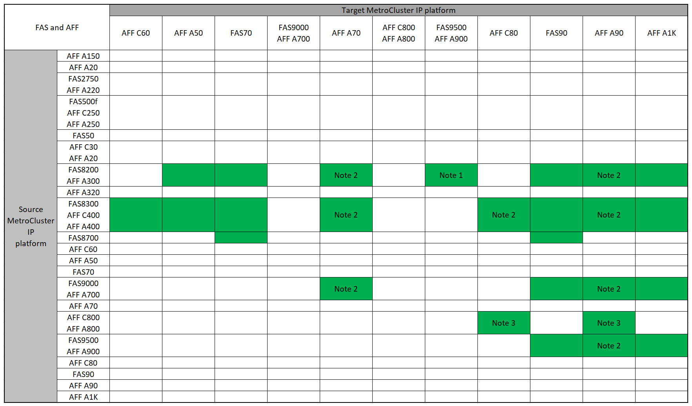

= 使用「系統控制器置換」命令支援的 MetroCluster IP 控制器升級
:allow-uri-read: 
:icons: font
:imagesdir: ../media/

[role="lead"]
在開始 MetroCluster IP 控制器升級之前，您需要確認您的升級組合是否受到支援。

從本節的 MetroCluster 控制器升級表中找到您的 * 來源 * 平台。如果 *Source* 平台列與 *Target* 平台欄的交會為空白、則不支援升級。

開始升級之前、請先檢閱下列考量事項、確認您的組態是否受到支援。

* 如果未列出您的平台、則沒有支援的控制器升級組合。
* 當您執行控制器升級時、舊的和新的平台類型 * 必須 * 相符：
+
** 您可以將 FAS 系統升級至 FAS 系統、或將 AFF A 系列升級至 AFF A 系列。
** 您無法將 FAS 系統升級至 AFF A 系列、或將 AFF A 系列升級至 AFF C 系列。
+
例如、如果您想要升級的平台是 FAS8200 、您可以升級至 FAS9000 。您無法將 FAS8200 系統升級至 AFF A700 系統。

* MetroCluster 組態中的所有節點（新舊節點）都必須執行相同的 ONTAP 版本。請參閱link:https://hwu.netapp.com["Hardware Universe"^]以取得您的組合所支援的最低 ONTAP 版本。

== 支援的 AFF 和 FAS MetroCluster IP 控制器升級

下表顯示使用「系統控制器置換」命令在 MetroCluster IP 組態中升級 AFF 或 FAS 系統所支援的平台組合，分成兩個群組。

* * 群組 1* 顯示升級至 AFF A150 ， AFF A20 ，， AFF A220 ， FAS500f ， AFF C250 ， FAS8200 ， FAS50 ， AFF C400 C30 ， FAS2750 A30 ， AFF A250 ， AFF A300 ， AFF A400 ， FAS8300 ， AFF ， AFF A320 ， AFF 和 FAS8700 系統的組合。
* * 第 2 組 * 顯示升級至 C60 ， AFF A50 ， FAS70 ， FAS9000 ，， FAS9500 ， AFF A900 ， AFF ， AFF A70 ， AFF C800 ， AFF A800 ， AFF A700 ， AFF C80 ， FAS90 ， AFF A90 和 AFF A1K 系統的組合。

下列注意事項適用於這兩個群組：

* 附註 1 ：執行 ONTAP 9.13.1 或更新版本的系統支援控制器升級。
* 附註 2 ：目標平台必須等到控制器升級完成後、才能擁有內部磁碟機。您可以在升級後新增內部磁碟機。
* 附註 3 ：需要更換控制器模組。
* 附註 4 ：需要 IOM 模組，才能將舊控制器轉換為外部 SAS 機櫃。如需支援的 IOM 模組，請參閱link:https://hwu.netapp.com/["Hardware Universe"^]。

[role="tabbed-block"]
====
.AFF 和 FAS 組合群組 1
--
檢閱， A20 ，， FAS8700 ， FAS500f ， FAS2750 ， AFF A250 ， AFF A220 ， FAS50 ， AFF C30 ， AFF A30 ， FAS8300 ， AFF C400 ， AFF C250 ， FAS8200 ， AFF A300 ， AFF A400 ， AFF ， AFF A320 和 AFF A150 系統的支援組合。

image:../media/assisted-group-1.png["顯示 AFF 和 FAS 升級組合組 1"]

--
.AFF 和 FAS 組合群組 2
--
檢閱支援的組合，以升級至 AFF C60 ， AFF A50 ， FAS70 ， AFF C800 ， AFF A700 ， FAS9500 ， FAS9000 ， AFF ， AFF A70 ， AFF A900 ， AFF A800 C80 ， FAS90 ， AFF A90 和 AFF A1K 系統。

--
====

== 支援的 ASA MetroCluster IP 控制器升級

不支援在 ASA 系統上使用命令來升級控制器 `system controller replace` 。

如需其他程序，請參閱link:https://docs.netapp.com/us-en/ontap-metrocluster/upgrade/concept_choosing_an_upgrade_method_mcc.html["選擇升級或重新整理方法"]。

.接下來呢？
查看 link:upgrade-mcc-ip-system-controller-replace-requirements.html["使用此升級程序的需求"]。
